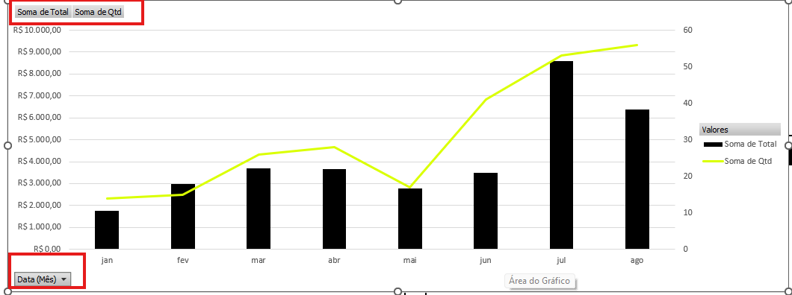
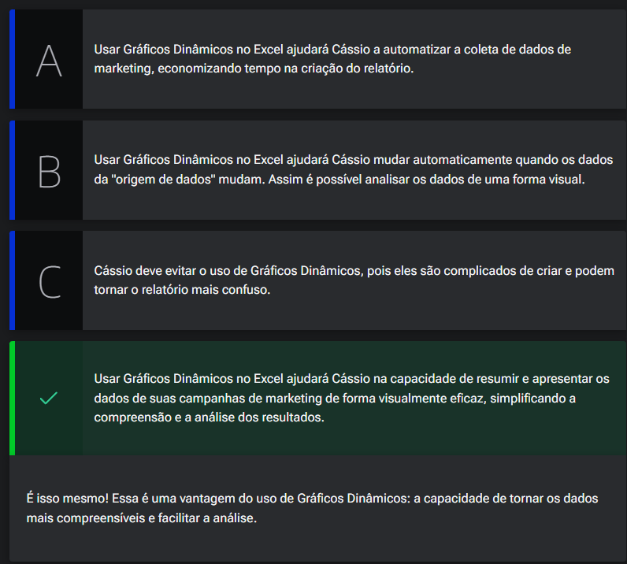
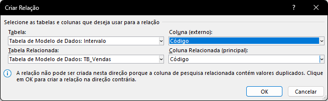
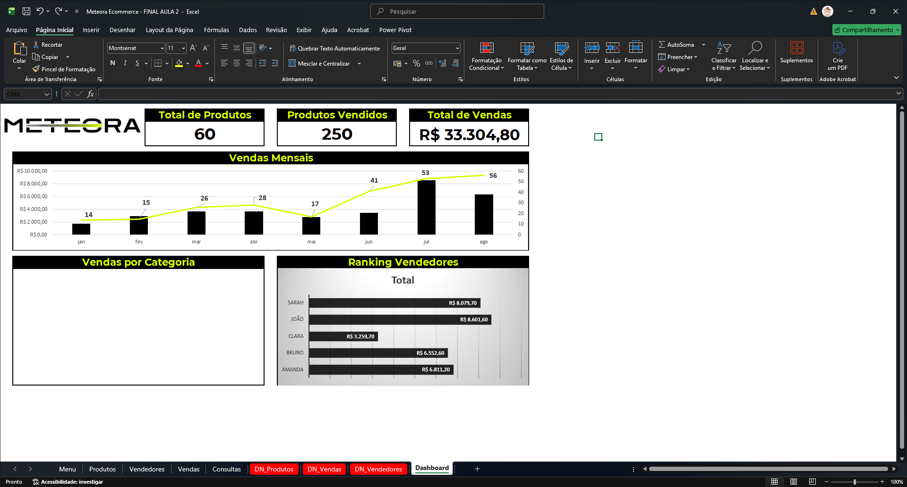

# Gráficos dinâmicos

## Sumário
- [Gráficos dinâmicos](#gráficos-dinâmicos)
  - [Sumário](#sumário)
  - [1. Projeto da aula anterior](#1-projeto-da-aula-anterior)
  - [2. Criando o dashboard com dinâmica](#2-criando-o-dashboard-com-dinâmica)
  - [3. Criando gráficos dinâmicos](#3-criando-gráficos-dinâmicos)
  - [4. Para saber mais: gráficos dinâmicos](#4-para-saber-mais-gráficos-dinâmicos)
  - [5. Dados visuais](#5-dados-visuais)
  - [6. Ranking de vendedores](#6-ranking-de-vendedores)
  - [7. Faça como eu fiz: ranking de vendedores](#7-faça-como-eu-fiz-ranking-de-vendedores)
  - [8. O que aprendemos?](#8-o-que-aprendemos)

## 1. Projeto da aula anterior 

Para acompanhar o curso com o máximo de aproveitamento, você pode acessar a [planilha](db/Meteora%20Ecommerce%20-%20FINAL%20AULA%202.xlsx).

Baixando a planilha, você poderá praticar os exercícios de modo cada vez mais personalizado, acompanhar os exemplos realizados em aulas e se dedicar ainda mais. Bons estudos! Vamos em frente!

---
## 2. Criando o dashboard com dinâmica

Iremos realizar a recriação do [dashboard](https://github.com/thierryLchaves/Santander-Imersao-Digital/blob/2dcda4e32b2c16e2b28dcbc24a307de24f61c3a6/Analise_de_dados_e_IA_Nivelamento/Semana_03/Recursos_visuais_com_excel_explorando_graficos_e_formatos), realizado anteriormente, e o primeiro gráfico a ser recriado será o gráfico de __Vendas Mensais__, para tal dentro da nossa planilha de vendas, iremos recriar a planilha até então apresentada, selecionando os dados necessários, sendo eles _(DATA, TOTAL E QTD).
>PS: Quando selecionamos o dado de data nos dados de construção de uma tabela dinâmica, ele poderá criar duas informações uma de data, e outra de DATA(MÊS), que será utilizada para nosso exemplo.  
Dado essa seleção iremos novamente realizar o processo de inserção de gráficos conforme já visto no módulo anterior, porém desta vez já iremos inserir esse gráfico utilizando a opção de `Gráfico dinâmico`, e para melhor coesão do gráfico escolheremos a opção de combinação iremos marcar a opção de eixo secundário para para soma de quantidades. 

>PS2: Como estamos trabalhando com gráficos dinâmicos a partir de uma fonte de tabela dinâmica é valido ressaltar que quaisquer alterações realizadas na fonte de dados irá refletir diretamente na exibição o gráfico automaticamente.   

---
## 3. Criando gráficos dinâmicos

> PS: Quando estivermos trabalhando com gráficos dinâmicos, pode ocorrer da tela de seleção de campos fique sendo apresentada em conjunto assim como na tabela dinâmica.

Outro recurso interessante dos gráficos dinâmicos diz respeito a modificação das informações diretamente do gráficos, para tal podemos dar o exemplo sobre os botões que são exibidos no gráfico: 
<table style="text-align: center; width: 100%;"> 
<tr>
    <td style="text-align: left;">
    
    </td>
</tr>
</table>

Quando selecionamos algum desses botões destacados na imagem, podemos modificar de maneira rápida sua apresentação modificando por exemplo a forma de exibição de soma para média, ou contagem, para além disso também temos recursos de filtros, e quando selecionados, ficara indicado que aquele botão em especifico trata-se de um filtro, para que possamos modificar a exibição dos campo conforme exemplo basta clicar sobre o botão em questão e selecionar a opção de `Configuração do campo de valor`. 
Agora se caso desejarmos ocultar completamente todos os botões apresentados no gráfico essa opção é realizada através de outra opção de mouse `Ocultar todos os botões de campo do gráfico`. 
Outra maneira de construção de gráfico dinâmico pode ser realizada através do `Power Pivot`, onde sua diferença para os passos vistos aqui se dá na indexação do gráfico com a tabela dinâmica criada de maneira visível. 

---
## 4. Para saber mais: gráficos dinâmicos

Na aula, vimos que os Gráficos dinâmicos são representações visuais de dados que podem mudar e se adaptar em tempo real ou em resposta a interações do usuário. Eles são frequentemente usados para tornar a apresentação de informações mais envolvente e interativa. E oferecem várias vantagens significativas em comparação com gráficos estáticos, tais como:

- Interatividade: Os gráficos dinâmicos permitem que os usuários interajam com os dados, explorando-os, filtrando-os, destacando áreas de interesse e obtendo informações mais detalhadas. Isso torna a análise de dados mais envolvente e personalizada.

- Atualização em tempo real: Os gráficos dinâmicos podem ser configurados para se atualizarem automaticamente à medida que novos dados estão disponíveis. Isso é especialmente útil para rastrear informações em tempo real, como preços de ações, métricas de desempenho ou estatísticas de tráfego da web.

- Visibilidade de tendências: Gráficos dinâmicos podem incluir animações que mostram como os dados evoluem ao longo do tempo. Isso facilita a identificação de tendências, padrões sazonais e mudanças significativas nos dados.

- Tomada de decisão informada: A interatividade e a capacidade de explorar dados de maneira dinâmica ajudam na tomada de decisões mais informadas. Os usuários podem investigar detalhes específicos antes de tirar conclusões ou fazer escolhas.

- Personalização: Os usuários podem personalizar gráficos dinâmicos para atender às suas necessidades individuais, escolhendo quais dados exibir, como organizá-los e como os gráficos são estilizados. Isso permite que eles foquem nas informações mais relevantes.

- Análise comparativa: Gráficos dinâmicos podem incluir a capacidade de comparar dados lado a lado, o que é valioso para identificar discrepâncias, semelhanças e correlações entre diferentes conjuntos de dados.

- Integração de fontes de dados: Eles podem ser integrados com fontes de dados em tempo real, como bancos de dados, APIs da web ou sensores IoT, fornecendo informações atualizadas instantaneamente e eliminando a necessidade de atualizações manuais.

Em resumo, os gráficos dinâmicos oferecem uma maneira mais flexível, interativa e eficaz de apresentar e analisar dados, tornando a visualização de informações mais poderosa e envolvente. Por isso, eles são especialmente valiosos em ambientes de negócios, análise de dados, pesquisa científica e em qualquer contexto em que a tomada de decisões informadas seja essencial.

---
## 5. Dados visuais

Cássio é um analista de marketing. Atualmente, ele está imerso na criação de um relatório crítico que analisa o desempenho das campanhas de marketing ao longo dos últimos anos. Cássio está bem ciente da importância de representar visualmente os dados para criar um relatório impactante e está considerando a utilização de Gráficos Dinâmicos no Excel como uma das opções.

Seguindo o que aprendemos na aula, qual seria a principal vantagem para Cássio ao utilizar o recurso "Gráfico Dinâmico" no Excel para visualizar os dados em seu relatório de desempenho de marketing?

<table style="text-align: center; width: 100%;"> 
<tr>
    <td style="text-align: center;">
    
    </td>
</tr>
</table>

---
## 6. Ranking de vendedores
Um ponto importante quando estamos por exemplo criando manualmente uma relação de dados entre tabelas, diz respeito ao processo de _"prioridade"_ ou sentido dos dados, se por exemplo estivemos criando uma nova tabela dinâmica para vendedores, e ao tentar criar a relação de vendedores com vendas e a primeira tabela selecionada for a de vendedores, teremos uma mensagem de informação como abaixo:  

<table style="text-align: center; width: 100%;"> 
<tr>
    <td style="text-align: left;">
    
    </td>
</tr>
</table>  

Outro ponto interessante sobre  a construção de gráficos com tabelas dinâmicas, e que esses podem utilizar de campos existentes em nossas tabelas dinâmicas, onde podemos adicionar com o `=` do teclado e selecionar o campo desejado, deixando nosso gráfico até o presente momento da seguinte maneira:    

<table style="text-align: center; width: 100%;"> 
<tr>
    <td style="text-align: left;">
    
    </td>
</tr>
</table>  

---
## 7. Faça como eu fiz: ranking de vendedores

Agora é o momento de aplicarmos o que aprendemos e colocar nossas habilidades à prova! Por isso, fica o desafio: que tal utilizar o conhecimento adquirido em aula e criar o gráfico dinâmico de “Ranking de Vendedores” para a E-commerce Meteora utilizando o Modelo de Dados?

Com as dicas que exploramos, você é uma pessoa preparada para criar o gráfico dinâmico de forma precisa e eficiente. Aproveite essa oportunidade para consolidar seu aprendizado e se destacar no Excel.  
__Opinião do instrutor__  

- Passo 1: O primeiro passo que devemos seguir é criar uma nova tabela dinâmica com os dados da planilha de “Vendedores”. Posicione o cursor do mouse em qualquer área da tabela de Vendedores.

- Passo 2: Na guia Inserir, clique em Tabela Dinâmica e selecione a opção Da Tabela/Intervalo.

- Passo 3: Na janela “Tabela Dinâmica da tabela ou Intervalo”, na opção Escolha onde você deseja colocar a tabela dinâmica selecione a opção Nova Planilha e, em seguida, habilite a opção Adicionar estes dados ao Modelo de Dados. Pressione o botão OK.

- Passo 4: Como queremos criar uma tabela dinâmica com dados de duas tabelas diferentes, “Vendas” e “Vendedores”, o próximo passo é estabelecer um relacionamento entre as duas tabelas.

- Passo 5: Na guia Dados, em Ferramentas de dados, clique no ícone Relações.

- Passo 6: Na janela “Gerenciar Relações”, para criar um novo relacionamento, clique no botão Novo.

- Passo 7: Na janela Criar Relação, vamos selecionar a primeira tabela que será a Tabela de Modelo de Dados: TB_Vendas e em Coluna (externo) vamos selecionar Vendedor.

- Passo 8: Em Tabela Relacionada vamos selecionar a tabela Tabela de Modelo de Dados: TBDN_Vendedores e em Coluna Relacionada (principal) vamos selecionar Código. Pressione o botão Ok.

Pronto, o novo relacionamento foi criado!

- Passo 9: Posicione o cursor do mouse em qualquer área da tabela dinâmica para que a guia Análise de Tabela Dinâmica seja habilitada.

- Passo 10: No seletor de campos, na guia “Tudo”, clique na TBDN_Vendedores. Para o campo Linhas, clique nos dados de Vendedor.

- Passo 11: Para o campo Valores, clique na TB_Vendas e selecione os dados de Total.

- Passo 12: Para formatar os dados de “Total” como contábil, clique na coluna de “Soma de Preço Unitário, e na guia Análise de Tabela Dinâmica, clique no ícone Configurações do Campo.

- Passo 13: Na caixa de diálogo “Configurações do Campo de Valor”, clique no botão Formato do Número. Na janela Formatar Células, escolha a opção Contábil.

Pronto, a nossa tabela dinâmica foi criada!

- Passo 14: O terceiro passo é criar o gráfico dinâmico para representar as informações de Ranking de Vendedores.

- Passo 15: Na guia “Inserir”, em Gráficos, clique no ícone Gráfico Dinâmico.

- Passo 16: Na janela “Inserir Gráfico”, escolha o gráfico dinâmico do tipo Barras e clique em Ok.

Pronto, o gráfico do tipo barras foi criado!

Nos próximos passos, vamos formatar o gráfico dinâmico criado

- Passo 17: Para remover os botões, selecione por exemplo o botão Soma de Total, clique com o botão direito do mouse e, em seguida selecione a opção Ocultar todos os Botões de Campo no gráfico.

- Passo 18: Depois de ocultarmos os botões, agora vamos remover a legenda do gráfico que pode ser removida de duas opções:

- Passo 19: Para excluir a legenda do gráfico, clique no ícone Adicionar Elemento de Gráfico na guia "Design do Gráfico" (se não estiver aparecendo, clique sobre o gráfico), selecione Legenda e clique na opção Nenhum.

- Passo 20: Na guia "Design do Gráfico" (se não estiver aparecendo, clique sobre o gráfico), no grupo "Estilos de Gráfico", escolha a melhor apresentação para seu gráfico. Na aula o prof. Sabino utilizou o Estilo 3.

Agora vamos mover o gráfico para a planilha Dashboard

- Passo 21: Para mover o gráfico para o “Dashboard”, clique no ícone Mover Gráfico na guia “Design do Gráfico” (se não estiver aparecendo, clique sobre o gráfico).

- Passo 22: Na caixa Mover Gráfico, na opção “Objeto em:” selecione Dashboard e em seguida clique no botão Ok.

- Passo 23 Por último, ajuste o tamanho do gráfico para encaixar na posição correta no Dashboard.

---
## 8. O que aprendemos?

Nessa aula, você aprendeu a:

- Experimentar o suplemento Power Pivot do Excel;
- Produzir um gráfico dinâmico pelo Modelo de Dados do Excel;
- Elaborar um gráfico dinâmico de Combinação no Excel;
- Elaborar um gráfico dinâmico de Barras no Excel;
- Produzir diferentes tipos de formatação nos gráficos dinâmicos no Excel;
- Criando Gráficos Dinâmicos: Ranking de Vendedores.

---

<table align="center" style="border-collapse: collapse; margin-left: auto; margin-right: auto;"> 
  <caption><b>Skills do projeto</b></caption>
  <tr>
    <td style="padding: 5px;">
      
    </td>
    <td style="padding: 5px;">
      
    </td>
    <td style="padding: 5px;">
      
    </td>
  </tr>
</table>

---
__Titulo:__ Gráficos dinâmicos
__Autor:__ Thierry Lucas Chaves  
__Data de Criação:__ 04-06-2026  
__Data de Modificação:__ 06-06-2026  
__Versão:__ "1.0"