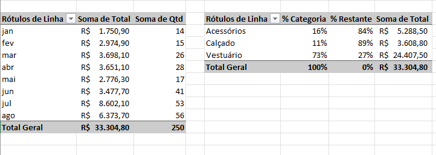
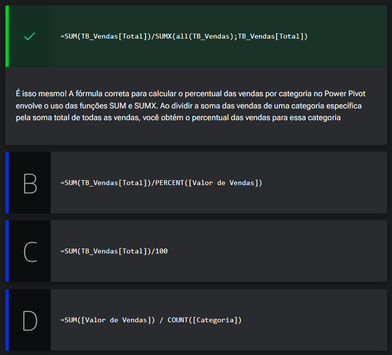

# Modelo de dados

<a id="topo"></a>

## Sumário
- [Modelo de dados](#modelo-de-dados)
  - [Sumário](#sumário)
  - [1. Projeto da aula anterior](#1-projeto-da-aula-anterior)
  - [2. Criando medidas com fórmula DAX](#2-criando-medidas-com-fórmula-dax)
  - [3. Percentual de vendas](#3-percentual-de-vendas)
  - [4. Vendas por categoria](#4-vendas-por-categoria)
  - [5. Carregando dados externos](#5-carregando-dados-externos)
  - [E para realizar esse processo iremos  dentro da guia de dados escolher a opção de `Obter dados -> De arquivo -> De texto/CSV`, quando for o caso da fonte externa vier desse modelo , lido o arquivo será apresentado a tela de seleção básica das informações e por  fim devemos clicar sobre a opção de transformar dados, com os dados em pre-seleção iremos selecionar a opção de fechar e carregar, com esse processo  será criado uma nova planilha.](#e-para-realizar-esse-processo-iremos--dentro-da-guia-de-dados-escolher-a-opção-de-obter-dados---de-arquivo---de-textocsv-quando-for-o-caso-da-fonte-externa-vier-desse-modelo--lido-o-arquivo-será-apresentado-a-tela-de-seleção-básica-das-informações-e-por--fim-devemos-clicar-sobre-a-opção-de-transformar-dados-com-os-dados-em-pre-seleção-iremos-selecionar-a-opção-de-fechar-e-carregar-com-esse-processo--será-criado-uma-nova-planilha)
  - [6. Faça como eu fiz: importando dados externos](#6-faça-como-eu-fiz-importando-dados-externos)
  - [7. Para saber mais: suplemento Power Query](#7-para-saber-mais-suplemento-power-query)
  - [8. O que aprendemos?](#8-o-que-aprendemos)

## 1. Projeto da aula anterior
Para acompanhar o curso com o máximo de aproveitamento, você pode acessar [planilha](db/Meteora%20Ecommerce%20-%20FINAL%20AULA%203.xlsx), no ponto em que paramos na aula anterior para continuar seus estudos.

---
## 2. Criando medidas com fórmula DAX
Para criar o processo de criar o ultimo gráfico utilizando tabela dinâmica, primeiro iremos iniciar criando uma nova tabela dinâmica  para esse gráfico, esse como já temos nossas fontes criadas nos modelos de dados, iremos inserir uma nova tabela dinâmica selecionando a opção de `Inserir Tabela Dinâmica -> Do modelo de dados`. 
Quando criamos em nossa aula anterior o gráfico de Vendas por categorias, realizamos a confecção de uma tabela auxiliar, que consistia em o total de vendas por categoria, e mais 2 campos de percentuais, porém para criar ese processo em tabelas dinâmicas precisaremos utilizar o `Power Pivot` e quando estamos trabalhando com tabelas dinâmica essas contas realizadas são chamadas de __medidas__.
E importante salientar também que no processo de criação de tabelas dinâmicas, o Excel cria medidas essas são chamadas de medidas implícitas, outro ponto a se atentar e que dentro do `Power Pivot` existe a segregação entre os dados das tabelas e o restante, para criarmos uma nova medida iremos selecionar algum desses _"campos vazios"_, e inserir uma nova medida utilizando uma fórmula:  
```DAX
Medida 1:=SUM(TB_Vendas[Total])
``` 
Pós esse processo será refletido em nossa tabela dinâmica um novo campo nomeado de medida 1, se selecionarmos esse campo conforme a fórmula selecionada os valores serão idênticos aos de soma anteriormente já feitos pelo prócio Excel, o que nos reforça ao ponto de medidas implícitas e explicitas. 
Dado esse conceito iremos criar mais uma medida utilizando mais um fórmula:  
```DAX
Vendas Totais:=SUMX(ALL(TB_Vendas);TB_Vendas[Total])
``` 
Essa ira representar o total geral de vendas independente do filtro realizado, após esse processo iremos então realizar a adição de mais 2 medidas em nossa tabela sendo elas  `% Categoria` e `%Restante`, utilizando as fórmulas abaixo: 
```DAX
% Categoria:=[Soma de Vendas]/[Vendas Totais]

% Restante:=1-[% Categoria]
```
> PS: os nomes antes dos caracteres de `:=` são os nomes das medidas que foram criadas  

Com todas essas medidas realizadas, podemos então criar nossa tabela dinâmica para refletir as informações anteriormente feitas:  
<table style="text-align: center; width: 100%;"> 
<tr>
    <td style="text-align: left;">
    
    </td>
</tr>
</table>
 
---
## 3. Percentual de vendas

Eliane é a analista financeira. Ela integra uma equipe dedicada à análise dos dados de vendas mensais, com o objetivo de tomar decisões relacionadas ao estoque e ao desempenho das vendas. Recentemente, Eliane decidiu criar uma Tabela Dinâmica no Excel para visualizar e analisar a distribuição percentual das vendas por categoria dos produtos. No entanto, ao trabalhar na Tabela Dinâmica, Eliane percebeu que os dados de porcentagem das vendas não estavam disponíveis e concluiu que para calcular o percentual das vendas, ela precisa criar uma medida usando o Power Pivot, porém está em dúvida de como realizar a escrita da fórmula.

Baseado no que aprendemos na aula, vamos ajudar a Eliane a escrever a fórmula corretamente para criar a medida que calcula o percentual das vendas por categoria. Qual das opções abaixo indica a forma adequada para essa tarefa?
Com todas essas medidas realizadas, podemos então criar nossa tabela dinâmica para refletir as informações anteriormente feitas:    

<table style="text-align: center; width: 100%;"> 
<tr>
    <td style="text-align: center;">
    
    </td>
</tr>
</table> 

---
## 4. Vendas por categoria

Por se tratar de um gráfico que utiliza de tabela dinâmica para apresentação dos dados, não é possível por exemplo realizar a seleção de somente um intervalo e realizar a inserção de um novo gráfico a partir dessa seleção, pois ao construir um gráfico a partir de uma tabela dinâmica sua apresentação será com base na tabela dinâmica como um todo.
Então uma das maneiras para _"contornar"_ esse revez seria realizando uma cópia dos valores da tabela dinâmica para ai então criar o gráfico de vendas.

---
## 5. Carregando dados externos

Agora como já finalizamos o processo de confecção de gráficos vamos utilizar o  `Power Query`, é o `Power Query` é uma ferramenta que pode ser utilizada no Excel que serve para importar dados externos do Excel para a pasta de trabalho.
E para realizar esse processo iremos  dentro da guia de dados escolher a opção de `Obter dados -> De arquivo -> De texto/CSV`, quando for o caso da fonte externa vier desse modelo , lido o arquivo será apresentado a tela de seleção básica das informações e por  fim devemos clicar sobre a opção de transformar dados, com os dados em pre-seleção iremos selecionar a opção de fechar e carregar, com esse processo  será criado uma nova planilha.
---
## 6. Faça como eu fiz: importando dados externos

Chegou mais um momento de você exercitar o aprendizado e fortalecer suas habilidades.

Por isso, desafie-se a aplicar o que aprendemos em aula para importar os dados de histórico de vendas da E-commerce Meteora no Power Query.

__Opinião do instrutor__  

- Passo 1: Na guia Dados no Excel, em opções Obter e Transformar Dados, vamos clicar no ícone Obter Dados, selecionar a opção De Arquivo e clicar em De Text/CSV.

- Passo 2: Na janela Procurar, selecione o caminho na qual o arquivo “Vendas.csv” foi salvo e, em seguida, clique no botão “Importar.”

- Passo 3: Na janela seguinte, “Vendas.csv”, clique na opção Transformar Dados.

Pronto o arquivo Vendas.csv foi importado para o Power Query!

- Passo 4: No Editor do Power Query, selecione a coluna Mês e com o auxílio do botão direito do mouse, clique na opção Remover para excluir a coluna.

- Passo 5: Na guia Página Inicial , clique no ícone Fechar e Carregar para importarmos e criarmos a consulta dos dados de Vendas para o Excel.

Pronto, os dados de histórico de vendas da E-commerce Meteora foram importados no Excel!  

---
## 7. Para saber mais: suplemento Power Query  

O Power Query é uma poderosa ferramenta de transformação de dados e consulta disponível no Microsoft Excel, bem como em outras aplicações da Microsoft, como o Power BI e o Power Automate.

O suplemento é gratuito, presente a partir da versão 2016 do Office e oferece uma ampla gama de funcionalidades avançadas para manipulação e tratamento de dados, tais como:

- Importação de Dados: Com o Power Query, você pode importar dados de uma ampla variedade de fontes, incluindo bancos de dados, arquivos CSV, Excel, páginas da web, serviços online como SharePoint, fontes OData e muitos outros. Ele também suporta a conexão com bancos de dados locais ou remotos.

- Transformação de Dados: O Power Query permite que você aplique uma série de transformações aos dados importados. Isso inclui filtragem, classificação, agrupamento, remoção de colunas, renomeação de colunas, substituição de valores, cálculos personalizados e muito mais. As etapas de transformação são registradas e podem ser editadas a qualquer momento.

- Combinação de Dados: É possível combinar dados de várias fontes ou tabelas diferentes usando o Power Query. Você pode realizar operações como mesclar, anexar ou relacionar tabelas para criar uma única fonte de dados consolidada.

- Linguagem M: Por trás das cenas, o Power Query usa uma linguagem chamada "M" para executar transformações de dados. Embora a maioria dos usuários não precise escrever código M, ele oferece uma flexibilidade adicional para personalizar suas transformações, se necessário.

- Atualização Automática: O Power Query permite configurar a atualização automática dos dados, o que é útil quando você precisa manter seus relatórios e análises atualizados com novos dados regularmente.

- Interface de Usuário Amigável: O Power Query possui uma interface de usuário intuitiva que permite que você veja as transformações aplicadas aos dados em uma série de etapas. Isso facilita a depuração e a manutenção das transformações.

- Integração com o Excel: Após importar e transformar os dados com o Power Query, você pode carregá-los diretamente em uma planilha do Excel ou em uma tabela de dados do Power Pivot para análises mais avançadas.

- Compartilhamento e Publicação: Os dados transformados com o Power Query podem ser compartilhados ou publicados em outros aplicativos da Microsoft, como o Power BI, para criar painéis interativos e relatórios dinâmicos.

Em resumo, o Power Query é uma ferramenta valiosa para profissionais que trabalham com dados no Microsoft Excel. Ele simplifica o processo de importação, transformação e combinação de dados de várias fontes, economizando tempo e tornando a análise de dados mais eficiente e precisa.

---
## 8. O que aprendemos?

Nessa aula, você aprendeu a:
- Elaborar uma Tabela Dinâmica a partir dos dados inseridos no Power Pivot;
- Criar Medidas utilizando funções como SUM() e SUMX() no Power Pivot;
- Elaborar um gráfico dinâmico de Rosca no Excel;
- Experimentar o suplemento Power Query;
- Importar um arquivo do tipo csv no Power Query;
- Modificar os dados no Power Query.  

---

<table align="center" style="border-collapse: collapse; margin-left: auto; margin-right: auto;"> 
  <caption><b>Skills do projeto</b></caption>
  <tr>
    <td style="padding: 5px;">
      
    </td>
    <td style="padding: 5px;">
      
    </td>
    <td style="padding: 5px;">
      
    </td>
  </tr>
</table>


---
__Titulo:__ Modelo de dados
__Autor:__ Thierry Lucas Chaves  
__Data de Criação:__ 04-06-2026  
__Data de Modificação:__ 06-06-2026  
__Versão:__ "1.0"