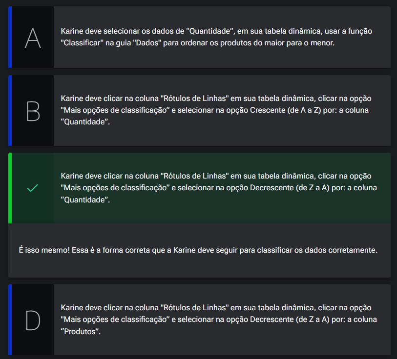

# Finalizando o dashboard

## Sumário
- [Finalizando o dashboard](#finalizando-o-dashboard)
  - [Sumário](#sumário)
  - [1. Projeto da aula anterior](#1-projeto-da-aula-anterior)
  - [2. Ajustando o dashboard](#2-ajustando-o-dashboard)
  - [3. Classificando os dados](#3-classificando-os-dados)
  - [4. Faça como eu fiz: classificando os dados de vendedores](#4-faça-como-eu-fiz-classificando-os-dados-de-vendedores)
  - [5. Revisão para desafio](#5-revisão-para-desafio)
  - [6. Desafio: histórico de vendas](#6-desafio-histórico-de-vendas)
  - [7. Projeto final do curso](#7-projeto-final-do-curso)
  - [8. O que aprendemos?](#8-o-que-aprendemos)

## 1. Projeto da aula anterior

Para acompanhar o curso com o máximo de aproveitamento, você pode acessar [planilha](db/Meteora%20Ecommerce%20-%20FINAL%20AULA%204.xlsx). Com a planilha em mãos, você terá a oportunidade de praticar os exercícios propostos, explorar os exemplos e mergulhar ainda mais no aprendizado.

---
## 2. Ajustando o dashboard
Um ponto sobre o dashboard criado sobre o Ranking de vendedores, e que ele não estava ordenado de forma do  do maior para o menor, porém como construímos nosso gráfico em cima de uma tabela dinâmica, precisamos então atualizar nossa origem de dados, e assim como nas demais particularidades de uma tabela dinâmica sua ordenação também se da diretamente nela e forma _"especifica"_.
Outro ponto quando estamos trabalhando em um Dashboard, sua exibição se dá de forma inversa a classificação, então quado desejarmos realizar o processo de exibição correta devemos inverter a ordenação das informações na tabela dinâmica origem para a correta apresentação no gráfico.

---
## 3. Classificando os dados

Karine é uma talentosa gerente de vendas numa renomada empresa de eletrônicos, e atualmente está imersa em preparativos para uma reunião importante com sua equipe. O objetivo da reunião é a análise dos resultados de vendas do último trimestre. Para otimizar a análise e destacar os produtos mais bem-sucedidos em termos de quantidade, Karine decidiu utilizar uma tabela dinâmica. No entanto, para sua frustração, os dados não foram dispostos da maneira desejada para uma análise adequada.

Seguindo o que aprendemos na aula, qual alternativa a seguir indica a abordagem correta que Karine deve adotar para classificar os produtos de maior para menor em termos de quantidade de vendas?

<table style="text-align: center; width: 100%;"> 
<tr>
    <td style="text-align: center;">
    
    </td>
</tr>
</table>

---
## 4. Faça como eu fiz: classificando os dados de vendedores

Agora é com você! Vamos treinar o que aprendemos na aula para classificar os dados de vendedores, com base no valores de Soma de total, para que os dados sejam ordenados no gráfico dinâmico “Ranking dos vendedores”, do maior para o menor? E então, vamos colocar a mão na massa?!   

__Opinião do instrutor__  

Para realizar essa atividade, siga o passo a passo proposto.

- Passo 1: Na tabela dinâmica DN_Vendedores, em “Rótulos de linhas”, clique no botão de filtro (um botão parecido com uma seta para baixo). Clique nele para mostrar as opções da tabela dinâmica.

- Passo 2: Escolha a opção "Mais opções de Classificação".

- Passo 3: Na janela Classificar (Vendedor), em “Opções de Classificação” habilite Crescente (de A a Z) por: e, em seguida, clique no botão de filtro (um botão parecido com uma seta para baixo) e selecione a coluna Soma de Total. Aperte o botão “Ok”.

Pronto, os dados de vendedores foram classificados e o gráfico dinâmico está representando os dados do maior para o menor!  

---
## 5. Revisão para desafio

Para conclusão do desafio que fora proposto vale a pena ressaltar alguns pontos, que anotaremos aqui como dicas:  
- 1º Para criar uma nova tabela dinâmica, devemos primeiro realizar o relacionamentos da tabela de vendas histórica.
  - Caso necessário acessar o `Power Pivot`  a opção de Exibição de diagrama, para visualizar como está realizado a conexão dos dados.
  - Assim como feito em vendas ela também será relacionada com  tb_produtos e intervalo
  

---
## 6. Desafio: histórico de vendas

Neste desafio, a sua missão é seguir o passo a passo elaborado durante as aulas para refazer o Dashboard utilizando agora com os dados históricos de vendas.

No entanto, o desafio não pára por aí! Utilize essa atividade para explorar ainda mais os recursos e aproveite para adicionar um toque especial de originalidade, elevando o padrão dos gráficos dinâmicos e tornando-o surpreendente. E então, vamos colocar a mão na massa?!

Para desenvolver o desafio, recomendamos que você baixe a planilha e caso você não tenha baixado o arquivo na aula anterior, o arquivo de histórico de vendas, que estamos trabalhando para a Loja Meteora. Essa é uma excelente oportunidade para explorar e aplicar o seu conhecimento, colocando em prática tudo o que aprendeu.  

---
## 7. Projeto final do curso

Parabéns pela conclusão do curso! Você pode fazer o acessar a [planilha final](db/Meteora%20Ecommerce%20-%20FINAL%20AULA%205%20-%20DESAFIO%20RESOLVIDO.xlsx) da loja Meteora que criamos ao longo desta jornada.

Lembre-se: essa é apenas uma etapa de uma jornada repleta de aprendizado. Continue buscando conhecimento e desafiando o seu desenvolvimento. Até a próxima!  

---
## 8. O que aprendemos?

Reconhecer o recurso de classificação da tabela dinâmica no Excel;
- Classificar os dados em ordem crescente de A a Z no Excel;
- Classificar os dados em ordem decrescente de Z a A no Excel;
- Classificar os dados do maior para o menor para serem ordenados no gráfico dinâmico no Excel.  

---

<table align="center" style="border-collapse: collapse; margin-left: auto; margin-right: auto;"> 
  <caption><b>Skills do projeto</b></caption>
  <tr>
    <td style="padding: 5px;">
      
    </td>
    <td style="padding: 5px;">
      
    </td>
    <td style="padding: 5px;">
      
    </td>
  </tr>
</table>

---
__Titulo:__ Finalizando o dashboard
__Autor:__ Thierry Lucas Chaves  
__Data de Criação:__ 04-06-2026  
__Data de Modificação:__ 06-06-2026  
__Versão:__ "1.0"