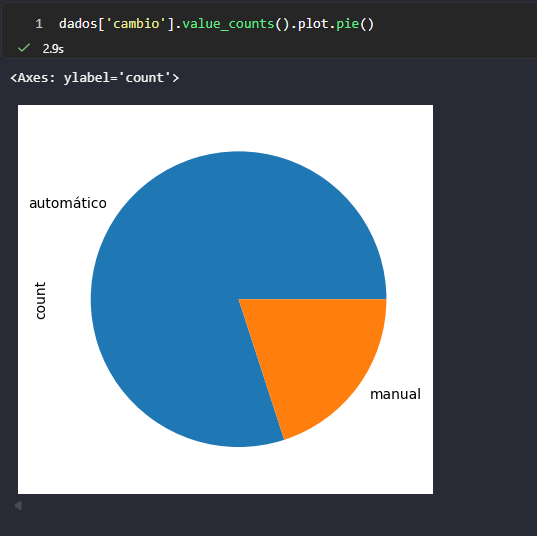

# Conteúdo Live 01/06/2026
## Manipulações de Dados Pandas

<a id="topo"></a>

## Sumário
- [Conteúdo Live 01/06/2026](#conteúdo-live-01062026)
  - [Manipulações de Dados Pandas](#manipulações-de-dados-pandas)
  - [Sumário](#sumário)
  - [1. Recapitulação e avisos](#1-recapitulação-e-avisos)
  - [2. Valor medio](#2-valor-medio)
- [3. Filtrando valor](#3-filtrando-valor)
- [4. Ordenação por algo](#4-ordenação-por-algo)
  - [5. Preço médio](#5-preço-médio)
  - [6. Filtro elaborado](#6-filtro-elaborado)
- [7. Criando nova coluna](#7-criando-nova-coluna)
  - [Criando um gráfico](#criando-um-gráfico)

## 1. Recapitulação e avisos
 
Um ponto durante a live foi informado que a aula utilizara o [Google Colab](), porém nesse repositório, os códigos serão desenvolvidos e anotados [aqui](src/aula5.ipynb).

Assim como na aula anterior, devemos inciar pela instalação do `Pandas`, para tal instalação o comando é:  
```py
!pip install pandas
```

Na aula anterior verificamos, que em Analise de dados, as coisas são pareadas por indices então quando temos 2 listas essas devem conter a mesma quantidade de elementos, para que possamos realizar a impressão dos itens com seus preços conforme exemplo:  
```py
modelo =['uno','gol','polo','kombi']
preco = [20000,30000,60000,15000]

for i in range(len(modelo)):
    print(f"O carro  tem preço{modelo[i]} tem preço:  RS: {preco[i]}")
```
o comando abaixo, é utilizado para realizar a criação de um arquivo Excel a partir de um dicionário por exemplo:  
```py
import pandas as pd

carros = pd.DataFrame(carros)
carros.to_excel("carros.xlsx")
```

Com o comando acima criamos uma  planilha, porém como podemos também realizar a leitura de uma planilha com python, isso é possível de ser realizado com o seguinte comando:  [
```py
dados = pd.read_excel("carros.xlsx")
dados
```

Para informações em pares devemos utilizar o seguinte comando: 
```py
dados[['modelo','preço']]
```

## 2. Valor medio
Após o processo de leitura de um arquivo, ou algo do tipo, podemos realizar por exemplo a captura de um preço médio de algo ou o valor médio de desse valor, para tal utilizamos
```py
preco_medio = dados['preço'].mean()
print(f"O preço médio dos carros na tabela é R$:{preco_medio}")
```
Nesse comando acima realizamos o processo de filtragem da tabela em questão, e posteriormente realizamos o processo com o comando `mean()`, para que esse valor médio seja apresentado.

# 3. Filtrando valor
No comando abaixo, estamos realizando diretamente no DataFrame, onde X valor de coluna obedeça o comando conforme exemplo:
```py
dados[dados['preço'] > 30000]
```
# 4. Ordenação por algo
Para que possamos realizar a ordenação de valores, podemos realizar o comando de `sort_values`, no objeto que chamamos de dados, esse comando recebera como argumento, qual é a coluna do data Frame a ser utilizado, e com esse data frame, o outro argumento, também possibilita  informar `ascending`, como TRUE quando for de forma decrescente

## 5. Preço médio
No comando abaixo realizamos a utilização do comando `mean()` no qual esse realiza a media dos valores de um determinado intervalo:
```py
carros_volks  = dados[dados['marca'] == 'Volkswagen']
print(f"O preço médio dos caros da volks é R$:{carros_volks['preco'].mean()}")
```

## 6. Filtro elaborado
No comando em questão realizamos uma maneira de obter as médias de valores conforme um filtro aplicado, para tal criamos um laço de repetição for, sobre a coluna "Marca", e utilizamos também o comando `unique()`, com esse comando em questão estamos retirando da planilha todos os valores que estão repetidos:
```py
for marca in dados['marca'].unique():
    carros_marca = dados[dados['marca'] == marca]
    print(f"O preço médio dos carros da {marca} é R$: {carros_marca['preco'].mean()}")
```
por fim estamos realizando somente o print onde o variável em marca for igual aquele valor que foi _"capturado"_


# 7. Criando nova coluna

Nesse caso do exemplo abaixo, estamos adicionando uma nova coluna no dataframe, e para tal podemos realizar o comando seguinte:
```py
dados['preco_desconto'] =  0.9*dados['preco']
dados
```
o que esse comando faz estamos criando uma nova coluna, criando com o `[]` o nome da nova coluna e para esse estamos criando um esse novo valor com base em um calculo de outra coluna.
e para salvar segue o mesmo comando de `to_excel` por exemplo

## Criando um gráfico
Para criar um  gráfico dentro do pandas é preciso primariamente realizar o import da biblioteca  `matplotlib`, pós o import dessa biblioteca, podemos realizar o seguinte comando:  
```py
dados['cambio'].value_counts().plot.pie()
```
Nesse comando acima, estamos extraindo do dataframe original o valor da coluna cambio, posteriormente fazendo a contagem dos valores `value_counts`, e por fim exibindo isso através do `plot.pie()`
fazendo a exibição do gráfico em tela :  
<table style="text-align: center; width: 100%;"> 
     <tr>
         <td style="text-align: left;">
             
         </td>
     </tr>
 </table>

 
---

<table align="center" style="border-collapse: collapse; margin-left: auto; margin-right: auto;"> 
  <caption><b>Skills do projeto</b></caption>
  <tr>
    <td style="padding: 5px;">
      
    </td>
    <td style="padding: 5px;">
      
    </td>
    <td style="padding: 5px;">
      
    </td>
    <td style="padding: 5px;">
      
    </td>
  </tr>
</table>


---
__Titulo:__ Conteúdo Live 01/06/2026  
__Autor:__ Thierry Lucas Chaves    
__Data de Criação:__ 01-06-2026  
__Data de Modificação:__ 01-06-2026  
__Versão:__ "1.0"