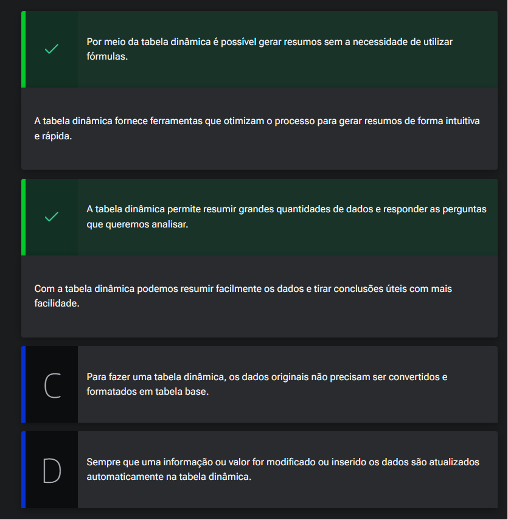
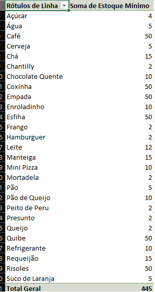
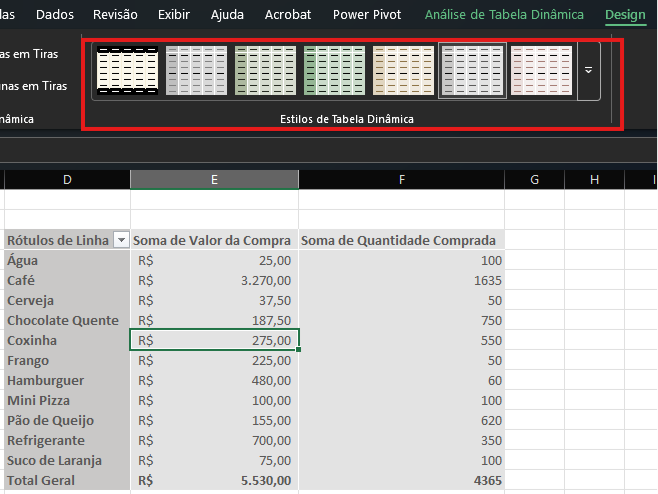

# Relembrando tabela dinâmica

## Sumário
- [Relembrando tabela dinâmica](#relembrando-tabela-dinâmica)
  - [Sumário](#sumário)
  - [1. Apresentação](#1-apresentação)
  - [2. Conceito de tabela dinâmica](#2-conceito-de-tabela-dinâmica)
  - [3. Vantagens da tabela dinâmica](#3-vantagens-da-tabela-dinâmica)
  - [4. Preparando o ambiente: planilha Serenatto Café e Bistrô](#4-preparando-o-ambiente-planilha-serenatto-café-e-bistrô)
  - [5. Seletor de campos](#5-seletor-de-campos)
  - [6. Formatando uma tabela dinâmica](#6-formatando-uma-tabela-dinâmica)
  - [7. Faça como eu fiz: criando uma tabela dinâmica](#7-faça-como-eu-fiz-criando-uma-tabela-dinâmica)
  - [8. O que aprendemos?](#8-o-que-aprendemos)

## 1. Apresentação
Uma das principais ferramentas utilizadas no curso em questão trata-se do `POWER PIVOT`, do Excel e com base nele trabalharemos em uma base de dados.   

---
## 2. Conceito de tabela dinâmica

Antes de iniciáramos o handson propriamente dito, iremos recapitular alguns conceitos e fundamentos sobre tabelas dinâmicas, para isso vamos ao primeiro passo que é explicar o que é tabela dinâmica ? A tabela dinâmica pode ser entendida como um grande repositório de dados,que nos auxilia a calcular, resumir e analisar dados (habitualmente esse processo tem como objetivo de realizar análise de dados,ou de ainda realizar representações com gráficas com dashboards).Para além disso temos outras coias que podemos citar para responder outra pergunta, o porque utilizar uma tabela dinâmica ?  Um dos motivos que podemos citar para a adoção de tabelas dinâmicas, se da tanto na sua facilidade de uso, quanto na sua grande utilização em empresas, outro ponto é que tabelas dinâmicas nos permitem realizar criações rápidas de relatórios, apresentações claras e objetivas dos dados (Nesse ponto é importante discernimos que não é a tabela dinâmica que realiza essa apresentação e sim o conhecimento sobre utilização da tabela dinâmica que nos possibilita essa apresentação), para além disso a utilização de tabelas dinâmicas nos possibilita a redução de utilização de fórmulas complexas.   

dado essa explicações de porque da adoção de tabelas dinâmicas, vamos relatar quais são os __elementos da tabela dinâmica__?  
  - _Campos_: Títulos dos relatórios
  - _Filtros_: Verificar informações específicas
  - _Rótulos de linhas_: Informações nas linhas
  - _Rótulos de colunas_: Informações nas colunas
  - _Valores_: Operações matemáticas
---
Sobre sua utilização, para que possamos realizar a utilização da uma tabela dinâmica existem várias formas de iniciar o processo um deles, é através da dia de `Inserir` tabela dinâmica no agrupamento de tabelas, quando utilizamos planilhas formatadas como tabela esse processo se torna mais simples, posto que para realizar esse processo batas selecionar alguma célula da tabela em questão e será apresentado uma outra tela, onde nessa tela o Excel nos informa qual será a tabela ou intervalo a ser trabalhado com tabela dinâmica, como estamos trabalhando com planilhas com dados formatados como tabela, o Excel já realiza automaticamente essa seleção de intervalo.  Nesse mesmo menu nos possibilita outras maneiras de inserção para além do botão principal, e uma delas é de `Da fonte de dados Externos`, nessa opção assim como visualizamos na [aula de importação de dados](https://github.com/thierryLchaves/Santander-Imersao-Digital/blob/052706c38962fd7d9c63447fea58f83420158140/Analise_de_dados_e_IA_Nivelamento/Semana_06/Excel_Simulacao_e_analise_de_cenarios/02_Importando_e_atualizando/ImportandoEAtualizando.md), é possível que a tabela a ser criada venha de uma fonte como CSV, banco de dados etc.., como também podemos utilizar a guia de tabela, na qual será mostrado as tabelas nomeadas existentes na pasta de trabalho, essas são algumas maneiras de realizar a criação de uma tabela dinâmica, porém sua utilização na se limita a tais, mais adiante veremos maneiras de manipulação dos dados em tabelas dinâmicas, para além das que foram vistas anteriormente nesse repositório. 

[↑ Voltar ao topo](#topo)

---
## 3. Vantagens da tabela dinâmica  

Vimos que a tabela dinâmica é uma ferramenta muito útil para organizar, resumir e analisar os dados em poucos cliques e através dela podemos ver tendências nos dados e realizar comparações.

Sendo assim: quais as vantagens de utilizar essa ferramenta?  

<table style="text-align: center; width: 100%;"> 
<tr>
    <td style="text-align: left;">
    
    </td>
</tr>
</table>

---
## 4. Preparando o ambiente: planilha Serenatto Café e Bistrô  

Para acompanhar o curso com o máximo de aproveitamento, você pode acessa a [planilha do Serenatto Café e Bistrô](db/Serenatto%20Café%20e%20Bistrô%20-%20PLANILHA%20INICIAL.xlsx)

---
## 5. Seletor de campos
De posse de nossa base de dados, iremos voltar a alguns conceitos básicos da utilização de tabelas dinâmicas, mas o que podemos considerar como _"b-a-bá"_ da tabela dinâmica, ou seja o que é o básico de saber para dizer que conhecemos tabela dinâmica ?  
Bem a tabela dinâmica a grosso modo, nada mais é que os mesmos dados presente da origem de dados (ou planilha original), estando disponíveis em outro lugar o `Power Pivot`, disponíveis para sua reorganização.   
Para melhor exemplificar o que estamos dizendo, quando criamos uma tabela dinâmica em nossa base de dados, podemos realizar a seleção de campos para que seja apresentado uma nova tabela, no nosso exemplo iremos selecionar as informações de __produtos e estoque mínimo__, porém quando realizamos essa seleção a tabela dinâmica não realiza simplesmente a representação dos campos, e sim realiza a somatória do estoque mínimo  conforme o produtos, isso fica evidente pela nome da coluna criada na tabela:  

<table style="text-align: center; width: 50%;"> 
<tr>
    <td style="text-align: center;">
    
    </td>
</tr>
</table>

Ou seja quando realizamos essa seleção de campos a tabela dinâmica, já realiza o resumo dos dados no nosso caso uma soma (esse dado pode ser alterado, pois podemos escolher entre algumas operações tais como: soma, média etc..). 
Ta mas qual é o _"truque"_ da tabela dinâmica ? Existe um quadrante na parte inferior direita com __4__ quadrantes (Filtros, Colunas, Linhas e Valores), e através desses quadrantes é possível reorganizar a apresentação dos dados, para a readequação dos dados basta realizar a seleção do campo desejado e _"arrastar"_ esse valor para algum dos quadros, porém isso pode tornar a visualização sem sentido prático, e é nesse ponto que aprenderemos formas de organizar esses dados de forma a apresentar melhor as informações.  

---
Uma das possibilidades de criação de tabelas dinâmica e de realizar sua criação em um planilha já existente, para isso dentro de nossa base de dados, iremos utilizar a planilha de __"Entrada"__ e iremos criar uma nova tabela dinâmica porém dessa vez iremos escolher a opção de `Planilha existente`, nessa opção e de suma importância que para além da indicação da planilha destino também selecionarmos o campo/célula que essa tabela dinâmica será inserida.
>PS: É possível que seja realizado a inserção de varias tabelas dinâmicas na mesma planilha, porém isso não é recomendado por uma série de motivos, como por exemplo:
> Em caso de inserção de duas tabelas dinâmicas ao lado da outra com intervalo curto de colunas, sua apresentação ficara prejudicada, para além de impossibilitar apresentação de dados para além do intervalo entre uma tabela e outra.
><table style="text-align: center; width: 100%;"> 
><tr>
><td style="text-align: left;">
>
></td>
></tr>
></table>

com esses exemplos clarificamos que de fato tabela dinâmica não se trata de uma transposição de uma tabela origem para outra planilha ou outra tabela, e sim uma nova tabela reestruturada ou reorganizada, que nos permite através dos quadrantes a reapresentação dos dados, e ao longo desse módulo visualizaremos como podemos reorganizar esses dados, para que a tabela dinâmica nos apresente da melhor forma tais dados.

[↑ Voltar ao topo](#topo)

---
## 6. Formatando uma tabela dinâmica
Nesse tópico visualizaremos maneiras de realizar uma formatação mais aprazível em tabelas dinâmicas para que não fiquem com tanta cara de tabela dinâmica.  
Uma das maneiras, que podemos realiza uma formatação de campo simples como realizar a conversão de um determinado dado para formato monetário, e através da opção de `Configuração do campo de valor` presentes nas opções expandidas de cada quadrante, será apresentado uma tela para seleção de opções dentro delas, temos a opção de formato do número, nessa opção podemo por exemplo escolher qual será a apresentação visual do campo _"Contábil, numérico porcentagem etc.. "_,  essa formatações podem ser feitas tanto pelo caminho descrito como também através das opções: analise da tabela dinâmica -> Configurações do campo, e importante salientar que essas configurações campo irão obedecer o campo que esta selecionado.   
Outro ponto é que as guias de `Analise da tabela dinâmica e Design`, como por exemplo dentro da guia de `Design`, podemos reformular o estilo da tabela dinâmica, conforme exemplo:  

<table style="text-align: center; width: 100%;"> 
<tr>
    <td style="text-align: left;">
    
    </td>
</tr>
</table>

Para além das formatações de estilo da tabela, também temos opções de apresentações, como os campo presentes no menu de `Opções de estilo de tabela dinâmica` onde é possível realizar a a remoção dos cabeçalhos em linha, ou colunas, já no que diz respeito as opções de linhas em tiras e colunas em tira dependem da formatação escolhida em estilo.

---
Outro ponto que podemos salientar e que podemos modificar a fonte de dados, atualmente essa tabela dinâmica esta com base na tabela de origem da planilha _Entrada_, como essa planilha está formatada em tabela, implica que ao atualizarmos essa tabela, seja inserindo novos valores, ou modificando valores em questão a nossa tabela dinâmica também irá sofrer alterações, porém o mesmo não irá ocorrer se criarmos uma tabela dinâmica com base em um intervalo, ou seja se dentro da nossa fonte de dados da tabela dinâmica fosse acrescido uma nova linha, porém essa fonte não fosse uma tabela e sim um intervalo de valores, essa atualização não iria refletir na nossa tabela dinâmica.

[↑ Voltar ao topo](#topo)

---
## 7. Faça como eu fiz: criando uma tabela dinâmica
A tabela dinâmica é muito utilizada quando precisamos resumir e analisar de forma mais detalhada grandes quantidades de dados.

Vamos treinar o que vimos na aula e criar uma tabela dinâmica com os dados de Entradas do Serenatto Café e Bistrô.

__Opinião do instrutor__  
Vamos ao Passo a Passo:

- __Passo 1:__ Na planilha de Entradas, selecione a Tabela que contém os dados que queremos inserir na tabela dinâmica `(B5:G59)`.

- __Passo 2:__ Na guia Inserir, clique em Tabela Dinâmica e selecione a opção Da Tabela/Intervalo.

- __Passo 3:__ Na janela Tabela Dinâmica da tabela ou Intervalo, na opção Escolha onde você deseja colocar a tabela dinâmica selecione a opção Nova Planilha para posicionar a Tabela Dinâmica em uma nova planilha e selecione o botão OK.

- __Passo 4:__ Agora vamos começar a inserir os campos que queremos analisar na tabela dinâmica criada.

- __Passo 5:__ No seletor de campos vamos selecionar para o campo linhas, as colunas de Produtos e Fornecedor da tabela do Serenatto Café e Bistrô.

- __Passo 6:__ No campo valores vamos selecionar as colunas Custo Unitário e Valor da Compra para visualizarmos quanto que foi gasto por cada produto.

Pronto, a nossa tabela dinâmica foi criada!

[↑ Voltar ao topo](#topo)

---
## 8. O que aprendemos?

Nessa aula, você aprendeu a:
- Relembrar os conceitos de Tabela Dinâmica;
- Reconhecer o seletor de campos;
- Identificar algumas formas de formatação, como alterar a cor e os tipos de estilo da tabela dinâmica.

---

<table align="center" style="border-collapse: collapse; margin-left: auto; margin-right: auto;"> 
  <caption><b>Skills do projeto</b></caption>
  <tr>
    <td style="padding: 5px;">
      
    </td>
    <td style="padding: 5px;">
      
    </td>
    <td style="padding: 5px;">
      
    </td>
  </tr>
</table>

---
__Titulo:__ Relembrando tabela dinâmica
__Autor:__ Thierry Lucas Chaves  
__Data de Criação:__ 08-06-2026  
__Data de Modificação:__ 13-06-2026  
__Versão:__ "1.0"