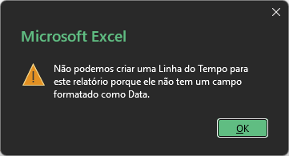
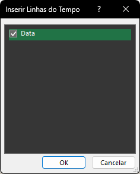
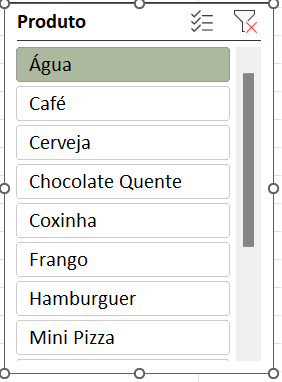
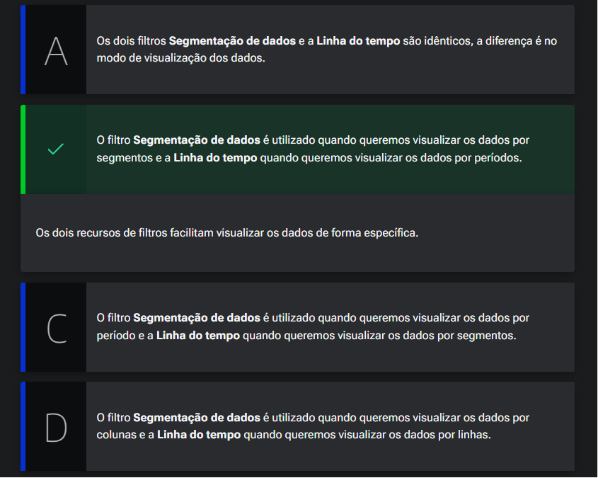
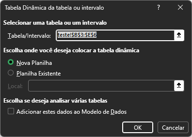
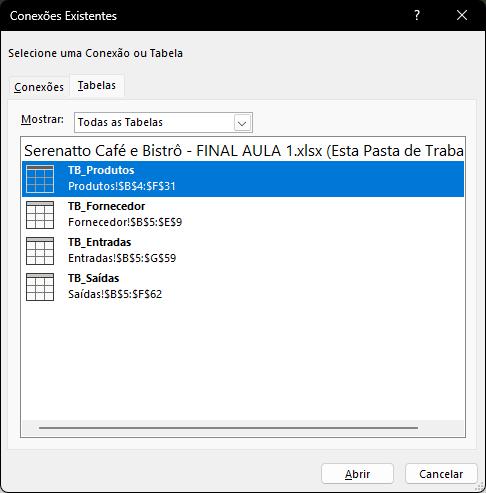
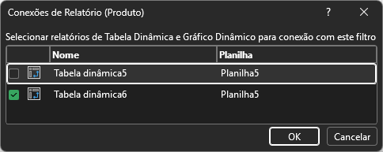

# Opções de tabela Dinâmica

## Sumário
- [Opções de tabela Dinâmica](#opções-de-tabela-dinâmica)
  - [Sumário](#sumário)
  - [1. Projeto da aula anterior](#1-projeto-da-aula-anterior)
  - [2. Linha do tempo](#2-linha-do-tempo)
  - [3. Segmentação de dados](#3-segmentação-de-dados)
  - [4. Filtros na tabela dinâmica](#4-filtros-na-tabela-dinâmica)
  - [5. Origens de dados](#5-origens-de-dados)
  - [6. Faça como eu fiz: inserindo uma segmentação de dados](#6-faça-como-eu-fiz-inserindo-uma-segmentação-de-dados)
  - [7. O que aprendemos?](#7-o-que-aprendemos)

## 1. Projeto da aula anterior

Você pode acessar a [planilha do Serenatto Café e Bistrô](db/Serenatto%20Café%20e%20Bistrô%20-%20FINAL%20AULA%201.xlsx) que estamos usando neste curso.

---
## 2. Linha do tempo
Apenas para recapitularmos, de onde paramos em nossa base dados, temos uma planilha com duas tabelas dinâmicas de origem de dados diferentes, sendo uma da tabelas de produtos, e outra da tabela de entradas, se fossemos tentar realizar a inserção de uma linha do tempo na tabela dinâmica de produtos o Excel não irá permitir que esse recurso seja realizado, visto que na fonte de dados em questão não possuímos informações de datas, sendo apresentado uma mensagem de alerta conforme abaixo:  

<table style="text-align: center; width: 50%;"> 
<tr>
    <td style="text-align: left;">
    
    </td>
</tr>
</table>

Para que possamos inserir uma linha do tempo, devemos acessar a guia de `INSERIR`, dentro da opção de filtro  `Linha do tempo`, agora se seguirmos esse caminho, porém com a seleção de célula dentro da nossa tabela dinâmica de entradas, será apresentado outro menu para que possamos escolher qual será o campo que está formatado como data, para a construção dessa linha do tempo. 
<table style="text-align: center; width: 50%;"> 
<tr>
    <td style="text-align: left;">
    
    </td>
</tr>
</table>

> PS: Nessa caixa será demonstrado todos os campos que estão formatados como data.  
A apresentação de filtros da linha do tempo será proporcional aos intervalos de datas presentes na fonte de dados, para além desse fato aqui vale o mesmo comportamento visto anteriormente sobre as tabelas dinâmicas, as opções relativas de guias serão apresentadas conforme a seleção de campos da planilha, ou seja caso selecionarmos um campo da tabela dinâmica serão apresentados as guias relativas a tabelas dinâmicas, já quando clicamos sobre a linha do tempo as guias relativas serão sobre a linha do tempo, outro ponto e que para inserção de uma linha do tempo sobre a tabela dinâmica, temos essa opção dentro da guia de `Análise de Tabela Dinâmica`, também temos a mesma opção.  
Outro ponto de importante a ser atentar, e que __a nossa linha do tempo está conectada em nossa tabela dinâmica através da nossa fonte de dados__.

[↑ Voltar ao topo](#topo)

---
## 3. Segmentação de dados

A segmentação de dados, também é um especie de filtro disponível do Excel, e normalmente esse filtro que será carregado normalmente é escolhido a partir do dado principal da fonte de dados de origem, porém na segmentação de dados diferente da linha do tempo não limita sua utilização a apenas a dados do tipo data, ao selecionar o dado desejado é _"plotado"_ em tela um outro filtro para seleção conforme exemplo abaixo:  
<table style="text-align: center; width: 50%;"> 
<tr>
    <td style="text-align: left;">
    
    </td>
</tr>
</table>

Um ponto importante a se ater sobre a segmentação de dados, e que não é muito prudente utilizar esse tipo de filtro quando temos um gama vasta de opções para seleção.   
> PS: Para inserção desse filtro, as opções para ele seguem os mesmo caminhos vistos para linha do tempo.   
---
Dentro de nossa tabela dinâmica criada, temos o campo de fornecedor, porém esse campo em questão advém de outra tabela, que não é a de entrada, e por que essa informação é importante, normalmente base de dados que advém de sistemas por exemplo, a relação entre informações não é feita através de nomes e sim por códigos de identificação chamados de relacionamentos, o que em um contexto de filtro de segmentação de dados não seria uma boa prática de se utilizada. Para além do que já fora visto até aqui temos um ponto a ser ressaltado, dentro da guia de contexto da segmentação de dados tempo a opção `Conexões de relatório`, nessa opção o Excel irá  apresentar a tabela dinâmica na qual a segmentação está ligada, e não da origem de dados. Para que possamos utilizar a segmentação de dados em duas origem de dados diferentes e necessário a utilização do `POWER PIVOT`, o que será abordado em outra aula.

---
## 4. Filtros na tabela dinâmica

Na aula vimos que para facilitar a visualização de alguns dados podemos inserir os recursos de filtro Segmentação de dados e Linha do tempo.

Vamos identificar qual a diferença entre esses dois recursos de filtros?  

<table style="text-align: center; width: 100%;"> 
<tr>
    <td style="text-align: left;">
    
    </td>
</tr>
</table>

---
## 5. Origens de dados

Nesse tópico iremos reforçar o conceito que fora descrito anteriormente, sobre a utilização de tabelas dinâmicas, com a origem de dados com base em um intervalo.
Dentro de nossa pasta de trabalho vamos criar uma nova planilha de testes, nessa planilha em questão iremos inserir alguns dados conforme demonstrado abaixo:   

<table style="text-align: center; width: 50%;"> 
<tr>
    <td style="text-align: left;">
    
    </td>
</tr>
</table>

O primeiro ponto, dessa tela em questão, e que o intervalo que foi selecionado para criação dessa tabela dinâmica, se na sua seleção diferentemente das tabelas anteriormente criadas, o Excel nos demonstra que a referência do intervalo no qual a tabela dinâmica foi criada é um intervalo absoluto, e não a tabela em sí como `TB_ENTRADA` por exemplo, e isso implica diretamente em nossa tabela dinâmica, pois caso realizarmos a inserção de mais uma linha nessa tabela e formos atualizar nossa tabela dinâmica essa atualização feita na origem de dados não será refletida, pois realizamos a criação da tabela dinâmica com base em um intervalo de células.  

---
Agora iremos abordar outro ponto, para exemplo desse ponto iremos realizar a inserção de duas tabelas dinâmicas com base na mesma origem de dados.
Para o exemplo em questão iremos criar mais um tabela dinâmica com base em Produtos, pós criação das duas tabelas, iremos dentro da guia de `Análise de Tabela dinâmica` o menu de `Ações -> Mover Tabela dinâmica` , e iremos move-la para mesma planilha de tabela dinâmica que foi criada primeiro, agora iremos criar uma nova segmentação de dados, o que deveria acontecer, seria que como as tabelas dinâmicas tem como sua origem a mesma fonte de dados, uma segmentação de dados funcionaria para as duas tabelas, porém isso não ocorre. Mas como podemos fazer para que isso não seja um problema ?   

Dentro iremos criar uma nova tabela dinâmica, porém iremos cria-la a partir da opção de `Fonte de dados Externos` e dentro da opção de escolher conexão iremos inserir nossa tabela conforme ilustrado abaixo:  

<table style="text-align: center; width: 100%;"> 
<tr>
    <td style="text-align: left;">
    
    </td>
</tr>
</table>

Iremos repetir o passo para criar uma nova tabela dinâmica, e agora iremos criar uma segmentação de dados, porém agora podemos notar que dentro da opção de conexões de relatórios, está presente a opção para as duas tabelas dinâmicas, 
<table style="text-align: center; width: 100%;"> 
<tr>
    <td style="text-align: left;">
    
    </td>
</tr>
</table>  

Com isso visualizamos que é possível realziar a inserção ou criação de diferentes tabelas dinâmicas de diferentes formas. 
[↑ Voltar ao topo](#topo)

---
## 6. Faça como eu fiz: inserindo uma segmentação de dados

Vimos que os recursos de filtro Segmentação de dados e Linha do tempo deixam os dados mais interativos e facilitam a sua visualização.

Vamos treinar o que aprendemos nas aulas e aplicar na planilha “Dinâmica” uma segmentação de dados para filtrar os dados de Fornecedor?  

__Opinião do instrutor__  

- __Passo 1:__  Posicione o cursor do mouse em qualquer área da tabela dinâmica para que a guia Análise de Tabela Dinâmica seja habilitada.

- __Passo 2:__  Na guia Análise de Tabela Dinâmica, clique em Inserir Segmentação de dados.

- __Passo 3:__  Na janela *Inserir Segmentação de dados, vamos selecionar a coluna de Fornecedor e apertar o botão OK.

Pronto, nossa segmentação de dados foi inserida e agora podemos filtrar os dados clicando nos nomes dos Fornecedores. 

---
## 7. O que aprendemos?
Nessa aula, você aprendeu a:
- Implementar os dois recursos de filtros, linha do tempo e Segmentação de dados na Tabela Dinâmica;
- Modificar a origem dos dados da Tabela Dinâmica.

---

<table align="center" style="border-collapse: collapse; margin-left: auto; margin-right: auto;"> 
  <caption><b>Skills do projeto</b></caption>
  <tr>
    <td style="padding: 5px;">
      
    </td>
    <td style="padding: 5px;">
      
    </td>
    <td style="padding: 5px;">
      
    </td>
  </tr>
</table>

---
__Titulo:__ Opções de tabela Dinâmica
__Autor:__ Thierry Lucas Chaves  
__Data de Criação:__ 08-06-2026  
__Data de Modificação:__ 13-06-2026  
__Versão:__ "1.0"