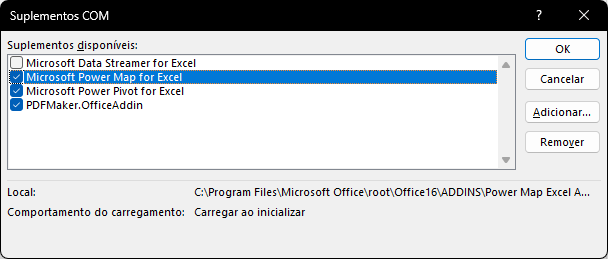
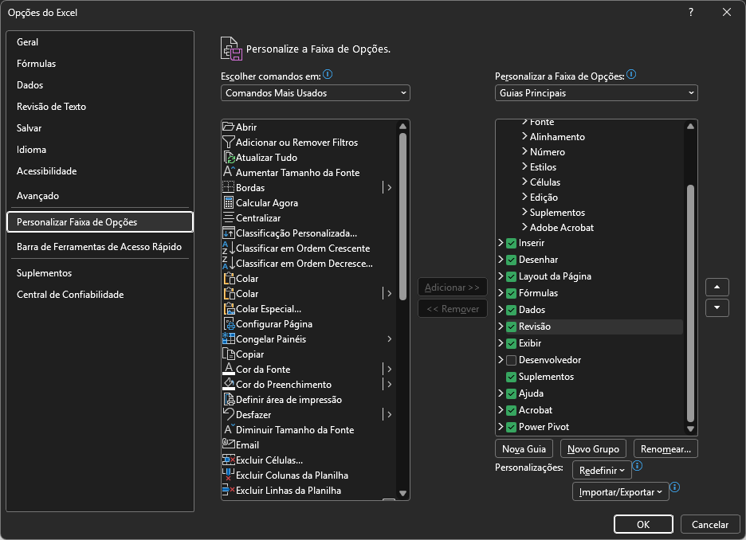
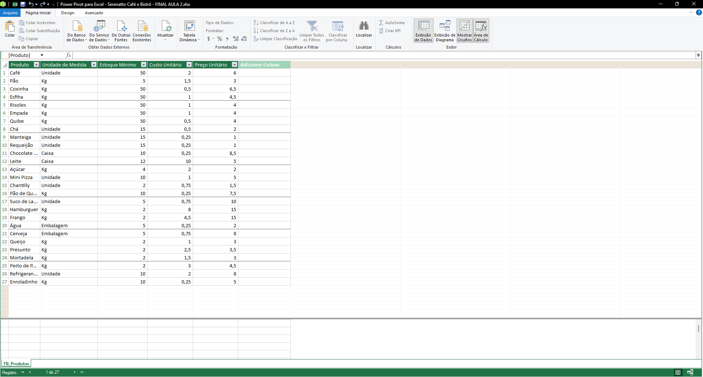
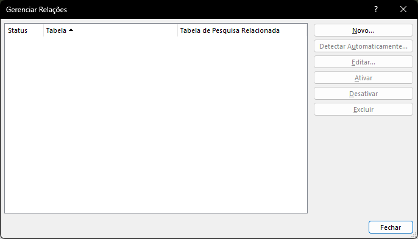
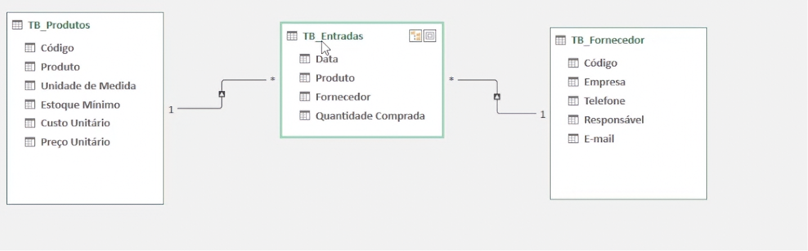
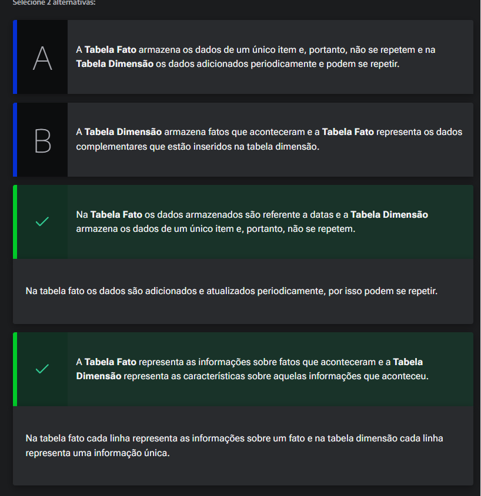

# Conhecendo Power Pivot

## Sumário
- [Conhecendo Power Pivot](#conhecendo-power-pivot)
  - [Sumário](#sumário)
  - [1. Projeto da aula anterior](#1-projeto-da-aula-anterior)
  - [2. O que é Power Pivot?](#2-o-que-é-power-pivot)
  - [3. Relacionando duas tabelas](#3-relacionando-duas-tabelas)
  - [4. Faça como eu fiz: habilitando o Power Pivot](#4-faça-como-eu-fiz-habilitando-o-power-pivot)
  - [5. Relacionando três tabelas](#5-relacionando-três-tabelas)
  - [6. Tabela fato versus Tabela dimensão?](#6-tabela-fato-versus-tabela-dimensão)
  - [7. O que aprendemos?](#7-o-que-aprendemos)

## 1. Projeto da aula anterior

Você pode acessar a [planilha do Serenatto Café e Bistrô](db/Serenatto%20Café%20e%20Bistrô%20-%20FINAL%20AULA%202.xlsx) que estamos usando neste curso.

---
## 2. O que é Power Pivot?

O Power Pivor é uma das ferramentas de analise de dados disponíveis no Excel, essa ferramenta está disponível como um __Suplemento__ para o Excel, para além disso também e utilizado como uma ferramenta de modelagem de dados, que tem como sua principal utilização a possibilidade de trabalhar com uma grande base de dados com alto desempenho.
Mas porque utilizar o Power Pivot ?
Pois através desse suplemento podemos facilitar a criação de análises de dados. Ainda podemos através do Power Pivot realizar esse processo de analise de dados com grande base de dados, outra utilização padrão para o Power Pivot se deve ao fato de que essa ferramenta é a mais indicada dentro do contexto de  Excel para casos que seja necessário trabalhar com mais de uma fonte de dados, e o principal motivo para utilização do Power Pivot se da na funcionalidade de criação de relacionamento entre tabelas.
> PS: O processo de importação de fontes externas para planilha é um propriedade do  <a href="#powerquery"> `POWER QUERY` </a>

Ta mas como podemos Habilitar o Power Pivot ? Para esse presso devemos seguir os passo descritos abaixo:

- 1º Clicar sobre a guia __Arquivo__
- 2º Com a guia aquivo aberta selecionar a opção de __Opções__  
- 3º Dentro do menu de opções selecionar a aba de __Suplementos__.
- 4º Na guia de suplementos, selecionar na parte inferior da tela __Gerenciar__, e escolher o __Suplementos com__, selecionado essa opção clicar em ir
- 5º No guia de __Gerenciador de suplementos COM__, habilitar a opção de `MICROSOFT POWER PIVOT FOR EXCEL`

<table style="text-align: center; width: 100%;"> 
<tr>
    <td style="text-align: left;">
    
    </td>
</tr>
</table>

>Pode ser que o Power Pivot, já esteja habilitado para planilha de trabalho, restando somente realizar a apresentação dessa através da opções de mouse `Personalizar faixa de opções`, e marcar o item do Power Pivot  
><table style="text-align: center; width: 100%;"> 
><tr>
><td style="text-align: left;">
>
></td>
></tr>
></table>

---
Para que possamos começar a trabalhar com o Power Pivot diretamente iremos acessar a guia de mesmo nome, e clicar sobre a opção de __Gerenciar__, será apresentado uma nova tela com outras opções essa é uma maneira _"mais gráfica"_ de se trabalhar com power pivot, porém algumas coisas que já fizemos anteriormente nesse módulo já podem ser consideradas com trabalhos com power pivot. A tela do Power Pivot pode ser visualizada conforme imagem abaixo:  

<table style="text-align: center; width: 100%;"> 
<tr>
    <td style="text-align: left;">
    
    </td>
</tr>
</table>

Na tela acima temos uma representação do Power Pivot, com base na nossa planilha de trabalho, porém se notarmos já temos uma guia nomeada de  `TB_Produtos`, e por que essa  tabela já está presente no nosso cenário, pois na [aula anterior](https://github.com/thierryLchaves/Santander-Imersao-Digital/blob/b12dc23fae2d165a84eaabe4bc720326f0d00359/Analise_de_dados_e_IA_Nivelamento/Semana_06/BI_com_Excel_Trabalhando_com_tabelas_dinamicas_com_Power_Pivot/02_Opcoes_de_tabela_Dinamica/OpcoesDeTabelaDinamica.md), nos utilizamos a criação de uma tabela dinâmica através da opção de fontes externas, quando realizamos esse processo o Excel realiza automaticamente o processo de criação de uma fonte de dados dentro do POWER PIVOT.
> PS: Esse processo de importação de dados e utilização de fontes externas já foi abordado em outra pasta do repositório que pode ser acessada [aqui](https://github.com/thierryLchaves/Santander-Imersao-Digital/blob/052706c38962fd7d9c63447fea58f83420158140/Analise_de_dados_e_IA_Nivelamento/Semana_06/Excel_Simulacao_e_analise_de_cenarios/02_Importando_e_atualizando/ImportandoEAtualizando.md)
---
Dado esses pontos entraremos agora nos problemas que serão abordados no curso sobre nossa planilha.  
O primeiro problema que temos em nossa base de dados que podemos citar se entre as planilhas de __Fornecedor e Entradas__, atualmente essa planilha está preenchida sem a devida ligação entre tabelas o que pode ocasionar em divergências de dados, ou de não reflexão de atualização dos dados entre uma planilha e outra, nesse ponto entramos em um conceito que é denominado de relacionamento de dados, em banco de dados relacionais por exemplo, temos o conceitos de Chaves _"(Primárias e Estrangeiras)"_, esse conceito diz respeito sobre um atributo de identificação para uma determinada linha, e nesse mesmo conceito que nos diz sobre unicidade dos dados, temos uma convenção se podemos dizer assim sobre a __NÃO UTILIZAÇÃO DE NOMES COMO CHAVES__, sendo amplamente adotado e recomendado que essa identificação seja através de códigos, o mesmo conceito deve ser aplicado também para nossa planilhas agora, retornaremos a nossa base de dados e dentro da guia de fornecedor iremos inserir mais uma coluna com o código do fornecedor.  

    
 Power Query

    
É uma tecnologia de conexão e preparação de dados da Microsoft que permite automatizar o processo de extração, transformação e carregamento (ETL).

    <ul>
        <li><strong>Conexão Multivínculos:</strong> Permite importar dados de quase qualquer fonte, como arquivos (Excel, CSV, PDF), bancos de dados (Oracle, SQL Server) e APIs Web.</li>
        <li><strong>Transformação sem Código:</strong> Disponibiliza uma interface gráfica para limpar dados, remover duplicadas, mesclar tabelas e pivotar colunas de forma visual.</li>
        <li><strong>Automação de Etapas:</strong> Grava cada ação de limpeza em um script em segundo plano (linguagem M), permitindo atualizar todo o relatório com apenas um clique quando novos dados chegarem.</li>
    </ul>

---
## 3. Relacionando duas tabelas

Para o processo de relacionamento entre as tabelas, iremos modifica-la mais adiante, para inclusão de códigos tanto dos produtos quanto dos fornecedores.  
Para além desse processo teremos que modificar algumas apresentações da tabelas,  uma das modificações propostas dizem respeito sobre a utilização das tabelas, e aqui entramos em conceito muito importante, quando estamos trabalhando com base de dados podemos separar a base de dados de sua visualização, ou seja podemos realizar a exclusão de algumas informações presentes na planilha de Entradas tais como _Custo Unitário e Valor da compra_, pois nessa base de dados em questão temos as informações de data, produto  (que estará como código), código do fornecedor e uma quantidade comprada, pois podemos realizar dentro do Power Pivot a conexão dos dados.  
Então o que iremos fazer a agora é realizar a junção ou conexão da planilha de entradas com a planilha de produtos através do `Power Pivot`
Para esse processo iremos primeiramente realizar a exclusão tanto da planilha nomeada de dinâmica, quanto da planilha 5, após realizarmos esse passos os dados que foram carregados dentro do `Power Pivot`, será excluído e então iremos realizar outro processo de importação de dados que pode ser realizado através da guia de `Dados`. 
Nesse menu escolheremos dentro do menu de Ferramentas de dados o menu de Relacionamento de dados, será demonstrado uma tela conforme imagem abaixo:  
<table style="text-align: center; width: 100%;"> 
<tr>
    <td style="text-align: left;">
    
    </td>
</tr>
</table>

Dentro dessa opção iremos selecionar a opção de novo e gerar esse relacionamento. 
>PS: Esse processo foi abordado anteriormente em outra aula anotada desse repositório e está presente [aqui](https://github.com/thierryLchaves/Santander-Imersao-Digital/blob/bbbab33d40fd0b9148d0c1799a9d7c6807657770/Analise_de_dados_e_IA_Nivelamento/Semana_05/Excel_Utilizando_tabelas_dinamicas_e_graficos_dinamicos/02_Origens_dos_Dados/OrigensDosDados.md)

Quando realizamos o processo de criação de tabelas dinâmicas com relacionamentos o Excel ira construir tabelas interligas automaticamente por exemplo se selecionarmos a coluna produto e quantidade ele irá apresentar o nome do  produto e não o código, pois como temos o relacionamento dos códigos dos proturos das planilha de entradas e produtos  o Excel irá apresentar o nome que está presente da planilha de produtos. 

---
## 4. Faça como eu fiz: habilitando o Power Pivot

Vimos que o Power Pivot é um suplemento do Excel que pode ser utilizado para criar modelos de dados, realizar cálculos e estabelecer relações entre os dados.

O suplemento é gratuito, presente a partir da versão 2013 do Office, mas que por padrão da Microsoft o Power Pivot não vem habilitado.

Vamos aprender como habilitar o Power Pivot no Excel?

__Opinião do instrutor__  

- __Passo 1:__ Na guia Arquivo clique em Opções.

- __Passo 2:__ Na janela Opções do Excel, clique em Suplementos.

- __Passo 3:__ Na parte inferior da janela Exiba e gerencie Suplementos do Microsoft Office em Gerenciar selecione Suplementos COM e aperte o botão Ir....

- __Passo 4:__ Na janela Suplementos COM habilite a caixa Microsoft Power Pivot for Excel e clique em OK.

Pronto, o suplemento Power Pivot já está habilitado e pronto para ser utilizado durante as aulas do nosso curso.  

---
## 5. Relacionando três tabelas
Com esse processo de de relacionamento de planilhas agora sanamos o primeiro problema proposto que é de integridade dos dados, que em suma se trata da não repetição de informações em diferentes planilhas.   
Ainda nessa base caso desejarmos relacionar ou analisar dados pelo fornecedor será necessário mais um relacionamento que no caso será entre a planilha de fornecedor, com a de entrada e para tal seguiremos os mesmo passo descritos no [tópico anterior](#3-relacionando-duas-tabelas). Quando esse processo for concluído podemos voltar ao nosso power pivot, e exibir o diagrama para visualizar mais graficamente o relacionamento de dados realizado. 

<table style="text-align: center; width: 100%;"> 
<tr>
    <td style="text-align: left;">
    
    </td>
</tr>
</table>

Nesse gráfico visualizamos o relacionamento entre as planilhas propostas, e aqui vale um conceito importante no Excel, a tabela nomeada aqui de TB_Entradas é denominada de <a href="#tbfato">__TABELA FATO__</a>, e esse tabela recebe esse nome pois essa tabela irá receber atualizações constantes ou seja aconteceram fatos novos nelas. já as tabelas TB_Produtos e TB_Fornecedor, são conhecidas como  <a href="#tbdimen">__TABELAS DIMENSÃO__,</a>  pois elas trazem informações que complementares sobre  a tabelas de produtos. 

Agora quando estamos trabalhando com modelagem de dados dentro do Excel é o equivalente a trabalharmos com <a href="#modestrela"> __Modelo de dados estrela__ </a>, ele recebe esse nome pois temos centro uma tabela fato no centro e ao redor dela _N_  tabelas dimensão

    
Tabelas Fato

    
É a tabela central de um modelo de dados (Star Schema) que armazena os acontecimentos históricos, métricas quantitativas e eventos de um negócio.

    <ul>
        <li><strong>Dados Numéricos e Métricas:</strong> Contém os valores brutos que serão somados, calculados ou medidos (ex: quantidade vendida, valor do faturamento, custo do frete).</li>
        <li><strong>Chaves Estrangeiras (FK):</strong> Armazena colunas de chaves (IDs) que servem apenas para ligar o evento de negócio às tabelas de dimensão correspondentes.</li>
        <li><strong>Volume e Dinâmica:</strong> É uma tabela longa, acumulativa e que cresce constantemente a cada nova transação ou registro inserido no sistema.</li>
    </ul>

    
Tabelas Dimensão

    
É a tabela que armazena os atributos, características e contextos que descrevem os elementos contidos em uma tabela fato.

    <ul>
        <li><strong>Contexto e Texto:</strong> Contém dados descritivos que servem para filtrar, segmentar e agrupar as métricas (ex: nome do cliente, categoria do produto, região de venda, data detalhada).</li>
        <li><strong>Chave Primária (PK):</strong> Possui uma coluna de identificação exclusiva (ID) onde cada linha representa um elemento único, sem duplicadas (ex: um ID para cada produto).</li>
        <li><strong>Volume Estático:</strong> É uma tabela geralmente menor e mais estática, cujo conteúdo muda apenas quando um novo cadastro é realizado ou atualizado.</li>
    </ul>

    
Modelo de dados  Estrela

    
É uma abordagem de modelagem de dados relacional otimizada para consultas de Business Intelligence (BI), onde uma tabela fato central é cercada por tabelas de dimensão.

    <ul>
        <li><strong>Formato Visual:</strong> O design se assemelha a uma estrela, onde a tabela fato fica no centro (núcleo) e as pontas são formadas pelas tabelas de dimensão conectadas diretamente a ela.</li>
        <li><strong>Relacionamentos Diretos:</strong> Diferente do modelo floco de neve (Snowflake), as dimensões não são normalizadas, o que significa que não há subdimensões conectadas a outras dimensões.</li>
        <li><strong>Alta Performance:</strong> Reduz drasticamente a necessidade de JOINS complexos nas consultas, tornando a filtragem, agregação e leitura dos dados muito mais rápida no Power Pivot e Power BI.</li>
    </ul>

[↑ Voltar ao topo](#topo)

---
## 6. Tabela fato versus Tabela dimensão?
Ao criar os relacionamentos entre as tabelas utilizadas do Serenatto Café e Bistrô no Power Pivot, o professor Sabino explicou sobre o modelo do tipo estrela que se baseia em tabelas do tipo fato e dimensão.

Para reforçar o conceito, vamos identificar qual a diferença entre tabela dimensão e tabela fato?   

<table style="text-align: center; width: 100%;"> 
<tr>
    <td style="text-align: left;">
    
    </td>
</tr>
</table>

---
## 7. O que aprendemos?

Nessa aula, você aprendeu a:
- Localizar o suplemento do Excel, o Power Pivot;
- Utilizar o Power Pivot no Excel;
- Identificar e reconhecer o que é uma Tabela Fato e Tabela Dimensão;
- Relacionar as tabelas no Power Pivot.

---

<table align="center" style="border-collapse: collapse; margin-left: auto; margin-right: auto;"> 
  <caption><b>Skills do projeto</b></caption>
  <tr>
    <td style="padding: 5px;">
      
    </td>
    <td style="padding: 5px;">
      
    </td>
    <td style="padding: 5px;">
      
    </td>
  </tr>
</table>

---
__Titulo:__ Conhecendo Power Pivot
__Autor:__ Thierry Lucas Chaves  
__Data de Criação:__ 08-06-2026  
__Data de Modificação:__ 13-06-2026  
__Versão:__ "1.0"