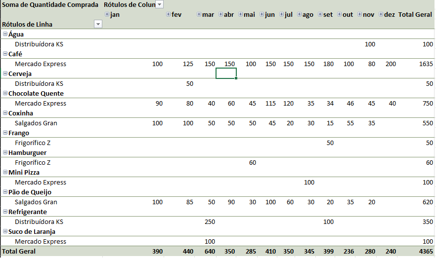
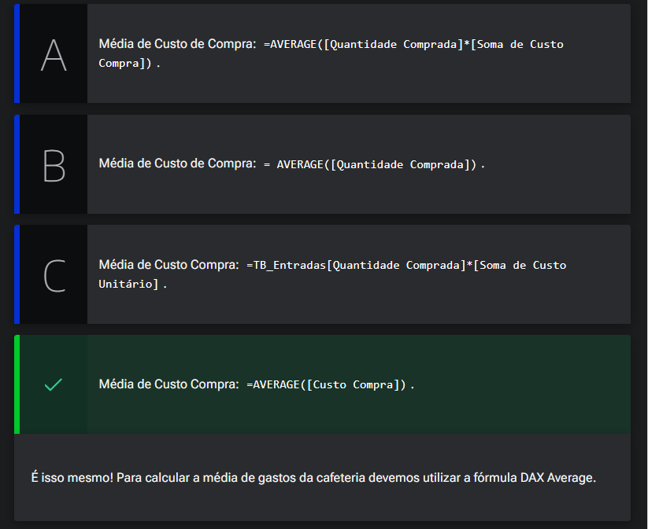
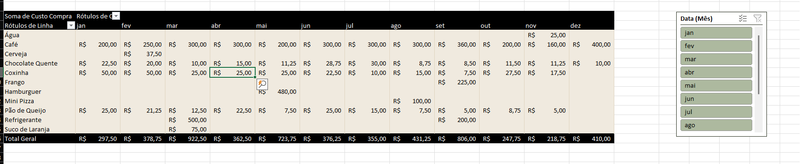

# Usando modelo de dados

<a id="topo"></a>

## Sumário
- [Usando modelo de dados](#usando-modelo-de-dados)
  - [Sumário](#sumário)
  - [1. Projeto da aula anterior](#1-projeto-da-aula-anterior)
  - [2. Criando tabelas dinâmicas](#2-criando-tabelas-dinâmicas)
  - [3. Criando uma coluna calculada](#3-criando-uma-coluna-calculada)
  - [4. Para saber mais: fórmulas DAX](#4-para-saber-mais-fórmulas-dax)
  - [5. Calculando a venda total dos produtos](#5-calculando-a-venda-total-dos-produtos)
  - [6. Aplicando filtros](#6-aplicando-filtros)
  - [7. Faça como eu fiz: criando uma coluna calculada](#7-faça-como-eu-fiz-criando-uma-coluna-calculada)
  - [8. O que aprendemos?](#8-o-que-aprendemos)

## 1. Projeto da aula anterior

Você pode acessar a [planilha do Serenatto Café e Bistrô](db/Estoque%20Serenatto%20Café%20e%20Bistrô%20-%20FINAL%20AULA%203.xlsx) que estamos usando neste curso.  

---
## 2. Criando tabelas dinâmicas

De posse agora da nossa base de dados, que contém  os relacionamentos devidamente feitos, iremos aos próximos passo e para tal temos um desafio inicial que é a montagem de uma tabela que mostre as compras por fornecedores, em cada mês. Como já temos os relacionamento de dados devidamente realizados, quaisquer inserção de novas tabelas dinâmicas a serem feitas serão através da opção de `Tabela Dinâmica do Modelo de dados` com essa opção o Excel irá mostrar no menu lateral de campos da tabela dinâmica, os campos referentes as tabelas de dados presentes nas fontes.  
Agora para realizar essa apresentação proposta devemos realizar uma pergunta antes de construir esse modelo que é :  
__Quais são as informações que serão inseridas ?__
Para responder esse questionamento vamos exemplificar visualmente de como seria a construção dessa tabela...  
<table style="text-align: center; width: 100%;"> 
<tr>
    <td style="text-align: left;">
    
    </td>
</tr>
</table>

Com essa visualização podemos até obter as informações desejadas, porém dessa maneira a informação ficaria até meio redundante pois a final podemos analisar que um determinado produto só e comprado por somente um fornecedor. mas e se quisermos complementar essa apresentação para sabermos o quanto foi gasto? O salto lógico a ser feito para responder esse questionamento seria realizar simplesmente selecionar da tabela de produtos a coluna de custo unitário, visto que se nossa tabela de dimensão produtos temos a informação de custo unitário, e na tabela de entradas temos a informação de quantidade comprada a fórmula ser aplicada seria (Quantidade x Preço), nos sabemos porém o Excel não detecta isso automaticamente, sendo necessário realizar essa adição, e para isso poderíamos tanto realizar a edição da tabela fato para conter essa formula conforme já estava anteriormente, ou podemos através do Power Pivot criar uma MEDIDA. 


[↑ Voltar ao topo](#topo)

---
## 3. Criando uma coluna calculada

Tá no tópico anterior visualizamos que é possível realizar analise de dados pre-existentes no Excel, como melhorar a apresentação de informações, porém como fora anunciado anteriormente , como podemos realizar a criação de informações no Power Pivot ?
Dentro do Power Pivot temos a representação das fontes de dados distribuídas em planilhas assim como também é em planilhas do Excel, porém ao visualizarmos melhor as planilhas ali dispostas, notamos que temos ao final da planilha uma coluna apagada com dizeres de adicionar colunas, nessa colunas iremos inserir novas medidas, para adicionar uma medida dentro do Power Pivot o processo se assemelha bastante com adições de fórmulas do Excel, ou seja também iremos iniciá-las com o `=`, porém no Power Pivot, quando inserirmos tal caractere a própria ferramenta nos sugere algumas medidas possíveis de serem criadas, conforme exemplo abaixo:  

<table style="text-align: center; width: 100%;"> 
<tr>
    <td style="text-align: left;">
    
    </td>
</tr>
</table>

Porém o que desejamos criar é uma fórmula que seria a multiplicação da quantidade comprada pelo preço unitário, então para tal  utilizaremos a seguinte fórmula abaixo.

```DAX
=TB_Entradas[Quantidade Comprada]*[Soma de Custo Unitário]
```

---
## 4. Para saber mais: fórmulas DAX

Ao criar uma medida no Power Pivot, o professor Sabino utilizou uma fórmula bem parecida com as fórmulas que utilizamos no Excel, mas de uma forma diferente.

No Power Pivot, a linguagem de fórmulas utilizada para realizar cálculos e medidas são chamadas de `DAX (Data Analysis Expressions)` que em português são chamadas de Expressões de Análises de Dados.

As fórmulas DAX tem dois objetivos:

- Criar Colunas Calculadas que adicionam valores diferentes para cada linha da tabela;
- Criar Medidas que são cálculos simples que retornam um único valor.  

As fórmulas DAX possibilitam um trabalho mais completo de análise de dados e permitem que os cálculos sejam realizados nas bases de dados inseridas no Power Pivot, sem a necessidade de utilizar fórmulas complexas e ficar alternando entre tabelas e/ou planilhas para obter os resultados calculados.

A sintaxe ou a forma que as fórmulas são escritas na linguagem DAX, incluem vários elementos que compõem uma fórmula. Vamos utilizar a fórmula aplicada pelo Professor Sabino, como exemplo.
```DAX
= [Quantidade Comprada]*[Soma de Custo Unitário]
```

Os elementos da sintaxe são:

- Sinal de igual (=): Indica que uma fórmula será utilizada.
- [Quantidade Comprada]: É a primeira coluna referenciada, indica qual será o primeiro campo que queremos realizar o cálculo.
- Símbolo do Asteriscos (*): É o operador matemático que representa a multiplicação.
- [Soma de Custo Unitário]: É a segunda coluna referenciada que contém os valores dos quais nós desejamos realizar a multiplicação.  

Como dito, as fórmulas DAX contribuem com análises mais completas sobre nossa base de dados e isso é um ganho de tempo muito valioso no cotidiano do trabalho, portanto, em caso de dúvidas sobre os temas aqui estudados, fique à vontade para interagir no fórum do curso, pois são espaços colaborativos no qual alunas e alunos - além das pessoas instrutoras - buscam responder as dúvidas que surgem durante os cursos.

---
## 5. Calculando a venda total dos produtos

Além de saber o valor gasto em cada produto, a Clara gostaria de saber o valor médio de gastos em produtos da Serenatto Café e Bistrô.

Como podemos calcular a média do custo de compra utilizando a linguagem DAX?

<table style="text-align: center; width: 100%;"> 
<tr>
    <td style="text-align: left;">
    
    </td>
</tr>
</table>


---
## 6. Aplicando filtros

Nesse tópico iremos apenas representar uma maneira de realizar uma representação de uma nova planilha de custo por  mês com uma segmentação de dados por mês, e essa ficaria assim:  

<table style="text-align: center; width: 100%;"> 
<tr>
    <td style="text-align: left;">
    
    </td>
</tr>
</table>

>ps: Essa apresentação não é um Dashboard de dados, e sim uma representação que facilite a analise de dados.Porém é essencial para apresentação dos dados do forma gráfica que os dados estejam organizados de forma inteligível . 

---
## 7. Faça como eu fiz: criando uma coluna calculada
Vamos aplicar o que foi ensinado na aula e criar uma Coluna Calculada, utilizando a linguagem DAX para a Clara visualizar quanto ela gastou em cada produto?  
__Opinião do instrutor__  

- __Passo 1:__ Na guia Power Pivot no Excel clique em Gerenciar para abrirmos o suplemento Power Pivot.

- __Passo 2:__ Na planilha TB_Entradas, selecione a coluna chamada Adicionar Coluna.

- __Passo 3:__ Agora vamos utilizar a fórmula DAX, na barra de fórmulas digite o sinal do igual e em seguida insira o colchete de abertura: `=[`

- __Passo 4:__  O Power Pivot abrirá uma janela pequena com todas as colunas que a TB_Entradas possui.

- __Passo 5:__ Clique duas vezes na coluna [Quantidade Comprada] ou selecione a coluna [Quantidade Comprada] e, em seguida, pressione o botão TAB:
```DAX
=[Quantidade Comprada]
```
- __Passo 6:__ Como queremos realizar uma multiplicação, vamos digitar o símbolo do operador da multiplicação `*` (símbolo do asterisco):
```DAX
=[Quantidade Comprada]*
```
- __Passo 7:__ Em seguida insira outro colchete de abertura:
```DAX
=[Quantidade Comprada]*[`
```
- __Passo 8:__ Selecione a coluna [Soma de Unitário] e pressione o botão Enter:
```DAX
=[Quantidade Comprada]*[Soma de Custo Unitário]
```
- __Passo 9:__ Para renomear a coluna calculada chamada de Adicionar Coluna, clique duas vezes no cabeçalho da coluna ou selecione novamente a coluna, clique com o botão direito do mouse e selecione Renomear a Coluna.

- __Passo 10:__ Renomeie a coluna como Custo Compra e pressione o botão Enter.

Pronto, nossa Coluna Calculada foi criada!


[↑ Voltar ao topo](#topo)

---
## 8. O que aprendemos?

<table style="text-align: center; width: 100%;"> 
<tr>
    <td style="text-align: left;">
    
    </td>
</tr>
</table>

---

<table align="center" style="border-collapse: collapse; margin-left: auto; margin-right: auto;"> 
  <caption><b>Skills do projeto</b></caption>
  <tr>
    <td style="padding: 5px;">
      
    </td>
    <td style="padding: 5px;">
      
    </td>
    <td style="padding: 5px;">
      
    </td>
  </tr>
</table>


---
__Titulo:__ Usando modelo de dados
__Autor:__ Thierry Lucas Chaves  
__Data de Criação:__ 08-06-2026  
__Data de Modificação:__ 13-06-2026  
__Versão:__ "1.0"