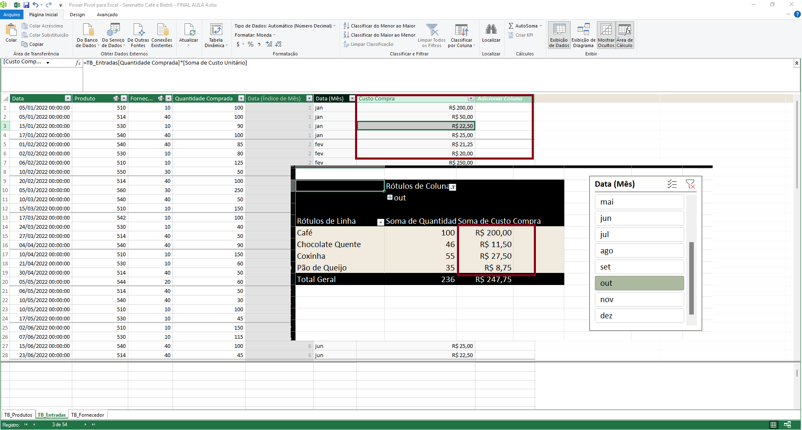
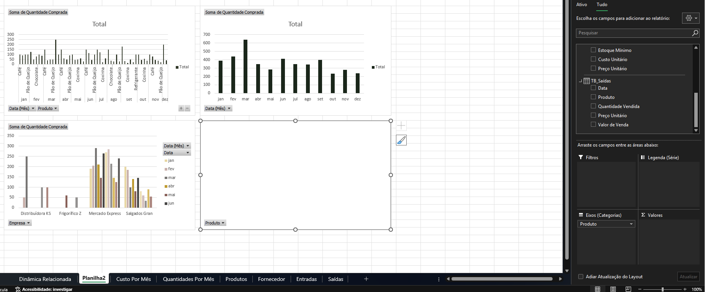
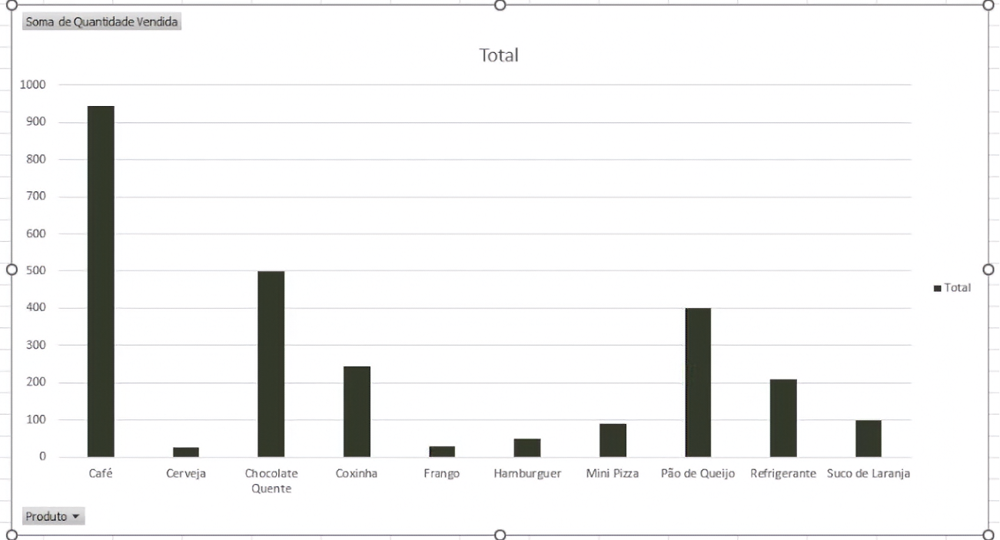
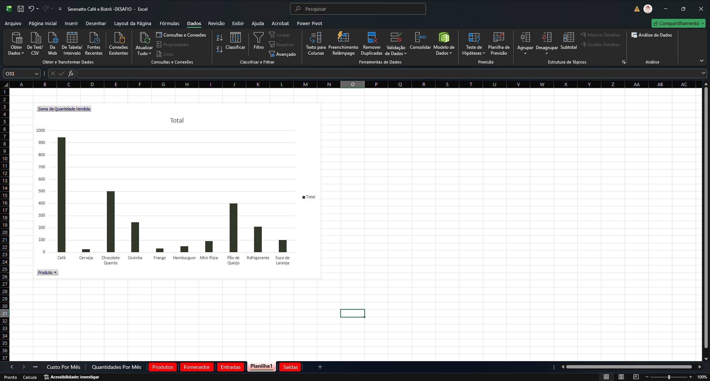

# Finalizando tabelas

<a id="topo"></a>

## Sumário
- [Finalizando tabelas](#finalizando-tabelas)
  - [Sumário](#sumário)
  - [1. Projeto da aula anterior](#1-projeto-da-aula-anterior)
  - [2. Gerenciando o Power Pivot](#2-gerenciando-o-power-pivot)
  - [3. Desafio: criar um gráfico dinâmico no Power Pivot](#3-desafio-criar-um-gráfico-dinâmico-no-power-pivot)
  - [4. Desafio: explicação](#4-desafio-explicação)
  - [5. Projeto final do curso](#5-projeto-final-do-curso)
  - [6. O que aprendemos?](#6-o-que-aprendemos)
  - [7. Conclusão](#7-conclusão)

## 1. Projeto da aula anterior

Você pode acessar a [planilha do Serenatto Café e Bistrô](db/Serenatto%20Café%20e%20Bistrô%20-%20FINAL%20AULA%204.xlsx) que estamos usando neste curso.

---
## 2. Gerenciando o Power Pivot

Também é possível realizar o processo de formatação numérica de uma tabela  dinâmica através do Power Pivot.   
Para realização de tal processo devemos acessar o gerenciamento dos dados do Power Pivot, na guia de Pagina Inicial do Power Pivot, existe um agrupamento do Menu chamado de formatação, nele podemos realizar formatações das colunas, tais como realizar a formatação do  campo valore monetário, ao alterar um dado da tabela do Power Pivot o processo de alteração seja de medidas ou de outras colunas serão refletidas também na Tabela Dinâmica do Excel conforme demonstrado anexo.

<table style="text-align: center; width: 100%;"> 
<tr>
    <td style="text-align: left;">
    
    </td>
</tr>
</table>

Para além do processo de formatação básica das células (seja formatação de casas decimais, _"transformação"_ em datas ETC.. ), o Power Pivot também nos permite realizar o processo de criação de gráficos dinâmicos diretamente, escolhemos uma opção de 4 gráficos dinâmicos para criar 4 gráficos diferentes diretamente em uma planilha e cada um deles mostrando informações diferentes. 

<table style="text-align: center; width: 100%;"> 
<tr>
    <td style="text-align: left;">
    
    </td>
</tr>
</table>

> PS: A imagem acima também nos mostra a tabela de TB_SAIDA, porém se recordarmos do nosso processo de relacionamento das tabelas não realizamos ainda a inserção e/ou relacionamento desta tabela.

---
## 3. Desafio: criar um gráfico dinâmico no Power Pivot

Você pode acessar a [planilha do Serenatto Café e Bistrô](db/Serenatto%20Café%20e%20Bistrô%20-DESAFIO.xlsx) para o desafio.

Chegou a hora de aplicar o que aprendemos ao longo do curso.

O desafio agora é fazer um gráfico dinâmico que represente a quantidade vendida de cada produto.

__Opinião do instrutor__  

- __Passo 1:__ A primeira coisa que precisamos fazer para realizar o desafio é inserir na planilha TB_Saídas os códigos dos Produtos.

- __Passo 2:__ Na tabela TB_Saídas vamos clicar com o botão direito do mouse na coluna Produto para inserir uma nova coluna.

- __Passo 3:__ Na nova coluna vamos abrir a função `PROCX()` para realizar a busca do código dos produtos, digite:
```excel
=PROCX(
```
- __Passo 4:__ A nossa pesquisa_valor será o nome do produto que está na célula D5 (Coxinha) na coluna Produtos:
```excel
=PROCX([@Produto]
```
- __Passo 5:__ Após selecionar a célula D5 digite ponto e vírgula (;)
```excel
=PROCX([@Produto];
```
- __Passo 6:__ Para a nossa pesquisa_matriz, vamos selecionar a coluna Produto que está na planilha Produtos e digitar novamente o ponto e vírgula (;)
```excel
=PROCX([@Produto];TB_Produtos[[#Tudo];
```
- __Passo 7:__ Ainda na planilha Produtos, vamos selecionar a coluna Código que será a nossa matriz_retorno e pressionar o botão Enter:
```excel
=PROCX([@Produto];TB_Produtos[[#Tudo];[Produto]];TB_Produtos[[#Tudo];[Código]];;0)
```
Pronto, já temos os códigos dos nossos produtos na nossa planilha.

- __Passo 8:__ O próximo passso será criar um relacionamento entre a nossa TB_Saídas e a nossa planilha Produtos pela coluna de Código.

- __Passo 9:__ Na guia Dados clique em Relações e selecione o botão Novo.

- __Passo 10:__ Na janela Criar Relação, vamos selecionar a primeira tabela que será a Tb_Saídas e em Coluna (externo) vamos selecionar Código.

- __Passo 11:__ Em Tabela Relacionada vamos selecionar a tabela TB_Produtos e em Coluna Relacionada (principal) vamos selecionar Código.

Pronto, o novo relacionamento foi criado!

- __Passo 11:__ Na guia Power Pivot vamos em Gerenciar para acessarmos a nossa nova tabela no Power Pivot.

- __Passo 12:__ No Power Pivot na guia Página Inicial vamos clicar em Tabela Dinâmica e selecionar a opção Gráfico Dinâmico.

- __Passo 13:__ Na janela Criar Gráfico Dinâmico vamos selecionar Nova Planilha e clicar no botão OK.

- __Passo 14:__ No seletor de campos, vamos clicar na TB_Produtos para selecionar o campo Produto e na TB_Saídas para selecionarmos o campo Quantidade Vendida.

Pronto, você concluiu o desafio. Parabéns por completar o curso de Excel: Tabelas Dinâmicas com Power Pivot e ter chegado até aqui, desejamos ótimos mergulhos e não deixe de acompanhar os próximos da formação.

Em caso de dúvidas sobre os temas aqui estudados, fique à vontade para interagir no fórum do curso na qual são espaços colaborativos no qual alunas e alunos - além das pessoas instrutoras - buscam responder as dúvidas que surgem durante os cursos.

[↑ Voltar ao topo](#topo)

---
## 4. Desafio: explicação

A ideia final de desafio consistira em realizar a confecção de um gráfico dinâmico, das quantidades vendidas por produto, conforme demonstra imagem anexo:  

<table style="text-align: center; width: 100%;"> 
<tr>
    <td style="text-align: left;">
    
    </td>
</tr>
</table>


---
## 5. Projeto final do curso

Após a conclusão do desafio, o gráfico construído para a tabela de saídas ficou da seguinte maneira:  


<table style="text-align: center; width: 100%;"> 
<tr>
    <td style="text-align: left;">
    
    </td>
</tr>
</table>

[↑ Voltar ao topo](#topo)

---
## 6. O que aprendemos?

Nessa aula, você aprendeu como:
- Modificar a formatação dos campos no Power Pivot;
- Elaborar uma tabela dinâmica no Power Pivot;
- Produzir gráficos dinâmicos no Power Pivot.


---
## 7. Conclusão

Nesse curso visualizamos os seguintes tópicos:
- Revisão dos conceitos de tabela Dinâmica, 
- Linha do tempo e Segmentação de dados
- Filtros 
- Criar tabelas dinâmicas a partir de tabelas é mais fácil
- Relacionamento de dados
- Gerenciador do Power Pivot
- Relação entre tabelas no Power Pivot
- Utilizar códigos para relação 
  
Em sintaxe o que aprendemos ao findar do curso foi: 
- Maneiras de modelagem de dados
- Manipulações de dados com Power Pivot
- Conexão de tabelas diferentes. 

---

<table align="center" style="border-collapse: collapse; margin-left: auto; margin-right: auto;"> 
  <caption><b>Skills do projeto</b></caption>
  <tr>
    <td style="padding: 5px;">
      
    </td>
    <td style="padding: 5px;">
      
    </td>
    <td style="padding: 5px;">
      
    </td>
  </tr>
</table>


---
__Titulo:__ Finalizando tabelas
__Autor:__ Thierry Lucas Chaves  
__Data de Criação:__ 08-06-2026  
__Data de Modificação:__ 14-06-2026  
__Versão:__ "1.0"