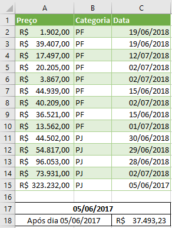
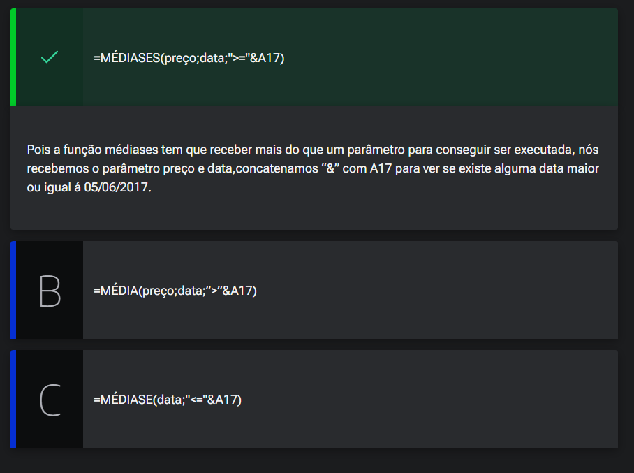

# Pequenas boas práticas

<a id="topo"></a>

## Sumário
- [Pequenas boas práticas](#pequenas-boas-práticas)
  - [Sumário](#sumário)
  - [1. Introdução](#1-introdução)
  - [2. Material do curso](#2-material-do-curso)
  - [3. Importando dados e fórmulas condicionais](#3-importando-dados-e-fórmulas-condicionais)
  - [4. Nomes e boas práticas](#4-nomes-e-boas-práticas)
  - [5. Definindo média](#5-definindo-média)
  - [6. Faça como eu fiz na aula](#6-faça-como-eu-fiz-na-aula)
  - [7. O que aprendemos?](#7-o-que-aprendemos)

## 1. Introdução

Nesse curso  iremos abordar dentro do Excel algumas ferramentas disponíveis sendo elas:  
- Funções 
- Funcionalidades
- Gerenciadores de cenários
- Teste de Hipótese 
- Até o processo de analise de gráficos 
informações
Também iremos visualizar informações de como podemos realizar a atualização automaticamente quando a fonte de dados é alterada. Também será abordado como executar algumas funções condicionalmente para analise de modelos, e a partir disso podemos realizar premissa de cenários. 

---
## 2. Material do curso
Para que o trabalho seja realizado e acompanhado conforme o desenrolar das aulas esse iremos utilizar a seguinte [BASE DE DADOS](db),como fonte.

---
## 3. Importando dados e fórmulas condicionais
Para o início dessa jornada iremos criar uma [nova base](db/Analise_cenarios_01.xlsx), e a partir dela iremos realizar a importação dos dados disponibilizados pela empresa que estão presentes no arquivo [dados.csv](db/dados.csv). 
Para isso iremos acessar nossa nova pasta de trabalho, e iremos realizar o processo de importação dados [aula referência](https://github.com/thierryLchaves/Santander-Imersao-Digital/blob/bbbab33d40fd0b9148d0c1799a9d7c6807657770/Analise_de_dados_e_IA_Nivelamento/Semana_05/Excel_Utilizando_tabelas_dinamicas_e_graficos_dinamicos/04_Modelo_de_dados/ModeloDeDados.md)
> PS: Aqui é importante atentar pela origem do arquivo, e modificar a codificação do arquivo. 

De posse dessa base de dados iremos realizar a extração de algumas inforamções, a primeira que iremos trabalhar será a média, porém não somente a média geral 
```excel
=MÉDIA(dados[Preço])
```
Mas sim iremos realizar o processo de média condicional se por assim formos nomear, onde desejamos e realizar o processo de média por tipo de cliente, então para realizar sse processo utilizaremos a fórmula 
```exce
=MÉDIASES(dados[Preço];dados[Categoria];"pf")
```
Ná pratica do dia a dia utilizamos mais o MÉDIASES, que propriamente dito o médiase, e sua utilização se da em 3 parâmetros, o intervalo de captura da média, o intervalo de critério das médias, e a condição para essa obtenção. 
Outro ponto e que quando realizamos a primeira versão dessa fórmulas passamos como argumento direto o valor do critério de média porém como boa prática passar esse argumento por referências

---
## 4. Nomes e boas práticas

No tópico anterior realizamos o processo de quantificação de média condicional, realizando essa média mediante a uma condição de igualdade que no caso foi o processo de média de algum valor se a condição x for atendida, porém se o caso da média que estivermos procurando for retirada de média se após implementação de um determinado produto ou ação em uma determinada data, as vendas medias aumentaram ou diminuíram. 
Para o caso do exemplo iremos visualizar o valor médio do preço aumentou ou diminuiu pós 18/07/2025, então um processo que podemos realizar é se tal processo e avaliar as médias pré e pós essa data.  
```excel 
=MÉDIASES(dados[Preço];dados[Data];">01/07/2018")
```  
Porém quando anotamos a fórmula dessa maneira, estamos novamente sujeitos a fragilidade de mudanças do processo, valores etc.., para mitigar esse processo iremos concatenar o valor com a condição, para isso substituiremos o valor direto por ` ">=" & F6)`, outra boa prática que podemos adotar é modificar o nome de uma célula, e isso pode ser feito com opção de mouse lado direito definir nome.

---
## 5. Definindo média

Você está trabalhando em uma empresa financeira, e te pediram para fazer a média de gastos dos clientes em geral com base nos dados da planilha abaixo.

<table style="text-align: center; width: 100%;"> 
<tr>
    <td style="text-align: left;">
    
    </td>
</tr>
</table>

Para calcular a média de preço a partir do dia 05/06/2017, qual a fórmula correta do Excel você precisa usar?
<table style="text-align: center; width: 100%;"> 
<tr>
    <td style="text-align: left;">
    
    </td>
</tr>
</table>


---
## 6. Faça como eu fiz na aula

Chegou a hora de você seguir todos os passos realizados por mim durantes esta aula. Caso já tenha feito, excelente. Se ainda não, é importante que você implemente o que foi visto no vídeo para poder continuar com a próxima aula, que tem como pré-requisito todo o código aqui escrito. Se por acaso você já domina essa parte, em cada capítulo, você poderá baixar o projeto feito até aquele ponto.

__Opinião do instrutor__  
O gabarito deste exercício é o passo a passo demonstrado no vídeo. Tenha certeza de que tudo está certo antes de continuar. Ficou com dúvida? Podemos te ajudar pelo nosso fórum.

---
## 7. O que aprendemos?

<table style="text-align: center; width: 100%;"> 
<tr>
    <td style="text-align: left;">
    
    </td>
</tr>
</table>

---

<table align="center" style="border-collapse: collapse; margin-left: auto; margin-right: auto;"> 
  <caption><b>Skills do projeto</b></caption>
  <tr>
    <td style="padding: 5px;">
      
    </td>
    <td style="padding: 5px;">
      
    </td>
    <td style="padding: 5px;">
      
    </td>
  </tr>
</table>


---
__Titulo:__ Pequenas boas práticas
__Autor:__ Thierry Lucas Chaves  
__Data de Criação:__ 08-06-2026  
__Data de Modificação:__ 09-06-2026  
__Versão:__ "1.0"