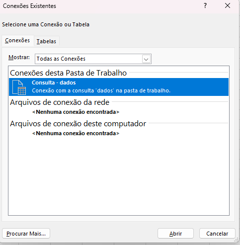
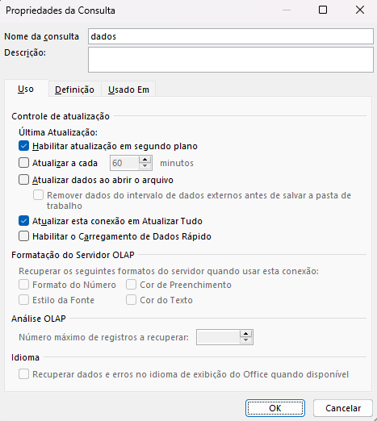
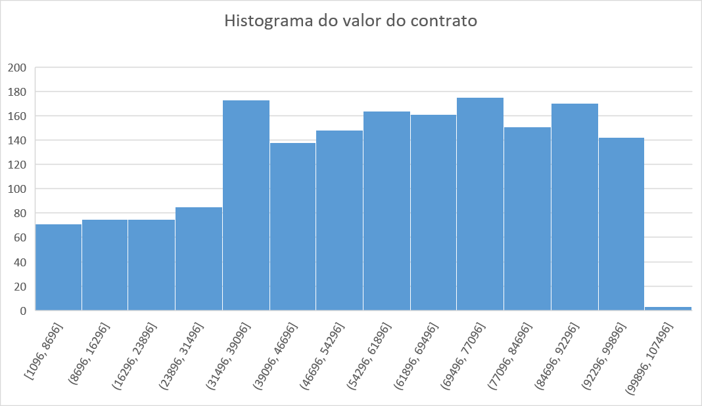
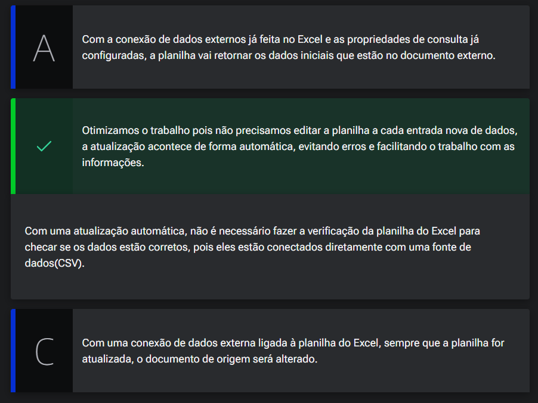
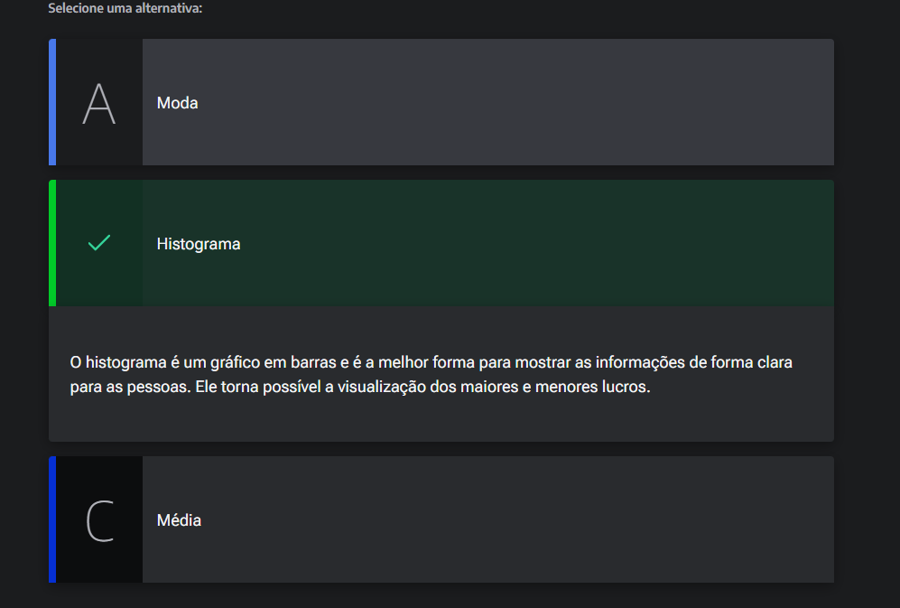

# Importando e atualizando

## Sumário
- [Importando e atualizando](#importando-e-atualizando)
  - [Sumário](#sumário)
  - [1. Projeto da aula anterior](#1-projeto-da-aula-anterior)
  - [2. Auto atualização e histogramas](#2-auto-atualização-e-histogramas)
  - [3. Conexão com fontes externas](#3-conexão-com-fontes-externas)
  - [4. Visualização de dados](#4-visualização-de-dados)
  - [5. Faça como eu fiz na aula](#5-faça-como-eu-fiz-na-aula)
  - [6. O que aprendemos?](#6-o-que-aprendemos)

## 1. Projeto da aula anterior

Daremos continuidade em nossos estudos, e iremos trabalhar em nossa [base de dados](db/Analise_cenarios_02.xlsx)

---
## 2. Auto atualização e histogramas

Agora para esse processo iremos atualizar novamente nossa base de dados, para  não precisarmos realizar o processo de re-importação da fonte de dados, podemos realizar a atualização do processo de outra maneira, dentro da guia de dados, temos a opção de `Conexões Existentes`. dentro dessa opção será apresentado uma nova tela de consulta, informando quais são as conexões de dados existentes, e dentro dessa opção temos a opção de mouse editar propriedades da conexão, conforme imagem 

<table style="text-align: center; width: 100%;"> 
<tr>
    <td style="text-align: left;">
    
    </td>
  <td style="text-align: left;">
    
    </td>
</tr>
</table>

Dentro da opção de edição das conexões, é possível realizar a atualização dos dados, quando o arquivo de origem também é atualizado de forma automática. Essa atualização pode ser programada por tempo, ou a cada vez que a pasta de trabalho for aberta novamente. 
E para essa atualização poderíamos fazer a substituição do arquivo de origem, quando realizamos esse processo o Excel irá realizar o processo de atualização da nossa fonte de dados automaticamente. 
>PS: Como estamos trabalhando com mesmo arquivo porém em diferentes repositórios a base de dados de atualização será com base no arquivo de onde esta o arquivo origem.

Como realizamos o processo de utilização de cálculos das medias através dos nomes das tabelas ou nomes de variáveis essa não foi alterada.

---
Agora que já trabalhamos com o processo de atualização da fonte de dados. iremos analisar outros pontos, anteriormente havíamos comentado sobre a média, e que existe um ponto de desabono sobre sua utilização, esse desabono pois ela nos fornece somente um ponto (ou uma visão), porém mais interessante equ somente 1 dado ponto, seria  gerar um gráfico de histograma para melhor analise: 

<table style="text-align: center; width: 100%;"> 
<tr>
  <td style="text-align: left;">
    
    </td>
</tr>
</table>

---
## 3. Conexão com fontes externas

No Excel, podemos conectar fontes de dados externa. É possível também programar de quanto em quanto tempo queremos que os dados da planilha sejam atualizados, por exemplo: a cada meia hora ou a cada vez que a planilha é aberta.

Qual a vantagem em conectar fontes de dados externas ao Excel?

<table style="text-align: center; width: 100%;"> 
<tr>
  <td style="text-align: left;">
    
    </td>
</tr>
</table>

---
## 4. Visualização de dados

Haverá uma reunião, onde você deve mostrar os lucros por mês de uma empresa, você deve mostrar quando ocorreu o maior lucro e o menor lucro de uma forma nítida e clara para as pessoas na reunião. Você está com a planilha de dados em mãos.

Qual o método você pode utilizar para mostrar de forma clara o menor e o maior lucro?  

<table style="text-align: center; width: 100%;"> 
<tr>
  <td style="text-align: left;">
    
    </td>
</tr>
</table>

---
## 5. Faça como eu fiz na aula

Chegou a hora de você seguir todos os passos realizados por mim durantes esta aula. Caso já tenha feito, excelente. Se ainda não, é importante que você implemente o que foi visto no vídeo para poder continuar com a próxima aula, que tem como pré-requisito todo o código aqui escrito. Se por acaso você já domina essa parte, em cada capítulo, você poderá baixar o projeto feito até aquele ponto.

__Opinião do instrutor__  
O gabarito deste exercício é o passo a passo demonstrado no vídeo. Tenha certeza de que tudo está certo antes de continuar. Ficou com dúvida? Podemos te ajudar pelo nosso fórum.

---
## 6. O que aprendemos?
Nessa aula aprendemos:

- Criar um histograma
- Atualizar os dados CSV no Excel
- Utilizar a função MED  

---

<table align="center" style="border-collapse: collapse; margin-left: auto; margin-right: auto;"> 
  <caption><b>Skills do projeto</b></caption>
  <tr>
    <td style="padding: 5px;">
      
    </td>
    <td style="padding: 5px;">
      
    </td>
    <td style="padding: 5px;">
      
    </td>
  </tr>
</table>

---
__Titulo:__ Importando e atualizando
__Autor:__ Thierry Lucas Chaves  
__Data de Criação:__ 08-06-2026  
__Data de Modificação:__ 09-06-2026  
__Versão:__ "1.0"