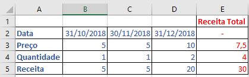
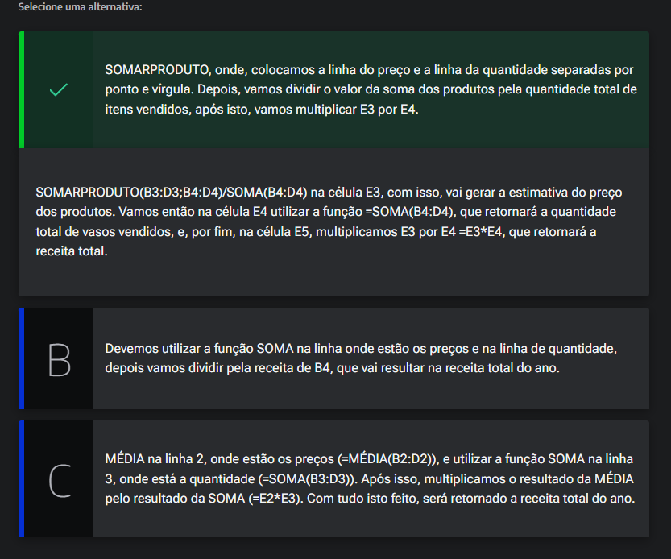
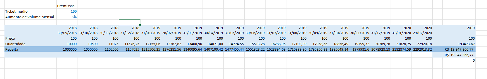

# Validação

<a id="topo"></a>

## Sumário
- [Validação](#validação)
  - [Sumário](#sumário)
  - [1. Projeto da aula anterior](#1-projeto-da-aula-anterior)
  - [2. Células de validação e fazendo testes pequenos](#2-células-de-validação-e-fazendo-testes-pequenos)
  - [3. Testando estimativas](#3-testando-estimativas)
  - [4. Expandindo para 2 anos](#4-expandindo-para-2-anos)
  - [5. Faça como eu fiz na aula](#5-faça-como-eu-fiz-na-aula)
  - [6. O que aprendemos?](#6-o-que-aprendemos)

## 1. Projeto da aula anterior

Daremos continuidade em nossos estudos, e iremos trabalhar em nossa [base de dados](db/Analise_cenarios_03.xlsx)

---
## 2. Células de validação e fazendo testes pequenos

A partir de agora iremos trabalhar no processo de simulações em  cima da nossa base de dados, e para tal, iremos criar mais uma planilha em nossa pasta de trabalho e iremos nomeá-la de Simulações: 

Vamos supor que estamos trabalhando com o processo de previsão de vendar para os meses X, e nesse processo em questão estamos simulando , a quantidade de vendas o preço de um produto e lucro presumido, uma das maneiras que podemos utilizar o Excel de maneira que facilita o preenchimento de datas pelo menos do fil de uma data, para tal utilizamos a fórmula: 
```excel
=FIMMÊS(C6;1)
```
Um ponto valido de se atentar e que o segundo parâmetro diz a quantidade de meses que devem ser acrescidas no calculo, mas o que queremos no fim pós essa projeção seria de calcular quanto teremos vendido ao final do ano; Existem varias formas diferentes de calcularmos esse processo, para isso podemos utilizar a fórmula de média para verificar quanto foi a média de vendas para informação de preço, a soma para a quantidade vendida, e também a soma para a receita presumida, ou ainda podemos fazer o calculo com base na multiplicação do valor da média pelo preço final, porém nesse cenário pode nos levar a cometer alguns erros, e para isso é importante termos uma célula de verificação.
 <table style="text-align: center; width: 100%;"> 
<tr>
    <td style="text-align: left;">
    
    </td>
</tr>
</table>

E como verificamos de fato se a previsão deu "erro", para tal podemos realizar a subtração da célula de receita, pela de validação (que utiliza a soma), se tivermos no caso uma diferença entre a fórmula de validação entre o fórmula que foi utilizada para obtenção da presunção de lucro, então nesse caso temos um erro, quando esses cenários são _"encontrados"_ devemos validar novamente quais são as outras possibilidades para tal erro.
Ao olharmos por exemplo a fórmula da receita por padrão sempre será a __quantidade x o preço__, a quantidade de itens sempre será também a somatória dos itens vendidos, sendo assim nos leva a intuir que o erro está no calculo da média de preço, então para a correção desse _"problema"_ devemos realizar a soma de produtos, pois em cenários que temos um valor médio que "destoe" em detrimento do peso de algo.  

> Ex: No decorrer de 3 meses tive 4 vendas, onde os 2 primeiros meses foram vendidos  1 produto a 5 e no terceiro mês tivemos 2 vendas totalizando 10, nossa média de fato seria o equivalente a multiplicação do valor x quantidade de cada mês para então realizar a somatória desse processo e posteriormente aplicar a divisão pela quantidade.
Para um efeito ilustrativo melhor vamos tabelar esse processo miniaturizando esse processo 


|            |       |       |       |     |             |
| ---------- | ----- | ----- | ----- | --- | ----------- |
|            | Mês 1 | Mês 2 | Mes 3 |     | Resultados  |
| Valor      | 5     | 5     | 10    |     | Média: 6,66 |
| Quantidade | 1     | 1     | 2     |     | 3           |
| Total      | 5     | 5     | 20    |     | 15          |

Conforme a tabela acima temos a aplicação da média normal ou seja a soma dos valores de vendas pela quantidade total de ocorrências, porém esse número não nos traz de fato a média verdadeira, pois o certo seria, resultado entre 10 e 5 ou seja  média desses valores para tal aplicamos a soma dos produtos  (Vl x qt de cada mes / soma das quantidades), conforme exemplo abaixo:  

|            |       |       |       |     |                                            |
| ---------- | ----- | ----- | ----- | --- | ------------------------------------------ |
|            | Mês 1 | Mês 2 | Mes 3 |     | Resultados                                 |
| Valor      | 5     | 5     | 10    |     | Média: (5x1 + 5x1 + 10x2) / (1+1+2)  = 7,5 |
| Quantidade | 1     | 1     | 2     |     | 3                                          |
| Total      | 5     | 5     | 20    |     | 30                                         |

ou seja nossa média real de fato seria a soma dos produtos, o Excel conta com um fórmula de aplicação de soma de produtos:  
```excel
=SOMARPRODUTO(C13:E13;C14:E14)/SOMA(C14;D14:E14)
```
> PS: Para aplicação da soma de produtos, é necessário que realizemos 2(duas) passagens de parâmetros, pois queremos a soma dos produtos de preço e a soma de produtos de quantidades que são duas matrizes.

Ao retornamos para  nossa base de dados vamos ajustar nossa média que estava sendo trabalhada para então refletir nosso novo cenário:
```excel
=SOMARPRODUTO(C7:F7;C8:F8)/SOMA(C8:F8)
```
ao aplicar essa fórmula podemos obter enfim nosso ticket médio. Nesse processo também e importante nos ater a quantidade de variação de erro, se por exemplo tivéssemos uma diferença mínima entre os resultados na casa de algumas casas decimais pós a vírgula isso não deveria ser considerado como um erro, então para tal e o que é comumente adotado e realizar o arredondamento desse valor.
```excel
=ARRED(H10-H9;2)
```

---
## 3. Testando estimativas

No começo de 2018, Ana montou uma empresa de vasos de cerâmica. Ela gostaria de fazer pequenos testes para ter uma estimativa sobre o preço, a quantidade de produtos vendidos e a receita que a empresa terá até o final do ano. Por enquanto, a tabela de Ana está assim:  

<table style="text-align: center; width: 100%;"> 
<tr>
    <td style="text-align: left;">
    
    </td>
</tr>
</table>  

Qual fórmula Ana pode utilizar para automatizar o cálculo da célula E5? 

<table style="text-align: center; width: 100%;"> 
<tr>
    <td style="text-align: left;">
    
    </td>
</tr>
</table>  


---
## 4. Expandindo para 2 anos

Pós a primeira validação daremos sequência no nosso processo de validação, com dados o suficiente para obtermos resultados até o segundo mês de 2020.
Para tal utilizamos a extensão do corpo da nossa base de dados, e para além desse processo também adicionamos o a validação de erro, outro ponto dado aos nossos cenários simulados, e que temos valores que podem ser variáveis, que no caso são o ticket médio de vendas, e o valor percentual de expectativa de vendas, para tal iremos tabular novamente esses dados e trataremos esses  valores a partir de então como premissas.

<table style="text-align: center; width: 100%;"> 
<tr>
    <td style="text-align: left;">
    
    </td>
</tr>
</table>  

No processo final conforme imagem acima, temos que ficar modificando nossas premissas para previsibilidade conforme demanda ex como seria se a taxa fosse 10% ou 15 ou 0 etc.., porém isso não é replicável em vida real, e para melhorar isso veremos mais adiante.  

---
## 5. Faça como eu fiz na aula  

Chegou a hora de você seguir todos os passos realizados por mim durantes esta aula. Caso já tenha feito, excelente. Se ainda não, é importante que você implemente o que foi visto no vídeo para poder continuar com a próxima aula, que tem como pré-requisito todo o código aqui escrito. Se por acaso você já domina essa parte, em cada capítulo, você poderá baixar o projeto feito até aquele ponto.  

__Opinião do instrutor__  
O gabarito deste exercício é o passo a passo demonstrado no vídeo. Tenha certeza de que tudo está certo antes de continuar. Ficou com dúvida? Podemos te ajudar pelo nosso fórum.  

---
## 6. O que aprendemos?

Nessa aula aprendemos:

- Utilizar a função FIMMÊS
- Utilizar a função ARRED
- Utilizar a função SOMARPRODUTO
- Declarar um erro de validação

---

<table align="center" style="border-collapse: collapse; margin-left: auto; margin-right: auto;"> 
  <caption><b>Skills do projeto</b></caption>
  <tr>
    <td style="padding: 5px;">
      
    </td>
    <td style="padding: 5px;">
      
    </td>
    <td style="padding: 5px;">
      
    </td>
  </tr>
</table>


---
__Titulo:__ Validação
__Autor:__ Thierry Lucas Chaves  
__Data de Criação:__ 08-06-2026  
__Data de Modificação:__ 09-06-2026  
__Versão:__ "1.0"