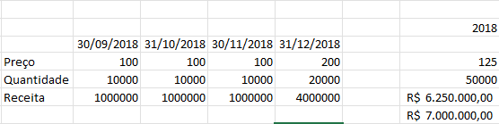

# Validação

<a id="topo"></a>

## Sumário
- [Validação](#validação)
  - [Sumário](#sumário)
  - [1. Projeto da aula anterior](#1-projeto-da-aula-anterior)
  - [2. Células de validação e fazendo testes pequenos](#2-células-de-validação-e-fazendo-testes-pequenos)
  - [3. Testando estimativas](#3-testando-estimativas)
  - [4. Expandindo para 2 anos](#4-expandindo-para-2-anos)
  - [5. Faça como eu fiz na aula](#5-faça-como-eu-fiz-na-aula)
  - [6. O que aprendemos?](#6-o-que-aprendemos)

## 1. Projeto da aula anterior

Daremos continuidade em nossos estudos, e iremos trabalhar em nossa [base de dados](db/Analise_cenarios_02.xlsx)

---
## 2. Células de validação e fazendo testes pequenos

A partir de agora iremos trabalhar no processo de simulações em  cima da nossa base de dados, e para tal, iremos criar mais uma planilha em nossa pasta de trabalho e iremos nomeá-la de Simulações: 

Vamos supor que estamos trabalhando com o processo de previsão de vendar para os meses X, e nesse processo em questão estamos simulando , a quantidade de vendas o preço de um produto e lucro presumido, uma das maneiras que podemos utilizar o Excel de maneira que facilita o preenchimento de datas pelo menos do fil de uma data, para tal utilizamos a fórmula: 
```excel
=FIMMÊS(C6;1)
```
Um ponto valido de se atentar e que o segundo parâmetro diz a quantidade de meses que devem ser acrescidas no calculo, mas o que queremos no fim pós essa projeção seria de calcular quanto teremos vendido ao final do ano; Existem varias formas diferentes de calcularmos esse processo, para isso podemos utilizar a fórmula de média para verificar quanto foi a média de vendas para informação de preço, a soma para a quantidade vendida, e também a soma para a receita presumida, ou ainda podemos fazer o calculo com base na multiplicação do valor da média pelo preço final, porém nesse cenário pode nos levar a cometer alguns erros, e para isso é importante termos uma célula de verificação.
 <table style="text-align: center; width: 100%;"> 
<tr>
    <td style="text-align: left;">
    
    </td>
</tr>
</table>
E como verificamos de fato se a previsão deu "erro", para tal podemos realizar a subtração da célula de receita, pela de validação (que utiliza a soma)


---
## 3. Testando estimativas

[↑ Voltar ao topo](#topo)

---
## 4. Expandindo para 2 anos

[↑ Voltar ao topo](#topo)

---
## 5. Faça como eu fiz na aula

[↑ Voltar ao topo](#topo)

---
## 6. O que aprendemos?

[↑ Voltar ao topo](#topo)

---

<!-- <table style="text-align: center; width: 100%;"> 
<tr>
    <td style="text-align: left;">
    
    </td>
</tr>
</table> -->

---

<table align="center" style="border-collapse: collapse; margin-left: auto; margin-right: auto;"> 
  <caption><b>Skills do projeto</b></caption>
  <tr>
    <td style="padding: 5px;">
      
    </td>
    <td style="padding: 5px;">
      
    </td>
    <td style="padding: 5px;">
      
    </td>
  </tr>
</table>


---
__Titulo:__ Validação
__Autor:__ Thierry Lucas Chaves  
__Data de Criação:__ 08-06-2026  
__Data de Modificação:__ 08-06-2026  
__Versão:__ "1.0"