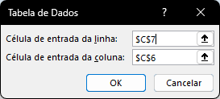
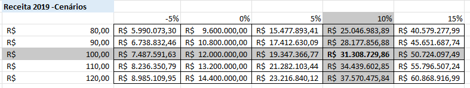
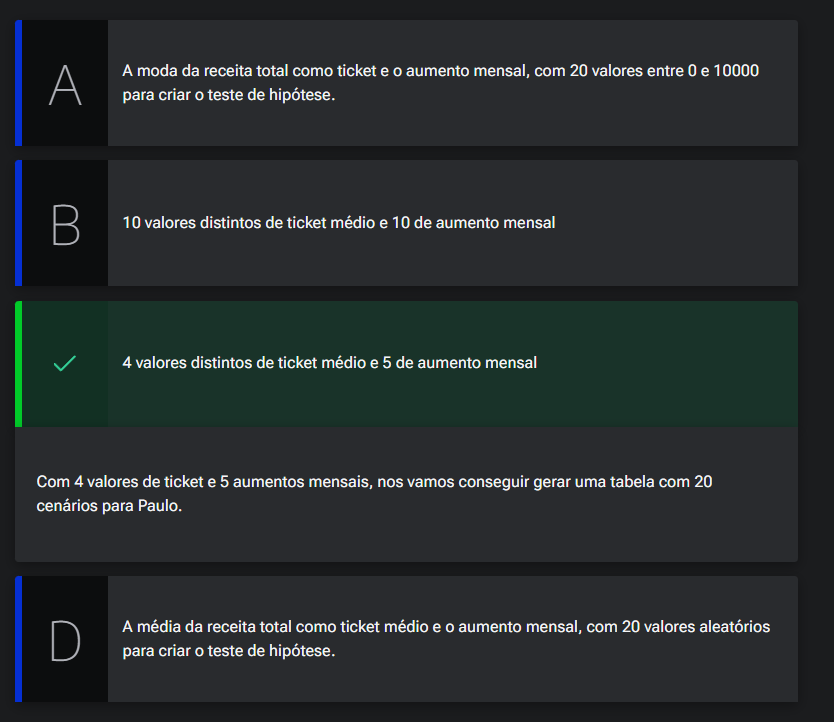

# Rodando Cenários

## Sumário
- [Rodando Cenários](#rodando-cenários)
  - [Sumário](#sumário)
  - [1. Projeto da aula anterior](#1-projeto-da-aula-anterior)
  - [2. Cenários distintos e teste de hipótese](#2-cenários-distintos-e-teste-de-hipótese)
  - [3. Criação de cenário](#3-criação-de-cenário)
  - [4. Protegendo a planilha e comentários](#4-protegendo-a-planilha-e-comentários)
  - [5. Medidas de precaução](#5-medidas-de-precaução)
  - [6. Faça como eu fiz na aula](#6-faça-como-eu-fiz-na-aula)
  - [7. O que aprendemos?](#7-o-que-aprendemos)

## 1. Projeto da aula anterior

Daremos continuidade em nossos estudos, e iremos trabalhar em nossa [base de dados](db/Analise_cenarios_04.xlsx)

---
## 2. Cenários distintos e teste de hipótese
Conforme visualizamos no final da [aula anterior](https://github.com/thierryLchaves/Santander-Imersao-Digital/blob/e7369311aaa4386779f453894f29ed9c0e219f83/Analise_de_dados_e_IA_Nivelamento/Semana_06/Excel_Simulacao_e_analise_de_cenarios/03_Validacao/Validacao.md), nosso cenário de simulação contém um problema _"intrínseco"_ no processo de preenchimento das premissas, em primeira ordem pelo fato que os valores que são preenchidos nas premissas dependem da alteração manual do usuário, e em última instância os valores que são preenchidos estão meramente especulados e não estão sendo projetados com base em algo.

Mas vamos pensar se o que desejamos e projetar  4 cenários de por exemplo _(-5%,0%,5%,10%)_, bem como para diferentes tikects médios _(100,90,110,120)_, se fossemos aplicar todos esses cenários manualmente teríamos que projetar 16 cenários distintos. 
Então para facilitar esse processo podemos criar uma tabela para simular esse processo e podemos realizar uma fórmula que será descrita posteriormente da melhor maneira a ser preenchido para tais informações.   

__Receita 2019__
|            |     |     |     |     |
| ---------- | --- | --- | --- | --- |
|            | -5% | 0%  | 5%  | 10% |
| R$: 90,00  |     |     |     |     |
| R$: 100,00 |     |     |     |     |
| R$: 110,00 |     |     |     |     |
| R$: 120,00 |     |     |     |     |

Essa seria o esboço da nossa nova tabela para simulação dos cenários, e para isso precisamos agora de algumas informações que já temos em nossa base, uma delas e nosso valor de receita _(calculo com base na soma dos produtos X somatório da quantidade)_; Para isso a primeira célula da intercessão foi deixada em branco para que possamos endereçar o valor dessa receita ali. O processo para realizar isso no Excel é através da guia DADOS na função __Teste de Hipóteses__, nessa função temos algumas opções porém iremos inicialmente selecionar a opção de `tabela de dados..` ao selecionar tal opção será apresentado uma tela conforme a imagem:    

<table style="text-align: center; width: 100%;"> 
<tr>
    <td style="text-align: left;">
    
    </td>
</tr>
</table>

Por esse motivo montamos nossa simulação em formato tabular, pois queremos simular cenários de diferentes tickets médios com diferentes variações de crescimento de venda mensal, nossa linha a percentual irá corresponder célula de aumento de volume mensal, já a coluna de crescimento de ticket médio será a nossa coluna; 
> PS: Normalmente adota-se uma formatação de célula diferente para o cenário mais provável a ser adotado.

Com esse processo teremos um cenário de simulação similar ao que temos na imagem abaixo:  

<table style="text-align: center; width: 100%;"> 
<tr>
    <td style="text-align: left;">
    
    </td>
</tr>
</table>

---
## 3. Criação de cenário

Paulo trabalha em uma empresa de investimento que analisa cenários possíveis de aumento de lucro, desvalorização, estagnação etc de uma empresa. Uma cliente solicita uma análise para investir em determinada empresa conforme os valores de ticket médio e aumento mensal.

Quais informações Paulo precisa para executar o teste de hipótese e gerar 20 cenários diferentes para sua cliente?  
<table style="text-align: center; width: 100%;"> 
<tr>
    <td style="text-align: left;">
    
    </td>
</tr>
</table>

---
## 4. Protegendo a planilha e comentários
Uma das maneiras para que possamos trabalhar a imutabilidade, e blindagem da nossa planilha, seria através da guia de revisão, nessa guia temos as opções de menu  proteção.
Com essa opção o Excel realiza a trava de edição de quaisquer valores dentro da planilha em questão, porém para nosso cenário desejamos ainda que os valores de premissas estejam passiveis de modificação e isso também pode ser feito dentro do mesmo menu, na opção de Permitir a edição de intervalos.
Assim como também é possível realizar a adição de comentários dentro da planilha.

---
## 5. Medidas de precaução  

José guarda uma planilha com os dados anuais de sua empresa, e ele vai compartilhar esta planilha para ser analisada em um escritório financeiro, porém deseja que ninguém altere sem querer parte dos dados da tabela.

Como José faria para formatar a sua planilha, para evitar que não seja modificada sem querer?  
<table style="text-align: center; width: 100%;"> 
<tr>
    <td style="text-align: left;">
    
    </td>
</tr>
</table>  

---
## 6. Faça como eu fiz na aula

Chegou a hora de você seguir todos os passos realizados por mim durantes esta aula. Caso já tenha feito, excelente. Se ainda não, é importante que você implemente o que foi visto no vídeo para poder continuar com a próxima aula, que tem como pré-requisito todo o código aqui escrito. Se por acaso você já domina essa parte, em cada capítulo, você poderá baixar o projeto feito até aquele ponto.

__Opinião do instrutor__   
O gabarito deste exercício é o passo a passo demonstrado no vídeo. Tenha certeza de que tudo está certo antes de continuar. Ficou com dúvida? Podemos te ajudar pelo nosso fórum.  

---
## 7. O que aprendemos?

Nessa aula aprendemos:

- Adicionar comentários em células
- Proteger a planilha
- Permitir edição em células com a planilha protegida
- Utilizar o teste de hipótese

---

<table align="center" style="border-collapse: collapse; margin-left: auto; margin-right: auto;"> 
  <caption><b>Skills do projeto</b></caption>
  <tr>
    <td style="padding: 5px;">
      
    </td>
    <td style="padding: 5px;">
      
    </td>
    <td style="padding: 5px;">
      
    </td>
  </tr>
</table>

---
__Titulo:__ Rodando Cenários
__Autor:__ Thierry Lucas Chaves  
__Data de Criação:__ 08-06-2026  
__Data de Modificação:__ 10-06-2026  
__Versão:__ "1.0"