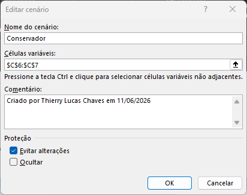
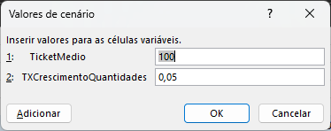
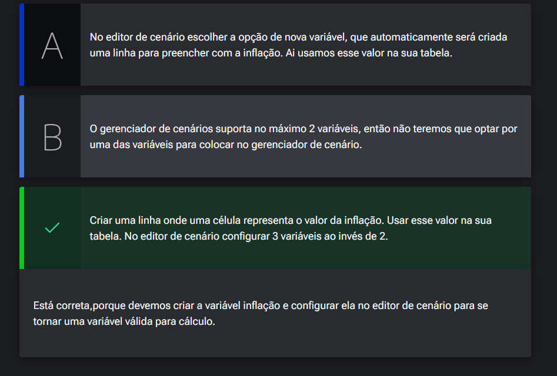

# Gerenciando

## Sumário
- [Gerenciando](#gerenciando)
  - [Sumário](#sumário)
  - [1. Projeto da aula anterior](#1-projeto-da-aula-anterior)
  - [2. Gerenciador de cenários](#2-gerenciador-de-cenários)
  - [3. Análise de cenário](#3-análise-de-cenário)
  - [4. Faça como eu fiz na aula](#4-faça-como-eu-fiz-na-aula)
  - [5. O que aprendemos?](#5-o-que-aprendemos)

## 1. Projeto da aula anterior

Daremos continuidade em nossos estudos, e iremos trabalhar em nossa [base de dados](db/Analise_cenarios_05.xlsx)

---
## 2. Gerenciador de cenários
Na [módulo anterior](https://github.com/thierryLchaves/Santander-Imersao-Digital/blob/02c15b50e39c175e567710982e2a1047370f0c4b/Analise_de_dados_e_IA_Nivelamento/Semana_06/Excel_Simulacao_e_analise_de_cenarios/04_Rodando_Cenarios/RodandoCenarios.md), visualizamos como realizar o processo de simulação de cenários, com base em uma tabela, ou seja realizar simulações`TESTE DE HIPÓTESES` em duas dimensões, realizando a variação de duas premissa _(ou veiáveis)_ tabulando esse resultado, em nossas simulações foram realizados 25 cenários diferentes, porém essa quantidade de informações ou simulações podem ser um tanto quanto exaustiva de ser feita, e as vezes o que desejamos seja trabalhar com número reduzido de cenários. 
Para que possamos reaproveitas nosso preenchimento que já foi realizado, iremos copiar nossa planilha para um segunda planilha.  
De posse de nossa nova planilha, vamos acessar novamente a guia de __DADOS -> Teste de hipóteses__, porém dessa vez iremos escolher a opção de `Gerenciador de cenários`. será exibido uma nova tela, com algumas opções e nessa tela iremos escolher a opção de adicionar.

<table style="text-align: center; width: 100%;"> 
<tr>
    <td style="text-align: left;">
    
    </td>
</tr>
</table>

Inserção dos valores, no campo de células variáveis, será apresentado uma nova tela para informar quais serão os valores de veriaveis :

<table style="text-align: center; width: 100%;"> 
<tr>
    <td style="text-align: left;">
    
    </td>
</tr>
</table>

> PS: os nomes que estão sendo apresentado os nomes das [células que foram nomeadas](https://github.com/thierryLchaves/Santander-Imersao-Digital/blob/052706c38962fd7d9c63447fea58f83420158140/Analise_de_dados_e_IA_Nivelamento/Semana_06/Excel_Simulacao_e_analise_de_cenarios/02_Importando_e_atualizando/ImportandoEAtualizando.md)  

Pós adição dos cenários podemos retornar a tela de gerenciador de cenários,  selecionar a opção de `Mostrar` para que tais informações sejam apresentadas. 
Essa opção comumente é utilizada quando desejamos explorar esses cenários de forma esporádica para apresentação. 

---
## 3. Análise de cenário  

No cenário apresentado nós mostramos a análise de cenários com 2 variáveis: o ticket médio e o aumento de volume de vendas mensal.

Se a Joana analista de negócios, deseja utilizar mais uma variável, que é a inflação esperada, o que ela deve fazer?

<table style="text-align: center; width: 100%;"> 
<tr>
    <td style="text-align: left;">
    
    </td>
</tr>
</table>

---
## 4. Faça como eu fiz na aula

Chegou a hora de você seguir todos os passos realizados por mim durantes esta aula. Caso já tenha feito, excelente. Se ainda não, é importante que você implemente o que foi visto no vídeo para poder continuar com a próxima aula, que tem como pré-requisito todo o código aqui escrito. Se por acaso você já domina essa parte, em cada capítulo, você poderá baixar o projeto feito até aquele ponto.

__Opinião do instrutor__ 
O gabarito deste exercício é o passo a passo demonstrado no vídeo. Tenha certeza de que tudo está certo antes de continuar. Ficou com dúvida? Podemos te ajudar pelo nosso fórum.  

---
## 5. O que aprendemos?

Nessa aula aprendemos:

- Gerenciar cenários

---

<table align="center" style="border-collapse: collapse; margin-left: auto; margin-right: auto;"> 
  <caption><b>Skills do projeto</b></caption>
  <tr>
    <td style="padding: 5px;">
      
    </td>
    <td style="padding: 5px;">
      
    </td>
    <td style="padding: 5px;">
      
    </td>
  </tr>
</table>

---
__Titulo:__ Gerenciando
__Autor:__ Thierry Lucas Chaves  
__Data de Criação:__ 08-06-2026  
__Data de Modificação:__ 11-06-2026  
__Versão:__ "1.0"