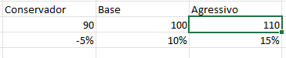

# Metas e mais cenários complexos

<a id="topo"></a>

## Sumário
- [Metas e mais cenários complexos](#metas-e-mais-cenários-complexos)
  - [Sumário](#sumário)
  - [1. Projeto da aula anterior](#1-projeto-da-aula-anterior)
  - [2. Cenários com filtros e validação](#2-cenários-com-filtros-e-validação)
  - [3. Índice e correspondente como boa prática](#3-índice-e-correspondente-como-boa-prática)
  - [4. Atingindo metas nos modelos](#4-atingindo-metas-nos-modelos)
  - [5. Lucro previsto](#5-lucro-previsto)
  - [6. Conclusão](#6-conclusão)
  - [7. Projeto](#7-projeto)
  - [8. Faça como eu fiz na aula](#8-faça-como-eu-fiz-na-aula)
  - [9. O que aprendemos?](#9-o-que-aprendemos)

## 1. Projeto da aula anterior

Daremos continuidade em nossos estudos, e iremos trabalhar em nossa [base de dados](db/Analise_cenarios_06.xlsx)

---
## 2. Cenários com filtros e validação

Para inicio do módulo iremos iniciar adicionando mais uma planilha, essa será com base na ultima criada da segunda simulação. Como realizamos o processo de simulação de cenário 2, as indicações das células foram relativas, e por esse motivo ao realizar a copia os cenários se mantiveram, que não haja _"confusão"_ na execução desse processo iremos excluir os cenários presentes na simulação 3. 
Nesse processo de simulações, deixaremos uma tabela com as descrições dos cenários em formato tabular, informando a taxa e ticket médio para os cenários, conforme imagem:  
<table style="text-align: center; width: 100%;"> 
<tr>
    <td style="text-align: left;">
    
    </td>
</tr>
</table>

 porém iremos adicionar  outra célula as informações via uma função de Excel, para isso iremos realizar a procura horizontal `PROCH`
 ```excel
 =PROCH($C$5;$E$7:G9;2;FALSO)
 ```
 Na fórmula acima é entendida da seguinte maneira:  
 - 1º Qual o valor está sendo buscado no caso o home do cenário 
 - 2º Qual a matriz (ou intervalo de valores) estão sendo buscado os valores.
 - 3º Qual a linha dentro dessa matriz que contem o valor buscado
 - 4º Se a correspondência e aproximada ou exata.  

A mesma fórmula será aplicada também para o percentual, porém com edição do parâmetro para 3.   
Outro ponto e que dessa maneira estamos deixando a escrita por conta do usuário, o que já vimos reiteradamente, que pode incorrer em erros, para sanar esse processo iremos realizar a validação de dados, escolhendo de lista, e selecionaremos as opções da tabela que foi criada, fazendo assim com que somente os valores desejados sejam passíveis de serem inseridos / selecionados.

---
## 3. Índice e correspondente como boa prática
A abordagem anterior funciona perfeitamente , porém tem fragilidades, caso tenhamos alguma modificação dentro 

---
## 4. Atingindo metas nos modelos

[↑ Voltar ao topo](#topo)

---
## 5. Lucro previsto

[↑ Voltar ao topo](#topo)

---
## 6. Conclusão

[↑ Voltar ao topo](#topo)

---
## 7. Projeto

[↑ Voltar ao topo](#topo)

---
## 8. Faça como eu fiz na aula

[↑ Voltar ao topo](#topo)

---
## 9. O que aprendemos?

[↑ Voltar ao topo](#topo)

---

<!-- <table style="text-align: center; width: 100%;"> 
<tr>
    <td style="text-align: left;">
    
    </td>
</tr>
</table> -->

---

<table align="center" style="border-collapse: collapse; margin-left: auto; margin-right: auto;"> 
  <caption><b>Skills do projeto</b></caption>
  <tr>
    <td style="padding: 5px;">
      
    </td>
    <td style="padding: 5px;">
      
    </td>
    <td style="padding: 5px;">
      
    </td>
  </tr>
</table>


---
__Titulo:__ Metas e mais cenários complexos
__Autor:__ Thierry Lucas Chaves  
__Data de Criação:__ 08-06-2026  
__Data de Modificação:__ 08-06-2026  
__Versão:__ "1.0"