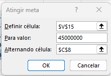
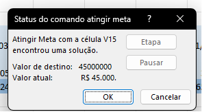
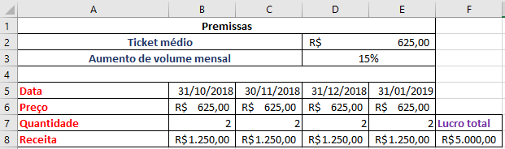
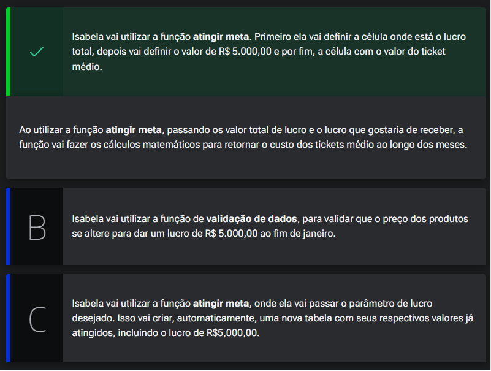

# Metas e mais cenários complexos

<a id="topo"></a>

## Sumário
- [Metas e mais cenários complexos](#metas-e-mais-cenários-complexos)
  - [Sumário](#sumário)
  - [1. Projeto da aula anterior](#1-projeto-da-aula-anterior)
  - [2. Cenários com filtros e validação](#2-cenários-com-filtros-e-validação)
  - [3. Índice e correspondente como boa prática](#3-índice-e-correspondente-como-boa-prática)
  - [4. Atingindo metas nos modelos](#4-atingindo-metas-nos-modelos)
  - [5. Lucro previsto](#5-lucro-previsto)
  - [6. Faça como eu fiz na aula](#6-faça-como-eu-fiz-na-aula)
  - [7. O que aprendemos?](#7-o-que-aprendemos)

## 1. Projeto da aula anterior

Daremos continuidade em nossos estudos, e iremos trabalhar em nossa [base de dados](db/Analise_cenarios_06.xlsx)

---
## 2. Cenários com filtros e validação

Para inicio do módulo iremos iniciar adicionando mais uma planilha, essa será com base na ultima criada da segunda simulação. Como realizamos o processo de simulação de cenário 2, as indicações das células foram relativas, e por esse motivo ao realizar a copia os cenários se mantiveram, que não haja _"confusão"_ na execução desse processo iremos excluir os cenários presentes na simulação 3. 
Nesse processo de simulações, deixaremos uma tabela com as descrições dos cenários em formato tabular, informando a taxa e ticket médio para os cenários, conforme imagem:  
<table style="text-align: center; width: 100%;"> 
<tr>
    <td style="text-align: left;">
    
    </td>
</tr>
</table>

 porém iremos adicionar  outra célula as informações via uma função de Excel, para isso iremos realizar a procura horizontal `PROCH`
 ```excel
 =PROCH($C$5;$E$7:G9;2;FALSO)
 ```
 Na fórmula acima é entendida da seguinte maneira:  
 - 1º Qual o valor está sendo buscado no caso o home do cenário 
 - 2º Qual a matriz (ou intervalo de valores) estão sendo buscado os valores.
 - 3º Qual a linha dentro dessa matriz que contem o valor buscado
 - 4º Se a correspondência e aproximada ou exata.  

A mesma fórmula será aplicada também para o percentual, porém com edição do parâmetro para 3.   
Outro ponto e que dessa maneira estamos deixando a escrita por conta do usuário, o que já vimos reiteradamente, que pode incorrer em erros, para sanar esse processo iremos realizar a validação de dados, escolhendo de lista, e selecionaremos as opções da tabela que foi criada, fazendo assim com que somente os valores desejados sejam passíveis de serem inseridos / selecionados.

---
## 3. Índice e correspondente como boa prática
A abordagem anterior funciona perfeitamente , porém tem fragilidades, caso tenhamos alguma modificação dentro da tabela de premissas, teremos invitalmente um erro devido a utilização do  `PROCH`, por exemplo no __3º__ parâmetro informamos qual será a linha de busca para o resultado, e informamos qual seria manualmente, porém se tivermos qualquer alteração na formatação dessa tabela a fórmula não irá funcionar conforme esperado.  
Então uma das maneiras que temos para realizar a edição que seja menos suscetível a esse tipo de falhas, usaremos a fórmula associação das fórmulas de `ÍNDICE + CORRESP`, onde através do `CORRESP` iremos buscar o valor _"relativo"_ da coluna, e com a função `índice`, conforme exemplo abaixo:  
```excel
=ÍNDICE(E10:G10;1;CORRESP($C$5;$E$7:$G$7;0))
```
Dessa maneira teremos uma garantia mínima de que os valores desejados para o retorno fiquem menos suscetíveis a erros de fórmula em caso de alterações de linhas. 
> PS: É também uma boa prática realizar a utilização `índice` e `corresp`, ao invés de `PROCV` ou `PROCH`
---
## 4. Atingindo metas nos modelos

Nesse tópico iremos verificar mais um cenário o cenário de quando temos um valor alvo a ser atingido.   
Para o exemplo em questão iremos traçar como meta o lucro presumido de R$: 45.000.000,00, nos visualizamos fórmulas de simulações distintas desde vários cenários conforme premissas bases através do teste de hipóteses, na qual verificamos que é possível realizar a tabulação de múltiplos resultados de uma só vez, também visualizamos manerias de diferentes cenários através do gerenciador de cenários onde através de uma seleção visualizamos a modificação no cenário proposto, e recentemente visualizamos a forma com base em um escopo menor de premissas podemos aliar índice e correspondência de resultados. Porém em todos os cenários baseamos o lucro em correspondência a quantidade de vendas e valor de aumento de percentual. Nesse caso o que desejamos é com base em um valor determinado como podemos visualizar qual seria o percentual de taxa de crescimento para atingir essa meta ?  
> PS: Para esse novo cenário ao contrário dos demais vistos anteriormente, o único valor a ser modificado  será a taxa e o ticket médio, será fixo em R$: 110,00.  

A maneira que utilizaremos para realizar tal tarefa segue os seguintes passos, dentro da guia de dados ainda na opção de teste de hipóteses temos a opção de `ATINGIR META..`, ao selecionar essa opção será exibido uma caixa de informações para que possamos  informar alguns parâmetros, conforme ilustrado em imagem abaixo:  

<table style="text-align: center; width: 50%;"> 
<tr>
    <td style="text-align: left;">
    
    </td>
</tr>
</table>

Nesse quadro precisamos informar qual será a célula que _"recebera"_ o valor, e posteriormente informaremos qual será o valor de meta, e o ultimo parâmetro qual é a célula ou qual variável deverá sofrer alterações para alcançar tal meta. Ao finalizar o processo de simulações, o Excel retornará uma caixa de informação com uma mensagem que pode ser similar a da imagem :  
<table style="text-align: center; width: 50%;"> 
<tr>
    <td style="text-align: left;">
    
    </td>
</tr>
</table>

Ao clicar em `OK` o Excel irá preencher a célula de destino com o valor do cenário que atingiu a meta.  
>PS: A célula da primeira opção da caixa deve ser um fórmula em seu resultado, e não um valor fixo. 
>PS2: A célula que será alterada (o ultimo campo da caixa), deverá ser um valor e não uma fórmula.  


---
## 5. Lucro previsto

Isabela gerencia um e-commerce. Ela fez uma planilha de planejamento de lucros mensal e o lucro total esperado é de R$ 880,00, considerando o período entre 31/10/2018 e 31/01/2019. Entretanto, o objetivo de Isabela é ter um lucro total de R$ 5.000,00 até o fim de janeiro de 2019.

<table style="text-align: center; width: 100%;"> 
<tr>
    <td style="text-align: left;">
    
    </td>
</tr>
</table>

Qual função Isabela precisar usar para que seu planejamento atinja o lucro de R$ 5.000,00 no período estipulado?  

<table style="text-align: center; width: 100%;"> 
<tr>
    <td style="text-align: left;">
    
    </td>
</tr>
</table>


---
## 6. Faça como eu fiz na aula

Chegou a hora de você seguir todos os passos realizados por mim durantes esta aula. Caso já tenha feito, excelente. Se ainda não, é importante que você implemente o que foi visto no vídeo para poder continuar com a próxima aula, que tem como pré-requisito todo o código aqui escrito. Se por acaso você já domina essa parte, em cada capítulo, você poderá baixar o projeto feito até aquele ponto.  

__Opinião do instrutor__  

O gabarito deste exercício é o passo a passo demonstrado no vídeo. Tenha certeza de que tudo está certo antes de continuar. Ficou com dúvida? Podemos te ajudar pelo nosso fórum.  

---
## 7. O que aprendemos?

Nessa aula aprendemos:

- Utilizar a função PROCH
- Utilizar a função ÍNDICE
- Utilizar a função CORRESP
- Validar dados nas células
- Atingir meta de valores
- Este conteúdo foi útil para o seu apr

---

<table align="center" style="border-collapse: collapse; margin-left: auto; margin-right: auto;"> 
  <caption><b>Skills do projeto</b></caption>
  <tr>
    <td style="padding: 5px;">
      
    </td>
    <td style="padding: 5px;">
      
    </td>
    <td style="padding: 5px;">
      
    </td>
  </tr>
</table>


---
__Titulo:__ Metas e mais cenários complexos
__Autor:__ Thierry Lucas Chaves  
__Data de Criação:__ 08-06-2026  
__Data de Modificação:__ 11-06-2026  
__Versão:__ "1.0"