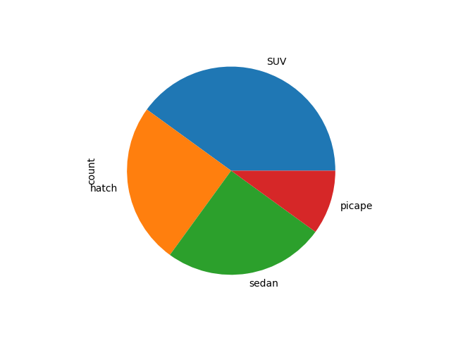

# Conteúdo Live 08/06/2026  
## Trabalhando com pandas II

<a id="topo"></a>

## Sumário
- [Conteúdo Live 08/06/2026](#conteúdo-live-08062026)
  - [Trabalhando com pandas II](#trabalhando-com-pandas-ii)
  - [Sumário](#sumário)
  - [1. Introdução.](#1-introdução)
  - [2. Recapitulação](#2-recapitulação)
  - [3. Filtros](#3-filtros)
  - [4. Plotando dados](#4-plotando-dados)
  - [5. Agrupamento do dados](#5-agrupamento-do-dados)

## 1. Introdução.
> Conforme jpa visualizado em aulas anteriores, o curso sera utilizado via Collab do Google, porém para notações serão feitas em repositório padrão

Conforme boas práticas de programação os Alias padrões para algumas bibliotecas são:
- Pandas = PD
- Numpy = NP
- TensorFLow = TF

## 2. Recapitulação 
Iremos utilizar o `Pandas` para leitura de um arquivo e para tal utilizamos os seguintes comandos:  
```py
dados = pd.read_excel("carros.xlsx")
dados.head()
```
## 3. Filtros
O comando acima nos dá uma visão geral da planilha porém se desejarmos realizar um filtro podemos utilizar o objeto instanciado, fazendo o filtro com a seguinte sintaxe:  
```py
dados[['modelo','ano','combustivel']]
```
Outro ponto importante e nos ater aos nomes que estão presentes nas colunas, pois a acentuação também influi na apresentação dos dados, dando continuidade ao processo podemos ter necessidades de realizar determinados filtros mais aplicados, se por exemplo fosse necessário realizar um filtro de carros que possuem acima de 5.000 km's, como poderíamos fazer isso? 
```py
for i in range(len(dados['quilometragem'])):
    if dados['quilometragem'][i] < 50000:
        print(dados['modelo'][i], dados['quilometragem'][i])
```
Essa é uma maneira de atingir a condição porém quando utilizamos o pandas podemos incertar esse código da seguinte maneira:
```py
dados[dados['quilometragem']<50000]
```
Ainda se desejarmos realizar o processo de seleção de determinados valores, podemos filtrar o resultado com seguinte trecho de código:
```py
dados_filtragem = dados[dados['quilometragem']<50000]
dados_filtragem[['modelo','ano','quilometragem']]
dados_filtragem.to_excel("Carros_filtrados.xlsx") # Nesse trecho fazemos o processo de salvar o arquivo em Excel
```
Mas em sintaxe, o que o `Pandas` Realiza quando escrevemos o comando acima, e equivalente o for escrito anteriormente.  

----

Agora se desejarmos realizar a contagem distinta da lista podemos utilizar o comando :  

```py
dados['marca'].unique()
```
> PS: Por regras de sintaxe do pandas, quando desejamos selecionar um conjunto de colunas, essas devem estar entre 2 `[]`

Quando for necessário realizar o processo de contagem agrupada por exemplo podemos utilizar a sintaxe abaixo:
```py
dados['marca'].value_counts()
```
## 4. Plotando dados
Agora se desejarmos realizar uma plotagem dos dados, utilizamos algo parecido como :
```
dados['categoria'].value_counts().plot.pie()
```
agora se formos incrementar esse processo, podemos escrever o código o seguinte
```py
import matplotlib.pyplot as plt
dados['categoria'].value_counts().plot.pie()
plt.savefig("grafico.png")
plt.show()
```
Onde no caso realizamos a contagem da chave de categoria, realizamos o plot via TORTA
posteriormente utilizamos a biblioteca `matplotlib.pyplot`,  utilizando a função `savefig` para que o gráfico em questão fique disponível em png
<table style="text-align: center; width: 100%;"> 
<tr>
    <td style="text-align: left;">
    
    </td>
</tr>
</table>

E por fim utilizamos o comando `show`, para visualizar o gráfico.

## 5. Agrupamento do dados

Agora se  digitarmos o seguinte código abaixo:  
```py
dados.groupby('cambio')['quilometragem'].mean()
```
O que estamos fazendo é o agrupamento dos dados em cambio, procurando pela média de quilometragem, essa média foi obtida pelo comando `mean()`. 

Agora ainda podemos realizar o processo de contagem utilizando alguma condição 
```py
dados[dados['quilometragem'] > dados['quilometragem'].mean()]
```
Nesse casso estamos extraindo os dados em quilometragem, onde somente tivermos carros com a quilometragem maior que a media geral.  
E para que possamos por exemplo _"plotar"_, os dados em barras podemos utilizar o seguinte comando:  

```py
dados.groupby('cambio')['quilometragem'].mean().plot.bar()
plt.savefig("Cambio_quilometragem.png")
plt.show()
```

Com isso terminamos nossa aula do dia.

---

<table align="center" style="border-collapse: collapse; margin-left: auto; margin-right: auto;"> 
  <caption><b>Skills do projeto</b></caption>
  <tr>
    <td style="padding: 5px;">
      
    </td>
    <td style="padding: 5px;">
      
    </td>
    <td style="padding: 5px;">
      
    </td>
  </tr>
  <tr>
    <td style="padding: 5px;">
      
    </td>
    <td>
    </td>
    <td style="padding: 5px;">
      
    </td>
  </tr>
</table>


---
__Titulo:__ Conteúdo Live 08/06/2026  
__Autor:__ Thierry Lucas Chaves    
__Data de Criação:__ 08-06-2026  
__Data de Modificação:__ 08-06-2026  
__Versão:__ "1.0"