# Conectando os dados

## Sumário
- [Conectando os dados](#conectando-os-dados)
  - [Sumário](#sumário)
  - [1. Apresentação](#1-apresentação)
  - [2. Para saber mais: conta gratuita indisponível](#2-para-saber-mais-conta-gratuita-indisponível)
  - [3. Preparando o ambiente: Power BI e base de dados](#3-preparando-o-ambiente-power-bi-e-base-de-dados)
  - [4. Para saber mais: Business Intelligence](#4-para-saber-mais-business-intelligence)
  - [5. Construindo o cartão com a média de pets](#5-construindo-o-cartão-com-a-média-de-pets)
  - [6. Alinhamento configuração Power BI](#6-alinhamento-configuração-power-bi)
  - [7. Ajustando a visualização](#7-ajustando-a-visualização)
  - [8. Importando as pastas e mesclando as tabelas](#8-importando-as-pastas-e-mesclando-as-tabelas)
  - [9. Tipo de dado correto](#9-tipo-de-dado-correto)
  - [10. Conectando com o Google planilhas](#10-conectando-com-o-google-planilhas)
  - [11. Renomeando tabelas](#11-renomeando-tabelas)
  - [12. Faça como eu fiz](#12-faça-como-eu-fiz)
  - [13. O que aprendemos?](#13-o-que-aprendemos)

## 1. Apresentação

Nesse curso teremos a mesma dinâmica vista anteriormente nos demais diretórios desse repositório, iremos aprender uma nova ferramenta com base em uma premissa de implementação prática. 
Durante o curso em questão veremos algumas coisas aqui listadas:  
- O que é o B.I
- Pro que utilizar o Power BI?
- Importar diferentes formatos
- Tratar os dados no Power Query
- Importar dos dados tratados
- Criar colunas e medidas
- Criar visuais 
- Estilização do DashBoard 

Ao final do curso teremos construído um  dashboard similar a imagem abaixo:  
<table style="text-align: center; width: 100%;"> 
<tr>
    <td style="text-align: center;">
    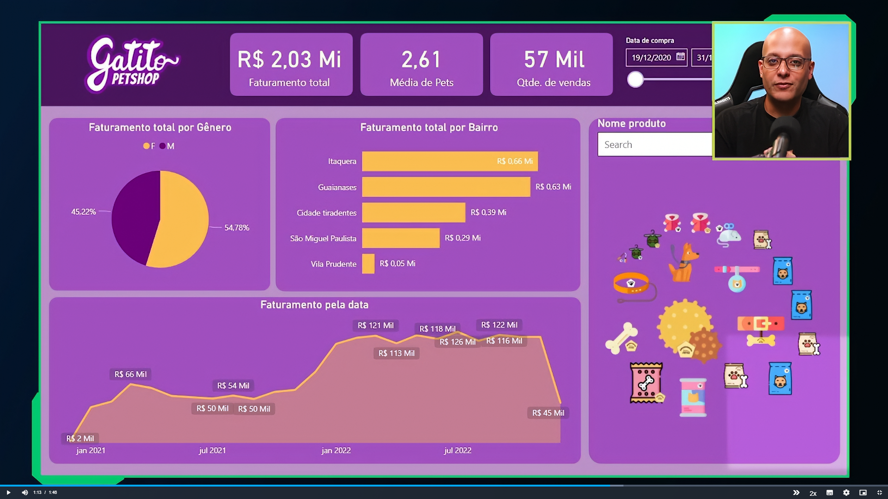
    </td>
</tr>
</table>

---
## 2. Para saber mais: conta gratuita indisponível

Durante a realização da formação de Power BI, você perceberá que alguns cursos utilizam o Power BI Serviço, a plataforma online onde é possível publicar relatórios e dashboard, além de compartilhar com outras pessoas.

No entanto, sabemos que muitos alunos e alunas estão enfrentando dificuldades para criar uma conta gratuita do Power BI. Isso está acontecendo porque, no momento, a Microsoft não está disponibilizando uma opção de criação de conta gratuita com tanta facilidade como antes, e o acesso ao Power BI Serviço está disponível apenas por meio de licenças pagas.

Apesar disso, não se preocupe, pois isso não afetará nos seus estudos. Você ainda poderá concluir todos os cursos da formação, mesmo sem acesso ao Power BI Serviço. A única diferença é que você não conseguirá publicar os relatórios online e importar alguns visuais, mas poderá fazer todo o projeto no Power BI Desktop, que é gratuito e fornece todas as funcionalidades necessárias durante a formação.

A Microsoft realiza atualizações com alta frequência, então isso pode mudar em breve. Se surgir uma nova maneira de criar uma conta gratuita, vamos comunicar a você. Por enquanto, você pode realizar os cursos da formação de Power BI sem empecilhos.

Em caso de dúvidas, entre em contato conosco pelo Discord da Alura ou pelo canal de atendimento ao estudante.

[↑ Voltar ao topo](#topo)

---
## 3. Preparando o ambiente: Power BI e base de dados
Neste curso, vamos aprender a construir um dashboard utilizando o [Power BI](https://www.microsoft.com/pt-br/power-platform/products/power-bi/). Para que possamos realizar as práticas do curso, precisamos instalar o Power BI Desktop e baixar os arquivos que serão utilizados.  
Abaixo, disponibilizo os materiais e passo a passo para fazermos isso.  

__Material do curso__
Durante o curso, iremos construir um dashboard utilizando uma base de dados contendo informações sobre um petshop. O material deste curso está disponível no [diretório de dados padrão do módulo](https://github.com/thierryLchaves/Santander-Imersao-Digital/blob/46e8db9e34f0eeb1ed62a6ccc230952768506b42/Analise_de_dados_e_IA_Nivelamento/Semana_07/Power_BI_Desktop_Construindo_meu_primeiro_dashboard/db).  

__Instalação do Power BI__  
- 1º Acesse a [página de download](https://www.microsoft.com/pt-br/power-platform/products/power-bi/downloads) do Power BI.
- 2º Na página de download, você encontrará diversas opções. Procure pela opção Microsoft Power BI Desktop e clique em Fazer download:
> <table style="text-align: center; width: 50%;"> 
> <tr>
> <td style="text-align: left;">
> 
> </td>
> </tr>
> </table>
- 3º Após essa ação, você será redirecionado para uma página em branco, onde será solicitada a abertura da loja da Microsoft. Clique em Abrir Microsoft Store:
> <table style="text-align: center; width: 100%;"> 
> <tr>
> <td style="text-align: left;">
> 
> </td>
> </tr>
> </table>
- 4º Com a página inicial do Power BI Desktop na loja da Microsoft aberta, você pode clicar em Instalar:
> <table style="text-align: center; width: 70%;"> 
> <tr>
> <td style="text-align: left;">
> 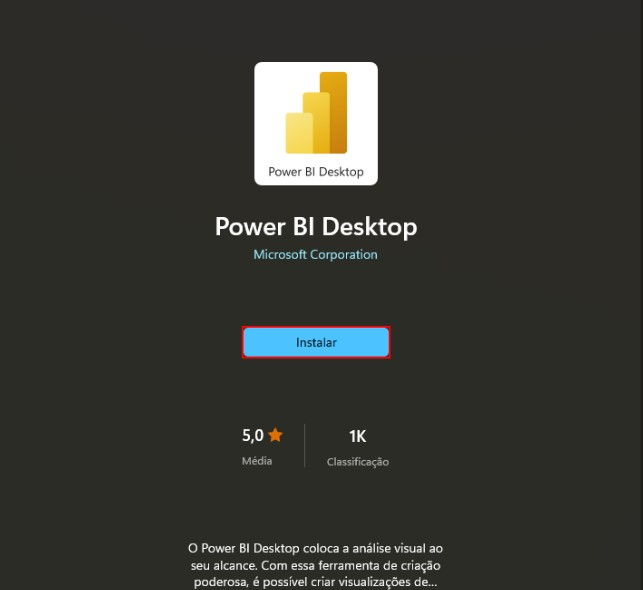
> </td>
> </tr>
> </table>
- 5º Nessa etapa, é necessário aguardar a instalação ser finalizada. Após a instalação ser concluída, você pode clicar em Abrir:
> <table style="text-align: center; width: 70%;"> 
> <tr>
> <td style="text-align: left;">
> 
> </td>
> </tr>
> </table>
- 6º Pronto! Finalizamos a instalação do Power BI Desktop. Agora você já pode utilizá-lo e dar sequência às atividades do curso.

[↑ Voltar ao topo](#topo)

---
## 4. Para saber mais: Business Intelligence  
Nos contrataram para participar de um projeto para o petshop Gatito, da Helô. Seu desejo é atualizar seu negócio para crescer e abrir novas filiais.  

Helô descobriu que, para isso, é importante incorporar o BI em sua empresa. Esse será o nosso papel no projeto.  

Mas, o que significa o termo "BI"? É o mesmo que Power BI? Para começar, vamos entender esse conceito.   

B.I. é uma sigla para o termo "Business Intelligence", do inglês. Podemos traduzi-lo como "Inteligência de Negócios". Que empresa não quer ser inteligente?!  

Mas, o que está por trás desse conceito de inteligência de negócios? Uma pessoa executiva super genial que consegue elaborar tomadas estratégicas de decisão?  

Na verdade, não. O conceito de BI é relacionado ao trabalho estruturado com os dados da empresa, trazendo métricas para que as pessoas tomadoras de decisão da empresa possam dar os direcionamentos necessários para o negócio baseados em dados.  

Esse conceito não é novo e surgiu na década de 1960. Mas, claro, nessa época a tecnologia ainda era muito embrionária. Então, o Business Intelligence ainda era bastante relacionado às decisões estratégicas.  

Na realidade atual, tudo ao nosso redor gera dados. Isso é extremamente importante e valioso para as empresas pois, com dados, elas podem definir métricas para entender exatamente o que está acontecendo com o negócio.  

Assim, elas podem traçar previsões não baseadas em achismos, mas em fatos. Isso é fundamental para alavancar a empresa para outros patamares.  

É importante salientar que a implementação do BI numa empresa não termina na estruturação de dados e definição de métricas. Muitas vezes, a pessoa que recebe as nossas análises não é uma pessoa técnica da área.  

Dessa forma, é essencial conseguir organizar todas as nossas análises e caminhos tomados. Para isso, utilizamos a técnica de Storytelling, que podemos traduzir como "contação de história" — a história das nossas análises.  

Nós apresentamos essa história de uma forma facilmente consultável pelas pessoas que precisam dessas informações. É por isso que construímos Dashboards, que podemos traduzir como "painel".  

Nesse painel, inserimos uma série de gráficos e elementos visuais que ajudam a pessoa a compreender rapidamente o que está acontecendo com a empresa, baseando-se nessas informações para tomar decisões.

Além disso, o dashboard pode ser atualizado em tempo real, possibilitando acompanhamento e análise constantes sobre o estado de diferentes setores da empresa.  

[↑ Voltar ao topo](#topo)

---
## 5. Construindo o cartão com a média de pets
O primeiro passo para confecção assertiva de nosso primeiro DashBoard, será importar os dados para dentro do Power B.I, para isso iremos selecionar na tela inicial do relatório em branco sobre a guia de `página inicial`, a opção de __obter dados__, assim como em outras ferramentas vide exemplo no processo de importação de dados para o Excel, o Power B.I também nos possibilita a obtenção de dados externos, quando clicamos diretamente sobre o botão de obter dados seremos apresentados a tela  com informações de importação de dados das principais fontes possíveis de utilização: 
<table style="text-align: center; width: 70%;"> 
<tr>
    <td style="text-align: left;">
    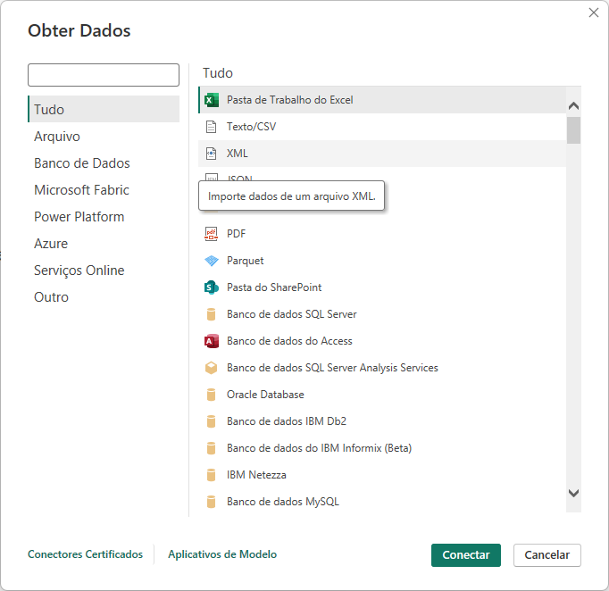
    </td>
</tr>
</table>

A tela da imagem acima, nos mostra todas as possibilidades de conexão possíveis de serem realizadas com  o Power B.I, porém para o nosso casso em questão iremos acessar o [arquivo de clientes](https://github.com/thierryLchaves/Santander-Imersao-Digital/blob/46e8db9e34f0eeb1ed62a6ccc230952768506b42/Analise_de_dados_e_IA_Nivelamento/Semana_07/Power_BI_Desktop_Construindo_meu_primeiro_dashboard/db/Clientes.txt) disponível em nosso repositório que está em formato `txt`, portanto a fonte de conexão escolhida será de `TEXTO/CSV`, assim como no processo de obtenção de dados de fontes externas pelo Excel, quando carregado a fonte externa desse formato, o POWER B.I irá apresentar a tela de pré-visualização dos dados, essa tela serve tanto para conferência dos dados a serem carregados, como também  nos possibilita algumas modificações preliminares nos dados em questão, tais como a codificação do arquivo, o tipo de delimitador, pós escolha da melhor codificação possível para nosso dados, temos as opções de carregar e transformar dados. 
>Ps: Em processos de trabalho com Power B.I, é muito raro que a importação de dados sem que haja a necessidade de tratamento dos dados, por tanto sempre devemos antes de quaisquer importação optar pela opção de __`TRANSFORMAR DADOS`__

Quando selecionado a opção de transformar dados, será aberto uma nova tela que no caso corresponde a tela do Power Query do B.I:  

<table style="text-align: center; width: 70%;"> 
<tr>
    <td style="text-align: left;">
    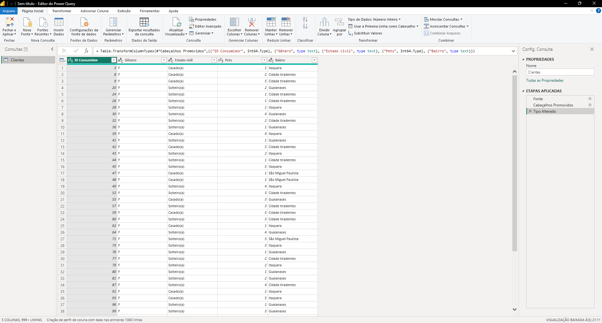
    </td>
</tr>
</table>

Caso o Power Query identifique de maneira equivocada as colunas em questão, podemos utilizar a opção de __Usar a primeira linha como Cabeçalho__, disponível na guia de página inicial agrupamento de transformar, outro ponto sobre o processo de <a href="#ETL">ETL</a> que está disponível no Power B.I e pode ser realizado de maneira muito simples, e a identificação e modificação do tipo de dados, na parte superior onde se encontra identificação dos dados, podemos notar que cada coluna possui um simbolo demonstrando qual o tipo de dado foi identificado, para que possamos modificar basta clicar sobre o ícone em questão e será apresentado uma lista de possibilidades de modificação, pós realizar a alterações necessários podemos clicar sobre o botão de __fechar e aplicar__, pós carregamento dos dados, a fonte de dados ficara disponível na barra lateral direta da tela inicial, com o nome da tabela ou fonte de dados escolhida, e quando clicarmos sobre ela será expandido com os dados existentes nessa fonte.  

<table style="text-align: center; width: 70%;"> 
<tr>
    <td style="text-align: left;">
    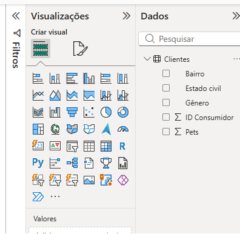
    </td>
</tr>
</table>

Agora que já possuímos nossa fonte de dados devidamente importada podemos realizar a primeira tarefa que é responder o primeiro questionamento para o projeto que é qual a média de pets por cliente? 
Quando realizamos o processo de arraste do coluna de nomeada de `PETS` para a área principal do dashboard, será criado um novo quadrante no Power B.I, e quando realizamos esse processo visualizamos que o dado inicial demonstrado, se trata sobre o somatório daquela coluna, porém queremos a média, para que possamos modificar essa informação dentro do quadrante de visualização temos opções tanto de formatação do quadro, como também na parte inferior da área as opções referentes a valor, bastando clicar sobre a seta da informação, e modificarmos tal informação para média de pets.  

    
ETL

    
É um processo de integração de dados em três etapas utilizado para mover dados de múltiplos sistemas de origem para um único repositório centralizado, como um Data Warehouse.

    <ul>
        <li><strong>E - Extração (Extract):</strong> A fase de coleta onde os dados brutos são capturados de fontes diversas (bancos de dados transacionais, arquivos planos, APIs) sem impactar a operação dos sistemas originais.</li>
        <li><strong>T - Transformação (Transform):</strong> A etapa de tratamento onde os dados são limpos, padronizados, validados e filtrados (remoção de duplicadas, conversão de tipos de dados, aplicação de regras de negócio).</li>
        <li><strong>L - Carga (Load):</strong> A fase final onde os dados já estruturados e limpos são gravados no destino final (Data Warehouse ou Data Mart) para ficarem prontos para o consumo via relatórios e ferramentas de BI.</li>
    </ul>

[↑ Voltar ao topo](#topo)

---
## 6. Alinhamento configuração Power BI

Você deve ter notado que, ao reproduzir os passos da aula, o seu Power BI pode não apresentar as mesmas configurações do instrutor, como a funcionalidade de “Sugerir visual”.

Para habilitar esse comportamento, é necessário ativar o recurso Interação no objeto, que sugere ações comuns diretamente nos visuais, facilitando a criação e formatação.

Abaixo, segue o passo a passo:

- No menu superior do Power BI clique em "Arquivo"
- Na próxima tela aberta, clique em "Opções e Configurações"
- Clique em __"Opções"__
- Ao abrir a janela de Opções, no menu lateral esquerdo, clique em Recursos de Visualização.
- Por fim, marque a opção Interação no Objeto.

> <table style="text-align: center; width: 100%;"> 
> <tr>
> <td style="text-align: left;">
> 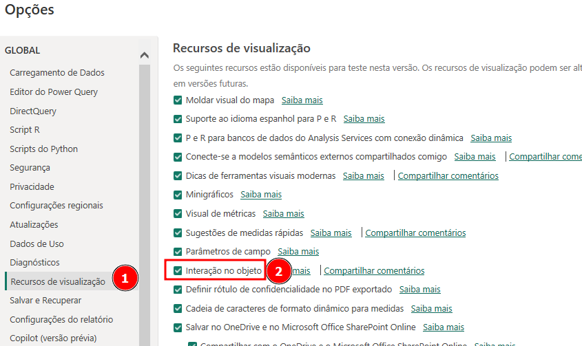
> </td>
> </tr>
> </table>

Agora reinicie o Power Bi, fechando e abrindo-o novamente.

Como complementação a leitura da documentação:  
- [Usar a interação no objeto com visuais em seu relatório (versão prévia)](https://learn.microsoft.com/pt-br/power-bi/create-reports/power-bi-on-object-interaction).  

[↑ Voltar ao topo](#topo)

---
## 7. Ajustando a visualização

Paula precisa construir um relatório para a empresa em que trabalha e decidiu utilizar o Power BI para isso. Os dados que ela vai trabalhar estão no formato TXT, e quando ela abriu esse arquivo pra analisar em um bloco de notas, eles tinham essa aparência:  

<table style="text-align: center; width: 30%;"> 
<tr>
    <td style="text-align: left;">
    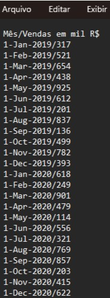
    </td>
</tr>
</table>

Esses arquivos mostram as vendas feitas pela empresa, em milhares de reais, nos respectivos meses. Ela então vai importar esses dados para o Power BI, porém quando ela seguiu os passos que tinha aprendido, percebeu que algo não estava correto. A tabela tinha essa visualização prévia:  
<table style="text-align: center; width: 100%;"> 
<tr>
    <td style="text-align: left;">
    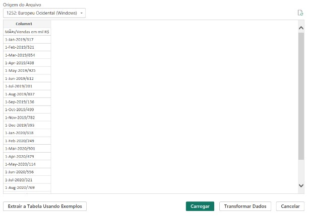
    </td>
</tr>
</table>
Como a prévia dos dados está estranha, Paula está pensando no que ela pode fazer para ajustar essa visualização.

O que ela pode fazer para ajustar os arquivos?  

<table style="text-align: center; width: 100%;"> 
<tr>
    <td style="text-align: left;">
    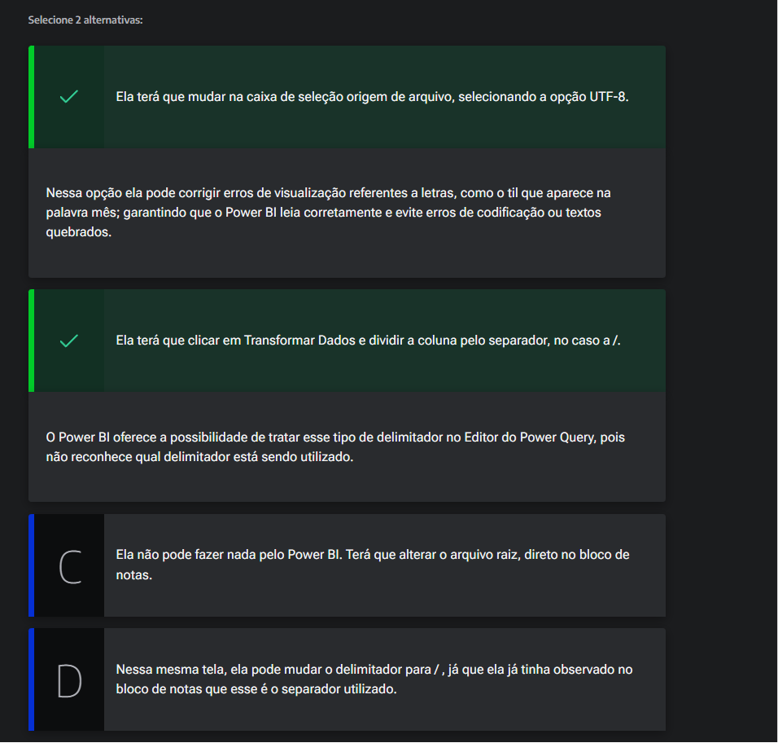
    </td>
</tr>
</table>

[↑ Voltar ao topo](#topo)

---
## 8. Importando as pastas e mesclando as tabelas
Para o próximo passo devemos realizar o processo de importação dos demais arquivos de vendas que estão [presentes no nosso repositório](https://github.com/thierryLchaves/Santander-Imersao-Digital/blob/46e8db9e34f0eeb1ed62a6ccc230952768506b42/Analise_de_dados_e_IA_Nivelamento/Semana_07/Power_BI_Desktop_Construindo_meu_primeiro_dashboard/db) , porém como dentro desse diretório temos vários arquivos, o Power B.I ainda não possibilita que varias fontes de dados sejam importado simultaneamente, sendo necessário que importamos uma por uma.  
Quando realizamos o processo de importação de dados de uma pasta de trabalho do Excel, temos um ponto importante que devemos notar, será apresentado uma tela conforme imagem abaixo:  

<table style="text-align: center; width: 100%;"> 
<tr>
    <td style="text-align: left;">
    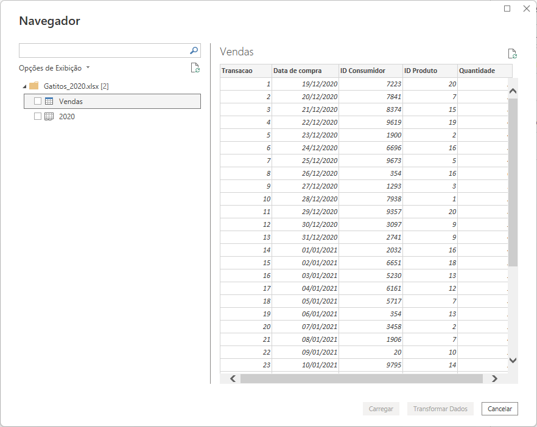
    </td>
</tr>
</table>

Podemos notar que nessa tela esta sendo apresentado 2 ícones das fonte diferentes, um nomeado como __vendas__ e outro de __2020__ e eles possuem ícones ligeiramente diferentes, mas o que esses itens querem dizer, o primeiro representa a fonte de dados da tabela, ou seja o Power B.I identificou a tabela existente nessa planilha com os nomes das colunas e suas linhas com preenchimento formando assim um tabela de dados, já o outro ícone diz respeito a pasta de trabalho como um todo, como por exemplo outras planilhas existentes, e possíveis _"sujeiras"_ nessa planilha, é uma boa prática nesse processo e comumente adotado que seja importado a tabela.
 
Como dito anteriormente caso fossemos importar todas as planilhas presentes no diretório teríamos que fazer esse processo manualmente várias vezes, porém existe uma outra maneira de realizar esse processo no repositório de dados temos uma divisão interna com a [pasta de vendas](https://github.com/thierryLchaves/Santander-Imersao-Digital/blob/46e8db9e34f0eeb1ed62a6ccc230952768506b42/Analise_de_dados_e_IA_Nivelamento/Semana_07/Power_BI_Desktop_Construindo_meu_primeiro_dashboard/db/Vendas), onde nesse repositório temos todos os arquivos de vendas, então o que podemos fazer é dentro da opção de __Obter dados__  temos a opção de __pasta__, nessa opção temos que apontar ou selecionar o diretório onde está a pasta em questão, pós esse passo seremos remetidos a tela de transformação e carregamento de dados, porém como importamos uma pasta diretamente para o Power B.I, temos mais um opção que é a __`COMBINAR`__, essa opção realiza a combinação dos arquivos em um único arquivo ou tabela, e essa opção também nos permite já combinar e carregar ou combinar e transformar os dados, e será essa opção a escolhida.  
Como realizamos a importação de de vários arquivos simultaneamente, o Power B.I irá adicionar para além dos dados transformados, a adição de uma coluna que está nomeada como origem dos dados, para que saibamos sobre qual arquivo aquela linha pertence, porém como nas tabelas de vendas temos a coluna de data de compra essa informação se torna redundante, então realizaremos a exclusão dessa coluna, para tal processo basta clicar com o mouse lado direito sobre o nome da coluna e escolher a opção de remover.  

[↑ Voltar ao topo](#topo)

---
## 9. Tipo de dado correto  

Para um aplicativo de e-commerce, identificar o tipo de dado correto de cada coluna é crucial. Por que é importante ajustar os tipos de dados de colunas como "Número de Produtos Vendidos" ao importar dados no Power BI?  

<table style="text-align: center; width: 100%;"> 
<tr>
    <td style="text-align: left;">
    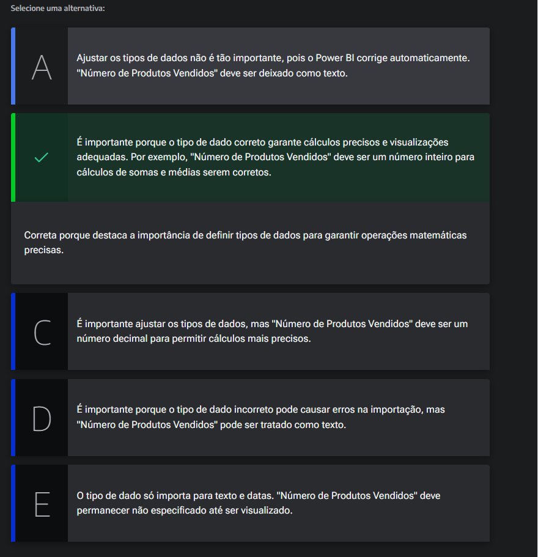
    </td>
</tr>
</table>

[↑ Voltar ao topo](#topo)

---
## 10. Conectando com o Google planilhas
Pós importação de transformação dos dados será carregado a nova tabela para que possamos aplicar as devidas apresentações, porém antes de irmos para esse processo temos alguns pontos que valem ser ressaltado, no Power B.I, temos varias outras maneiras de visualização dos dados para além do `canvas` _(a tela inicial visualizada anteriormente)_, na barra lateral esquerda do Power B.I, temos outras opções como por exemplo a visualização da tabela em formato de tabela:  

<table style="text-align: center; width: 100%;"> 
<tr>
    <td style="text-align: left;">
    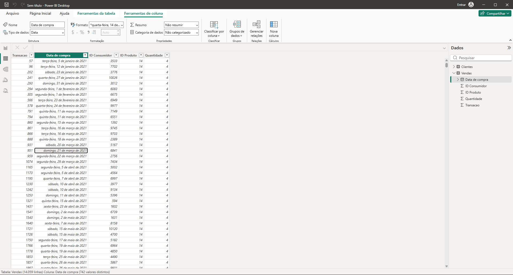
    </td>
</tr>
</table>

Mas qual a importância ou uma utilização valida dessa maneira, uma das coisas que temos que realizar no nosso projeto é obter a informação sobre o faturamento das vendas, e para tal processo devemos aplicar uma fórmula matemática que seria `(quantidade de itens vendidos x Preço do produto)`, porém como visualizado na imagem acima, a tabela de vendas não contem a informação do preço do produto, e essa informação está em outra planilha porém essa planilha está disponível no [google shets](https://docs.google.com/spreadsheets/create), e como visualizamos anteriormente é possível realizar a importação de dados de diferentes fonte, para esse processo vamos realizar a importação.
> PS: O power B.I  possui diversos conectores para diferente fontes de dados e um desses conectores disponíveis é o planilha Google, porém esse conector tende a não funcionar muito bem quando não somos o proprietário da planilha. 
Para esse processo de importação iremos utilizar o conector chamado de `WEB`, dentro da tela de obter dados temos uma barra de pesquisa, e iremos digitar web nessa barra, , e será apresentado o conector da web, esse conector tem como recebimento de parâmetro uma URL, então para o caso iremos inserir essa URL .

<table style="text-align: center; width: 100%;"> 
<tr>
    <td style="text-align: left;">
    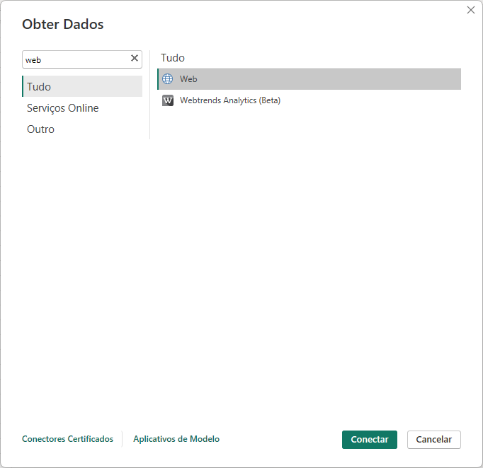
    </td>
</tr>
</table>

Ao selecionar tal opção será demonstrado outra tela, para que possamos inserir essa url conforme demonstra a imagem:  

<table style="text-align: center; width: 100%;"> 
<tr>
    <td style="text-align: left;">
    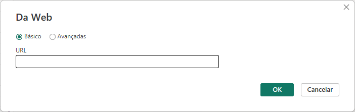
    </td>
</tr>
</table>

> No caso de nosso repositório iremos utilizar o [arquivo de produtos](https://github.com/thierryLchaves/Santander-Imersao-Digital/blob/46e8db9e34f0eeb1ed62a6ccc230952768506b42/Analise_de_dados_e_IA_Nivelamento/Semana_07/Power_BI_Desktop_Construindo_meu_primeiro_dashboard/db/Produtos_gatitos.xlsx) presente no nosso repositório.   

No passo de transformação de dados, teremos a nossa nova tabela para fonte dos dados, porém essa tabela está com nome genérico, e através do Power Query, podemos modificar o nome dessa tabela de forma simples, basta clicar com mouse direito sobre a tabela e escolher a opção de renomear. 
>PS: Durante o curso a planilha que foi importada, apresentou uma linha em branco o que não ocorreu durante a reprodução do processo, porém caso ocorra algo dessa maneira futuramente o Power Query possibilita a remoção de informações nulas de forma simples, na barra superior onde contém os rótulos das colunas, temos um ícone de tabela na qual possibilita diversas formatações de maneira mais ágil do processo. 

Pós o processo de tratamento dos dados a nova tabela ficará disponível também para utilização dentro do Power B.I.  

[↑ Voltar ao topo](#topo)

---
## 11. Renomeando tabelas
Num sistema de gerenciamento escolar, ao importar uma tabela de turmas, ela está com o nome genérico "Tabela1". Como corrigir isso? Qual a escolha correta?
<table style="text-align: center; width: 100%;"> 
<tr>
    <td style="text-align: left;">
    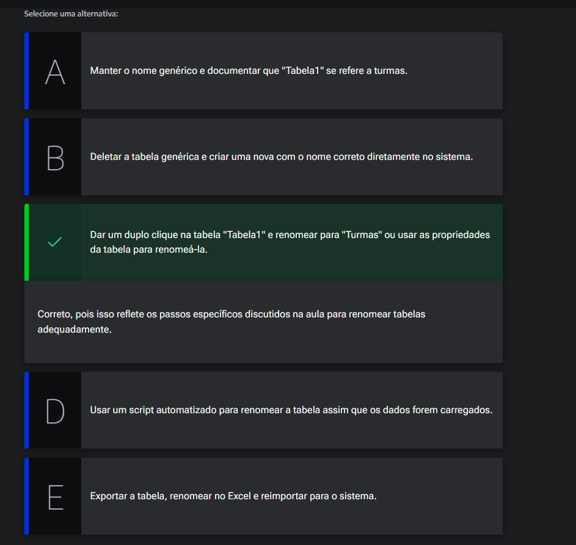
    </td>
</tr>
</table>

[↑ Voltar ao topo](#topo)

---
## 12. Faça como eu fiz
Durante esta aula, conhecemos o projeto com o qual iremos trabalhar e importamos as bases de dados necessárias.

Importando a primeira base: arquivo TXT
A primeira base foi importada através da fonte de TEXTO/CSV:  

<table style="text-align: center; width: 70%;"> 
<tr>
    <td style="text-align: left;">
    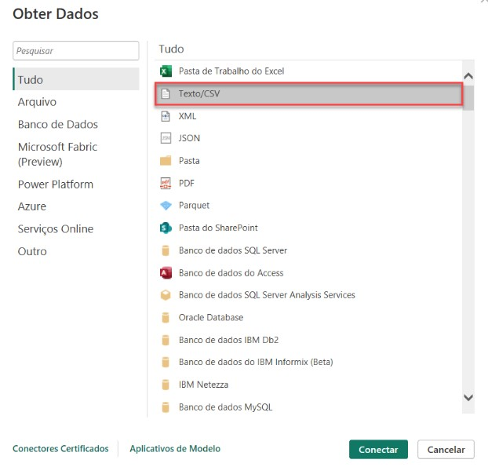
    </td>
</tr>
</table>

Através dessa conexão, importamos o arquivo de Clientes:

<table style="text-align: center; width: 70%;"> 
<tr>
    <td style="text-align: left;">
    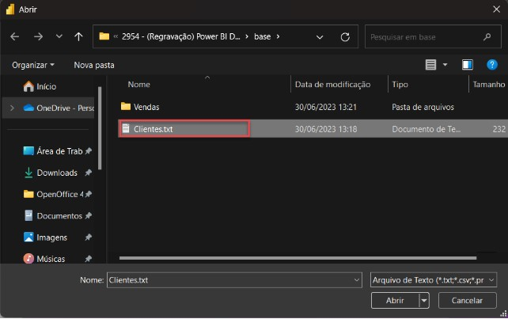
    </td>
</tr>
</table>

Ao selecionar os arquivos, uma janela contendo a prévia dos dados apareceu e clicamos em Transformar Dados:  
<table style="text-align: center; width: 70%;"> 
<tr>
    <td style="text-align: left;">
    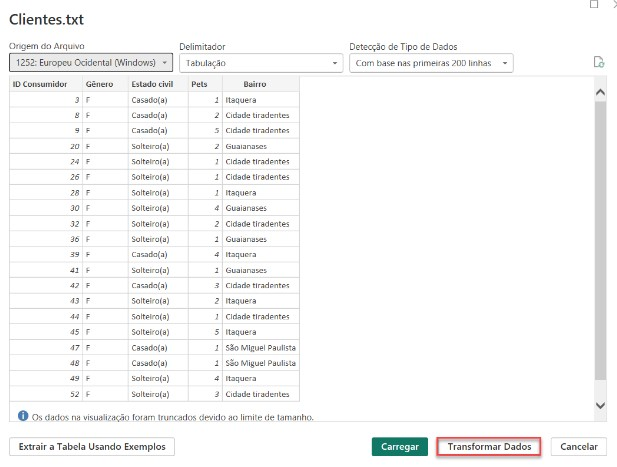
    </td>
</tr>
</table>

Ao clicar em Transformar Dados, fomos direcionados para o Editor do Power Query:
<table style="text-align: center; width: 70%;"> 
<tr>
    <td style="text-align: left;">
    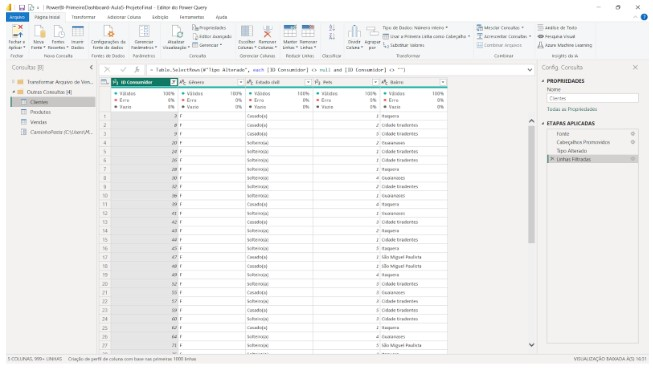
    </td>
</tr>
</table>

__Importando a segunda base: planilha online__  

A segunda base foi importada através da conexão do tipo Web:  
<table style="text-align: center; width: 70%;"> 
<tr>
    <td style="text-align: left;">
    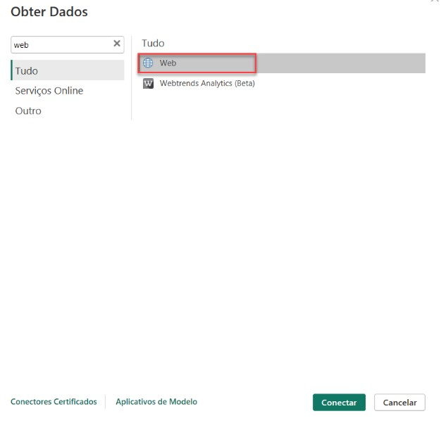
    </td>
</tr>
</table>

Ao clicar em Conectar, fomos direcionados para uma janela onde devemos inserir o link da planilha compartilhada:  
<table style="text-align: center; width: 70%;"> 
<tr>
    <td style="text-align: left;">
    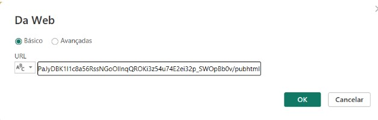
    </td>
</tr>
</table>

Após adicionarmos o link, fomos direcionados para a janela com a prévia da tabela, onde escolhemos a primeira opção e clicamos em Transformar Dados:
<table style="text-align: center; width: 70%;"> 
<tr>
    <td style="text-align: left;">
    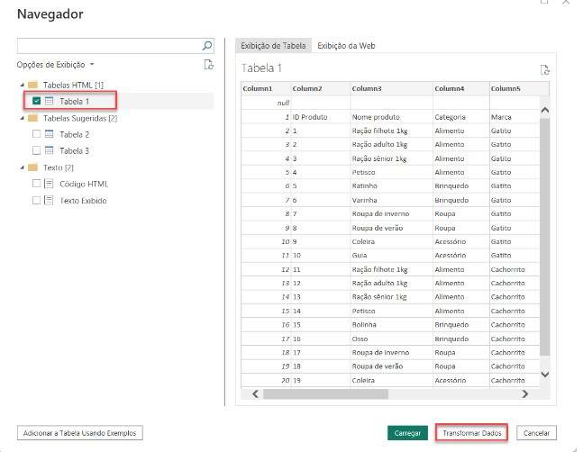
    </td>
</tr>
</table>  

__Importando a terceira base: pasta__  
Por fim, realizamos a importação da terceira base através da conexão do tipo Pasta:

<table style="text-align: center; width: 70%;"> 
<tr>
    <td style="text-align: left;">
    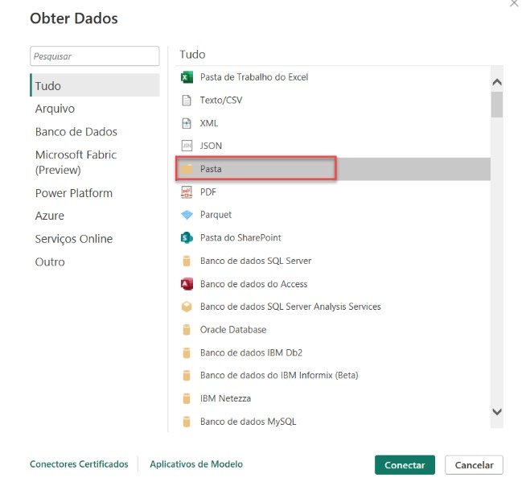
    </td>
</tr>
</table>  

Ao clicar em conectar, escolhemos a pasta de Vendas no nosso computador e, em seguida, fomos direcionados para a prévia da pasta e clicamos em Combinar e Transformar Dados:  
<table style="text-align: center; width: 70%;"> 
<tr>
    <td style="text-align: left;">
    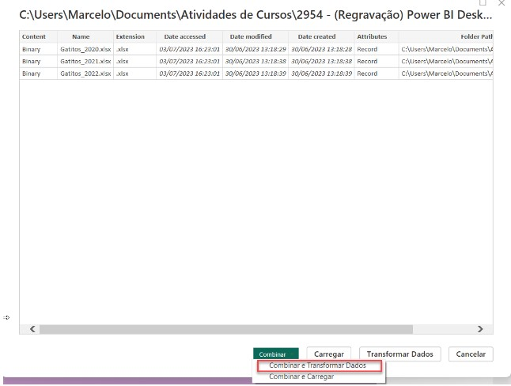
    </td>
</tr>
</table>  

Após clicar em Combinar e Transformar Dados, fomos direcionados para a prévia da tabela completa, onde escolhemos a primeira opção:  
<table style="text-align: center; width: 70%;"> 
<tr>
    <td style="text-align: left;">
    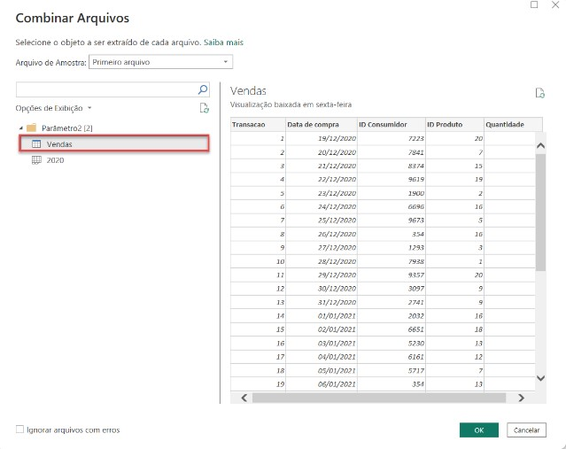
    </td>
</tr>
</table>  

Com isso, realizamos a importação dos dados para o projeto do pet shop Gatitos no Power BI.

__Opinião do instrutor__  

Em caso de dúvidas sobre os temas aqui estudados, fique à vontade para interagir no fórum do curso ou na nossa comunidade no discord. Ambos são espaços colaborativos no qual alunas e alunos - além das pessoas instrutoras - buscam responder às dúvidas que surgem durante os cursos.  

[↑ Voltar ao topo](#topo)

---
## 13. O que aprendemos?
Nessa aula, você aprendeu a:
- Iniciar um relatório em branco no Power BI e importar dados;
- Ajustar o decodificador de texto para correta visualização dos caracteres em português;
- Criar visuais no Power BI e ajustar suas configurações;
- Transformar dados no Power Query e aplicar essas transformações no Power BI;
- Importar dados de planilhas Excel e usar a opção "Combinar" para unir múltiplas planilhas;
- Retirar colunas desnecessárias e ajustar tipos de dados no Power Query;
- Remover linhas e promover cabeçalhos no Power Query.

[↑ Voltar ao topo](#topo)

---

<table align="center" style="border-collapse: collapse; margin-left: auto; margin-right: auto;"> 
  <caption><b>Skills do projeto</b></caption>
  <tr>
    <td style="padding: 5px;">
      
    </td>
    <td style="padding: 5px;">
      
    </td>
    <td style="padding: 5px;">
      
    </td>
  </tr>
</table>

---
__Titulo:__ Conectando os dados
__Autor:__ Thierry Lucas Chaves  
__Data de Criação:__ 14-06-2026  
__Data de Modificação:__ 14-06-2026  
__Versão:__ "1.0"