# Realizando Cálculos

<a id="topo"></a>

## Sumário
- [Realizando Cálculos](#realizando-cálculos)
  - [Sumário](#sumário)
  - [1. Criando uma coluna calculada](#1-criando-uma-coluna-calculada)
  - [2. Filtragem de dados nulos](#2-filtragem-de-dados-nulos)
  - [3. Para saber mais: qualidade da coluna](#3-para-saber-mais-qualidade-da-coluna)
  - [4. Calculando o faturamento total](#4-calculando-o-faturamento-total)
  - [5. Calcular receita total das vendas](#5-calcular-receita-total-das-vendas)
  - [6. Para saber mais: medidas implícitas e explícitas](#6-para-saber-mais-medidas-implícitas-e-explícitas)
  - [7. Para saber mais: M e DAX](#7-para-saber-mais-m-e-dax)
  - [8. Calculando o total de itens vendidos](#8-calculando-o-total-de-itens-vendidos)
  - [9. Mão na massa: utilizando DAX](#9-mão-na-massa-utilizando-dax)
  - [10. O que aprendemos?](#10-o-que-aprendemos)

## 1. Criando uma coluna calculada

Antes de realizar o processo de cálculo propriamente dito, precisamos entender como realizar o relacionamento entre as tabelas existentes. Para visualizar os relacionamentos de tabelas dentro do Power B.I, iremos acessar a barra de acesso na lateral esquerda da tela, nessa barra temos 4 ícones, onde já visualizamos que o primeiro ícone diz respeito ao _"Canvas"_ do Power B.I, a segunda diz respeito  aos dados da tabelas em visualização tabular, e a terceira que é nosso objetivo serve para visualizar/confeccionar os relacionamentos das tabelas.   

<table style="text-align: center; width: 100%;"> 
<tr>
    <td style="text-align: left;">
    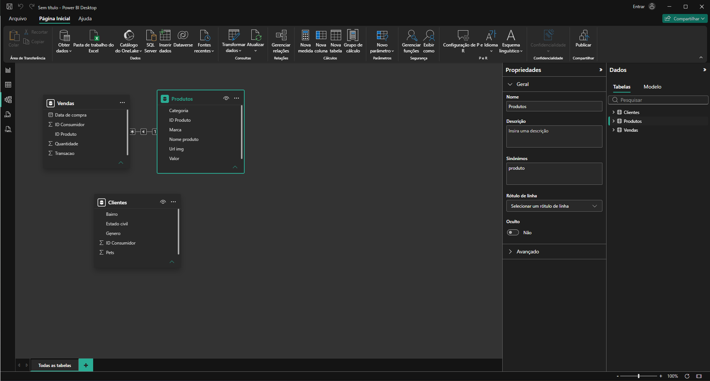
    </td>
</tr>
</table>

Nessa mesma tela, podemos notar o relacionamento que foi realizado entre as tabela de Produtos para Vendas, com um relacionamento de 1:N, ou seja para cada produto __1__, temos a possibilidade de muitas vendas __N__. Porém também notamos na imagem acima que não houve o relacionamento automático entre vendas e clientes, por mais que exista o mesmo atributo de `ID_CONSUMIDOR`, em ambas as tabelas, mas por qual motivo esse relacionamento não foi feito? E agora que não foi realizado automaticamente, como podemos então realizar esse relacionamento de forma manual?  
A maneira mais simples de realizar esse relacionamento dentro do Power B.I, e realizando o processo de clique e arraste sobre o campo, porém quando realizamos esse processo visualizamos uma nova tela com uma informação sobre esse relacionamento:  

<table style="text-align: center; width: 100%;"> 
<tr>
    <td style="text-align: left;">
    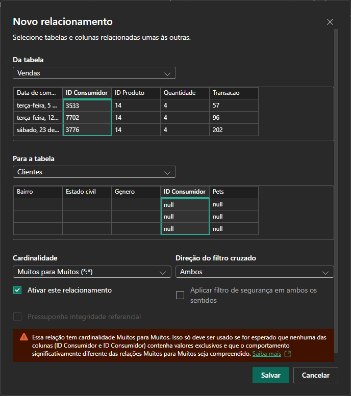
    </td>
</tr>
</table>

Conforme a imagem acima, podemos visualizar que o processo de relacionamento não ocorreu e o Power B.I notificou qual seria o problema encontrado, se notarmos na imagem temos que na tabela de clientes temos muitas linhas nulas o que ocasionou um relacionamento do tipo __N x  N__, o que para além de não ser o tipo correto ainda não pode ocorrer, então para sanar esse problema iremos voltar ao Power Query para realizar o devido tratamento nessa tabela, para isso na própria tela de Página Inicial, temos `Transformar dados`, o que irá retornar ao Power Query.  
E dentro do Power Query temos a opção em cada coluna de remover vazios, 

<table style="text-align: center; width: 100%;"> 
<tr>
    <td style="text-align: left;">
    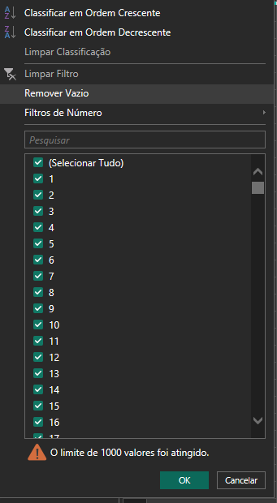
    </td>
</tr>
</table>

Com esse recurso podemos em um simples clique realizar a remoção dos ids de clientes vazios e podemos relacionar as tabelas.   

Esse relacionamento era importante de ser realizado pois realizaremos um calculo dentro da tabela de vendas, na qual será necessário alguma informação dos clientes, e para realizar tal calculo iremos retornar a visualização tabular, para criar tal coluna com esse calculo.   
Nesse modelo de visualização, é habilitado uma guia com a opção de `Ferramentas da tabela` onde dentro tela temos o botão de adicionar uma nova coluna que será a que utilizaremos, quando realizado essa adição podemos visualizar um barra superior, similar a barra de fórmulas do Excel, com a diferença que dentro dessa barra de fórmulas, também demos a opção de modificar o nome da coluna, agora como podemos realizar o caculo , para esse caso podemos utilizar uma função do Power B.I
```DAX
Valor_unitario = RELATED(Produtos[Valor])
```
Onde o Power B.I já realiza a busca do campo da tabela referida conforme o relacionamento existente, com essa adição de campo podemos então realizar a inclusão do faturamento e para tal utilizaremos a função: 

```DAX
Faturamento = 'Vendas'[Quantidade]*'Vendas'[Valor_unitario]
```

[↑ Voltar ao topo](#topo)

---
## 2. Filtragem de dados nulos

Um hospital possui tabelas de pacientes e procedimentos, mas alguns registros de pacientes estão sem identificação (nulos). Como você trataria esses dados?  

<table style="text-align: center; width: 100%;"> 
<tr>
    <td style="text-align: left;">
    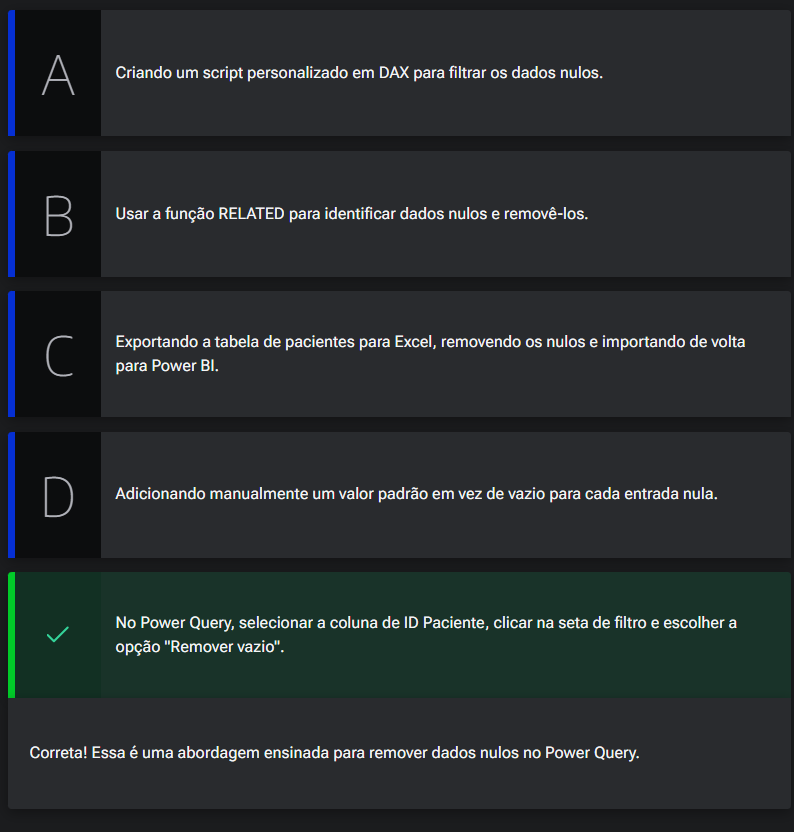
    </td>
</tr>
</table>


[↑ Voltar ao topo](#topo)

---
## 3. Para saber mais: qualidade da coluna

O recurso de Qualidade da Coluna no Power BI rotula os valores em linhas em cinco categorias, fornecendo informações sobre a qualidade dos dados em cada coluna:

- __Válido (verde):__ indica que os valores na coluna estão corretos e dentro dos critérios definidos.

- __Erro (vermelho):__ sinaliza a presença de erros na coluna, indicando que os valores não estão de acordo com as regras ou critérios estabelecidos.

- __Vazio (cinza escuro):__ representa valores ausentes ou nulos na coluna, indicando que não há dados presentes.

- __Desconhecido (verde pontilhado):__ indica a presença de erros em uma coluna, resultando em uma qualidade de dados desconhecida para os demais valores.

- __Erro inesperado (vermelho pontilhado):__ identifica a ocorrência de erros inesperados na coluna, que não se enquadram nas categorias anteriores.

Esses indicadores são exibidos abaixo do nome da coluna. O número de registros em cada categoria de qualidade de coluna é apresentado como uma porcentagem, como podemos verificar na imagem abaixo:

<table style="text-align: center; width: 100%;"> 
<tr>
    <td style="text-align: left;">
    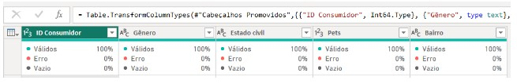
    </td>
</tr>
</table>

Ao passar o mouse sobre qualquer uma das colunas, é possível visualizar a distribuição numérica da qualidade dos valores em toda a coluna:  

<table style="text-align: center; width: 100%;"> 
<tr>
    <td style="text-align: left;">
    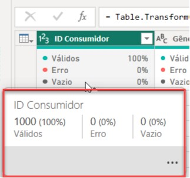
    </td>
</tr>
</table>

Além disso, ao selecionar o botão de reticências (...), são exibidos botões de ação rápida que permitem realizar operações nos valores:  


<table style="text-align: center; width: 100%;"> 
<tr>
    <td style="text-align: left;">
    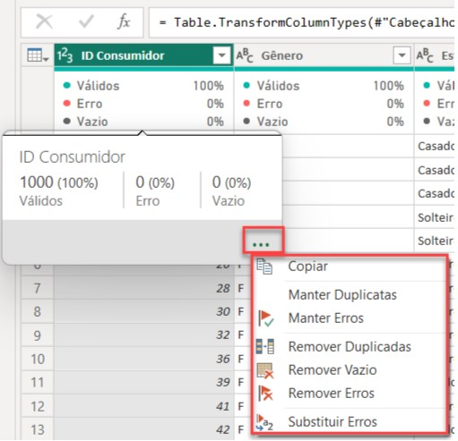
    </td>
</tr>
</table>

Essa funcionalidade de Qualidade da Coluna no Power BI proporciona uma visão rápida e clara sobre a qualidade dos dados em cada coluna. Entretanto, devemos estar atentos a um quesito muito importante quando se trata do Power BI, que é o fato de se tratar de uma ferramenta que tem como padrão resumir os dados, principalmente por questão de performance.  

Pensando nisso, o Power BI oferece a opção de filtrar os dados das tabelas, por meio de duas opções: criação de perfil da coluna com base nas primeiras 1000 linhas, que é a opção padrão; e criação de perfil da coluna com base em todo o conjunto de dados. Essa opção de filtragem por todo o conjunto pode ser especialmente importante para garantir uma análise mais precisa e abrangente dos seus dados.  

Ao ativar a opção de criação de perfil da coluna com base em todo o conjunto de dados, o Power BI analisará todas as linhas do conjunto de dados, permitindo identificar padrões, distribuições e problemas de qualidade que podem não ser detectados apenas com uma amostra limitada de linhas.

Como exemplo, vamos utilizar a tabela de Clientes, a qual já estávamos utilizando nas imagens anteriores. Assim como pôde ser observado, não foi encontrado nenhum erro, porém, não verificamos como a filtragem estava sendo definida. Para verificar isso, no canto inferior esquerdo, vamos procurar pelo botão da filtragem:  

<table style="text-align: center; width: 100%;"> 
<tr>
    <td style="text-align: left;">
    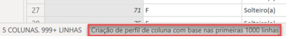
    </td>
</tr>
</table>

Como podemos verificar, estamos filtrando nossos dados pelas primeiras 1000 linhas. Para resolvermos isso, pode clicar nessa opção, pois se trata de um botão, e selecionar a opção para todo o conjunto de dados:

<table style="text-align: center; width: 100%;"> 
<tr>
    <td style="text-align: left;">
    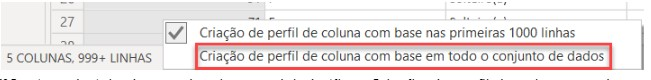
    </td>
</tr>
</table>

Agora, voltando para averiguar a qualidade da coluna, podemos ver o que realmente temos em mãos:

<table style="text-align: center; width: 100%;"> 
<tr>
    <td style="text-align: left;">
    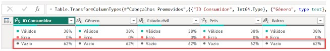
    </td>
</tr>
</table>


Encontramos uma porcentagem significativa de valores vazios. Se colocarmos o mouse em cima do campo de Vazio, percebemos a diferença:

<table style="text-align: center; width: 100%;"> 
<tr>
    <td style="text-align: left;">
    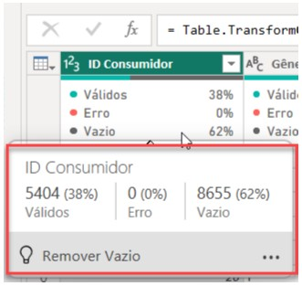
    </td>
</tr>
</table>

Além de garantir que a detecção de erros e demais ações de melhoria sejam aplicadas de maneira completa e abrangente, o tratamento desses dados vazios foi essencial para que pudéssemos realizar o relacionamento entre as tabelas de Clientes e Vendas na área de Modelagem de Dados. Inclusive, caso deseje aprofundar seus conhecimentos sobre esse tema, recomendo o curso [Power BI: modelagem de dados](https://cursos.alura.com.br/course/power-bi-modelagem-dados), que irá tratar da modelagem de dados, tipos de cardinalidades, e o que são tabela fato e tabela dimensão.  

Portanto, a funcionalidade de Qualidade da Coluna no Power BI proporciona uma visão rápida e clara sobre a qualidade dos dados em cada coluna. Adicionalmente, é altamente recomendável utilizar a opção de criação de perfil da coluna com base em todo o conjunto de dados. Isso permitirá uma análise mais precisa e confiável dos dados, fornecendo informações valiosas para aprimorar a qualidade dos seus relatórios e tomada de decisões. Caso você deseje estudar sobre as demais funcionalidades para visualização dos dados, você pode ler o artigo [Usar as ferramentas de criação de perfil de dados](https://learn.microsoft.com/pt-br/power-query/data-profiling-tools) da Microsoft.


[↑ Voltar ao topo](#topo)

---
## 4. Calculando o faturamento total

Com essas informações seremos capazes de responder através do gráfico 2 questionamentos qual é o faturamento total, e qual a quantidade de vendas, 
Agora ficara no Power B.I como vimos anteriormente as tabelas e as possibilidades de adição de informações, porém agora iremos utilizar uma outra opção presente na guia de Página Inicial no agrupamento de Inserir, nela selecionaremos o  cartão com esse quadrante selecionado iremos adicionar a soma da quantidade de vendas.  Esse tipo de informação, é comumente referendado como medida implícita (que nada mais é, que o artificio entre ferramenta e usuário sem que haja a necessidade de escrever código ou fórmula e a própria ferramenta realiza algo),porém caso não seja suficiente temos o contrário, que seria a medida explícita, ou seja escrever o código, então para fazer isso vamos seguir os passos a seguir:  
1º Opção de mouse lado direito, na tabela selecionada e opção de nova medida.
2º Na barra de fórmulas, digitar o comando abaixo:  
  ```dax
  Faturamento total = SUM('Vendas'[Faturamento])
  ```

3º Será criado , um novo campo, com simbolo de calculadora iremos ativamente escolher o quadro, e selecionar essa medida, criando assim 3 informações sobre a média, a quantidade de vendas, e o faturamento total.  

<table style="text-align: center; width: 100%;"> 
<tr>
    <td style="text-align: left;">
    
    </td>
</tr>
</table>

[↑ Voltar ao topo](#topo)

---
## 5. Calcular receita total das vendas
Numa empresa de plataforma de vendas de ingressos, que registra o valor de cada ingresso vendido, é preciso calcular a receita total gerada. Como você criaria uma medida explícita no Power BI para calcular a receita total usando a função 'SUM' na coluna 'Valor' da tabela 'Vendas'?  
<table style="text-align: center; width: 100%;"> 
<tr>
    <td style="text-align: left;">
    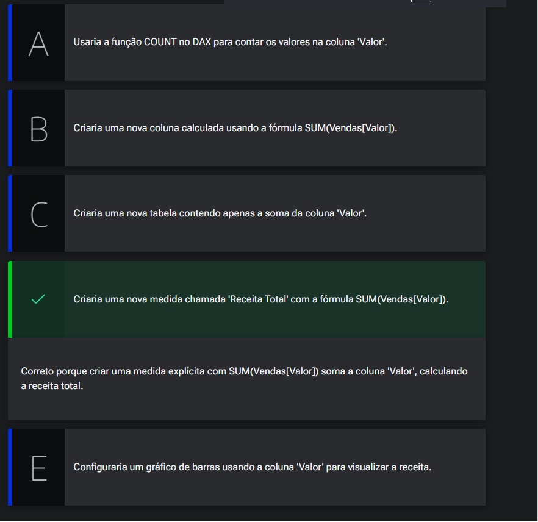
    </td>
</tr>
</table>

[↑ Voltar ao topo](#topo)

---
## 6. Para saber mais: medidas implícitas e explícitas
No Power BI, medidas são elementos essenciais para realizar cálculos e análises sobre os dados. Elas podem ser classificadas em medidas implícitas e medidas explícitas.

As medidas implícitas são calculadas automaticamente pelo Power BI com base nos dados presentes na tabela. Elas são úteis para realizar operações básicas, como soma, média, contagem, mínimo e máximo. O Power BI identifica automaticamente os campos numéricos na tabela e cria medidas implícitas correspondentes. Essas medidas são atualizadas dinamicamente à medida que os dados são modificados ou filtrados.

Por outro lado, as medidas explícitas são cálculos personalizados criados manualmente pelo usuário. Elas são criadas utilizando a linguagem de fórmulas DAX (Data Analysis Expressions) e permitem realizar cálculos mais complexos e específicos às necessidades do usuário. Com as medidas explícitas, é possível realizar operações matemáticas avançadas, combinar campos de diferentes tabelas, aplicar filtros condicionais e criar métricas personalizadas.  


Para obter mais informações detalhadas sobre medidas implícitas e explícitas no Power BI, recomendo a leitura do artigo [Power BI: Medidas implícitas e explícitas.](https://www.alura.com.br/artigos/power-bi-medidas-implicitas-explicitas?utm_source=gnarus&utm_medium=timeline)  

[↑ Voltar ao topo](#topo)

---
## 7. Para saber mais: M e DAX
No Power BI, duas linguagens fundamentais para manipulação e transformação de dados são o M e o DAX.

Ambas as linguagens, M e DAX, desempenham papéis complementares no Power BI. O M é utilizado principalmente na fase de preparação dos dados, enquanto o DAX é utilizado para realizar cálculos e análises com base nos dados já carregados no modelo de dados. Combinar o uso dessas duas linguagens permite uma transformação completa dos dados, desde a extração inicial até a análise final.

Para aprofundar seus conhecimentos sobre as linguagens M e DAX no Power BI, recomendo a leitura do artigo [Power BI: M e DAX](https://www.alura.com.br/artigos/power-bi-linguagens-m-dax). Ele apresenta uma visão detalhada sobre as características e funcionalidades dessas linguagens, fornecendo insights valiosos para aprimorar suas habilidades no Power BI.  

[↑ Voltar ao topo](#topo)

---
## 8. Calculando o total de itens vendidos  
Pedro está realizando uma análise em um conjunto de dados e precisa determinar a quantidade total de itens vendidos. Para isso, ele deseja utilizar o Power BI. Qual é a melhor abordagem que Pedro deve adotar e qual linguagem do Power BI ele deve utilizar para obter esse resultado?  

<table style="text-align: center; width: 100%;"> 
<tr>
    <td style="text-align: left;">
    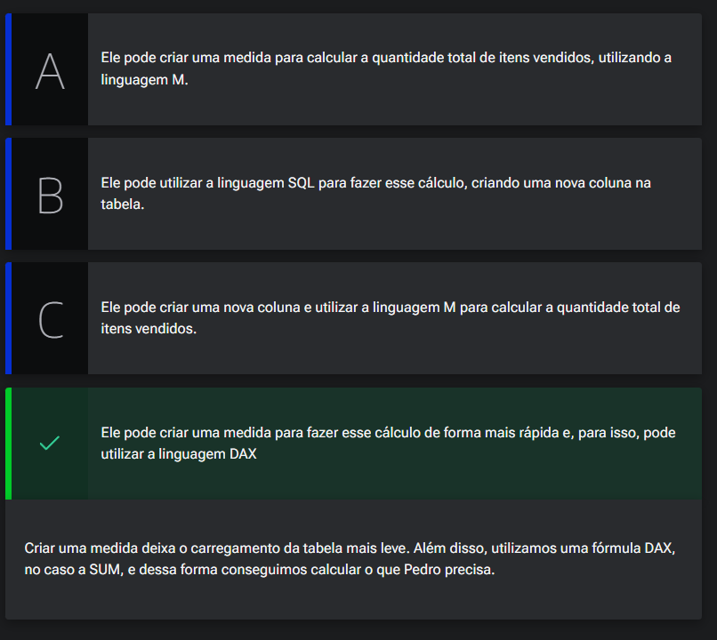
    </td>
</tr>
</table>

[↑ Voltar ao topo](#topo)

---
## 9. Mão na massa: utilizando DAX

Utilizando a linguagem DAX, adicionamos mais duas colunas à tabela de Vendas, sendo a primeira a coluna de Valor, como podemos verificar abaixo:  

<table style="text-align: center; width: 100%;"> 
<tr>
    <td style="text-align: left;">
    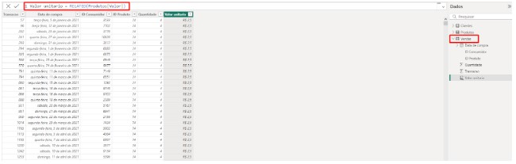
    </td>
</tr>
</table>

A seguir temos o código em DAX para criar a coluna Valor:
```DAX
Valor unitario = RELATED(Produtos[Valor])
```
A segunda coluna criada foi a de Faturamento:

<table style="text-align: center; width: 100%;"> 
<tr>
    <td style="text-align: left;">
    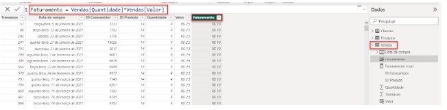
    </td>
</tr>
</table>

A seguir temos o código em DAX para criar a coluna Faturamento:
```DAX
Faturamento = Vendas[Quantidade]*Vendas[Valor]
```
Após adicionarmos as duas colunas, realizamos a criação da medida Total faturamento, como podemos verificar abaixo:  

<table style="text-align: center; width: 100%;"> 
<tr>
    <td style="text-align: left;">
    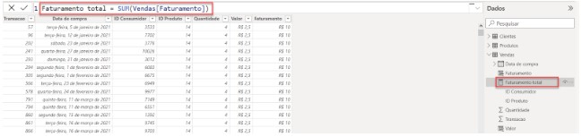
    </td>
</tr>
</table>

A seguir temos o código em DAX para criar a coluna Faturamento:
```DAX
Total faturamento = SUM(Vendas[Faturamento])
```  
Com isso, finalizamos a terceira aula, onde conhecendo as áreas do Power BI, realizamos o relacionamento entre as tabelas, e criamos colunas e medidas.

Agora, chegou o momento de colocar em prática seus conhecimentos e embarcar em um desafio empolgante!

Com o que você aprendeu até aqui, seu desafio é criar uma medida para calcular o Valor Médio por Produto Vendido. A medida deve fornecer o valor médio obtido por cada produto vendido, ajudando-nos a analisar o desempenho individual dos produtos e seu impacto na receita total.  

__Opinião do instrutor__  
- 1 - Na área de visualizações, clique com o botão direito do mouse na tabela de __Produtos__ e selecione __Nova Medida__.

- 2 - Utilize a fórmula:
```DAX
Valor_medio_por_produto_vendido = SUM('Vendas'[Faturamento]) / SUM('Vendas'[Quantidade])
```
- 3 - Pressione Enter para confirmar a fórmula e criar a medida.
  - Agora, observe os resultados e descubra qual é o valor médio por produto vendido!

    <table style="text-align: center; width: 100%;"> 
    <tr>
    <td style="text-align: left;">
    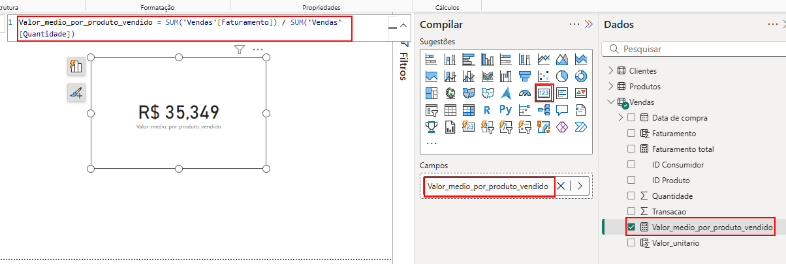
    </td>
    </tr>
    </table>  

Esse desafio permitirá aprimorar suas habilidades no Power BI e ajudará a desenvolver uma métrica relevante para análise de dados de vendas.

Em caso de dúvidas sobre os temas aqui estudados, fique à vontade para interagir no fórum do curso ou na nossa comunidade no discord. Ambas são espaços colaborativos no qual alunas e alunos - além das pessoas instrutoras - buscam responder as dúvidas que surgem durante os cursos.

[↑ Voltar ao topo](#topo)

---
## 10. O que aprendemos?

Nessa aula, você aprendeu a:
- Visualizar o modelo de dados no Power BI e entender os relacionamentos entre tabelas;
- Criar relacionamentos manuais entre tabelas e resolver problemas com dados nulos;
- Criar e nomear colunas calculadas utilizando a função "RELATED";
- Diferenciar medidas implícitas e explícitas, criando medidas explícitas com a função SUM.

[↑ Voltar ao topo](#topo)

---


<table align="center" style="border-collapse: collapse; margin-left: auto; margin-right: auto;"> 
  <caption><b>Skills do projeto</b></caption>
  <tr>
    <td style="padding: 5px;">
      
    </td>
    <td style="padding: 5px;">
      
    </td>
    <td style="padding: 5px;">
      
    </td>
  </tr>
</table>


---
__Titulo:__ Realizando Cálculos
__Autor:__ Thierry Lucas Chaves  
__Data de Criação:__ 14-06-2026  
__Data de Modificação:__ 16-06-2026  
__Versão:__ "2.0"