# Análises com os gráficos

## Sumário
- [Análises com os gráficos](#análises-com-os-gráficos)
  - [Sumário](#sumário)
  - [1. Projeto da aula anterior](#1-projeto-da-aula-anterior)
  - [2. Trabalhando com o gráfico de pizza](#2-trabalhando-com-o-gráfico-de-pizza)
  - [3. Comparação de receita por gênero](#3-comparação-de-receita-por-gênero)
  - [4. Série temporal](#4-série-temporal)
  - [5. Para saber mais: rótulos de hierarquia](#5-para-saber-mais-rótulos-de-hierarquia)
  - [6. Obtendo novos visuais](#6-obtendo-novos-visuais)
  - [7. Visualizando imagens dos eventos](#7-visualizando-imagens-dos-eventos)
  - [8. Faça como eu fiz: trazendo visuais externos](#8-faça-como-eu-fiz-trazendo-visuais-externos)
  - [9. O que aprendemos?](#9-o-que-aprendemos)

## 1. Projeto da aula anterior

Caso prefira, você pode acessar o projeto da [aula 2](https://github.com/thierryLchaves/Santander-Imersao-Digital/blob/6f543e282128ad594f9599d84d10ae2da89cf112/Analise_de_dados_e_IA_Nivelamento/Semana_07/Power_BI_Desktop_Construindo_meu_primeiro_dashboard/src/gatitvos_v1.pbix) no ponto em que paramos na aula anterior.

---
## 2. Trabalhando com o gráfico de pizza
Nesse tópico iremos criar uma maneira para que possamos visualizar a distribuição do faturamento por gênero, e para tal processo utilizaremos o famigerado gráfico de Pizza
Sua utilização é realizada de forma bem similar a dos `CARDS` de informação, e pode ser feita tanto na barra lateral de compilar, quanto na guia de página Inicial `Inserir`, quando selecionarmos o gráfico de pizza, o Power B.I irá adicionar um quadro para inserção dessa informação e habilitara alguns parâmetros para o preenchimento.   

<table style="text-align: center; width: 100%;"> 
<tr>
    <td style="text-align: left;">
    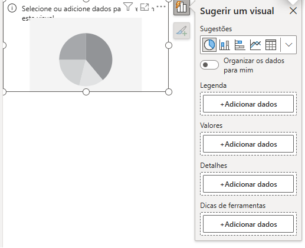
    </td>
</tr>
</table>  

O primeiro parâmetro que podemos e iremos inserir será o de legenda, nesse casso esse parâmetro funcionará como um agrupamento da informação a ser exibida, no caso como desejamos visualizar a distribuição das vendas/faturamento __por gênero__, o nosso fator de agregação será justamente o gênero _(essa informação está disponível em nossa tabela de clientes, na coluna de gênero)_ , o próximo parâmetro, que deve ser informado será qual informação deve ser dividida pelo fato de agregação, no caso desejamos saber o __faturamento__ _(essa informação está disponível na tabela de vendas pela medida criada de  Faturamento total)_ com o preenchimento desses parâmetros obteremos um gráfico similar ao da imagem abaixo:  

<table style="text-align: center; width: 100%;"> 
<tr>
    <td style="text-align: left;">
    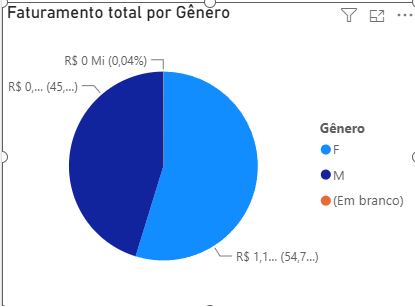
    </td>
</tr>
</table>  

[↑ Voltar ao topo](#topo)

---
## 3. Comparação de receita por gênero  
Você identificou que o gênero feminino contribui mais para a receita total na plataforma de streaming de música, mas a diferença não é grande. Como você compararia essas receitas utilizando outros tipos de gráficos? Qual a escolha correta?

<table style="text-align: center; width: 100%;"> 
<tr>
    <td style="text-align: left;">
    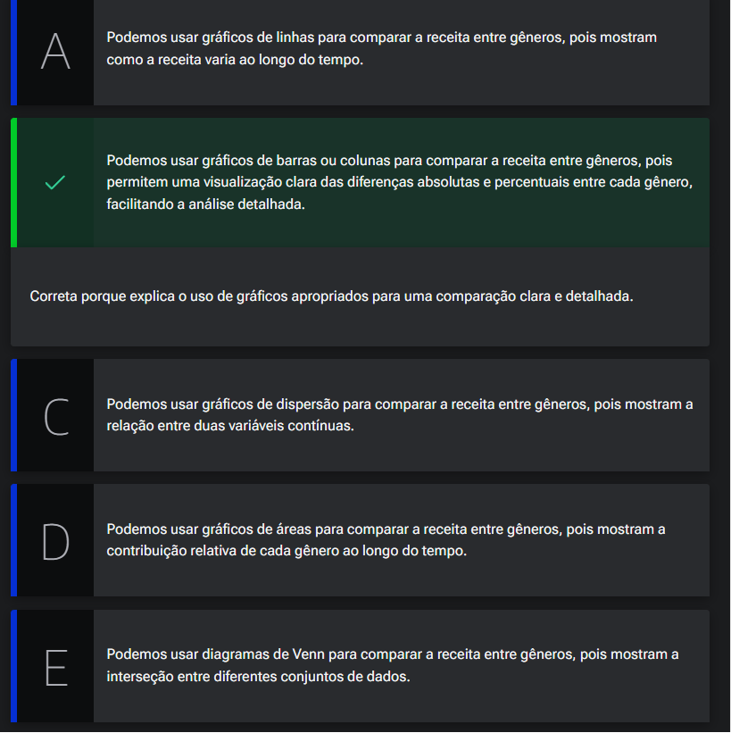
    </td>
</tr>
</table>  

[↑ Voltar ao topo](#topo)

---
## 4. Série temporal  
A próxima pergunta que iremos responder através dados, será a de qual a distribuição por localidade que mais compram no estabelecimento, tendo essa divisão por bairro.   
Para que possamos responder a tal questionamento iremos utilizar um gráfico de _"barras clusterizado"_. Novamente para o processo utilizaremos a barra de inserção de gráficos, e ao expandir as opções desse menu teremos uma série de opções, dentre essa a de barrar clusterizado, conforme demonstrado em imagem abaixo:  

<table style="text-align: center; width: 100%;"> 
<tr>
    <td style="text-align: left;">
    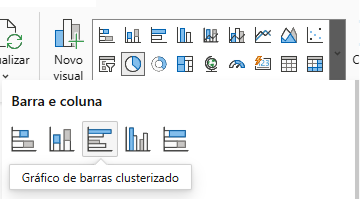
    </td>
</tr>
</table>  

E por que escolheremos esse gráfico, pois o cluster pode ser entendido como grupo, e como desejamos demonstrar uma divisão por agrupamento de localidade esse pode ser um gráfico que representa corretamente nosso ensejo, assim como foi realizado o preenchimento para o gráfico de pizza, também deveremos realizar o preenchimento de parâmetros para o gráfico de barras em cluster, porém os principais parâmetros que devemos preencher para esse gráfico são os eixos _(X, Y)_, onde o `EIXO Y` representa a informação que deverá preencher o gráfico de forma vertical, e o `EIXO X ` representa os dados que devem ser preenchidos horizontalmente.   

<table style="text-align: center; width: 100%;"> 
<tr>
    <td style="text-align: left;">
    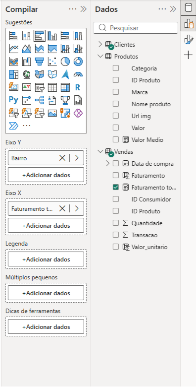
    </td>
</tr>
</table>  

---
Agora iremos  inserir um novo gráfico, dessa vez utilizando o gráfico de barras cluesterizado, porém com apresentação na vertical, esse gráfico tem os mesmos parâmetros de preenchimento do anterior, porém seu eixo determinante é o vertical ou seja o preenchimento das informações das barras serão agrupadas na horizontal, e preenchidas na vertical.  
Para esse gráfico iremos montar a demonstração de vendas por data;
> PS: Quando selecionamos um campo do tipo data, o Power B.I tem a funcionalidade de hierarquia de informação, onde na prática para esse tipo de campo serve para visualizarmos diferentes escalas de tempo a partir de um campo (ano, semestre, tremeste, mês, semana, dia).
Essa visualização das data pode ser modicada, na visualização através de botões de ação do card, modificando de forma rápida a apresentação, e nesse menu de acesso rápido temos 4 funcionalidades principais do card. 
- 1º Drill Up ⬆️: Simbolizado por uma seta na vertical para cima, esse botão realiza a subida de um nível de hierarquia com base na data escolhida.
- 2º Drill Down ⬇️: Simbolizado por uma seta na vertical para baixo, esse botão realiza a descida de um nível de hierarquia com base na data escolhida.
- 3º Seta dupla para baixo ↓↓: Essa ação diferente dos _"Drill"_ realiza a modificação de visualização pulando diretamente um nível de hierarquia abaixo
- 4º Gráfo para baixo ⑂:  Essa ação realiza a modificação da visualização de todo o campo diretamente para hierarquia imediatamente abaixo  

Na prática essas ações do carda modificam a visualização da informação, para além de realizar o filtro em linha temporal  dos demais gráficos, para melhor elucidar o que estamos dizendo iremos selecionar a habilitar o nível de hierarquia de dias do mês, realizando o Drill down, do ano de 2021, para o 2 trimestre,  para o mês de maio.

<table style="text-align: center; width: 100%;"> 
<tr>
    <td style="text-align: left;">
    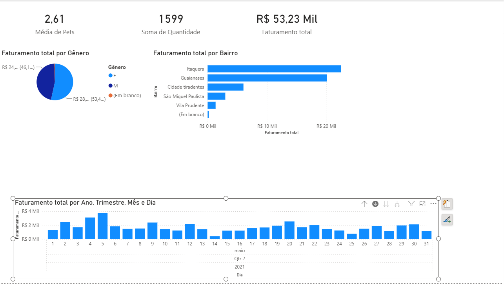
    </td>
</tr>
</table>  

Na imagem acima, podemos visualizar que para além da apresentação do gráfico de data, que foi realizado diretamente no card criado as demais informações também foram modificadas de forma a refletir essa modelo de data escolhido. 

> Ps: E uma boa prática a ser adotada de que quando estivermos trabalhando com serie temporais o gráfico para representação escolhida seja o __gráfico de linhas__

[↑ Voltar ao topo](#topo)

---
## 5. Para saber mais: rótulos de hierarquia

Os rótulos de hierarquia no Power BI são uma poderosa ferramenta que permite organizar e apresentar dados de forma estruturada e hierárquica. Com eles, é possível criar visualizações mais intuitivas e explorar a relação entre diferentes níveis de informações.

Vamos usar como referência a hierarquia no campo de data:  
<table style="text-align: center; width: 50%;"> 
<tr>
    <td style="text-align: left;">
    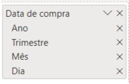
    </td>
</tr>
</table>  

- __Seta apontada para cima (drill up):__ este botão aumenta um nível na hierarquia, mas para cima. Por exemplo, se estamos filtrando os dados por Mês e clicamos nele, os dados serão filtrados em Trimestre. Caso cliquemos de novo, serão filtrados por Ano, e assim por diante.  
- __Seta apontada para baixo (drill down):__ esse botão serve para detalhar os campos. Por exemplo, se filtramos os dados por Trimestre, e clicamos no mês de janeiro, que faz parte do primeiro trimestre, todos os meses pertencentes ao primeiro trimestre serão detalhados.
- __Seta dupla apontada para baixo (próximo nível da hierarquia):__ essa opção faz o caminho inverso do Drill up, ou seja, quando clicamos nela os dados são filtrados pela hierarquia que vem abaixo. Por exemplo, se os dados estão filtrados por Mês e clicamos nessa seta, os dados passarão a ser filtrados por Dia.
- __Seta dupla em formato de garfo (expandir todo o campo um nível na hierarquia):__ essa opção só funciona quando estamos na hierarquia do topo, no caso do nosso exemplo, a hierarquia Ano. Como a seta dupla apontada para baixo, a seta dupla em formato de garfo também aciona as hierarquias abaixo da selecionada. Mas, ao invés de descer um nível todo, ela expande o nível com o próximo abaixo, de modo a incluir a filtragem do nível atual e a filtragem do nível abaixo. Por exemplo, quando estamos em Ano e clicamos nessa seta, os dados serão filtrados por Ano e Trimestre. Se clicarmos outra vez, serão filtrados por Ano, Trimestre e Mês, e assim por diante.

Agora que entendemos como essas filtragens funcionam, vamos mexer em um visual de exemplo, mais especificamente com um gráfico de área. Você também pode conferir os campos à direita, que estão no Eixo X e Eixo Y:
<table style="text-align: center; width: 100%;"> 
<tr>
    <td style="text-align: left;">
    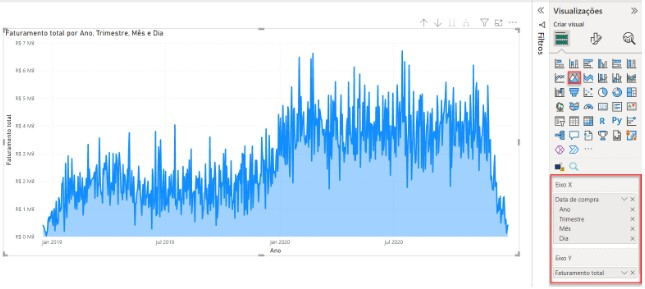
    </td>
</tr>
</table>  

A nossa ideia será filtrar os dados por Ano, Trimestre e Mês. Atualmente, ele também está filtrado por Dia, ou seja, o objetivo é remover o Dia da nossa filtragem.

Primeiramente, vamos clicar apenas uma vez na seta apontada para cima (drill up). Como os dados estavam expandidos até o Dia, quando clicamos nessa seta, vamos subir um nível, ou seja, estamos retirando o Dia da nossa filtragem, deixando apenas do Mês para cima: 

<table style="text-align: center; width: 100%;"> 
<tr>
    <td style="text-align: left;">
    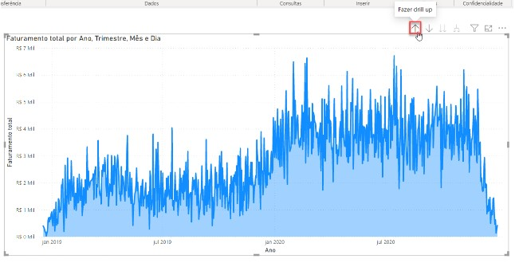
    </td>
    <td style="text-align: left;">
    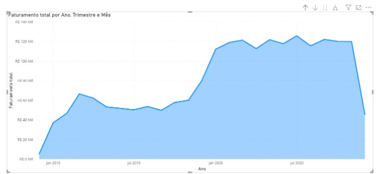
    </td>
</tr>
</table>  

Você pode acompanhar a mudança na filtragem pelo título do visual. Antes tínhamos Faturamento Total por Ano, Trimestre, Mês e Dia. Após fazermos o Drill up, o título mudou para Faturamento Total por Ano, Trimestre e Mês, indicando que não estamos utilizando os dias para filtrar nossos dados.

Em resumo, os rótulos de hierarquia no Power BI são uma excelente ferramenta para organizar e apresentar dados hierárquicos de forma clara e interativa. Eles permitem que você crie visualizações mais poderosas e flexíveis, oferecendo aos usuários a capacidade de explorar os dados em diferentes níveis de detalhe. Experimente utilizar os rótulos de hierarquia em seus relatórios e descubra como eles podem melhorar a compreensão e a análise dos seus dados.

[↑ Voltar ao topo](#topo)

---
## 6. Obtendo novos visuais

Agora iremos trabalhar com outro conceito já visto [anteriormente](https://github.com/thierryLchaves/Santander-Imersao-Digital/blob/5d9e1fc5c7886c2f8b794b671fd71610f9bdf401/Analise_de_dados_e_IA_Nivelamento/Semana_06/BI_com_Excel_Trabalhando_com_tabelas_dinamicas_com_Power_Pivot/02_Opcoes_de_tabela_Dinamica/OpcoesDeTabelaDinamica.md), no Excel, que é a segmentação de dados.  
Porém para aplicação desse modelo e para aprendermos um novo recurso do Power B.I iremos trabalhar com obtenção de visuais externos, para isso acessaremos novamente a parte de inserção de gráficos e selecionaremos a ultima opção do menu expandido de `Obter mais visuais`, quando selecionarmos essa opção seremos direcionado a tela que contém diversos visuais do Power B.I, tal qual a Microsoft Store, nessa tela serão apresentados diversos visuais de apresentação que são criados pela comunidade, porém assim como em outras lojas de aplicativos pode ocorrer do visual selecionado ser pago, então para nosso curso iremos utilizar a lupa de buscas, para inserirmos o visual especifico que é de utilização gratuita, que no caso será os visuais a serem escolhidos serão: __`Text Filter` e `Image Grid`__, para o processo de obtenção de visuais, pós sua seleção teremos duas opções a de adicionar, e a de Baixar modelo, no curso em questão utilizaremos a opção de adicionar. 
E quais são e como funcionam esses modelos importados, o primeiro `Text Filter` funciona como um filtro por texto, com base em um campo selecionado, então quando adicionarmos esse car com tal informação devemos inserir o parâmetro desejado que no caso será o de nome do produto, esse card ira atuar como um filtro geral dos demais modificando a demonstração do gráfico para o item buscado. Já o modelo de `Image Grid`, tem um funcionamento parecido, porém no caso ele montaram um gráfico interativo com base em imagens _(Em nossa base de dados, possuímos na tabela de produtos, a coluna de url do produto, o Power B.I que quando selecionada a ferramenta irá realizar o link e agrupamento por imagem realizando a busca das imagens das urls de forma automática)_  

<table style="text-align: center; width: 50%;"> 
<tr>
    <td style="text-align: left;">
    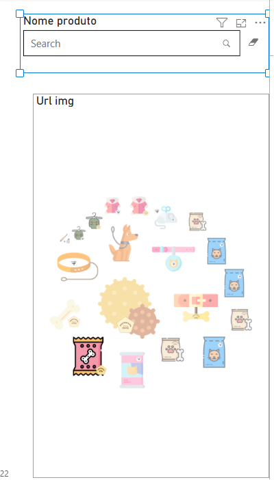
    </td>
</tr>
</table>  

O Power B.I também possui um modelo de segmentação de dados nativo e fica disponível no acesso rápido de gráficos, o seu preenchimento de parâmetro ocorre similar aos demais vistos, porém como se trata de uma segmentação de dados simples o parâmetro requisitado diz respeito a somente um campo, que no caso qual informação desejamos segmentar, a depender o dado escolhido, o modelo dessa segmentação será modificada, assim como também da quantidade de  informações do campo.

Com todos os dados devidamente preenchidos e cards criado temos um DashBoard,

<table style="text-align: center; width: 100%;"> 
<tr>
    <td style="text-align: left;">
    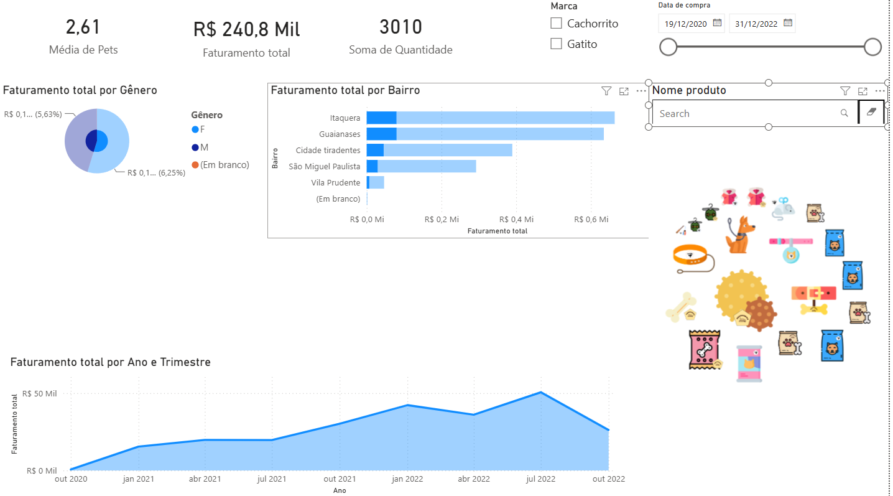
    </td>
</tr>
</table>  

Por mais que o DashBoard já apresente as informações necessárias, o mesmo ainda precisa de um tratamento visual de estilização e e isso que será realizado a posteriori.

>PS: Para habilitar tal recurso é necessário que estejamos logado em uma conta da Microsoft válida.
>PS2: Outra maneira de obtenção de novos visuais pode ser realizada através da guia de Pagina Inicial, no agrupamento de Inserir, pela opção de menu Mais Visuais, e assim como no modo anterior podemos selecionar tanto da AppSource, quanto de baixados, que estará nomeado como dos meus arquivos.

[↑ Voltar ao topo](#topo)

---
## 7. Visualizando imagens dos eventos
Sua empresa deseja exibir imagens de eventos passados de forma organizada. Como você usaria o Power BI para criar essa visualização? 

<table style="text-align: center; width: 100%;"> 
<tr>
    <td style="text-align: left;">
    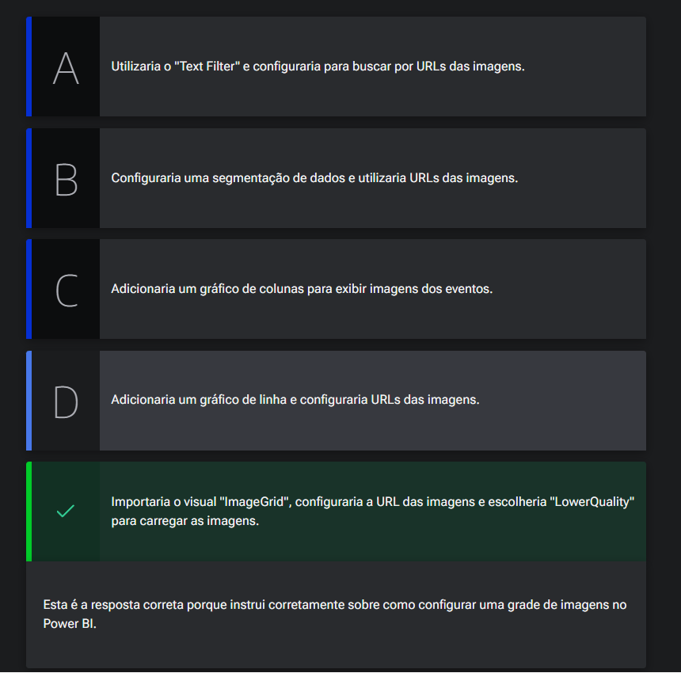
    </td>
</tr>
</table>  

[↑ Voltar ao topo](#topo)

---
## 8. Faça como eu fiz: trazendo visuais externos

> Nota: Atualmente, para importar visuais do Marketplace no Power BI, é necessário realizar login com uma conta Microsoft. No entanto, a criação de novas contas gratuitas está indisponível no momento, conforme indicado na atividade: Para saber mais: [conta gratuita indisponível](https://cursos.alura.com.br/classpage/power-bi-desktop-construindo-meu-primeiro-dashboard/task/193298).
>Dessa forma, os passos a seguir aplicam-se apenas a quem já possui uma conta corporativa Microsoft ativa. Como alternativa, você pode baixar o projeto desenvolvido [aqui], que já inclui os visuais necessários, sem a necessidade de importá-los manualmente.

[↑ Voltar ao topo](#topo)

---
## 9. O que aprendemos?

[↑ Voltar ao topo](#topo)

---

<!-- <table style="text-align: center; width: 100%;"> 
<tr>
    <td style="text-align: left;">
    
    </td>
</tr>
</table> -->

---

<table align="center" style="border-collapse: collapse; margin-left: auto; margin-right: auto;"> 
  <caption><b>Skills do projeto</b></caption>
  <tr>
    <td style="padding: 5px;">
      
    </td>
    <td style="padding: 5px;">
      
    </td>
    <td style="padding: 5px;">
      
    </td>
  </tr>
</table>

---
__Titulo:__ Análises com os gráficos
__Autor:__ Thierry Lucas Chaves  
__Data de Criação:__ 14-06-2026  
__Data de Modificação:__ 14-06-2026  
__Versão:__ "1.0"