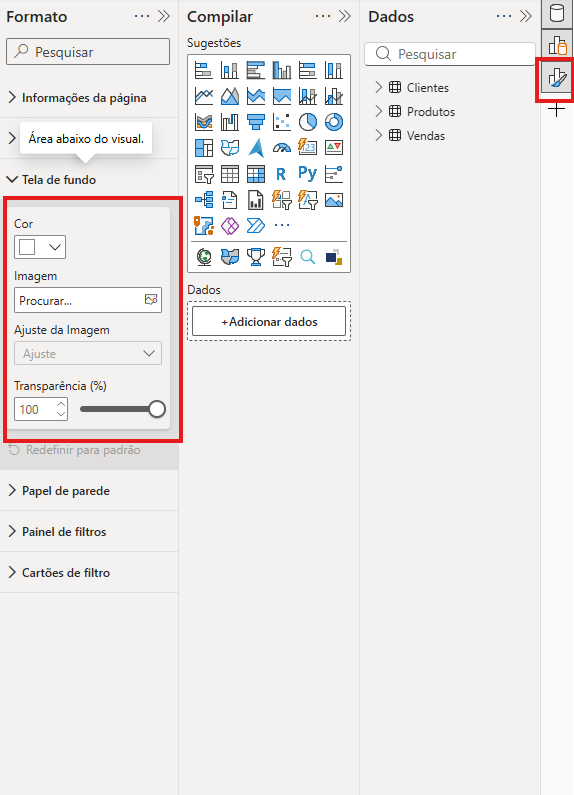
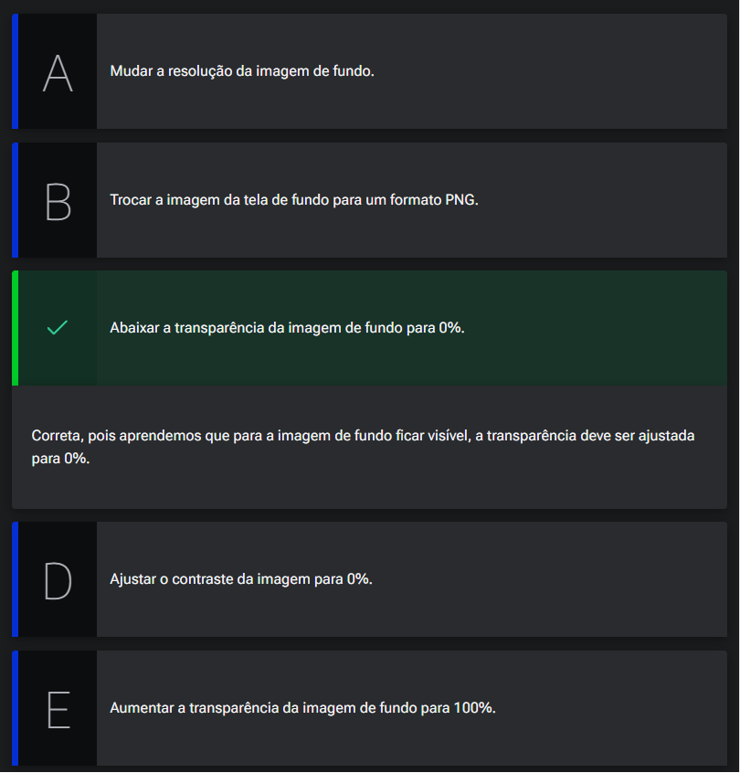
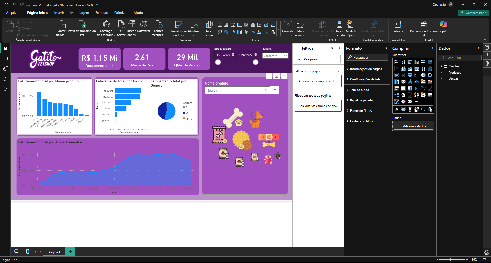
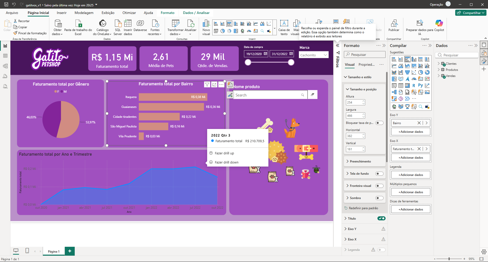
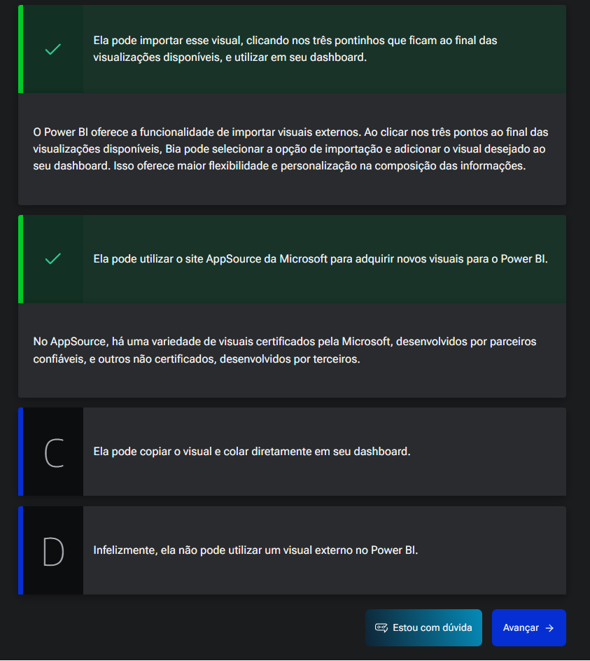
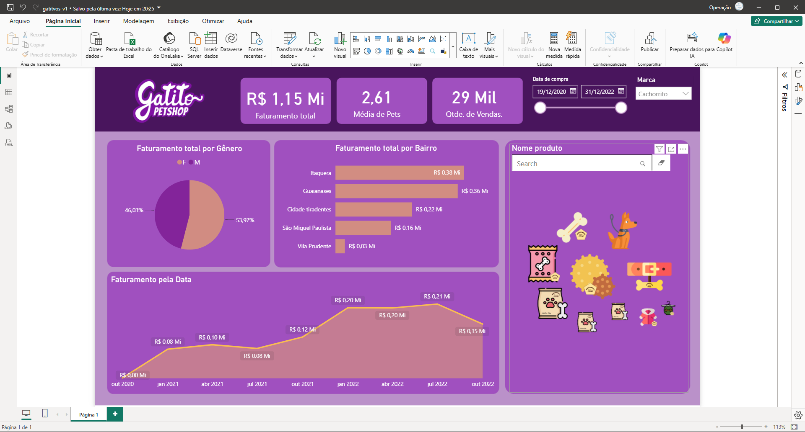
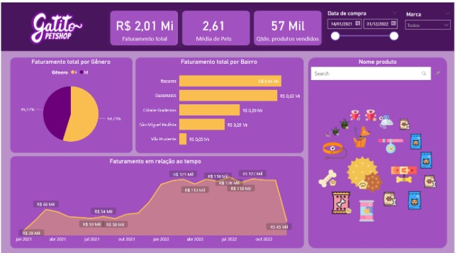
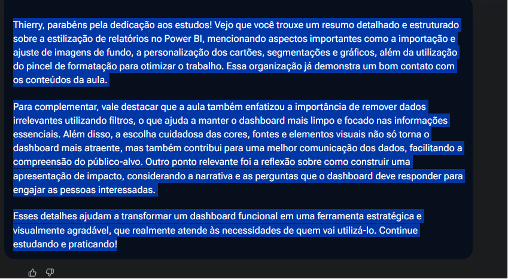

# Estilização do relatório

## Sumário
- [Estilização do relatório](#estilização-do-relatório)
  - [Sumário](#sumário)
  - [1. Projeto da aula anterior](#1-projeto-da-aula-anterior)
  - [2. Estilização dos cartões](#2-estilização-dos-cartões)
  - [3. Ajustando imagem de fundo](#3-ajustando-imagem-de-fundo)
  - [4. Estilizando as segmentações](#4-estilizando-as-segmentações)
  - [5. Para saber mais: apresentações de impacto](#5-para-saber-mais-apresentações-de-impacto)
  - [6. Estilizando o gráfico de pizza](#6-estilizando-o-gráfico-de-pizza)
  - [7. Escolhendo visuais](#7-escolhendo-visuais)
  - [8. Gráfico de área](#8-gráfico-de-área)
  - [9. Faça como eu fiz: dashboard com as estilizações](#9-faça-como-eu-fiz-dashboard-com-as-estilizações)
  - [10. O que aprendemos?](#10-o-que-aprendemos)

## 1. Projeto da aula anterior

Caso prefira, você pode acessar o projeto da [aula 3](Analise_de_dados_e_IA_Nivelamento\Semana_07\Power_BI_Desktop_Construindo_meu_primeiro_dashboard\src\gatitvos_v1.pbix) no ponto em que paramos na aula anterior.

---
## 2. Estilização dos cartões

Conforme comentado brevemente na aula anterior iremos agora trabalhar com o processo de estilização do DashBoard. 
Para realização desse processo podemos utilizar tanto o próprio Power B.I para criar esses estilos, quanto também outras ferramentas como por exemplo (Power Point, ou Figma).
Em nosso projeto iremos utilizar um Layout próprio, e o que iremos aprender nesse tópico será como realizar a importações desses Layout's.   
Para tal processo dentro da área de _"Canvas"_, do Power B.I, temos na barra lateral direita a opção de formato (ícone de pincel), essa opção irá habilitar mais uma barra de ação dentro _"canvas"_, com as opções de formato, para esse processo iremos utilizar  opção de tela de fundo. 

<table style="text-align: center; width: 100%;"> 
<tr>
    <td style="text-align: left;">
    
    </td>
</tr>
</table>

Iremos utilizar a opção de imagem de fundo, com a qual o Power B.I irá aplicar uma imagem no fundo da tela com a imagem selecionada, nessa parte é importante se atentar, pois por padrão a transparência da imagem fica definida como __100%__, o que leva a impressão primaria que a imagem não foi aplicada, porém quando abaixamos a transparência será refletido tal imagem.
Pós esse processo podemos ir realizando ajustes visuais nos cards, tais como remoção de fundo do card com a opção de tela de fundo. Já no que diz respeito ao processo de formatação da informação propriamente dita do card as opções ficam agrupadas no menu de valor do balão, assim como os rótulos ficam agrupados em rótulo da categoria. ainda sobre o rótulo da categoria é possível modicar essa informação, quando selecionado o objeto, no card de informação através do duplo clique no rótulo da informação e possível realizar a modificação ali apresentada.  

[↑ Voltar ao topo](#topo)

---
## 3. Ajustando imagem de fundo
No sistema de rastreamento de pedidos, você quer adicionar um layout personalizado no seu dashboard. O primeiro passo é ajustar a imagem de fundo, mas ela não é visível inicialmente. Como você pode fazer isso?  

<table style="text-align: center; width: 100%;"> 
<tr>
    <td style="text-align: left;">
    
    </td>
</tr>
</table>
s

[↑ Voltar ao topo](#topo)

---
## 4. Estilizando as segmentações
O primeiro campo que iremos modificar, será no filtro de data da compra, aplicaremos modificações visuais, como as que visualizamos antes, formatações de cores de fundo, modificação de contraste das fontes etc...  
Como foram modificações visuais segue abaixo o modelo do gráfico que foi construído até o momento. 
> PS: Para segmentação de dados da marca, foi modificado o estilo dela para suspenso por isso a apresentação diferente do modelo anterior  
<table style="text-align: center; width: 100%;"> 
<tr>
    <td style="text-align: left;">
    
    </td>
</tr>
</table>

[↑ Voltar ao topo](#topo)

---
## 5. Para saber mais: apresentações de impacto  

Quando você elaborar seu dashboard, considere que irá apresentar para a pessoa que demandou essa tarefa. Assim, você terá mais facilidade em definir como quer que seu dashboard transmita as informações solicitadas.

Preste atenção nas perguntas que você precisa responder no dashboard e priorize seus achados no momento em que for apresentar seu trabalho. A narrativa que você irá construir sobre seu dashboard pode facilitar a compreensão das pessoas e engajar as partes interessadas nas suas análises.

Para estruturar uma apresentação de impacto, tente responder algumas perguntas sobre seu dashboard:  

- O que a pessoa que vai consumir os dados desse dashboard precisa saber?
- O que você gostaria que as pessoas lembrassem ao final da sua apresentação?
- A linguagem utilizada é simples e apropriada para o público alvo?

Ao refletir sobre essas questões você pode resumir em uma frase o que você quer expor no começo, no meio e no fim da sua apresentação. Desse modo, você terá um caminho mapeado mais tranquilo de percorrer no momento em que for preparar a história que vai contar sobre seu dashboard.  

Quando falamos sobre o impacto de uma apresentação, estamos falando de quão útil, agradável e construtiva ela foi para a audiência. Então não se esqueça de:

- 1. Usar a sua criatividade no começo da apresentação para despertar o interesse do seu público alvo;
- 2.Durante a apresentação, mostrar gradualmente pontos fortes e pontos de melhoria realizados no dashboard para atender o público alvo;
- 3.Finalizar a apresentação reforçando a mensagem que você gostaria que as pessoas lembrem sobre a sua exposição.  
  
Em suma, para obter o resultado desejado com uma apresentação de impacto reflita sobre como facilitar a compreensão de todas as pessoas que estão entrando em contato com o seu dashboard e garanta que seu dashboard apresente as respostas para as perguntas dessas pessoas.  

[↑ Voltar ao topo](#topo)

---
## 6. Estilizando o gráfico de pizza
Assim como realizamos na edição do nome de outros títulos, também o faremos dentro do gráfico de pizza, iremos clicar sobre o título do card, para poder editar o nome, ainda dentro da opção de modificações do título nos permite para além da edição de tais informações, realizar o edições mais _"profundas"_, sobre esses itens similares as ferramentas de edição rápida que são realizar no Word ou Excel. 
Assim como já realizamos anteriormente também é possível utilizar o pincel de formatação de um card para outro para aproveitar, algumas formatações, também é possível dentro dos cards realizar filtros, no caso do nosso gráfico de pizza, tínhamos um pequeno percentual _"em branco"_, para remoção dessa informação basta clicar sobre o gráfico, acessar a barra lateral de filtro,  _"deselecionar"_ a opção de em branco, outra formatações são possíveis de serem realizadas, seja a modificação de cores existentes no gráfico de acordo com cada informação, essas cores podem ser pré-determinadas ou não ou seja podemos realizar a modificação de cores tanto por um código Hexa-decimal, quanto pela seleção expandida de grid de cores.   
Já que no que diz respeito a gráfico de barras temos a opções similares as vistas no gráfico de pizza, porém sua personalização é orientada aos eixos __(X,Y)__, uma outra coisa digna de nota e que podemos habilitar a opção de rótulos de barras, essa opção faz com que as informações dos valores fiquem sobre o gráfico dispensando em alguns casos a informações do titulo do eixo, no card do gráfico de barras também é possível realizar a exclusão da informação em branco através do filtro  e o passo para realizar esse processo seguira da mesma maneira que fora realizado no gráfico de pizza.
E assim como fizemos no outro tópico segue anexo a imagem de como os gráficos ficaram pós a estilização. 
<table style="text-align: center; width: 100%;"> 
<tr>
    <td style="text-align: left;">
    
    </td>
</tr>
</table>

[↑ Voltar ao topo](#topo)

---
## 7. Escolhendo visuais
Bia está construindo um dashboard e está colocando alguns gráficos e visuais bem legais para ajudá-la a compor todas as informações que ela quer trazer.

Entretanto, ela não conseguiu localizar uma das visualizações que ela pensou em utilizar. Ela descobriu então que essa visualização não vinha de forma nativa no Power BI.

O que ela pode fazer agora para utilizar essa visualização em seu dashboard? 

<table style="text-align: center; width: 100%;"> 
<tr>
    <td style="text-align: left;">
    
    </td>
</tr>
</table>

[↑ Voltar ao topo](#topo)

---
## 8. Gráfico de área
Agora iremos trabalhar na estilização do gráfico de área ou linhas, assim como no gráfico de barras o gráfico de linhas também disponibiliza estilizações de orientadas a eixos, porém nesse gráfico temos opções de estilizações a mais, tais como adição/remoção de linhas de grade, estilização da linha e cor de fundo, rótulos de dados, títulos etc...
As demais estilizações já foram citadas ou mencionadas anteriormente e por tal motivo não teceremos maiores detalhes sobre.. 
Por fim iremos estilizar os 2 últimos gráficos restantes _(aqueles que foram adicionados da AppSource)_, para o processo de estilização a priori seguiremos as mesma diretrizes, selecionar o gráfico e estilizar através da barra lateral de formato.  
Agora que já realizamos toda estilização do gráfico, nosso DashBoard completo e estilizado, conforme demonstra imagem abaixo:  
<table style="text-align: center; width: 100%;"> 
<tr>
    <td style="text-align: left;">
    
    </td>
</tr>
</table>

[↑ Voltar ao topo](#topo)

---
## 9. Faça como eu fiz: dashboard com as estilizações  
Durante esta aula, realizamos a estilização de todos os visuais. Dentre eles, estilizamos os visuais de cartão, de segmentação de dados, gráfico de pizza, gráfico de barras clusterizado, image grid, text filter e gráfico de área.

Abaixo, podemos verificar o dashboard após as estilizações aplicadas:
<table style="text-align: center; width: 100%;"> 
<tr>
    <td style="text-align: left;">
    
    </td>
</tr>
</table>

Assim, trabalhamos na estilização de cada um dos visuais e no dashboard como um todo através do tema da Gatito Petshop. Com isso, finalizamos a quarta aula.

Aplique sua criatividade e habilidades de estilização no Power BI para criar um tema personalizado que reflita a identidade da empresa ou projeto. Escolha cores, fontes e elementos visuais que proporcionem uma experiência única e coerente. Evidencie o potencial do seu dashboard com uma estilização profissional e impactante. Divirta-se e surpreenda-nos com seu resultado!  

__Opinião do instrutor__    

Em caso de dúvidas sobre os temas aqui estudados, fique à vontade para interagir no fórum do curso ou na nossa comunidade no discord. Ambas são espaços colaborativos no qual alunas e alunos - além das pessoas instrutoras - buscam responder as dúvidas que surgem durante os cursos.

---
## 10. O que aprendemos?
Explique com suas próprias palavras os principais conceitos que você aprendeu nesta aula.
<table style="text-align: center; width: 100%;"> 
<tr>
    <td style="text-align: left;">
    
    </td>
</tr>
</table>

---

<table align="center" style="border-collapse: collapse; margin-left: auto; margin-right: auto;"> 
  <caption><b>Skills do projeto</b></caption>
  <tr>
    <td style="padding: 5px;">
      
    </td>
    <td style="padding: 5px;">
      
    </td>
    <td style="padding: 5px;">
      
    </td>
  </tr>
</table>

---
__Titulo:__ Estilização do relatório
__Autor:__ Thierry Lucas Chaves  
__Data de Criação:__ 14-06-2026  
__Data de Modificação:__ 17-06-2026  
__Versão:__ "1.0"