# Power Bi Service

## Sumário
- [Power Bi Service](#power-bi-service)
  - [Sumário](#sumário)
  - [1. Projeto da aula anterior](#1-projeto-da-aula-anterior)
  - [2. Layout móvel](#2-layout-móvel)
  - [3. Layout personalizado](#3-layout-personalizado)
  - [4. Publicando na web](#4-publicando-na-web)
  - [5. Para saber mais: publicar na web](#5-para-saber-mais-publicar-na-web)
  - [6. Acessando o Power BI service](#6-acessando-o-power-bi-service)
  - [7. Fundo do dispositivo móvel](#7-fundo-do-dispositivo-móvel)
  - [8. Faça como eu fiz: estilizando o layout móvel](#8-faça-como-eu-fiz-estilizando-o-layout-móvel)
  - [9. Projeto final](#9-projeto-final)
  - [10. Para ir mais fundo](#10-para-ir-mais-fundo)
  - [11. O que aprendemos?](#11-o-que-aprendemos)
  - [12. Conclusão](#12-conclusão)

## 1. Projeto da aula anterior

Caso prefira, você pode acessar o [projeto da aula 4](https://github.com/thierryLchaves/Santander-Imersao-Digital/blob/8e831e53d99e05751dae476ba46f265abe28c810/Analise_de_dados_e_IA_Nivelamento/Semana_07/Power_BI_Desktop_Construindo_meu_primeiro_dashboard/src/gatitvos_v1.pbix) no ponto em que paramos na aula anterior.

---
## 2. Layout móvel
Ainda falta uma ultima estilização a ser realizada dentro do nosso DashBoard, que seria apresentação mobile, desse dashboard, então antes de aprendermos como publicar e/compartilhar uma DashBoard, vamos aprender como estilizar essa DashBoard, para apresentação em dispositivos móveis.    
Para inicio desse processo temos duas opções disponíveis para acessar esse processo, sendo o primeiro na barra inferior do aplicativo do Power B.I Desktop, temos o ícone de um celular, assim como também na guias temos dentro da guia de Exibição a opção de `Layout Móvel`, quando selecionado quaisquer uma dessa opções seremos redirecionados a uma tela similar a da imagem anexo:  

<table style="text-align: center; width: 100%;"> 
<tr>
    <td style="text-align: left;">
    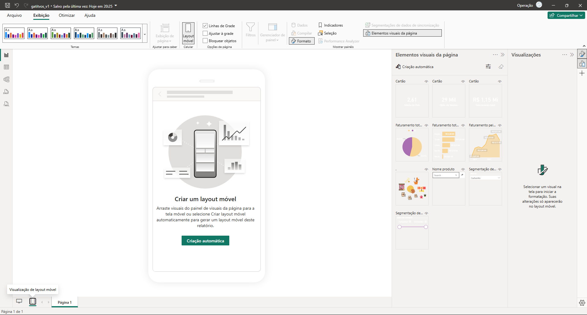
    </td>
</tr>
</table>

Uma das opções e que pode ser utilizada é o botão `Criação Automática`, uma das coisas que percebemos quando essa opção é selecionada, e que o layout de fundo não será importado para essa visualização, então os gráficos e informações que outrora ficavam visíveis, não estão sendo apresentadas da melhor maneira, então uma das maneiras que podemos realizar para contornar esse problema é retornando ao modo de exibição anterior, e modificando a coloração de fundo, então dentro do menu de formato iremos adicionar no menu de papel de parede, uma coloração e habilitar a transparência para __0%__, outro ponto a ser modificado e dentro desse menu inicial, iremos adicionar também a coloração no menu de tela fundo. 
> PS: Durante a aula foi citado que na versão utilizada pelo instrutor ocorria um erro de aplicação para essa modificação, porém durante a replicação do conteúdo não foi notado tal comportamento entretanto, constara nesse repositório a maneira que foi adotada em vídeo para contornar esse problema citado.  

Para contornar essa situação foi adicionado uma forma retangular para dentro do DashBoard _(Essa forma poderá ter qualquer tamanho desde que fique dentro do dashboard)_ e posteriormente foi realizado a edição da transparência desse objeto para __100%__, a ideia dessa utilização e que mesmo se apagarmos todo o layout realizado da forma automática, como essa forma existe no layout principal _(DESKTOP)_, ela se manterá então é realizado a modificação da transparência dessa forma na visualização mobile.
> PS: Quando realizado a modificação desse objeto dentro da visualização Mobile, essa alteração será aplicada somente nessa visualização. 

Deixaremos a estilização automática que foi criada pelo Power B.I, pois atende aos requezitos desse repositório que é de anotações, portando o layout mobile construído para esse processo ficou da seguinte maneira.

<table style="text-align: center; width: 100%;"> 
<tr>
    <td style="text-align: left;">
    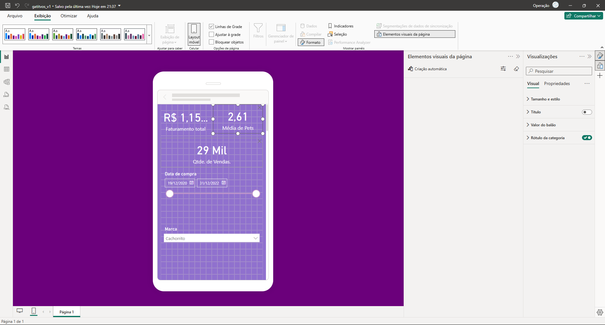
    </td>
</tr>
</table>

[↑ Voltar ao topo](#topo)

---
## 3. Layout personalizado

No contexto de uma plataforma de cursos online, personalizar o layout para diferentes dispositivos é crucial. Como organizar os elementos de um dashboard no Power BI para uma visualização adequada em dispositivos móveis?  

<table style="text-align: center; width: 100%;"> 
<tr>
    <td style="text-align: left;">
    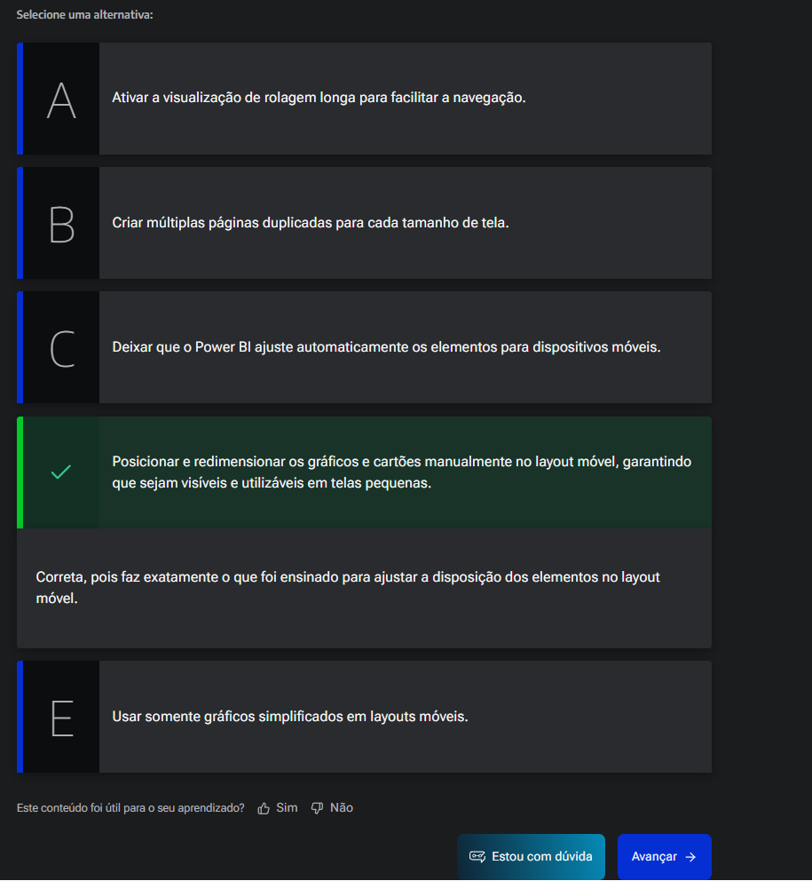
    </td>
</tr>
</table>  

[↑ Voltar ao topo](#topo)

---
## 4. Publicando na web
Agora para que possamos, compartilhar nosso projeto devemos realizar a publicação desse DashBoard dentro do Power B.I Serviços, e para realizar tal tarefa iremos seguir os passo descritos abaixo:  
A primeira coisa a ser realizada é salvar o projeto, podemos visualizar se um projeto foi salvo ao não através da barra de títulos do Power B.I, quando o arquivo não foi salvo ainda é usual, que o nome indicado nessa barra se apresente como Sem titulo.pibx, já quando realizamos o processo de salvar o projeto mudara conforme o nome escolhido para tal.   

---
Agora para publicar o projeto dentro da guia de Página Inicial, temos a opção de Publicar dentro do menu de opções de compartilhar, quando selecionarmos essa opção será apresentado uma nova tela indicando em qual pasta, que também pode ser conhecida como WorkSapace (Esse está vinculado a conta de entrada do Power b.i), quando não há nenhuma pasta criada de publicações do Power B.I a pasta apresentada terá o nome de __Meu WorkSapace__, quando o processo de publicação estiver completo e tiver exito em publicação seremos apresentado a tela abaixo:  

<table style="text-align: center; width: 100%;"> 
<tr>
    <td style="text-align: left;">
    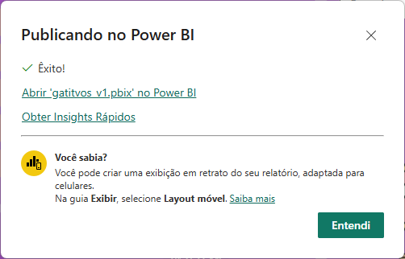
    </td>
</tr>
</table>  

[↑ Voltar ao topo](#topo)

---
## 5. Para saber mais: publicar na web
Agora, vamos disponibilizar o Dashboard que construímos na web para que a Helô consiga visualizá-lo. Como podemos fazer isso?

Antes de mais nada, vamos verificar se a opção para compartilhar na Web está habilitada e se a opção para inserir códigos novos também está selecionada.  

- 1º Primeiramente, você vai acessar a sua conta do Power BI, pelo seguinte [link](https://app.powerbi.com/)
- 2º  Após entrar na sua conta, clique no ícone de engrenagem, chamado Configurações e depois clique em Portal de administração:  
<table style="text-align: center; width: 50%;"> 
<tr>
    <td style="text-align: left;">
    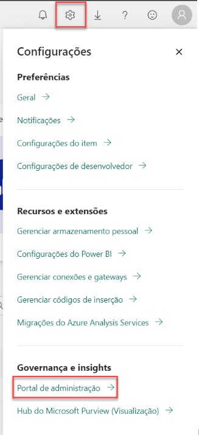
    </td>
</tr>
</table>  

- 3º No Portal de administração, entre na área de Configurações de locatário:
<table style="text-align: center; width: 50%;"> 
<tr>
    <td style="text-align: left;">
    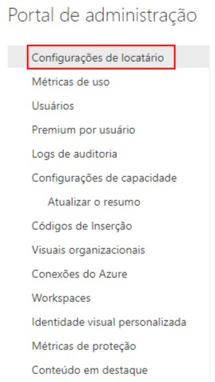
    </td>
</tr>
</table>  
- 4º Na área de configuração, procure pela seção de Configurações de compartilhamento e de exportação e, nela, pela opção Publicar na Web:
<table style="text-align: center; width: 100%;"> 
<tr>
    <td style="text-align: left;">
    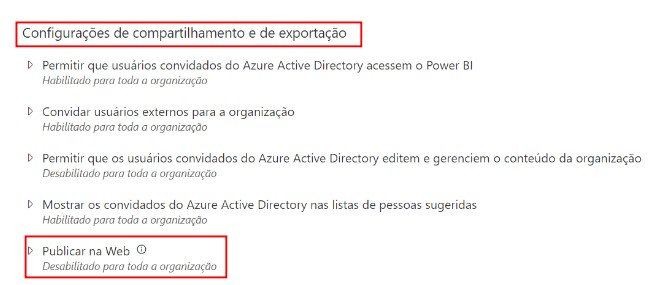
    </td>
</tr>
</table>  

- 5º Habilite a opção Publicar na Web. Você precisa que ela esteja habilitada com a opção Permitir códigos novos e existentes selecionada. Após ativar essas opções, clique em Aplicar:
<table style="text-align: center; width: 100%;"> 
<tr>
    <td style="text-align: left;">
    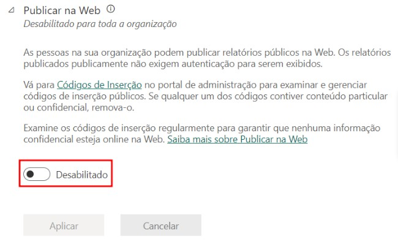
    </td>
</tr>
<tr>
    <td style="text-align: left;">
    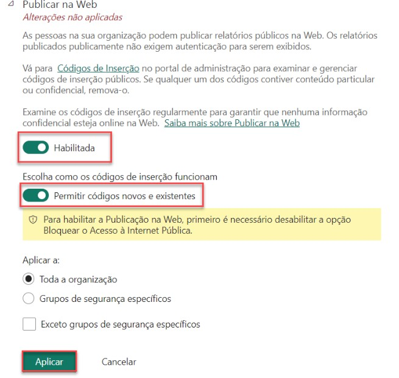
    </td>
</tr>
</table>  

- 6º Pronto, agora é só esperar alguns minutos até que essa função esteja habilitada no seu Power BI.

Agora que garantimos que essas opções foram habilitadas, podemos realizar a publicação através do Power BI Desktop.

- 1º Primeiramente, certifique-se de que você entrou na sua conta no Power BI Desktop:
<table style="text-align: center; width: 100%;"> 
<tr>
    <td style="text-align: left;">
    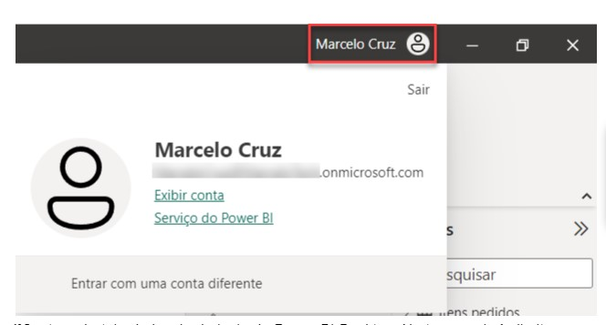
    </td>
</tr>
</table>  

- 2º  Em seguida, basta clicar no botão Publicar, que está na aba Página Inicial, na direita:
<table style="text-align: center; width: 100%;"> 
<tr>
    <td style="text-align: left;">
    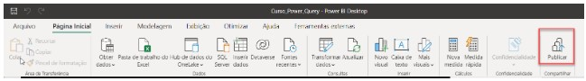
    </td>
</tr>
</table>  

- 3º Ao clicar no botão Publicar, uma janela irá aparecer, perguntando em qual workspace você deseja salvar seu projeto. Você pode escolher a opção Meu workspace e depois clicar em Selecionar:

<table style="text-align: center; width: 100%;"> 
<tr>
    <td style="text-align: left;">
    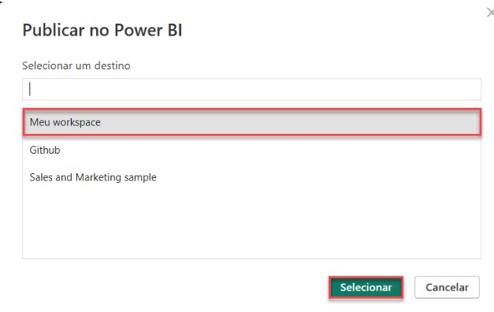
    </td>
</tr>
</table>  

- 4º Após selecionar o workspace, uma mensagem de confirmação irá aparecer junto com o link que dá acesso direto ao seu projeto no Power BI Service, no qual você pode clicar:

<table style="text-align: center; width: 100%;"> 
<tr>
    <td style="text-align: left;">
    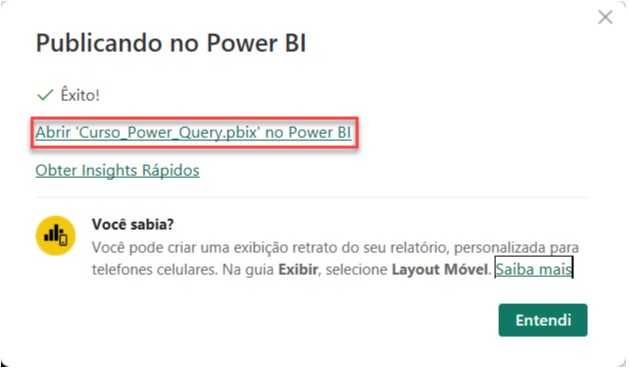
    </td>
</tr>
</table>  

- 5º E assim finalizamos a publicação do nosso dashboard na Web.

A publicação do seu dashboard do Power BI na web é uma maneira eficaz de compartilhar suas análises e insights com outras pessoas. Ao disponibilizar seu dashboard online, você amplia o acesso aos seus dados e permite que usuários visualizem e interajam com suas visualizações de qualquer lugar. Essa funcionalidade facilita a colaboração e o compartilhamento de informações, promovendo uma tomada de decisão mais informada e impactante.  

[↑ Voltar ao topo](#topo)

---
## 6. Acessando o Power BI service
Dentro da tela final de [exito na publicação](#publicacao), temos 2 hiperlinks disponíveis, porem nesse caso selecionaremos, a opção de abrir nome do arquivo no Power B.I, ao selecionar essa opção seremos redirecionados ao site do Power B.I Serviços, diretamente no projeto:  
<table style="text-align: center; width: 100%;"> 
<tr>
    <td style="text-align: left;">
    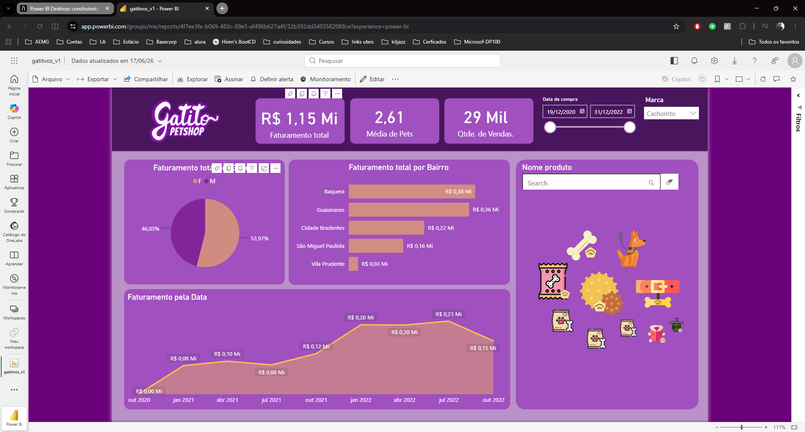
    </td>
</tr>
</table>  

Ou podemos dentro do navegador digitar, o endereço do site ou simplesmente `powerbi.com `, dentro do WorkSpace  temos várias opções de configurações, que podem futuramente serem exploradas, uma delas que iremos nos ater agora, será os arquivos que ficaram presentes no WorkSpace:  
<table style="text-align: center; width: 100%;"> 
<tr>
    <td style="text-align: left;">
    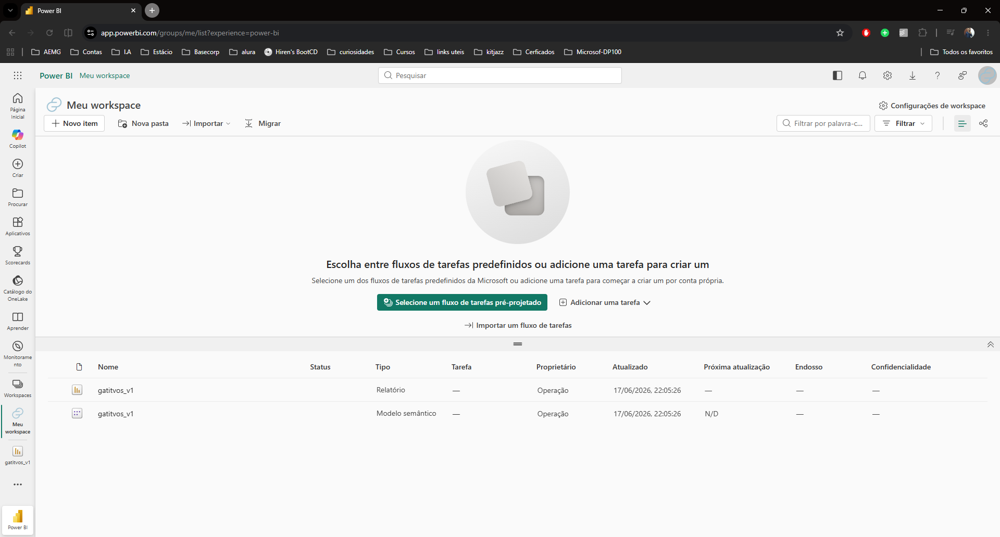
    </td>
</tr>
</table> 

Nessa tela é notamos que diferentemente do aplicativo DeskTop, temos 2 arquivos um nomeado de `Relatório` e outro de `Modelo Semântico`, essa segunda opção diz respeito diretamente aos dados que o relatório está consumindo para apresentação do relatório em Sí ou seja o relatório é o modelo visual, e o modelo semântico são as informações dados para construção do relatório.  
Quando clicamos sobre o relatório seremos redirecionados a tela de apresentação do DashBoard Online, nessa tela temos várias opções porém caso não seja clicado sobre o botão de editar, o relatório ficara em modo de visualização somente, porém quando clicamos em editar, é possível realizar algumas edições, 
Agora caso seja necessário realizar de fato a publicação na Web, desse relatório dentro da guia de arquivo teremos a opção de arquivo, publicar na WEB.
<table style="text-align: center; width: 100%;"> 
<tr>
    <td style="text-align: left;">
    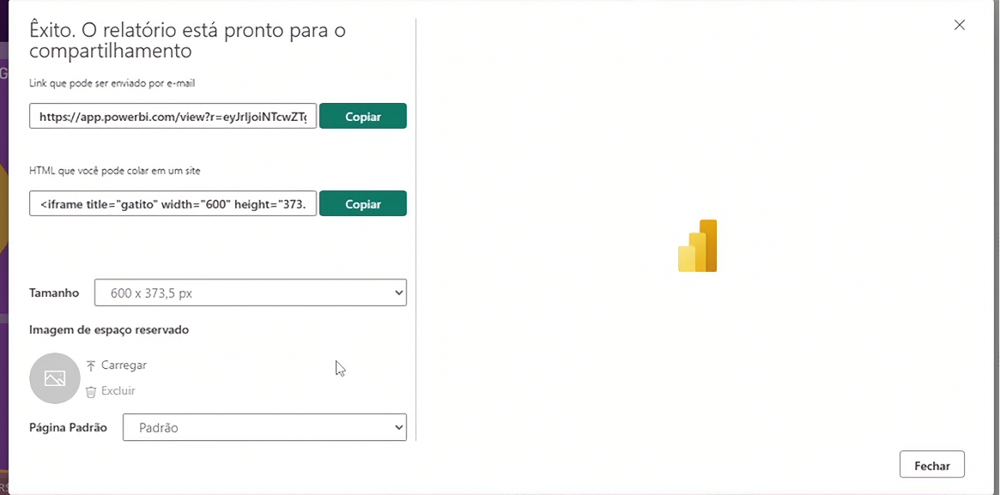
    </td>
</tr>
</table>   

Quando selecionado essa opção temos 2 opções um link para compartilhamento via E-mail, e outra de html, que servira para realizar a incorporação desse DashBoard em um site por exemplo. 
Agora a forma mais segura de realizar a publicação desse relatório é através do botão de compartilhar, porém para que esse compartilhamento funcione corretamente e necessário que tanto a pessoa que está criando esse relatório quanto que irá receber o link compartilhado tenha a conta PRÓ do Power B.I.

[↑ Voltar ao topo](#topo)

---
## 7. Fundo do dispositivo móvel

Thiago vai configurar o seu dashboard para ser visualizado no dispositivo móvel do seu cliente. Primeiro, ele construiu o dashboard no Power BI desktop e, logo após, foi fazer a configuração do layout, porém se assustou quando percebeu que o fundo estava todo em branco.

Por que isso ocorreu? Como ele pode alterar a cor do plano de fundo?  
<table style="text-align: center; width: 100%;"> 
<tr>
    <td style="text-align: left;">
    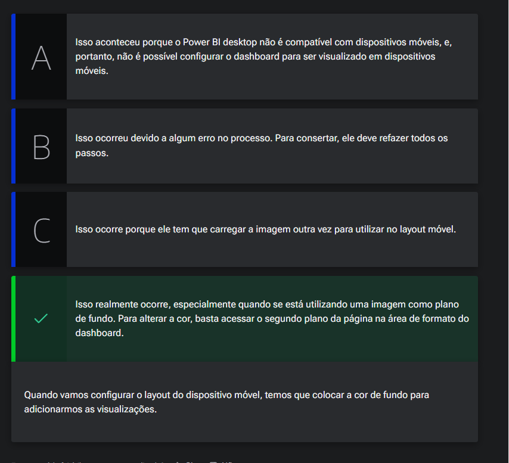
    </td>
</tr>
</table>   

[↑ Voltar ao topo](#topo)

---
## 8. Faça como eu fiz: estilizando o layout móvel
Durante esta aula, realizamos a criação do layout móvel, a publicação na Web e o acesso ao Serviço do Power BI.

Para elaborarmos o layout móvel, tivemos que habilitar a cor de fundo primeiro:  

<table style="text-align: center; width: 100%;"> 
<tr>
    <td style="text-align: left;">
    
    </td>
</tr>
</table>  

Em seguida, adicionamos os visuais no layout móvel:

<table style="text-align: center; width: 100%;"> 
<tr>
    <td style="text-align: left;">
    
    </td>
</tr>
</table> 

Após finalizar toda a parte visual, foi realizada a publicação do dashboard na Web, no Serviço do Power BI. Com isso, finalizamos a quinta aula e também o curso.

Parabéns por concluir essa primeira etapa na [Formação Power BI](https://cursos.alura.com.br/app/learning-guide/alura/power-bi).  

Utilize suas habilidades de estilização no Power BI para criar o tema para o dashboard desenvolvido em aula. Deixe-o visualmente atraente, intuitivo e profissional, escolhendo cores, fontes e organização de elementos de forma criativa. Depois, publique o dashboard na web para compartilhar seus insights com outras pessoas.  

__Opinião do instrutor__  
Em caso de dúvidas sobre os temas aqui estudados, fique à vontade para interagir no fórum do curso ou na nossa comunidade no discord. Ambas são espaços colaborativos no qual alunas e alunos - além das pessoas instrutoras - buscam responder as dúvidas que surgem durante os cursos.

Bons estudos!

[↑ Voltar ao topo](#topo)

---
## 9. Projeto final
Disponível [aqui](https://github.com/thierryLchaves/Santander-Imersao-Digital/blob/8e831e53d99e05751dae476ba46f265abe28c810/Analise_de_dados_e_IA_Nivelamento/Semana_07/Power_BI_Desktop_Construindo_meu_primeiro_dashboard/src/gatitvos_v1.pbix)  

[↑ Voltar ao topo](#topo)

---
## 10. Para ir mais fundo
Caso você queira ir além dos conhecimentos que estudamos no curso vou deixar a referência que utilizamos:

[Storytelling com Dados: um Guia Sobre Visualização de Dados Para Profissionais de Negócios (Português, pago, livro)](https://www.google.com.br/books/edition/Storytelling_with_Data/IheRCgAAQBAJ?hl=pt-BR&gbpv=0)

Autora: Cole Bussbaumer Knaflic

É um guia essencial para transformar dados em histórias impactantes e compreensíveis. O livro oferece estratégias práticas e exemplos claros de como criar visualizações eficazes que comunicam insights de maneira persuasiva. Com um foco em técnicas de design, psicologia da percepção e princípios de comunicação, Knaflic ensina aos leitores como envolver seu público e transmitir suas mensagens de forma clara e memorável através de gráficos e narrativas baseadas em dados.

[Documentação Microsoft (Português, gratuito, documentação)](https://learn.microsoft.com/pt-br/power-bi/)

É uma plataforma abrangente de aprendizado que oferece uma vasta gama de recursos. Com uma combinação de tutoriais interativos, módulos de treinamento passo a passo e exercícios práticos, a plataforma permite que os usuários desenvolvam suas habilidades em tecnologias Microsoft, como Azure, Power BI, e Microsoft 365. Projetada para ser acessível a todos os níveis de conhecimento, a sessão "Learn" ajuda a transformar o aprendizado teórico em prática aplicável, facilitando a aquisição de competências essenciais para o sucesso no mundo tecnológico.
[↑ Voltar ao topo](#topo)

---
## 11. O que aprendemos?

Nessa aula, você aprendeu a:
- Configurar o layout móvel;
- A fazer ajustes visuais utilizando formas e transparência no layout móvel;
- As diferenças entre o Power BI Desktop e o Power BI Serviço, especialmente no tratamento de dados;
- Acessar o Power BI Service;
- Publicar na web;
- Métodos seguros de compartilhamento de relatórios no Power BI, considerando a sensibilidade dos dados.

---
## 12. Conclusão

FIM 

---

<table align="center" style="border-collapse: collapse; margin-left: auto; margin-right: auto;"> 
  <caption><b>Skills do projeto</b></caption>
  <tr>
    <td style="padding: 5px;">
      
    </td>
    <td style="padding: 5px;">
      
    </td>
    <td style="padding: 5px;">
      
    </td>
  </tr>
</table>

---
__Titulo:__ Power Bi Service
__Autor:__ Thierry Lucas Chaves  
__Data de Criação:__ 14-06-2026  
__Data de Modificação:__ 17-06-2026  
__Versão:__ "1.0"