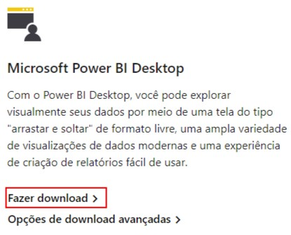
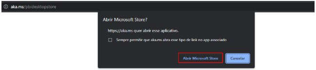
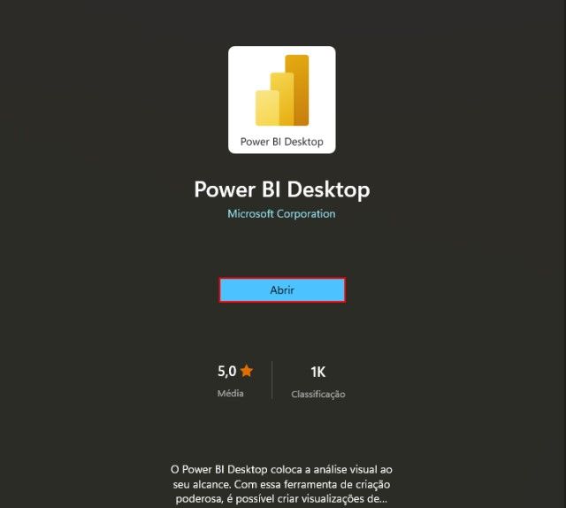
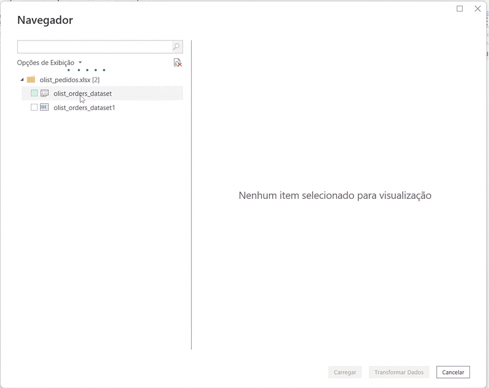
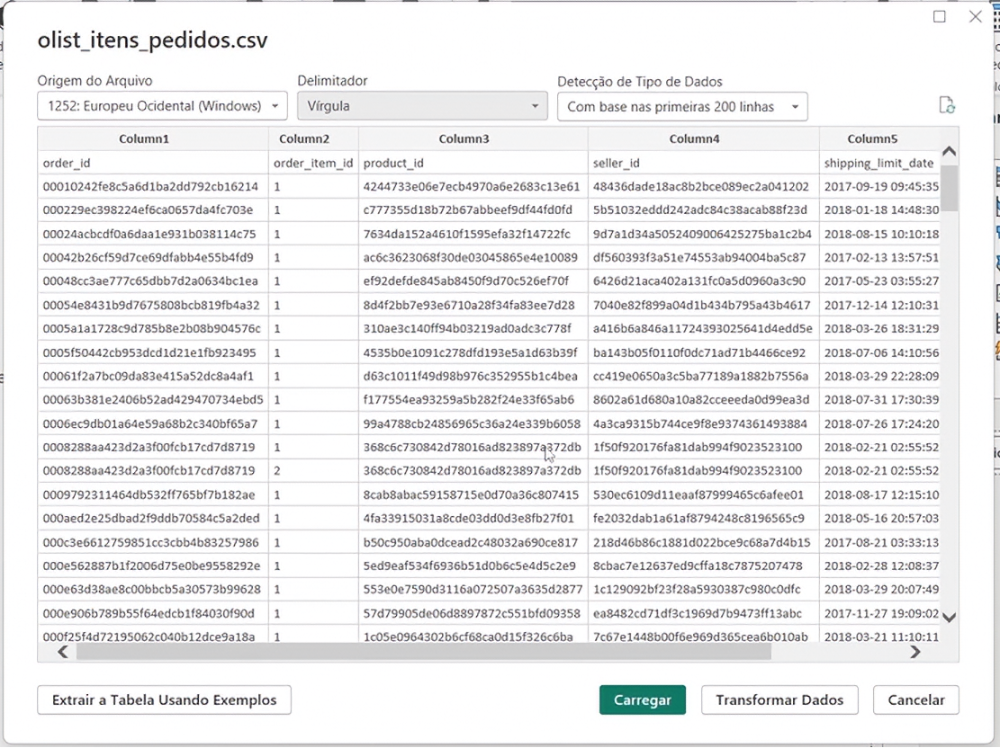
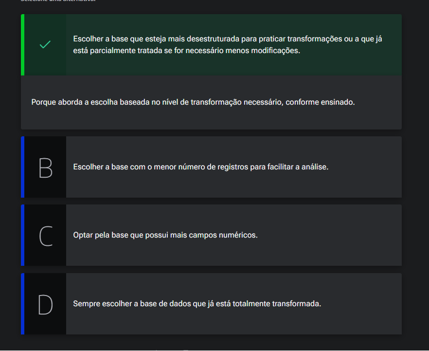
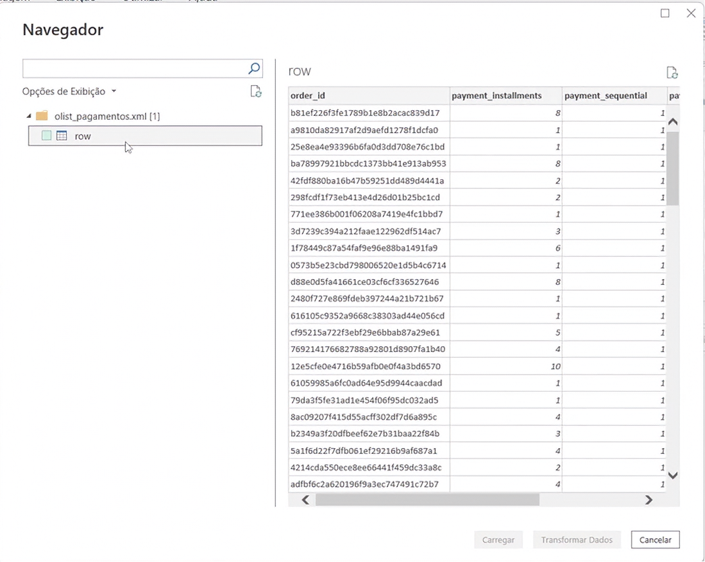
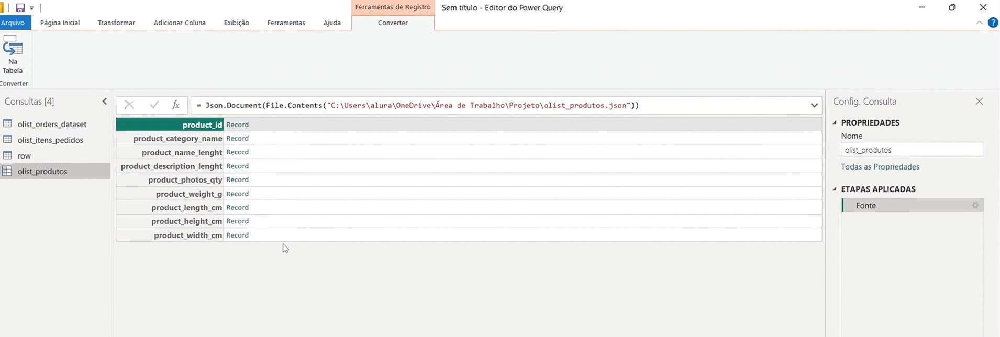
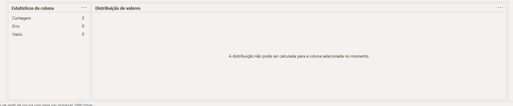

# Conectando os datasets

## Sumário
- [Conectando os datasets](#conectando-os-datasets)
  - [Sumário](#sumário)
  - [1. Apresentação](#1-apresentação)
  - [2. Para saber mais: conta gratuita indisponível](#2-para-saber-mais-conta-gratuita-indisponível)
  - [3. Preparando o ambiente: Power BI Desktop](#3-preparando-o-ambiente-power-bi-desktop)
  - [4. Conexão ao Excel e CSV](#4-conexão-ao-excel-e-csv)
  - [5. Avaliando a melhor base de dados](#5-avaliando-a-melhor-base-de-dados)
  - [6. Conexão ao XML e JSON](#6-conexão-ao-xml-e-json)
  - [7. Conhecendo o Power Query Editor](#7-conhecendo-o-power-query-editor)
  - [8. Mão na massa: explorando bases de dados da Olist](#8-mão-na-massa-explorando-bases-de-dados-da-olist)
  - [9. O que aprendemos?](#9-o-que-aprendemos)

## 1. Apresentação
No módulo do curso em questão iremos focar no processo de __ETL__ (Extração, Transformação e Carregamento) dos dados, e para realizarmos esse processo utilizaremos duas ferramentas, sendo o Power B.I e o Power Query.  
Então durante o curso veremos conceitos e maneiras de como:  
- __Importação__ de base de dados, onde iremos importar algumas bases de dados, utilizando diferentes formatos (Excel, CSV, XML E JSON), e veremos as particularidades de importação de cada tipo de arquivos. 
- __Conhecer o Power Query__  iremos entender de como essa ferramenta funciona 
- __Realizar Transformações__ aqui iremos aprofundar em práticas de transformações, onde iremos realizar de fato o tratamento necessário para que então possamos realizar  as __CARGAS__  
- Iremos abordar também um pouco sobre __Linguagem M__, de alguns recursos de transformações para que possamos realizar adições  colunas personalizadas. 
- Também abordaremos processo de como podemos visualizar e tratar melhor esses dados, para que possamos fazer as devidas transformações
- Ainda veremos práticas de como realizar a refatoração dos códigos, para que possamos realizar de forma mais prática e otimizada de realizar cargas.
- E por fim veremos conceitos de maneiras possíveis de modelagem de dados, utilizando formulas __DAX__ por exemplo.

[↑ Voltar ao topo](#topo)

---
## 2. Para saber mais: conta gratuita indisponível  
Durante a realização da formação de Power BI, você perceberá que alguns cursos utilizam o Power BI Serviço, a plataforma online onde é possível publicar relatórios e dashboard, além de compartilhar com outras pessoas.

No entanto, sabemos que muitos alunos e alunas estão enfrentando dificuldades para criar uma conta gratuita do Power BI. Isso está acontecendo porque, no momento, a Microsoft não está disponibilizando uma opção de criação de conta gratuita com tanta facilidade como antes, e o acesso ao Power BI Serviço está disponível apenas por meio de licenças pagas.

Apesar disso, não se preocupe, pois isso não afetará em nada nos seus estudos. Você ainda poderá concluir todos os cursos da formação, mesmo sem acesso ao Power BI Serviço. A única diferença é que você não conseguirá publicar os relatórios online, mas poderá fazer todo o projeto no Power BI Desktop, que é gratuito e fornece todas as funcionalidades necessárias durante a formação.

A Microsoft realiza atualizações com alta frequência, então isso pode mudar em breve. Se surgir uma nova maneira de criar uma conta gratuita, vamos comunicar a você. Por enquanto, você pode realizar os cursos da formação de Power BI sem empecilhos.

Em caso de dúvidas, entre em contato conosco pelo Discord da Alura ou pelo canal de atendimento ao estudante.

[↑ Voltar ao topo](#topo)

---
## 3. Preparando o ambiente: Power BI Desktop  
Neste curso, vamos aprender a construir um dashboard utilizando o [Power BI](https://www.microsoft.com/pt-br/power-platform/products/power-bi/). Para que possamos realizar as práticas do curso, precisamos instalar o Power BI Desktop e baixar os arquivos que serão utilizados.  
Abaixo, disponibilizo os materiais e passo a passo para fazermos isso.  

__Material do curso__
Durante o curso, iremos construir um dashboard utilizando uma base de dados contendo informações sobre um petshop. O material deste curso está disponível no [diretório de dados padrão do módulo](https://github.com/thierryLchaves/Santander-Imersao-Digital/blob/46e8db9e34f0eeb1ed62a6ccc230952768506b42/Analise_de_dados_e_IA_Nivelamento/Semana_07/Power_BI_Desktop_Construindo_meu_primeiro_dashboard/db).  

__Instalação do Power BI__  
- 1º Acesse a [página de download](https://www.microsoft.com/pt-br/power-platform/products/power-bi/downloads) do Power BI.
- 2º Na página de download, você encontrará diversas opções. Procure pela opção Microsoft Power BI Desktop e clique em Fazer download:
> <table style="text-align: center; width: 50%;"> 
> <tr>
> <td style="text-align: left;">
> 
> </td>
> </tr>
> </table>
- 3º Após essa ação, você será redirecionado para uma página em branco, onde será solicitada a abertura da loja da Microsoft. Clique em Abrir Microsoft Store:
> <table style="text-align: center; width: 100%;"> 
> <tr>
> <td style="text-align: left;">
> 
> </td>
> </tr>
> </table>
- 4º Com a página inicial do Power BI Desktop na loja da Microsoft aberta, você pode clicar em Instalar:
> <table style="text-align: center; width: 70%;"> 
> <tr>
> <td style="text-align: left;">
> 
> </td>
> </tr>
> </table>
- 5º Nessa etapa, é necessário aguardar a instalação ser finalizada. Após a instalação ser concluída, você pode clicar em Abrir:
> <table style="text-align: center; width: 70%;"> 
> <tr>
> <td style="text-align: left;">
> 
> </td>
> </tr>
> </table>

- 6º Pronto! Finalizamos a instalação do Power BI Desktop. Agora você já pode utilizá-lo e dar sequência às atividades do curso.

[↑ Voltar ao topo](#topo)

---
## 4. Conexão ao Excel e CSV

Antes de fato, iniciarmos o curso iremos primeiramente entender o conceito do projeto que será aplicado, ou seja do que se trata realmente o projeto que será estudado como aplicação no nosso repositório. 

Em nosso projeto temos como premissa atender uma demanda de uma solução online de compras, que irá nos disponibilizar 4 bases de dados, em diferentes modelos de arquivos sendo elas:  
- `.XLXS`
- `.CSV`
- `.JSON`
- `.XML`

Essas bases de dados distintas serão importadas para o Power B.I,  e realizaremos o processo de <a href="#ETL">ETL</a>  completo dentro e junto ao Power Query, esse é o ambiente responsável por realizar o carregamento desses dados, para que então consigamos chegar ao nosso objetivo final que é realizar a modelagem dos dados, deixando  eles passiveis de serem modelos utilizando fórmulas DAX por exemplo, para construir um relatório. 

---
Então iremos iniciar o processo de ETL, assim como começamos anteriormente na [aula anterior de Power B.I](https://github.com/thierryLchaves/Santander-Imersao-Digital/blob/0c47ac12284e797a7ce1b6b5792aaa7e723198ae/Analise_de_dados_e_IA_Nivelamento/Semana_07/Power_BI_Desktop_Construindo_meu_primeiro_dashboard/01_Conectando_os_dados/ConectandoOsDados.md), que será dentro do aplicativo do Power B.I Desktop, e na guia de Página Inicial iremos selecionar a opção de obter dados, e para esse projeto a primeira base de dados que iremos utilizar a opção de `Pasta de Trabalho do Excel`,  assim como visualizamos na aula supracitada, quando realizarmos a importação dos dados desse tipo de arquivo, será apresentado duas opções de dados, essas divergem um pouco no modelo de sua apresentação nos ícones, no primeiro apresentado quando visualizamos o primeiro arquivo, logo na sua pré-visualização, percebemos que a base de dados se apresenta de forma mais desestruturada, como por exemplo colunas ou linhas não formatadas, dados apresentados desestruturados etc.., como podemos visualizar na imagem abaixo:  
<table style="text-align: center; width: 100%;"> 
<tr>
    <td style="text-align: left;">
    
    </td>
</tr>
</table>

Já na segunda opção a pre-visualização muda sensivelmente, as colunas ficam mais estruturadas, com algumas opções prévias de transformação que são realizadas pelo próprio Power B.I, porém como esse módulo é focado especificamente no processo de ETL, iremos selecionar a primeira opção, e diferentemente do [módulo anterior](https://github.com/thierryLchaves/Santander-Imersao-Digital/blob/8e831e53d99e05751dae476ba46f265abe28c810/Analise_de_dados_e_IA_Nivelamento/Semana_07/Power_BI_Desktop_Construindo_meu_primeiro_dashboard), não iremos selecionar a opção de `Transformar Data`, e sim carregar.  
Iremos ainda nesse processo realizar a importação de outra base de dados, que no caso será a de CSV, e para esse tipo de arquivo iremos utilizar a opção de `Texto/CSV`, diferente da visualização de base de dados em `.XSLX`, a pré-visualização de arquivos em `.CSV` já apresenta sua pré-visualização de forma totalmente diferente do anterior, conforme demonstrado abaixo: 

<table style="text-align: center; width: 100%;"> 
<tr>
    <td style="text-align: left;">
    
    </td>
</tr>
</table>

Para além de não possuir a identificação de 2 bases, apresenta opções no menu superior de codificação do arquivo, delimitador de campos _(Usualmente em arquivos do tipo `CSV`,o delimitador do campo é feito pelo caractere de `,`)_, caso o delimitador selecionado não seja o presente no arquivo os dados serão comprimidos e apresentado em __somente 1 coluna__, por fim temos a opção de Detecção de tipo de dados, a opção padrão para tal campo vem como `Com base nas primeiras 200 linhas`, o Power B.I realiza a varredura das 200 primeiras linhas do arquivo e determina quais são os dados presentes naquela base. 
> PS: no processo de codificação do arquivo isso fora explicado anteriormente na aula citada de referência.   

Assim como realizamos anteriormente no arquivo de `.XLSX`, iremos apenas carregar os Dados,pois os tratamentos serão realizado posteriormente pelo editor do Power Query.  

    
O que é ETL?

    
É um processo fundamental de integração de dados que consiste em três etapas sequenciais para mover informações de múltiplos sistemas de origem para um repositório centralizado.

    <ul>
        <li><strong>E - Extração (Extract):</strong> A fase de coleta onde os dados brutos são capturados de fontes diversas (bancos de dados, planilhas, arquivos de texto ou APIs) e levados para uma área de transição (Staging Area).</li>
        <li><strong>T - Transformação (Transform):</strong> A etapa de limpeza e tratamento onde os dados são padronizados, validados e filtrados (remoção de duplicadas, conversão de tipos, junção de tabelas e aplicação de regras de negócio).</li>
        <li><strong>L - Carga (Load):</strong> A fase final onde os dados já estruturados e higienizados são gravados no destino definitivo (como um Data Warehouse ou tabelas analíticas) para consumo via BI.</li>
    </ul>

[↑ Voltar ao topo](#topo)

---
## 5. Avaliando a melhor base de dados  
Como escolher a base certa para importar no Power BI?

<table style="text-align: center; width: 100%;"> 
<tr>
    <td style="text-align: left;">
    
    </td>
</tr>
</table>

---
## 6. Conexão ao XML e JSON
Dando sequência nas importações dos dados, iremos importar a base em formato `.XML`, quando selecionado esse tipo de arquivo a pré-visualização desse dado será muito similar a importação de dados em `.XLSX`, com a diferença de que diferentemente da base de dados do Excel, não serão apresentados 2 opções para escolha de qual base será importada, e sim teremos apenas uma opção, devendo seleciona-la e escolher a opção de carregar.  

<table style="text-align: center; width: 100%;"> 
<tr>
    <td style="text-align: left;">
    
    </td>
</tr>
</table>

Agora o ultimo passo de importação dos dados será do arquivo em formato `.JSON`, quando selecionarmos esse tipo de arquivo sua apresentação será completamente diferente das vistas anteriormente, será apresentada uma nova janela, com um nome de __Editor do Power Query__, na base que será carregada sua pre-visualização também é representada de forma tabular, porém sua visualização diverge um pouco do que ja visualizamos. 

<table style="text-align: center; width: 100%;"> 
<tr>
    <td style="text-align: left;">
    
    </td>
</tr>
</table>

Assim como visualizado na imagem acima, os dados presentes nesse arquivo será apresentado com uma tabela de 2 colunas, onde a primeira conterá a lista de todos os atributos presentes no arquivo e a segunda coluna com os registros.  
Um ponto importante desse processo que realizamos e que deixamos o arquivo de `.JSON` por ultimo e que como esse arquivo exige um tipo de tratamento ele já irá abrir o editor do Power Query, e não irá permitir que os dados sejam simplesmente carregados sem o devido tratamento. 

[↑ Voltar ao topo](#topo)

---
## 7. Conhecendo o Power Query Editor
Aproveitando o fato da importação do `.Json`, foi realizada por ultimo e que esse processo abril o editor do Power Query, vamos explicar como funciona esse editor, na barra lateral esquerda, será apresentado todas as bases de dados que foram carregadas _(ou que fizemos a extração/conexão de alguma fonte)_, enquanto na parte central da tela teremos a exposição dos dados, ou sua visualização, e na barra lateral direita teremos a opções de consulta, onde através dessa aplicaremos certas etapas para que possamos realizar a transformação desses dados.  

---
Nessa mesma tela, temos algumas guias e seus menus, os quais citaremos abaixo as mais importantes, e seus respectivos botões com finalidades de utilização:  
- Página Inicial 
  -  Nova fonte: Através dessa opção podemos realizar novas conexões de dados
  -  Inserir dados: Através dessa opção podemos criar tabelas especificas, para dentro do Editor do Power Query
  -  Configurações da fonte de dados: Através dessa opção podemos visualizar/modificar os diretórios dessa conexões. 
  -  Atualizar a visualização: Através dessa opção o Power Query/ Power B.I, realiza a atualização dos dados presentes nas conexões. 

Iremos visualizar outras guias e colunas relevantes ao decorrer desse módulo, porém por hora é importante sabermos dessas e que existem nesse editor, guias focadas a alguns processos tais como transformação de dados que é realizada através da guia `Transformar`, `Adicionar coluna` que tem como objetivo realizar transformações especificas, mas a guia principal que será relatada nesse módulo é a guia de `Exibição`, através dessa guia temos algumas formas de exibição que são importante para darmos seguimento ao processo, uma deltas é a opção de `Barra de fórmulas`, que habilitara a linha de fórmulas escritas em __Linguagem M__, e para além dessa temos outra opção que é a `Qualidade da coluna` que somente é passível de seleção quando a base de dados estiver tabulada, essa opção também fora visualizada em outra [aula](https://github.com/thierryLchaves/Santander-Imersao-Digital/blob/8e831e53d99e05751dae476ba46f265abe28c810/Analise_de_dados_e_IA_Nivelamento/Semana_07/Power_BI_Desktop_Construindo_meu_primeiro_dashboard) presente no repositório, outra opção que podemos habilitar também e a de distribuição da coluna, através dessa opção será apresentado um gráfico que exibira um gráfico com informações tais como quantidade de valores distintos presentes na coluna, informações sobre exclusividade etc..., e por fim temos a opção de perfil da coluna, que quando habilitada será apresentada em uma barra inferior do dado informações mais detalhadas sobre cada coluna, conforme demonstra imagem abaixo:  

<table style="text-align: center; width: 100%;"> 
<tr>
    <td style="text-align: left;">
    
    </td>
</tr>
</table>

[↑ Voltar ao topo](#topo)

---
## 8. Mão na massa: explorando bases de dados da Olist  

A Olist é uma empresa que conecta lojistas aos maiores marketplaces do Brasil, proporcionando uma ampla base de dados que pode ser explorada para obter insights valiosos sobre o desempenho das vendas, comportamento do cliente e muito mais.

Vamos relembrar como importar e explorar quatro diferentes bases de dados utilizando o Power Query no Power BI.  
As bases de dados são as seguintes:

- Pedidos (xlsx): Contém informações sobre todos os pedidos realizados.
- Itens Pedidos (csv): Lista os itens específicos de cada pedido.
- Pagamentos (xml): Detalha os pagamentos realizados para cada pedido.
- Produtos (json): Fornece informações detalhadas sobre os produtos vendidos.
  - 1º Importação dos Dados
    - Importar Pedidos (xlsx)
    - Abra o Power BI e vá para a guia Página Inicial.
    - Clique em Obter Dados e selecione De Pasta de Trabalho.
    - Navegue até o arquivo de pedidos e selecione-o.
    - Selecione a planilha que contém os dados e clique em Carregar.
  - 2º Importar Itens Pedidos (csv)
    - Na guia Página Inicial, clique em Obter Dados e selecione Arquivo > Texto/CSV.
    - Navegue até o arquivo de itens pedidos e selecione-o.
    - Verifique as configurações de importação e clique em Carregar.
  - 3º Importar Pagamentos (xml)
    - Na guia Página Inicial, clique em Obter Dados e selecione Arquivo > XML.
    - Navegue até o arquivo de pagamentos e selecione-o.
    - Verifique a estrutura dos dados importados e clique em Carregar.
  - 4º Importar Produtos (json)
    - Na guia Página Inicial, clique em Obter Dados e selecione Arquivo > JSON.
    - Navegue até o arquivo de produtos e selecione-o.
    - Verifique a estrutura dos dados importados e clique em Carregar.

Através do Power Query, uma poderosa ferramenta de transformação e análise de dados, você será capaz de importar, limpar, e transformar esses dados, permitindo uma visão integrada e aprofundada sobre as operações da Olist. Aproveite para explorar cada base de dados importada e o ambiente do Power Query para se familiarizar.  

__Discussão e Reflexão__  
Após completar a atividade, reflita sobre as seguintes questões:
- Quais foram os principais desafios encontrados durante a importação dos dados?
- Como a integração de diferentes fontes de dados pode contribuir para uma análise mais robusta e detalhada?
- Quais insights valiosos você conseguiu obter a partir da exploração dos dados?

__Opinião do instrutor__  
A exploração de dados através do Power Query não apenas facilita a integração e análise de múltiplas fontes de dados, mas também permite a realização de análises mais complexas e ricas em detalhes. Desenvolver essas habilidades é fundamental para qualquer profissional que busca tomar decisões baseadas em dados de forma eficiente e informada.

Esse será o nosso foco a partir de agora neste projeto. Vamos lá!  

[↑ Voltar ao topo](#topo)

---
## 9. O que aprendemos?

Nessa aula, você aprendeu a:
- Introduzir o projeto que envolve atendimento de uma demanda da Olist, e a importação de quatro tipos de base de dados: xlsx, csv, xml e json.
- Explicar como importar uma base de dados Excel para o Power BI, identificando as opções disponíveis e selecionando a base correta.
- Detalhar o processo de importação de um arquivo CSV, incluindo a escolha do delimitador e a detecção automática do tipo de dados.
- Realizar a conexão com base de dados do tipo XML no Power BI, importando um arquivo com informações de pagamentos.
- Estabelecer a conexão com arquivos no formato JSON utilizando Power BI, importando um arquivo com informações sobre produtos.
- Explorar o editor do Power Query e sua estrutura de interface.
- Analisar a guia "Página Inicial" e suas funcionalidades.
- Utilizar a guia de exibição para ativar barras e ferramentas de análise.

---

<table align="center" style="border-collapse: collapse; margin-left: auto; margin-right: auto;"> 
  <caption><b>Skills do projeto</b></caption>
  <tr>
    <td style="padding: 5px;">
      
    </td>
    <td style="padding: 5px;">
      
    </td>
    <td style="padding: 5px;">
      
    </td>
  </tr>
</table>

---
__Titulo:__ Conectando os datasets
__Autor:__ Thierry Lucas Chaves  
__Data de Criação:__ 14-06-2026  
__Data de Modificação:__ 17-06-2026  
__Versão:__ "1.0"