# Power Query Editor

## Sumário
- [Power Query Editor](#power-query-editor)
  - [Sumário](#sumário)
  - [1. Projeto da aula anterior](#1-projeto-da-aula-anterior)
  - [2. Extraindo textos](#2-extraindo-textos)
  - [3. Mesclando consultas](#3-mesclando-consultas)
  - [4. Para saber mais: tipos de junção na mesclagem do Power BI](#4-para-saber-mais-tipos-de-junção-na-mesclagem-do-power-bi)
  - [5. Traduzindo colunas](#5-traduzindo-colunas)
  - [6. Possibilidades de transformações](#6-possibilidades-de-transformações)
  - [7. Para saber mais: tratamento de dados com linguagem M](#7-para-saber-mais-tratamento-de-dados-com-linguagem-m)
  - [8. Trabalhando com delimitadores](#8-trabalhando-com-delimitadores)
  - [9. Mão na massa: explorando a base com a coluna de exemplos](#9-mão-na-massa-explorando-a-base-com-a-coluna-de-exemplos)
  - [10. O que aprendemos?](#10-o-que-aprendemos)

## 1. Projeto da aula anterior

Caso prefira, você pode acessar o [projeto da aula 1](https://github.com/thierryLchaves/Santander-Imersao-Digital/blob/184f3613b2391ace6d1b4d46b148e44ccd1afc34/Analise_de_dados_e_IA_Nivelamento/Semana_07/Power_BI_Desktop_Realizando_ETL_no_Power_Query/src/Power%20Query%20-%20Aula%201.pbix) no ponto em que paramos na aula anterior.

---
## 2. Extraindo textos  
De posse de nossa fonte de dados, o primeiro arquivo a ser tratado será o de `XLSX`, que está nomeado como __olist_orders_dataset__, na imagem.  

<table style="text-align: center; width: 100%;"> 
<tr>
    <td style="text-align: left;">
    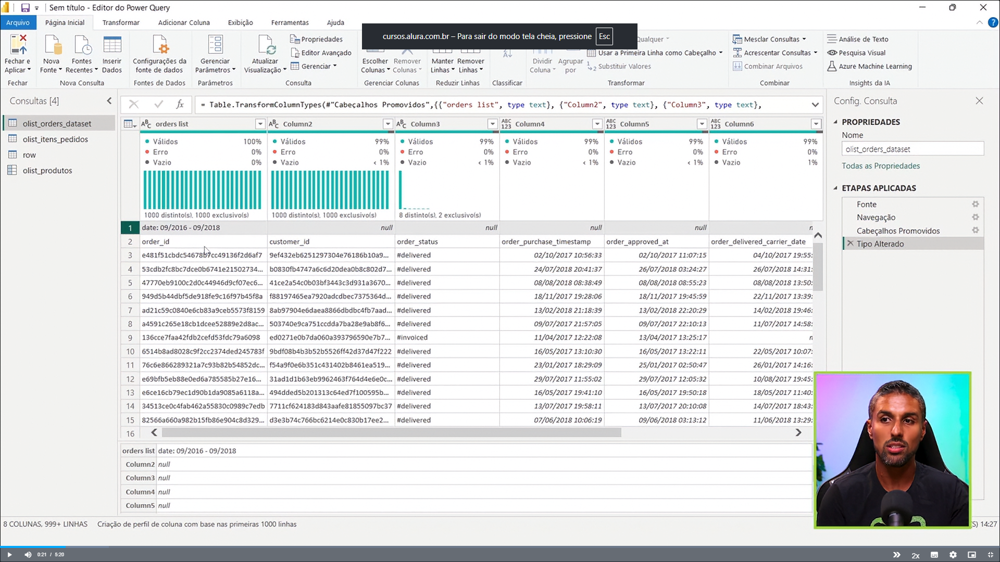
    </td>
</tr>
</table>

Para que possamos realizar o primeiro tratamento da fonte de dados dentro do Power Query, devemos dados informações desnecessárias, e o primeiro que podemos identificar, sem muita analise, se trata da primeira linha desse dataset, esse campo traz uma informação de temporalização geral do arquivo, porém como dentro do dataset, também temos campos de datas essa informação pode ser categorizada como _"desnecessária"_, para que possamos realizar a exclusão dessa informação, dentro do Power Query, existe um ícone de uma tabela, no canto superior esquerdo da tela ao lado das colunas, clicando sobre esse ícone temos uma serie de opções rápidas para alguns tratamentos, e uma delas que é a que utilizaremos será a de `Remover linhas superiores`, quando selecionado será exibido uma outra caixa para que possamos informar a número de linhas que serão removidas, no canto direito da tela teremos uma espécie de histórico sobre os processos de tratamento que vamos realizando no tratamento do dataset, com esse primeiro tratamento feito podemos realizar então a ação dentro desse mesmo menu de opções que é a opção de `Usar a primeira linha como Cabeçalho`, com essa ação o Power Query, realiza a edição do dataset e transforma a primeira linha como o nome das colunas, ou o cabeçalho dessa tabela.    
> PS: Um ponto sobre esse processo de remoção e promoção de linha a cabeçalho, é que quando realizamos esse processo o Power Query, irá anotar dentro da etapas 2 históricos, o primeiro sendo da ação propriamente dita, e a segunda será de "tipo alterado".  
---

O power query nos possibilita uma maneira de realizar o tratamento de um texto presente na base de dados, na tabela que estamos visualizando no momento podemos verificar que a coluna de status da compra consta com o <a id="#ref1">caractere de `#`</a>  antes do nome do status, para que possamos tratar esse texto de forma eficiente basta clicar sobre a guia de transformar, e acessar o agrupamento de menu, coluna de texto, nesse agrupamento temos a opção de extrair, essa opção de extração nos da diversas maneiras de realizar essa extração, a que utilizaremos será a opção de extração de texto após o delimitador, e que para o nosso caso é o caractere de `#`, quando clicarmos em OK, essa informação será removida, e podemos consultar se tal transformação foi realizada, através  do menu expansível presente em cada coluna, onde é possível consultar as informações ali contidas da coluna selecionada conforme demonstrar imagem abaixo:  

<table style="text-align: center; width: 100%;"> 
<tr>
    <td style="text-align: left;">
    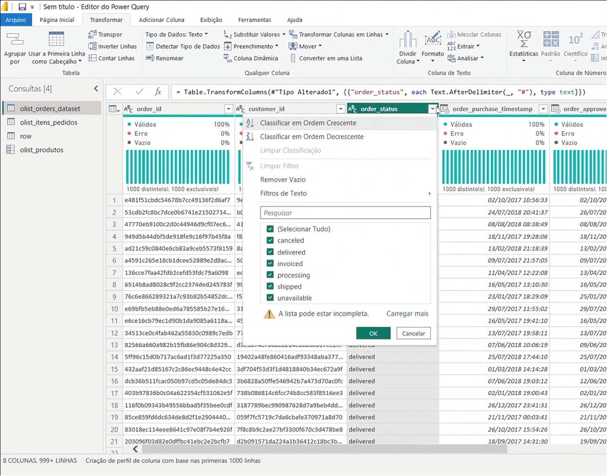
    </td>
</tr>
</table>

[↑ Voltar ao topo](#topo)

---
## 3. Mesclando consultas
Como podemos notar no tópico anterior estamos realizando o tratamento dentro de uma base em que algumas informações estão em língua inglesa, porém o Power Query, nos possibilita o processo de tradução de informações, para que possamos realizar essa tradução iremos importar mais um arquivo para nosso projeto, esse processo é necessário e será aplicado dentro da nossa tabela de estudo que será a orders, o arquivo que importamos realiza uma especie de __`DE/PAR`__, do inglês para o português, e para aplicar essa tradução com base nesse arquivo recém importado iremos retorna a nossa tabela anterior, e acessar dentro da guia de Página Inicial a opção de mesclar consultas _(presente no agrupamento de menu COMBINAR)_, quando selecioando tal opção será apresentado a seguinte tela:  
<table style="text-align: center; width: 100%;"> 
<tr>
    <td style="text-align: left;">
    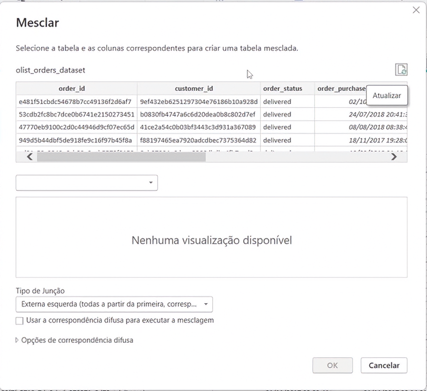
    </td>
</tr>
</table>

Nessa tela teremos na parte superior a tabela que está sendo tratada, e na segunda será necessário a seleção de qual fonte ou qual base iremos mesclar para nosso exemplo será a base de dados de tradução, e para que possamos fazer o match dessas informações devemos selecionar as colunas correspondentes que no caso será a coluna de order_stutus da tabela de pedidos, e a coluna inglês da fonte de tradução, quando for realizado a conferência das informações entre uma tabela e outra o Power Query, ira nos devolver a seguinte tela

<table style="text-align: center; width: 100%;"> 
<tr>
    <td style="text-align: left;">
    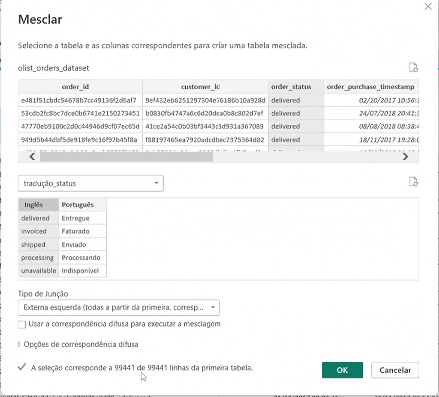
    </td>
</tr>
</table>

Nessa tela temos o campo de tipo de junção que nos possibilita alguns tipos de mesclagem que veremos adiante, porém para o caso em questão utilizaremos a opção de externa a esquerda, quando finalizado o processo seremos redirecionado ao Power Query, onde esse processo irá criar uma nova coluna, porém nessa coluna recém criada, não virá com traduções já de cara, e sim uma informação de com o descrito de `table`, pois quando esse processo e aplicado, o Power query realiza a consulta ou a seleção correspondente da coluna alvo com a tabela destino, e isso pode ser notado quando selecionarmos qualquer uma dessa informações, será apresentado no menu inferior do Power query, qual a linha encontrada.  
E para que possamos realizar uma extração desses dados para obtermos o resultado do nome do status em português selecionaremos essa coluna, e clicaremos novamente sobre a seta de expansão de menu:  

<table style="text-align: center; width: 50%;"> 
<tr>
    <td style="text-align: left;">
    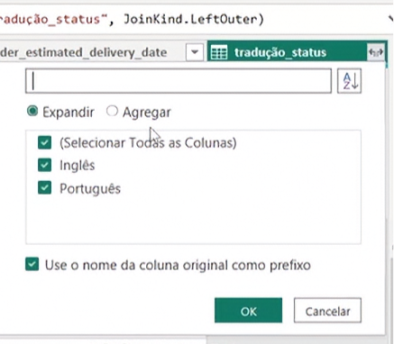
    </td>
</tr>
</table>

Esse menu nos possibilita 2 opções para o tratamento desse dado, sendo a opção de `Expandir` que é que selecionaremos, ou de `Agregar` que é utilizada quando queremos alguma outra funcionalidade dentro dessa coluna, por exemplo a inserção de alguma operação aritmética. Para concluir o processo basta selecionarmos apenas a coluna _Português_, presente no menu e clicar em ok, e desmarcar a opção de use o nome da coluna original como prefixo, pois quando marcamos essa opção o nome da coluna será algo como __tradução_status_Português__, que não é o que desejamos.

[↑ Voltar ao topo](#topo)

---
## 4. Para saber mais: tipos de junção na mesclagem do Power BI
No Power BI, uma das principais funcionalidades é a capacidade de mesclar dados de diferentes fontes em um único conjunto de dados para análise. Essa mesclagem é possível graças ao recurso de junções, que permite combinar informações com base em critérios específicos. Existem diferentes tipos de junções disponíveis no Power BI, cada uma com suas características e finalidades. Neste texto, vamos conhecer os tipos de junções mais comuns utilizados na mesclagem de dados no Power BI.    

<table style="text-align: center; width: 100%;"> 
<tr>
    <td style="text-align: center;">
    
    </td>
</tr>
</table>

- Esquerda Externa (Left Outer Join): Retorna todas as linhas da tabela esquerda e as linhas correspondentes da tabela direita com base em um critério de correspondência dos relacionamentos entre chaves primárias e estrangeiras das tabelas. Se não houver correspondência na tabela direita, os valores serão preenchidos com nulos.

- Direita Externa (Right Outer Join): Retorna todas as linhas da tabela direita e as linhas correspondentes da tabela esquerda com base em um critério de correspondência. Se não houver correspondência na tabela esquerda, os valores serão preenchidos com nulos.

- Completa Externa (Full Outer Join): Retorna todas as linhas das duas tabelas, combinando registros com base em um critério de correspondência. Se não houver correspondência em uma das tabelas, os valores correspondentes serão preenchidos com nulos.

- Interna (Inner Join): Retorna apenas as linhas correspondentes das duas tabelas com base em um critério de correspondência. As linhas não correspondentes são excluídas do resultado final da mesclagem.

- Anti Esquerda (Left Anti Join): Retorna apenas as linhas da tabela esquerda que não possuem correspondência com base em um critério de correspondência. As linhas correspondentes da tabela direita são excluídas do resultado.

- Anti Direita (Right Anti Join): Retorna apenas as linhas da tabela direita que não possuem correspondência com base em um critério de correspondência. As linhas correspondentes da tabela esquerda são excluídas do resultado.  

Esses tipos de junções de mesclagem no Power BI são extremamente úteis para combinar e analisar dados de diferentes fontes, permitindo obter insights valiosos e tomar decisões informadas.

Caso tenha interesse em complementar seus estudos sobre mesclagem, recomendo a leitura do artigo [Power BI: Mesclando consultas no Power Query](https://www.alura.com.br/artigos/power-bi-mesclando-consultas-no-power-query), que explica os tipos de mesclagem e o comportamento de cada um deles, além de pontuar como a mesclagem pode ajudar a reduzir o tempo de carregamento dos dados e evitar relacionamentos desnecessários.

[↑ Voltar ao topo](#topo)

---
## 5. Traduzindo colunas
Em um sistema de reservas de hotéis, é necessário traduzir os status das reservas para diferentes idiomas. Utilize o método de mesclagem aprendido para combinar duas tabelas: uma contendo as reservas e outra contendo as traduções dos status. Como você mesclaria as tabelas de reservas e traduções para garantir que cada status de reserva seja traduzido corretamente?  
<table style="text-align: center; width: 100%;"> 
<tr>
    <td style="text-align: left;">
    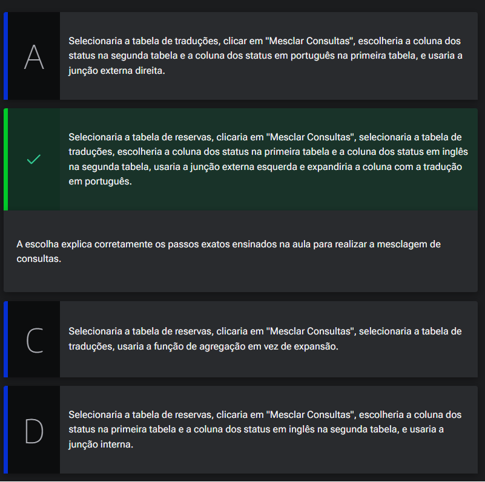
    </td>
</tr>
</table>

[↑ Voltar ao topo](#topo)

---
## 6. Possibilidades de transformações
Para o proximo passo do projeto iremos trabalhar agora com o arquivo de pagamentos, que está denominado em nossa base como row _(correspondente ao nosso arquivo `xml` importado anteriormente)_, dentro dessa base de dados também possuímos um campo com o caractere de `#`, no caso dessa informação poderíamos aplicar o mesmo tratamento que visualizamos no [tópico anterior](##ref1), porém para esse caso aplicaremos outra opção para esse tratamento, primeiro iremos selecionar a coluna de tipo de pagamento o `payment_type`, e sobre o nome da coluna com opção de mouse lado direito iremos escolher a opção de `REMOVER DUPLICADAS`, essa opção irá aplicar a remoção de todas as informações que estão repetidas da coluna em questão, deixando somente um valor único para cada preenchimento, pós esse processo iremos então clicar sobre o campo desejado e com a opção de mouse lado direito `Substituir valores...`, com a escolha dessa opção seremos redirecionados a tela abaixo:  
<table style="text-align: center; width: 50%;"> 
<tr>
    <td style="text-align: left;">
    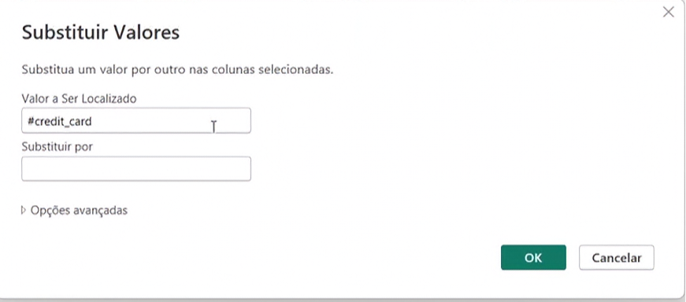
    </td>
</tr>
</table>

A _"vantagem"_ dessa opção e que podemos ao mesmo tempo que realizamos a remoção do caractere indesejado, e que podemos já traduzir a informação, a desvantagem é que temos que realizar esse mesmo processo várias vezes um para cada valor que desejamos substituir, porém como o Power Query nos possibilita verificar as etapas dos tratamentos que foram realizadas em determinada base, temos o histórico de cada informação que foi modificada aplicada etc, com esse histórico temos a possibilidade de remover uma etapa, 
<table style="text-align: center; width: 100%;"> 
<tr>
    <td style="text-align: left;">
    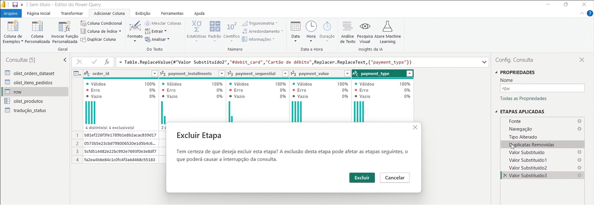
    </td>
</tr>
</table>

Com isso o power query, irá retornar com todas as informações, porém com os dados já devidamente tratados.

----
Ainda temos outra possibilidade de tratamento para essa situação, para isso iremos acessar a guia de Adicionar dados, e dentro do agrupamento Geral, iremos selecionar a opção de Coluna de exemplos.   
Quando selecionado tal opção o Power Query, irá apresentar uma nova tela, onde nessa tela teremos todas as colunas já existentes na base, com a adição de uma nova coluna que aplicara um tratamento com base nas colunas que estamos passando para ela.
Para exemplificar melhor o que foi dito acima, vamos a imagem:   

<table style="text-align: center; width: 50%;"> 
<tr>
    <td style="text-align: left;">
    
    </td>
</tr>
</table>

A imagem acima exemplifica bem a utilização dessa opção, com base na coluna ou no intervalo de colunas que selecionarmos, o Power Query, irá identificar a correspondência do valor selecionado para substituição e aplicar para os valores correspondentes, ou seja ele irá identificar todas as linhas que tem com o valor preenchimento de `#credit_card` e visualiza que será substituído por cartão de crédito, e para `#boleto` boleto, agora podemos aplicar as demais informações para cada linha desejado, podemos aplicar a opção de remover duplicada antes de aplicar a opção de coluna de exemplos, quando realizarmos novamente o processo de Coluna de exemplos basta substituir os nomes e ainda nessa tela podemos já realizar o processo de renomear a coluna, a principal _"vantagem"_ desse processo é que na tela de etapas aplicadas, será apresentado somente __1 (uma)__ etapa de modificação.  

[↑ Voltar ao topo](#topo)

---
## 7. Para saber mais: tratamento de dados com linguagem M  
No vídeo tópico, verificamos como realizar o tratamento da coluna de Tipo de pagamentos através de uma Coluna de Exemplo, em que removemos as duplicatas, inserimos os valores desejados e voltamos com os valores duplicados novamente.

Caso desejemos realizar esse processo sem remover as duplicatas, podemos realizar esse tratamento através da `linguagem M`. A `linguagem M` é uma linguagem de programação usada no Power BI para realizar transformações e manipulações de dados no processo de preparação de dados. Ela permite às pessoas usuárias escrever instruções sequenciais para filtrar, agrupar, unir tabelas e executar outras operações de transformação de dados. A `linguagem M` facilita a criação de processos automatizados e consistentes para preparar dados para análise no Power BI.

Para realizar essas alterações usando a `linguagem M`, vamos utilizar o próprio código gerado ao criar a coluna Pagamento tratado. Vamos copiar o código da caixa de texto acima da coluna criada, expandindo essa caixa clicando na seta à direita do campo. O código que vamos copiar será a partir do comando “each” até o “null”, que está marcado em azul:  

<table style="text-align: center; width: 100%;"> 
<tr>
    <td style="text-align: left;">
    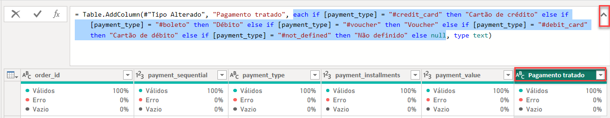
    </td>
</tr>
</table>

Agora, vamos criar uma coluna personalizada, acessando o botão no canto superior direito, na aba de Adicionar coluna:  

<table style="text-align: center; width: 50%;"> 
<tr>
    <td style="text-align: left;">
    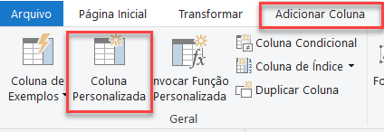
    </td>
</tr>
</table>

Ao clicar no botão, uma janela será aberta, onde poderemos modificar o nome da coluna e adicionar o código que copiamos:
<table style="text-align: center; width: 100%;"> 
<tr>
    <td style="text-align: left;">
    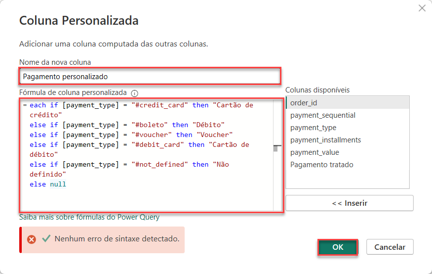
    </td>
</tr>
</table>

Após adicionarmos o código, basta clicarmos em OK e a nova coluna será exibida:
<table style="text-align: center; width: 100%;"> 
<tr>
    <td style="text-align: left;">
    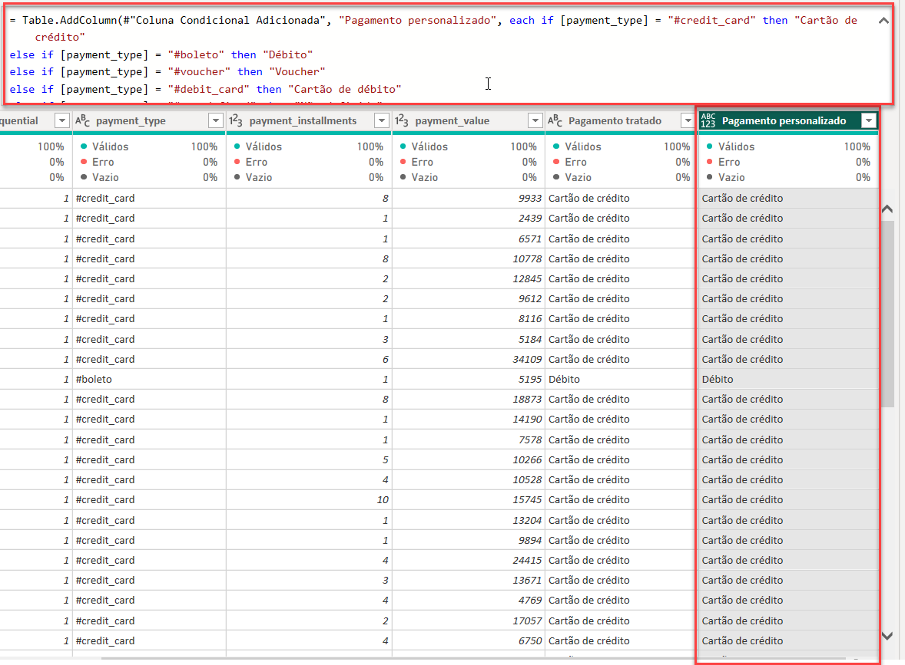
    </td>
</tr>
</table>

Com isso, temos mais uma opção para trabalharmos o tratamento da coluna de pagamentos, através da linguagem M.  
Caso você deseje se aprofundar no estudo dessa linguagem, recomendo que você faça o curso [Power BI: mergulhando na linguagem M](https://cursos.alura.com.br/course/power-bi-mergulhando-linguagem-m), onde você vai entender o que é a linguagem M, a sua importância, e vai conhecer os fundamentos da linguagem. No curso, você aprende como utilizar a linguagem M para manipular dados, consumir uma API, trabalhar com APIs paginadas e lidar com erros.  

[↑ Voltar ao topo](#topo)

---
## 8. Trabalhando com delimitadores
Ao analisar sentimentos, você recebe hashtags nos seus dados. Você precisa remover o símbolo de hashtag (#) para padronizar as entradas do dataset. Como você faria isso no Power BI?

<table style="text-align: center; width: 100%;"> 
<tr>
    <td style="text-align: left;">
    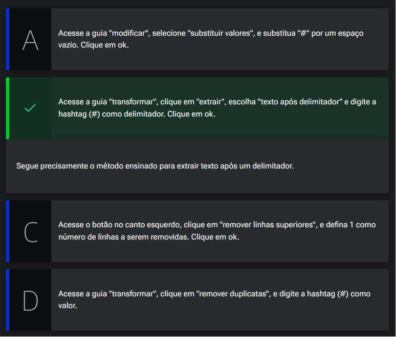
    </td>
</tr>
</table>

[↑ Voltar ao topo](#topo)

---
## 9. Mão na massa: explorando a base com a coluna de exemplos  
O Power Query no Power BI é uma ferramenta poderosa para a preparação e transformação de dados. Uma de suas funcionalidades mais úteis é a Coluna de Exemplos, que permite criar novas colunas com base em exemplos que você fornece. Isso torna o processo de transformação de dados mais intuitivo e acessível, mesmo para quem não tem experiência avançada em programação ou manipulação de dados.  

<table style="text-align: center; width: 100%;"> 
<tr>
    <td style="text-align: left;">
    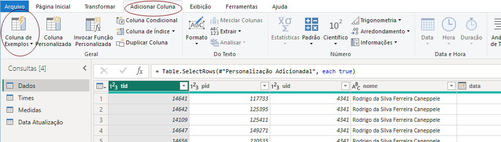
    </td>
</tr>
</table>

Sendo assim, você fornece exemplos e o Power BI deduz automaticamente a lógica para preencher o restante da coluna. Isso significa que você não precisa escrever fórmulas complexas manualmente — basta mostrar como o resultado esperado deve ser.  

__Agora é sua vez__  
A base de dados de pagamentos que estamos utilizando no curso possui as seguintes colunas:
- `order_id`: ID do pedido;
- `payment_installments`: número total de parcelas em que o pagamento foi dividido;
- `payment_sequential`: quantidade de parcela está sendo pago;
- `payment_value`: valores;
- `payment_type`: tipo do pagamento.

Para analisar melhor os dados de pagamentos, utilizando a funcionalidade da Coluna de Exemplos, você deverá criar a seguintes colunas:

- 1º Coluna que mostra o valor total pago por pedido;
- 2º Coluna que indica o valor restante a ser pago;
- 3º Coluna que calcula a média do valor das parcelas para cada pedido.

__Opinião do instrutor__  

__Coluna que mostra o valor total pago por pedido.__

- Abra o Power Query com as suas tabelas, igual vimos o instrutor fazendo em aula.

- Vá à guia Adicionar Coluna e clique em Coluna de Exemplos na faixa de opções.

- Desmarque as colunas deixando apenas a payment_installments, payment_value e order_id. Pois vamos multiplicar o valor de payment_installments por payment_value.

- Na coluna, digite o resultado da multiplicação dos campos payment_installments e payment_value, ou seja, 99x8 que é 792 aperte Enter.

- Para checar se ele entendeu a lógica, cheque os valores de outras linhas que a multiplicação não seja por 1.

- Clique em OK.

- Agora vamos nomear a coluna dando duplo clique sobre o título e mudando conforme você deseja.

<table style="text-align: center; width: 100%;"> 
<tr>
    <td style="text-align: left;">
    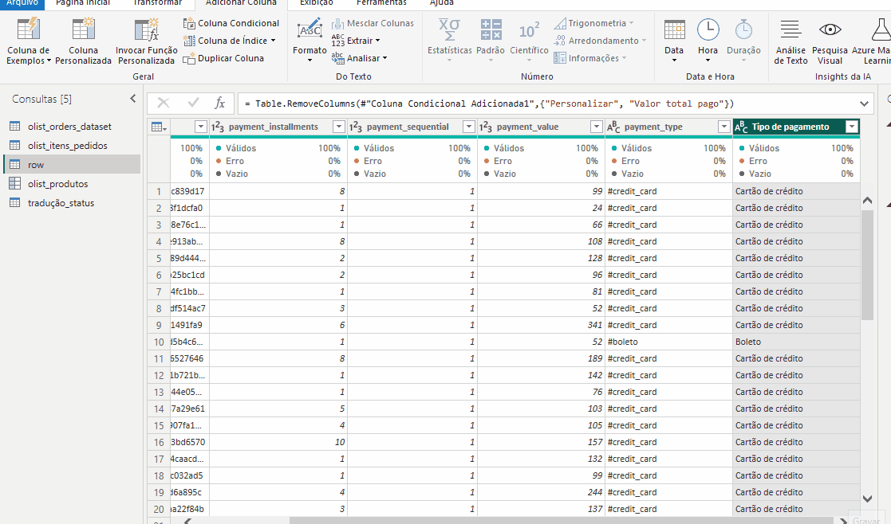
    </td>
</tr>
</table>

__Coluna que indica o valor restante a ser pago__  
- Abra o Power Query e seleciona as colunas payment_totale payment_value.
- Vá à guia Adicionar Coluna e clique em Coluna de Exemplos na faixa de opções.
- Na coluna, digite o resultado da subtração dos campos payment_total e payment_value, ou seja, 792-99 que é 693 aperte Enter.
- Para checar se ele entendeu a lógica, cheque os valores de outras linhas que a subtração não seja por 1.
- Clique em OK.
- Renomeie a coluna como desejar.  
<table style="text-align: center; width: 100%;"> 
<tr>
    <td style="text-align: left;">
    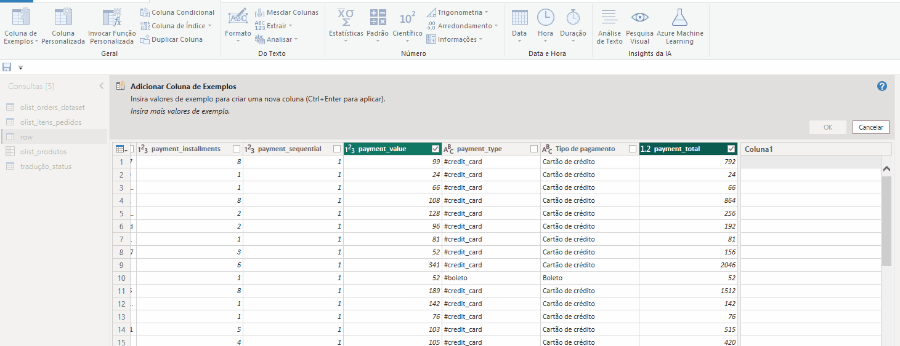
    </td>
</tr>
</table>

__Coluna que calcula a média do valor das parcelas para cada pedido.__  

Aqui, vamos criar uma coluna que calcula a média do valor das parcelas para cada pedido, baseando nas colunas payment_value e payment_sequential.

- Abra o seu projeto no Power Query.
- Selecione a coluna payment_sequential e payment_value.
- Na guia Adicionar Coluna, clique na opção Coluna de Exemplos.
- Na Coluna1, digite o resultado da divisão dos campos payment_sequential e payment_value que é 99 e aperte Enter.
- Repita o processo na linha onde a divisão será 45/2 que é igual a 22,5, a partir daqui o Power Query entenderá que você deseja o resultado da divisão das duas colunas.
- Feito isso, clique em OK que está na mensagem que surgiu anteriormente para inserir os valores conforma a lógico que você passou para o Power Query.
- Edite o nome de Divisão da coluna para o que desejar.
<table style="text-align: center; width: 100%;"> 
<tr>
    <td style="text-align: left;">
    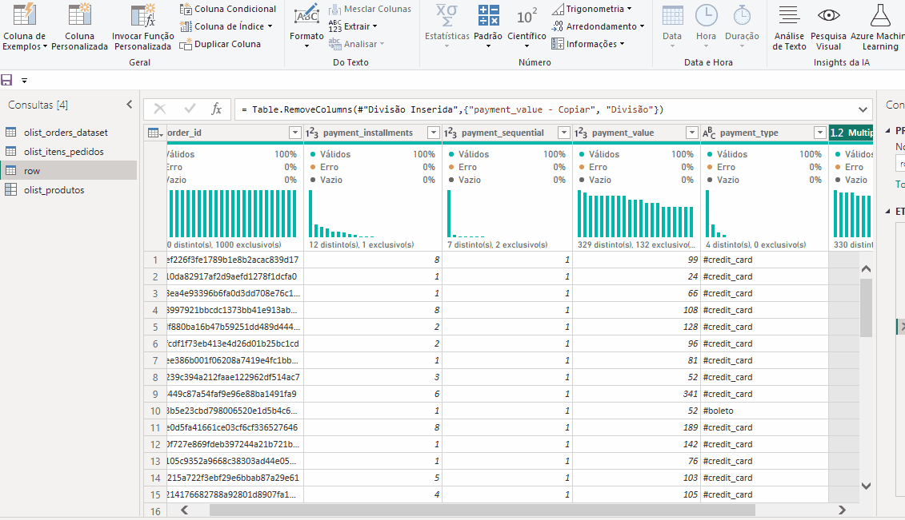
    </td>
</tr>
</table>

__Conclusão__  
Durante esse processo, sempre verifique se as novas colunas foram geradas corretamente e se os valores fazem sentido, corrigindo quaisquer erros, ajustando os exemplos fornecidos ou refinando as transformações sugeridas pelo Power Query. Explorar o potencial da ferramenta nos traz muitas vantagens e nessa atividade, vimos como é possível criar colunas derivadas que adicionam profundidade e insights à nossa análise de dados de pagamentos. Isso não só melhora a precisão das análises, mas também economiza tempo e esforço ao automatizar processos complexos. Em última análise, a Coluna de Exemplos capacita os usuários a extrair valor significativo de seus dados, suportando decisões mais informadas e estratégias de negócios mais eficazes.

[↑ Voltar ao topo](#topo)

---
## 10. O que aprendemos?
Nessa aula, você aprendeu a:
- Remover linhas específicas em bases de dados utilizando a função "Remover linhas superiores" no Power Query do Power BI.
- Promover uma linha existente como cabeçalho de tabela usando a opção "Usar primeira linha como cabeçalho".
- Extrair texto a partir de um delimitador específico em colunas, utilizando a função "Extrair texto após o delimitador".
- Mesclar consultas para correlacionar e traduzir informações entre tabelas.
- Conhecer a ferramenta "Substituir Valores", que permite a substituição direta de termos na coluna "Payment Type".
- Manipular etapas aplicadas no Power Query para restaurar registros completos após a substituição.
- Experimentar a criação de uma "Coluna de Exemplos", que usa a inteligência do Power Query para substituir valores de forma automática baseada em exemplos fornecidos.
- Usar "Coluna de Exemplos" para criar uma nova coluna com valores traduzidos, renomear a nova coluna e remover duplicatas em uma etapa simplificada.
- Explorar a ferramenta "Coluna Personalizada" como um recurso adicional para exploração futura.

---

<table align="center" style="border-collapse: collapse; margin-left: auto; margin-right: auto;"> 
  <caption><b>Skills do projeto</b></caption>
  <tr>
    <td style="padding: 5px;">
      
    </td>
    <td style="padding: 5px;">
      
    </td>
  </tr>
</table>

---
__Titulo:__ Power Query Editor
__Autor:__ Thierry Lucas Chaves  
__Data de Criação:__ 14-06-2026  
__Data de Modificação:__ 18-06-2026  
__Versão:__ "1.0"