# Avançando nas transformações

## Sumário
- [Avançando nas transformações](#avançando-nas-transformações)
  - [Sumário](#sumário)
  - [1. Projeto da aula anterior](#1-projeto-da-aula-anterior)
  - [2. Transposição de tabela](#2-transposição-de-tabela)
  - [3. Gerenciando parâmetros](#3-gerenciando-parâmetros)
  - [4. Para saber mais: parâmetros](#4-para-saber-mais-parâmetros)
  - [5. Organizando diretórios](#5-organizando-diretórios)
  - [6. Tipos dos dados](#6-tipos-dos-dados)
  - [7. Evitando problemas futuros](#7-evitando-problemas-futuros)
  - [8. Faça como eu fiz: inserindo parâmetros](#8-faça-como-eu-fiz-inserindo-parâmetros)
  - [9. O que aprendemos?](#9-o-que-aprendemos)

## 1. Projeto da aula anterior
Caso prefira, você pode acessar o [projeto da aula 1](https://github.com/thierryLchaves/Santander-Imersao-Digital/blob/184f3613b2391ace6d1b4d46b148e44ccd1afc34/Analise_de_dados_e_IA_Nivelamento/Semana_07/Power_BI_Desktop_Realizando_ETL_no_Power_Query/src/Power%20Query%20-%20Aula%201.pbix) no ponto em que paramos na aula anterior.  

[↑ Voltar ao topo](#topo)

---
## 2. Transposição de tabela
Agora nesse tópico iremos aprender maneiras de tratamento sobre base de dados em `.JSON`, em nosso projeto estamos trabalhando com a tabela nomeada de __olist_produtos__, como havíamos visualizado anteriormente, as bases de dados nesse formato possuem um modelo diferente tanto no arquivo em sí como em sua tabela. 
Quando clicamos sobre algum registro da tabela, visualizaremos no menu inferior as informações sobre cada coluna identificada conforme imagem abaixo:  

<table style="text-align: center; width: 100%;"> 
<tr>
    <td style="text-align: left;">
    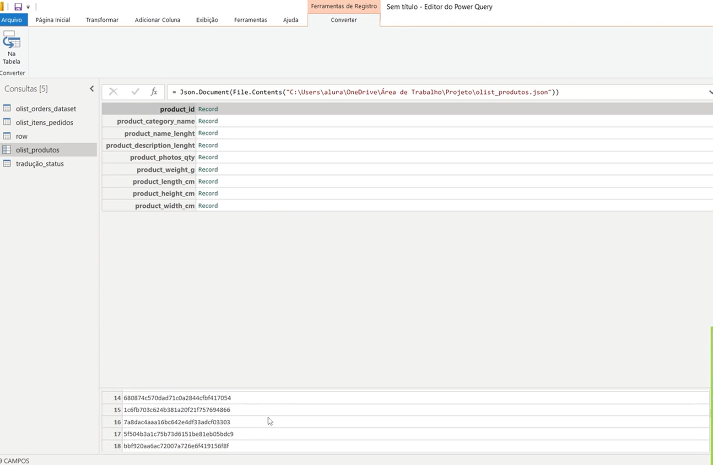
    </td>
</tr>
</table>

Devido a essa estruturação da tabela, o Power Query identifica esse tipo de estrutura e habilita uma nova guia, com a opção de converter, dentro dessa guia teremos o botão de __`Na tabela`__, quando realizamos essa conversão o Power query ira criar uma nova tabela com duas colunas como name e value, onde nessa primeira coluna, teremos o equivalente aos nomes existentes da tabela, e na segunda coluna os registro referentes daquela coluna, porém isso não é o suficiente para que possamos de fato utilizar esse arquivo como um base de dados válida para o Power B.I, dentro da coluna `Value`  temos um botão de expansão, quando clicamos sobre esse botão teremos um número correspondente de registros basta clicar sobre ok para realizar essa expansão:  

<table style="text-align: center; width: 100%;"> 
<tr>
    <td style="text-align: left;">
    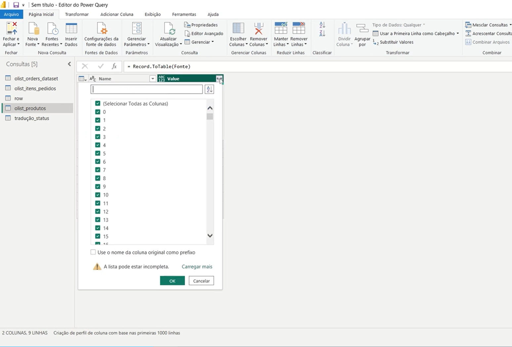
    </td>
</tr>
</table>

Quando o processo de expansão é terminado teremos uma nova tabela, conforme imagem:  

<table style="text-align: center; width: 100%;"> 
<tr>
    <td style="text-align: left;">
    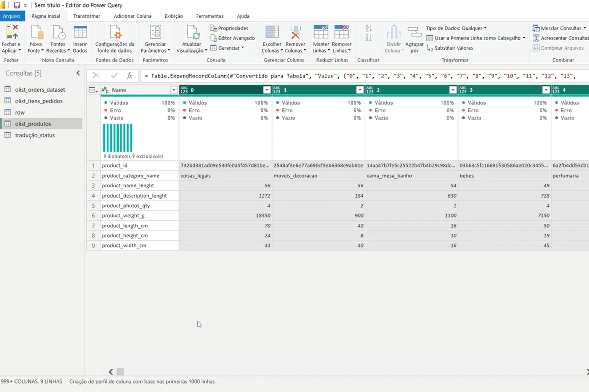
    </td>
</tr>
</table>

porém com esse processo as informações que estavam presentes nos registro nomeados de record ou tabele, porém transposta,na pratica o que ocorreu foi que ao invés das informações crescerem na vertical cresceram horizontal. Por conseguinte o que devemos fazer e o processo de transpor linha para coluna, esse processo de ocorrer selecionaremos toda a base, isso é possível de feito com o atalho de teclado `CTRL + SHIFT + A`, acessar a guia de transformar e escolher a opção de transpor, com esses passo ai sim teremos uma base de dados em formato tabular.
Dado isso iremos realizar o processo de tratamento com algumas das funcionalidades que já vimos antes, como por exemplo promover a primeira linha a coluna extrair algum caractere indesejado etc...  
Nessa base temos uma coluna nomeada de `product_category_name` na qual contém o carácter de `_` entre as palavras, as maneiras que visualizamos em outros módulos aprendemos forma de extração de texto, substituição de texto por exemplo, porém nesse caso teremos que aplicar um processo de extrair determinado simbolo entre textos.  
Esse processo pode ser feito de maneira simples, onde dentro da guia de transformar , temos a opção de substituir valores, essa opção iremos informar qual valor a ser localizado, e qual será substituído:
<table style="text-align: center; width: 100%;"> 
<tr>
    <td style="text-align: left;">
    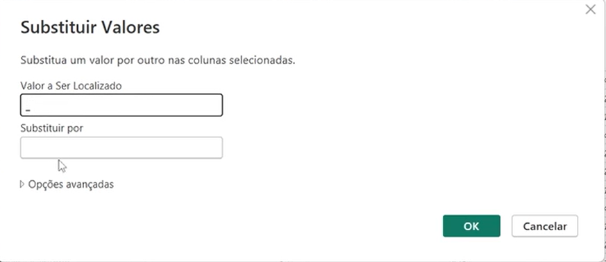
    </td>
</tr>
</table>

Essa parte de substituição não necessita que seja uma sentença como um todo, pode ser apenas um carácter conforme o exemplo da imagem. Um outro tratamento que podemos fazer é para deixar por exemplo a primeira letra da frase em maiúsculo, esse processo pode ser realizado clicando com o botão direito sobre a coluna a opção transformar, e uma que iremos escolher é `Colocar cada palavra em maiúscula`
> PS: É importante que cada uma dessas transformações citadas nas colunas  é importante que seja realizada com a coluna selecionada.

[↑ Voltar ao topo](#topo)

---
## 3. Gerenciando parâmetros
Existe um ponto muito importante sobre as fontes de dados, quando por exemplo compartilhamos o arquivo da maneira que está os arquivos de fontes ou seja nossas bases de dados terão o apontamento sobre a os arquivos existentes da máquina de origem, podemos notar isso no exemplo abaixo:  
<table style="text-align: center; width: 100%;"> 
<tr>
    <td style="text-align: left;">
    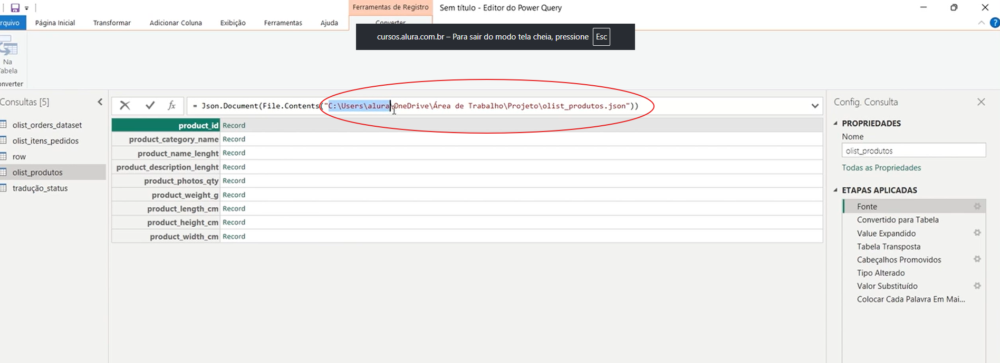
    </td>
</tr>
</table>

o problema é que nem sempre esse diretório será compartilhado ou outros usuários teriam acesso a esses arquivos, ou seja se compartilhamos esses arquivos com outras pessoas, essa pessoa teria que acessar cada uma dessas fontes de dados e atualizar essa fonte. Porém existe uma maneira que realiza essa conexão de forma otimizada e mais segura, essa opção está disponível dentro do Power B.I, na opção de `Gerenciar Parâmetros`. Essa opção está disponível dentro da Pagina Inicial no  editor do Power Query. 
Quando selecionado teremos uma nova tela conforme imagem de exemplo:  
<table style="text-align: center; width: 100%;"> 
<tr>
    <td style="text-align: left;">
    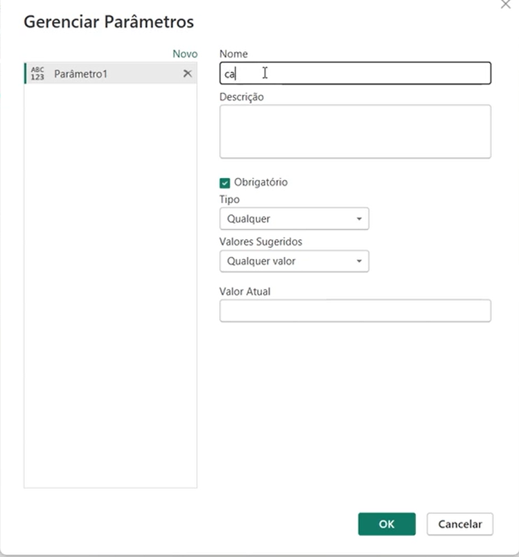
    </td>
</tr>
</table>

Nessa tela temos algumas opções de preenchimento e vamos explicar cada uma delas. 
- Nome: Aqui deverá ser criado um nome para esse parâmetro criado
- Descrição: Nesse campo devemos informar um descrição padrão sobre o parâmetro
- Obrigatório: Nesse checkBox, define se esse parâmetro é obrigatório ou não
- Tipo: Qual o tipo padrão desse parâmetro tendo as seguintes opções:  
  -  Qualquer
  -  Número Decimal
  -  Data/Hora
  -  Data
  -  Hora
  -  Data/Hora/ Fuso horário
  -  Duração
  -  Texto
  -  Verdadeiro/Falso
  -  Binário
  > No caso de nosso projeto escolheremos o tipo texto, pois iremos inserir esse parâmetro dentro da barra de fórmulas onde está apontando o nome dos caminhos.
- Valores sugeridos: Nesse campo podemos inserir valores que podem ser sugeridos para o preenchimento desse parâmetro, e temos os valores possíveis de serem selecionados
  -  Qualquer Valor
  -  Lista de valores
  -  Consulta
- Valor atual: Nesse campo deve-se informar qual  o valor atual sem o parâmetro nesse caso será o diretório dos aquivos.  

Quando terminamos o preenchimento desse parâmetro ele será apresentado na barra de consultas a esquerda. E para aplicarmos esse parâmetro e modificar esse diretório, iremos acessar cada fonte de dados, na parte de fonte, e substituir as partes onde contém o diretório:  
<table style="text-align: center; width: 100%;"> 
<tr>
    <td style="text-align: left;">
    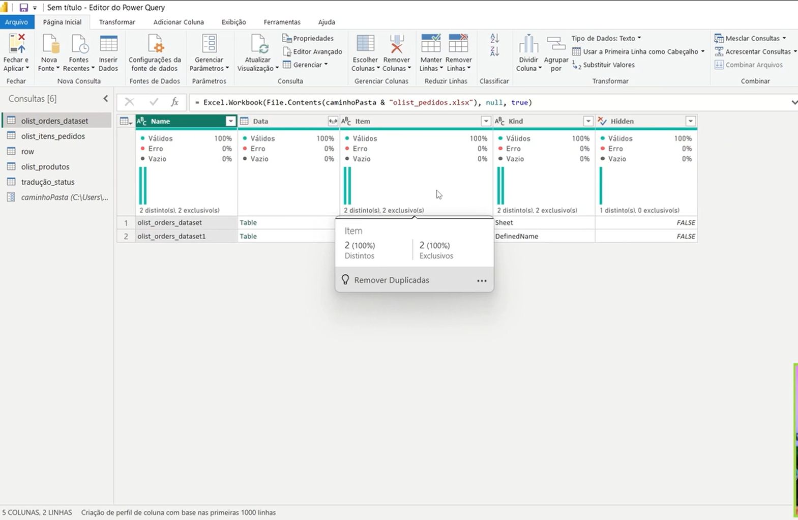
    </td>
</tr>
</table>

> PS: E importante que dentro dessa substituição  do diretório pelo parâmetro utilizarmos o caractere `&`, entre o nome e o parâmetro para que haja a concatenação.

[↑ Voltar ao topo](#topo)
 
---
## 4. Para saber mais: parâmetros
Caso queria conhecer um pouco mais sobre Parâmetros, recomendo o artigo [Power BI: parâmetros e exportação de modelos](https://www.alura.com.br/artigos/power-bi-parametros-e-exportacao-de-modelos) onde é demonstrado como utilizar parâmetros no Power BI para criar relatórios personalizados.  

O artigo foca na seleção de estados específicos e explica o processo de criação e aplicação desses parâmetros, destacando a importância de utilizar consultas e filtros dinâmicos para restringir os dados exibidos com base nas seleções feitas pela pessoa usuária. Essas técnicas possibilitam uma experiência interativa e personalizada na análise de dados no Power BI.

[↑ Voltar ao topo](#topo)

---
## 5. Organizando diretórios

No sistema de controle de inventário escolar, vários arquivos de inventário estão espalhados em diferentes locais. É necessário centralizá-los em uma única pasta para simplificar a gestão, qual a escolha correta?  

<table style="text-align: center; width: 100%;"> 
<tr>
    <td style="text-align: left;">
    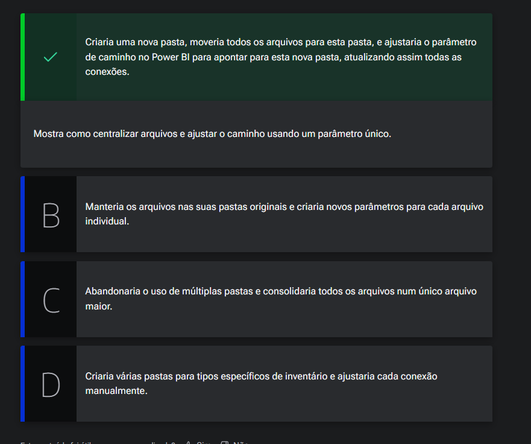
    </td>
</tr>
</table>

[↑ Voltar ao topo](#topo)

---
## 6. Tipos dos dados  

O próximo tratamento que iremos realizar será dentro da nossa base de dados `olist_itens_perdidos`, ao acessar essa tabela visualizamos duas colunas questão com preços e valores de frete, porém os valores contidos nessas colunas estão um pouco discrepantes, mas qual seria o problema desses valores, quando importamos a base para dentro do Power Query, durante o processo o próprio Power Query realiza uma analise dos valores da coluna e analise o _"comportamento"_ daquela coluna.  
Um problema que pode ser encontrado em diferentes bases, no caso dessa base quando removemos a etapa de tipo de dados alterado veremos que as colunas, possuem valores numéricos, porém o que marca o  valor decimal é o `.` e não uma `,`, nesse caso iremos alterar o tipo de dados transformando esse tipo em outro, para isso existem 3 caminhos, dentro da guia transformar temos algumas opções podemos utilizar por exemplo, detectar tipo de dados, podemos também alterar o tipo de dado diretamente na guia. 
Ou ainda podemos realizar, através de mouse  lado direito,  e escolher a opção de Alterar Tipo, nessa opção teremos várias outras opções porém a que iremos selecionar  a opção  `Usando a localidade`, ao selecionar tal opção será apresentado uma nov janela devemos informar qual o tipo de dados que será aplicado, e no segundo parâmetro qual a localidade geográfica que utiliza aquele tipo.  

<table style="text-align: center; width: 100%;"> 
<tr>
    <td style="text-align: left;">
    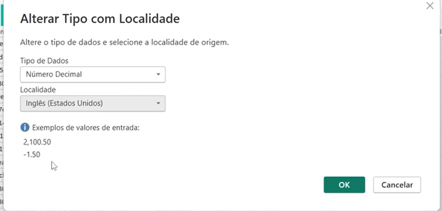
    </td>
</tr>
</table>

Para melhorar o tratamento, de forma mais _"rápida"_, basta selecionar as colunas desejadas,  para que então possamos aplicar o tratamento.  

---
Para que possamos configurar o Power Query, para impedir que ele realize a tipagem de dados de forma automática, devemos acessar a guia de arquivo -> Opções e configurações ->  Global - > Carregamento dos dados, nessa parte teremos a parte  de detecção de tipo, onde nessa temos as seguintes opções:    

<table style="text-align: center; width: 100%;"> 
<tr>
    <td style="text-align: left;">
    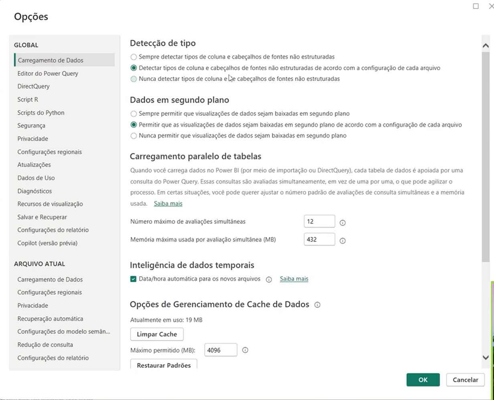
    </td>
</tr>
</table>

[↑ Voltar ao topo](#topo)

---
## 7. Evitando problemas futuros

Numa empresa de plataforma de gerenciamento de contratos, para evitar futuros problemas com tipos de dados incorretos ao importar, qual estratégia preventiva você usaria?  

<table style="text-align: center; width: 100%;"> 
<tr>
    <td style="text-align: left;">
    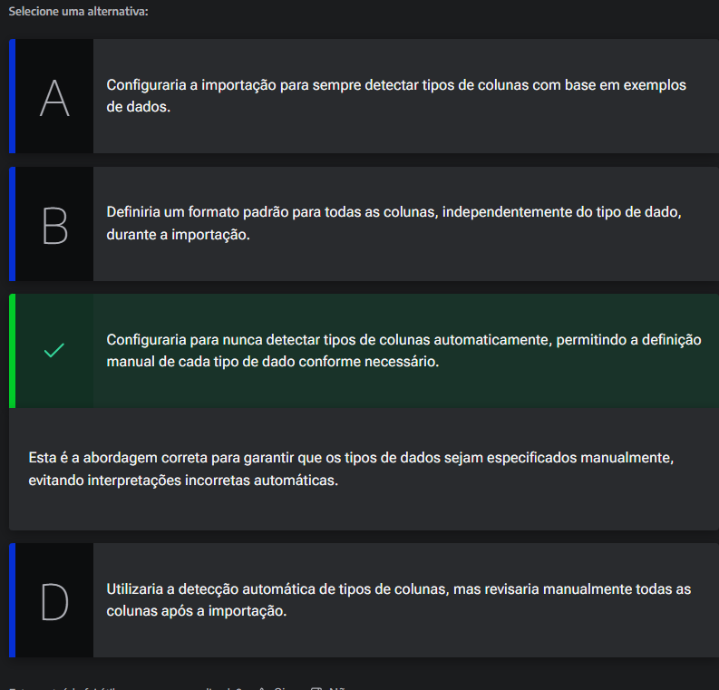
    </td>
</tr>
</table>

[↑ Voltar ao topo](#topo)

---
## 8. Faça como eu fiz: inserindo parâmetros
Nesta atividade, você será guiado para replicar o processo de criação e utilização de parâmetros no Power BI conforme demonstrado no vídeo transcrito. Ao final, você deverá refletir sobre a importância desse recurso e sua aplicação no mercado de trabalho.

__Passo 1: Criar Parâmetro de Caminho__  
  - 1º Copie o caminho do diretório sem o arquivo final, por exemplo: `C:\Users\alura\OneDrive\Área de Trabalho\Projeto\`
    - Acesse a guia "Página inicial" no Power BI e clique em "Gerenciar Parâmetros".
    - Crie um novo parâmetro com as seguintes configurações:
    - Nome: caminhoPasta
    - Descrição: Endereço do diretório
    - Tipo: Texto
    - Valor Atual: Cole o caminho do diretório copiado anteriormente.
    - Clique em "OK" para salvar o parâmetro.
__Passo 2: Aplicar Parâmetro nas Fontes__  
  - 2º Selecione a consulta olist_orders_dataset.
    - Clique em "Fontes" e modifique a barra de fórmulas para utilizar o parâmetro caminhoPasta:
    - `=Excel.Workbook(File.Contents(caminhoPasta & "olist_orders_dataset.xlsx"), null, true)`
    - Pressione "Enter" para aplicar a modificação. Certifique-se de que a consulta é atualizada corretamente.
    - Repita o processo para as outras consultas, ajustando o caminho e nome dos arquivos de acordo.
__Passo 3: Testar Modificações de Diretório__  
    - Crie uma nova pasta chamada Olist dentro do diretório Projeto.
    - Mova todos os arquivos para a nova pasta Olist.
    - No Power BI, acesse o parâmetro caminhoPasta e modifique o Valor Atual para: `C:\Users\alura\OneDrive\Área de Trabalho\Projeto\Olist\`
    - Clique em "OK" e observe que as consultas são atualizadas automaticamente para o novo diretório.

__Opinião do instrutor__  
O uso de parâmetros no Power BI é uma prática fundamental que promove eficiência e flexibilidade na gestão de dados. No mercado de trabalho, essa habilidade é altamente valorizada, pois permite que profissionais lidem com alterações e compartilhamentos de projetos de forma ágil e sem a necessidade de reconfigurações complexas. Dominar essa técnica pode não apenas otimizar seus processos, mas também facilitar a colaboração em equipes e a adaptabilidade em ambientes dinâmicos.

[↑ Voltar ao topo](#topo)

---
## 9. O que aprendemos?
Nessa aula, você aprendeu a:
- Explorar a consulta de dados JSON no Power Query e a necessidade de converter essa estrutura em uma tabela.
- Compreender o processo de transposição de dados para transformar linhas em colunas e colunas em linhas.
- Realizar a substituição de caracteres específicos dentro dos valores da coluna "categoria", trocando underlines por espaços.
- Formatar o texto da coluna, colocando a primeira letra de cada palavra em maiusculo.
- Compreender os desafios de compartilhar relatórios que dependem de caminhos de arquivos específicos.
- Utilizar o recurso "Gerenciar Parâmetros" no Power Query para criar parâmetros que representem diretórios.
- Realizar a concatenação de strings na linguagem M para unir o parâmetro de diretório ao nome do arquivo, otimizando as referências de caminho.
- Analisar os problemas de tipagem automática dos dados no Power Query e como isso pode causar erros.
- Reverter etapas de transformação para entender e resolver problemas de importação.
- Explorar como definir manualmente o tipo de dado de uma coluna usando localidade específica.
- Aplicar alterações de tipo para múltiplas colunas simultaneamente.
- Descobrir como desativar a detecção automática de tipo de dados no Power Query para ter maior controle no processo de importação de dados.

---

<table align="center" style="border-collapse: collapse; margin-left: auto; margin-right: auto;"> 
  <caption><b>Skills do projeto</b></caption>
  <tr>
    <td style="padding: 5px;">
      
    </td>
    <td style="padding: 5px;">
      
    </td>
    <td style="padding: 5px;">
      
    </td>
  </tr>
</table>

---
__Titulo:__ Avançando nas transformações
__Autor:__ Thierry Lucas Chaves  
__Data de Criação:__ 14-06-2026  
__Data de Modificação:__ 19-06-2026  
__Versão:__ "1.0"