# Finalizando os tratamento

## Sumário
- [Finalizando os tratamento](#finalizando-os-tratamento)
  - [Sumário](#sumário)
  - [1. Projeto da aula anterior](#1-projeto-da-aula-anterior)
  - [2. Renomeando e removendo consultas](#2-renomeando-e-removendo-consultas)
  - [3. Para saber mais: renomeando colunas no Power Query](#3-para-saber-mais-renomeando-colunas-no-power-query)
  - [4. Conhecendo o editor avançado](#4-conhecendo-o-editor-avançado)
  - [5. Para saber mais: diferença entre duplicar e referenciar uma tabela](#5-para-saber-mais-diferença-entre-duplicar-e-referenciar-uma-tabela)
  - [6. Reaproveitando processos](#6-reaproveitando-processos)
  - [7. Refatorando as etapas](#7-refatorando-as-etapas)
  - [8. Otimizando processos](#8-otimizando-processos)
  - [9. Mão na massa](#9-mão-na-massa)
  - [10. O que aprendemos?](#10-o-que-aprendemos)

## 1. Projeto da aula anterior

Caso prefira, você pode acessar o [projeto da aula 1](https://github.com/thierryLchaves/Santander-Imersao-Digital/blob/184f3613b2391ace6d1b4d46b148e44ccd1afc34/Analise_de_dados_e_IA_Nivelamento/Semana_07/Power_BI_Desktop_Realizando_ETL_no_Power_Query/src/Power%20Query%20-%20Aula%201.pbix) no ponto em que paramos na aula anterior. 

[↑ Voltar ao topo](#topo)

---
## 2. Renomeando e removendo consultas
Agora iremos partir para uma fase final das transformações desses dados, a partir daqui iremos realizar as cargas desses dados, e manipular para futura construção de relatórios, porém como temos o objetivo de criar relatório é interessante que tenhamos as nossas consultas, com os devidos nomes bem estruturados  assim como as suas colunas, então o que iremos realizar nesse tópico será realizar a renomeação dessas consultas e colunas, para além disso selecionar somente as colunas mais interessantes para realizar os futuros tratamentos. 

Para que possamos realizar o processo de renomear consultas _(ou nossas bases de dados)_, basta clicar com o mouse lado direito sobre a base e escolher a opção de `Renomear`, ou ainda podemos realizar um duplo clique sobre o nome da base para habilitar a edição desse nome, para renomear as colunas o processo segue o mesmo das consultas,basta clicar sobre o nome duas vezes ou com opção de mouse lado direito `Renomear`.
> PS: Nas tabela de pedido e de itens pedidos temos uma coluna de `order_id`, essas colunas realizam o relacionamento entre essas tabelas, porém para que possamos relacionar essas tabelas é necessário que ambas colunas tenham o mesmo nome.

--- 
Dentro  de nossa base temos alguns dados que podem ser considerados _"inúteis"_ para a aplicação do projeto vide exemplo a coluna de `costumer_id` na qual traz o ID do cliente, porém como não temos acesso a tabela de clientes essa coluna não terá aplicação, para que possamos excluir essa informação iremos selecionar a coluna em questão, e com opção de mouse lado direito, `Remover`.  
Uma outra opção para remoção de colunas que pode ser realizada diz respeito ao processo de quando temos apenas determinadas colunas que são tidas como relevantes para o projeto, nesse caso iremos selecionar as colunas desejadas, e com a opção de mouse lado direito escolher a opção de `Remover outras Colunas`

[↑ Voltar ao topo](#topo)

---
## 3. Para saber mais: renomeando colunas no Power Query

No Power Query, uma das etapas comuns na preparação de dados é a renomeação de colunas para tornar sua identificação mais clara e adequada. O Power BI oferece várias opções para renomear colunas no Power Query, tornando essa tarefa flexível e personalizável.

Primeiramente, vamos determinar quais serão os novos nomes das colunas da tabela de pedidos.

`order_id` → id pedido
`order_purchase_timestamp` → Data compra
`order_approved_at` → Data aprovação
`order_delivered_carrier_date` → Data transportadora
`order_delivered_customer_date` → Data entrega
`order_estimated_delivery_date` → Data estimada entrega

Agora que temos os novos nomes, vamos às formas de renomear uma coluna no Power Query.

- __1. Através da interface visual__  

A primeira forma de renomear colunas no Power Query é por meio da interface visual. Ao selecionar uma coluna, é possível efetuar clique duplo sobre o nome dela e Renomear. Isso permite que você digite um novo nome para a coluna diretamente na interface do Power Query:

<table style="text-align: center; width: 100%;"> 
<tr>
    <td style="text-align: left;">
    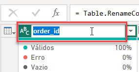
    </td>
</tr>
</table>

- __2. Através do menu de opções__

Outra forma de renomear as colunas é clicando com o botão direito em cima da coluna para abrir o menu de opções, e clicar na opção Renomear:

<table style="text-align: center; width: 100%;"> 
<tr>
    <td style="text-align: left;">
    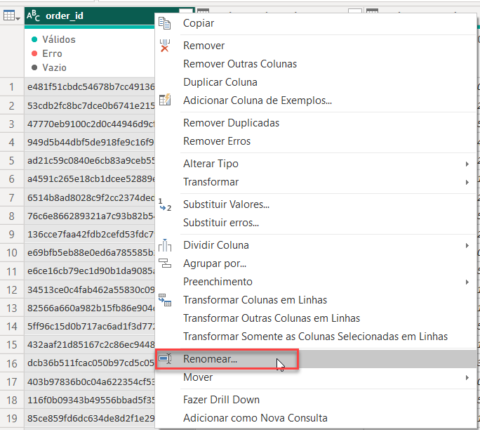
    </td>
</tr>
</table>

- __3. Através da aba Transformar__

Uma terceira maneira de renomear é selecionando a coluna deseja, indo na aba Transformar no topo e clicando na opção Renomear, na seção Qualquer Coluna:  
<table style="text-align: center; width: 100%;"> 
<tr>
    <td style="text-align: left;">
    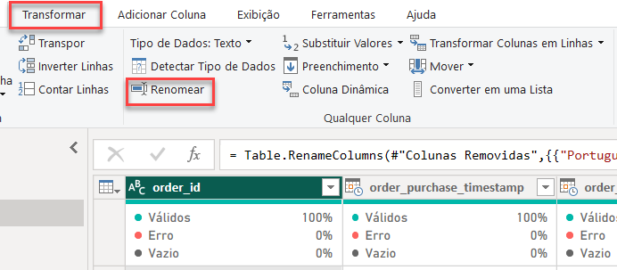
    </td>
</tr>
</table>

O Power Query no Power BI oferece diversas formas de renomear colunas. Você pode utilizar a interface visual, as opções da coluna ou até mesmo renomear através da barra de ferramentas. Com essas opções, você vai poder renomear as colunas da maneira que desejar e, assim, vamos dando continuidade ao nosso projeto.

[↑ Voltar ao topo](#topo)

---
## 4. Conhecendo o editor avançado
Conforme já dito anteriormente em outras aulas visualizadas, o Power Query utiliza a `Linguagem M`, para realizar as etapas de modificações que ficam presentes na barra de etapas aplicadas, porém como podemos acessar esses códigos que foram realizados em background, pelo Power Query de outra forma que não seja através da barra de fórmulas de cada etapa ? Para esse processo basta clicar sobre a opção de Editor Avançado, dentro da guia de Página Inicial.  
Quando selecionado, seremos apresentado a uma tela conforme imagem abaixo: 
<table style="text-align: center; width: 100%;"> 
<tr>
    <td style="text-align: left;">
    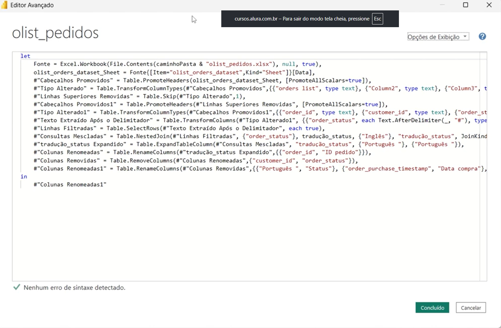
    </td>
</tr>
</table>

A estrutura básica dessa código pode ser resumida também em sua distribuição dos blocos, em que em suma podemos identificar 2 blocos principais sendo `Let` e `In`, o primeiro bloco o `let` irá listar todas as informações desde a conexão dos dados, até a ultima transformação aplicada. Um outro ponto que podemos visualizar nesse bloco é que para que haja a estrutura do histórico sempre na próxima transformação do dado será referenciado a alteração anterior, e isso seguirá até a ultima etapa.  
Já quando estamos trabalhando com o bloco `IN` ele é responsável por ser o bloco de retorno, ou seja ele irá apresentar ali a ultima tabela  que foi tratada,  ou a ultima tabela que foi referenciada. 
Isso nos possibilita por exemplo aplicar um tratamento em outra máquina por exemplo sem que haja a necessidade de realizar todas as etapas que vimos ao longo do curso.
> PS: É possível que haja a necessidade de realizar a duplicação de uma base pré existente no nosso projeto, para realizarmos tal processo podemos clicar sobre a base desejada e com opção de mouse lado direito duplicar, com essa ação a base será duplicada já com todos os tratamentos que foram realizados na base origem.  
> Ps2: Essa prática de duplicação não é muito indicada pois iremos instanciar duas vezes a mesma base, o ideal e que utilizemos a opção de referência.  

[↑ Voltar ao topo](#topo)

---
## 5. Para saber mais: diferença entre duplicar e referenciar uma tabela  

No dia a dia do profissional que trabalha com Power Query e Power BI, surgem desafios relacionados à manipulação e combinação de dados de várias fontes, bem como a necessidade de aplicar transformações complexas e reutilizar consultas em diferentes partes de um projeto.

Ao lidar com tabelas e consultas, surge a necessidade de copiá-las para realizar diferentes tipos de manipulação. Nesse cenário, duas opções estão disponíveis: duplicar ou referenciar. Compreender a diferença entre essas opções é fundamental para utilizar o recurso de forma eficiente.

A opção de duplicar cria uma cópia independente da tabela original, permitindo trabalhar com uma versão isolada dos dados, aplicar transformações específicas ou comparar diferentes cenários sem afetar o conjunto de dados original. Por outro lado, a opção de referenciar estabelece uma conexão entre duas consultas, utilizando os resultados da consulta original como entrada. Qualquer alteração na consulta original é automaticamente refletida na consulta de referência.

A escolha entre duplicar e referenciar depende do contexto e dos objetivos do projeto. Se a necessidade é trabalhar com dados independentes, realizar experimentações ou comparar cenários, a duplicação é a melhor opção. Em contrapartida, se a intenção é combinar dados, aplicar transformações sequenciais ou reutilizar consultas, a referência é a escolha adequada.

Então, vamos aprender a fazer essas duas operações:  

__Duplicar uma tabela__  

Você pode utilizar a opção de duplicar quando você quer copiar uma tabela inteira, com todas as suas etapas de transformações.  
Como exemplo, vamos imaginar que precisamos importar outra tabela com novos pedidos, e essa tabela terá a mesma estrutura da tabela que já tratamos. Nesse caso, nós podemos simplesmente duplicar a tabela de pedidos, clicando com o botão direito em cima dela e depois na opção Duplicar:   

<table style="text-align: center; width: 100%;"> 
<tr>
    <td style="text-align: left;">
    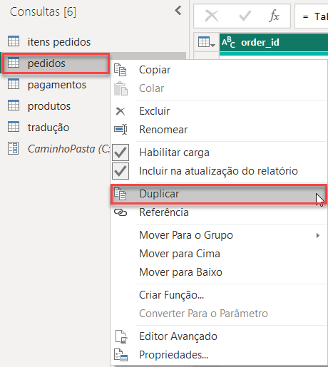
    </td>
</tr>
</table>

A nova tabela duplicada ficará com os tratamentos realizados na tabela original:
<table style="text-align: center; width: 100%;"> 
<tr>
    <td style="text-align: left;">
    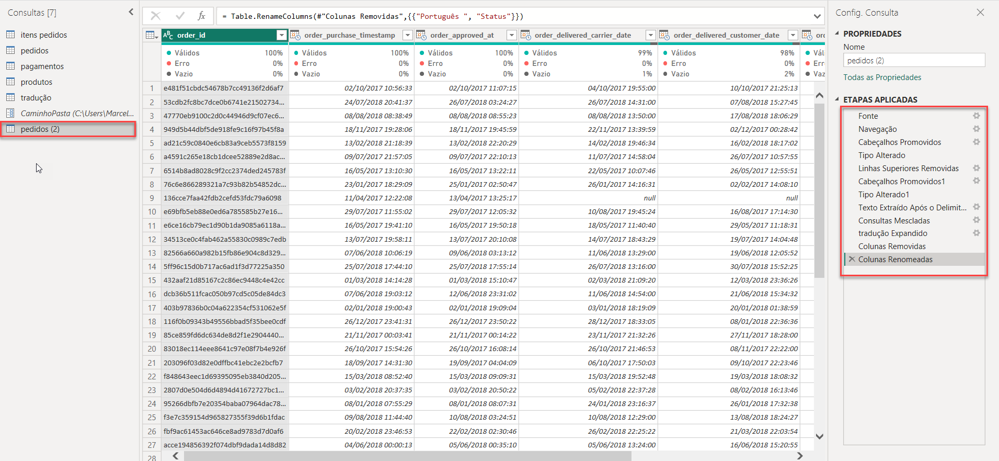
    </td>
</tr>
</table>

Agora, basta mudarmos o caminho do arquivo na fonte da tabela:
<table style="text-align: center; width: 100%;"> 
<tr>
    <td style="text-align: left;">
    
    </td>
</tr>
</table>

E assim teríamos a tabela com novos pedidos já com os tratamentos.  

__Referenciar uma tabela__  

A referência é uma outra forma de copiar uma tabela, com a diferença de que a nova tabela gerada terá todos os tratamentos realizados na original, mas não terá as etapas, pois todas elas se tornarão uma só, que é a Fonte, representando a referência à tabela original.

Para referenciar uma tabela, o processo é parecido. Vamos clicar com o botão direito em cima dela e depois na opção Referenciar:  
<table style="text-align: center; width: 100%;"> 
<tr>
    <td style="text-align: left;">
    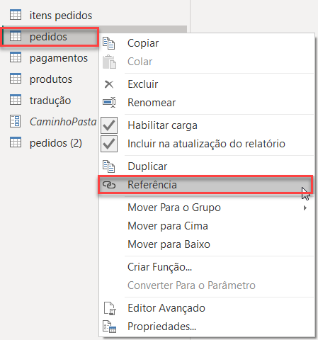
    </td>
</tr>
</table> 

Abaixo, podemos verificar a etapa Fonte na nova tabela, em que podemos perceber o cálculo ´= pedidos´ no topo, indicando a referência à tabela de pedidos:  

<table style="text-align: center; width: 100%;"> 
<tr>
    <td style="text-align: left;">
    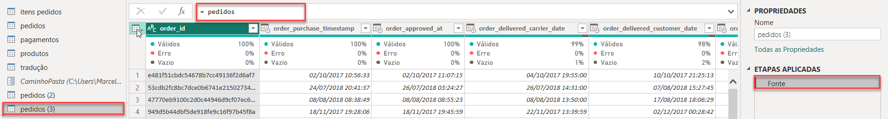
    </td>
</tr>
</table> 

Essa etapa de Fonte significa que se você fizer alterações na tabela de pedidos original, essa nova tabela será afetada.

A referência é uma boa opção quando você deseja realizar outros tratamentos na tabela, mas sem modificar a original. Uma tabela irá seguir certos tratamentos e a outra irá continuar com tratamentos diferentes, mas as duas compartilham algumas etapas da tabela original.  

__Duplicar vs Referenciar__  

A partir de agora, sabemos que existem duas opções ao copiar uma tabela. Com isso, vamos verificar mais de perto suas diferenças.

<table style="text-align: center; width: 100%;"> 
<tr>
    <td style="text-align: left;">
    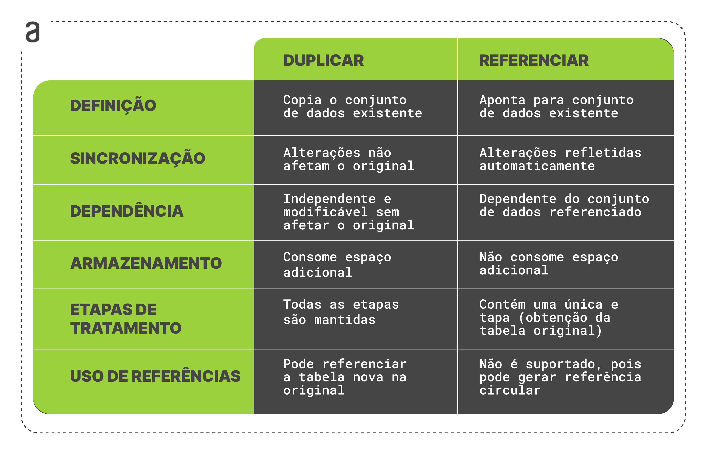
    </td>
</tr>
</table> 

As opções de Duplicar e Referenciar são distintas e cada uma tem suas vantagens e desvantagens. A opção de duplicar é útil quando você deseja que as duas cópias sejam independentes uma da outra, enquanto a opção de referência é adequada quando você cria ramos diferentes a partir de uma tabela original.  

[↑ Voltar ao topo](#topo)

---
## 6. Reaproveitando processos

Em uma empresa de gestão de projetos, processos de rastreamento precisam ser replicados em novos projetos. Qual a diferença entre duplicação e referência de processos e quando cada um deve ser aplicado em gestão de projetos?  
<table style="text-align: center; width: 100%;"> 
<tr>
    <td style="text-align: left;">
    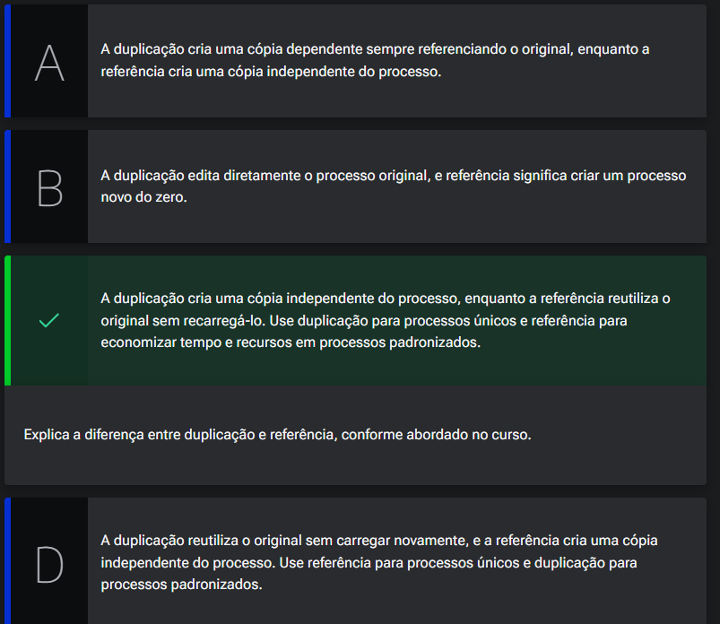
    </td>
</tr>
</table> 

[↑ Voltar ao topo](#topo)

---
## 7. Refatorando as etapas
Agora que já terminamos as etapas de transformações nos pedidos, visualizamos que realizamos muitas etapas similares ou iguais de transformações em uma de nossa base de dados. 
Esse processo de refatoração pode e deve ocorrer para visualizarmos por exemplo quais são as etapas que aplicamos de forma desnecessária, e para sua conferência quando por exemplo excluirmos uma etapa de alteração basta clicar até a ultima etapa ou ir seguindo sobre  as etapas para visualizarmos se essa alteração aplicada teve efeito diferente nas demais.
O processo em questão funciona quando por exemplo temos duas etapas que realizam o mesmo tratamento de dados, porém e quando tivermos situações na qual temos o mesmo tipo de tratamento porém para colunas diferentes, nesse caso podemos utilizar o editor avançado para unificarmos esse processo descrito em somente uma etapa.    

<table style="text-align: center; width: 100%;"> 
<tr>
    <td style="text-align: left;">
    
    </td>
</tr>
</table> 

No caso da imagem acima, o que iremos fazer e aproveitar o código existente dentro da colunas renomeadas, e iremos inserir  diretamente em Colunas renomeadas 1, para que possamos realizar em um único passo a renomeação dessas colunas, e para que isso seja feito basta separar com `,`, porém quando realizarmos por exemplo a exclusão de uma etapa e importante visualizar e refazer a referência cíclica que foi citada anteriormente, conforme exemplo:  
<table style="text-align: center; width: 100%;"> 
<tr>
    <td style="text-align: left;">
    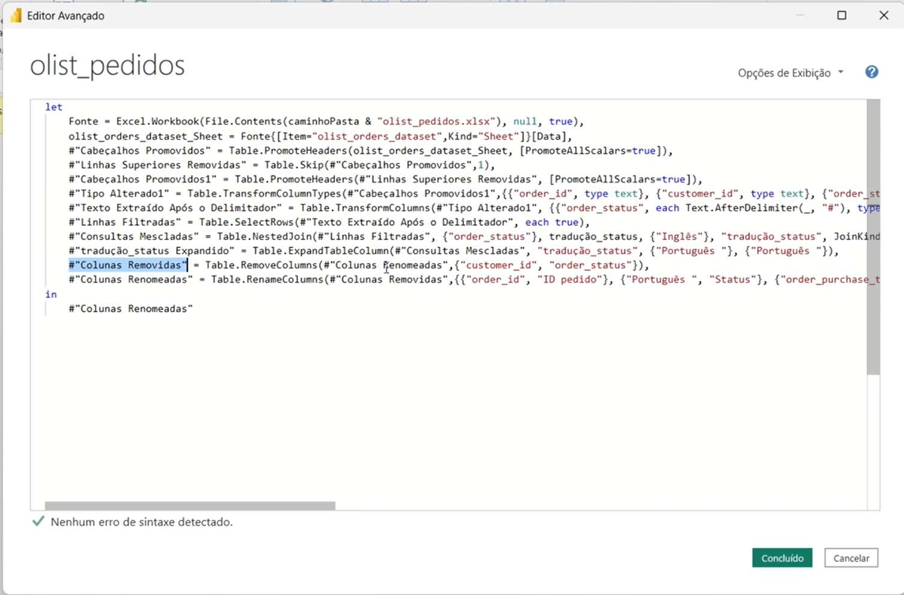
    </td>
</tr>
</table> 

No caso temos um erro pois a referência de colunas removidas apontava diretamente para o colunas renomeadas, e como excluímos essa etapa falta a referência. 

Um ponto importante sobre o tratamento de dados, é que é possível que realizarmos uma anotação sobre o que se trata ou para que serve aquela etapa, para isso dentro da opção de propriedades da etapa é possível inserir uma anotação dentro de descrição. 

[↑ Voltar ao topo](#topo)

---
## 8. Otimizando processos
Em uma empresa de gerenciamento de projetos, que lida com múltiplos projetos simultâneos, é necessário otimizar as etapas repetitivas para melhorar a performance. Como identificar e refatorar etapas repetitivas em um processo de gerenciamento de projetos?  

<table style="text-align: center; width: 100%;"> 
<tr>
    <td style="text-align: left;">
    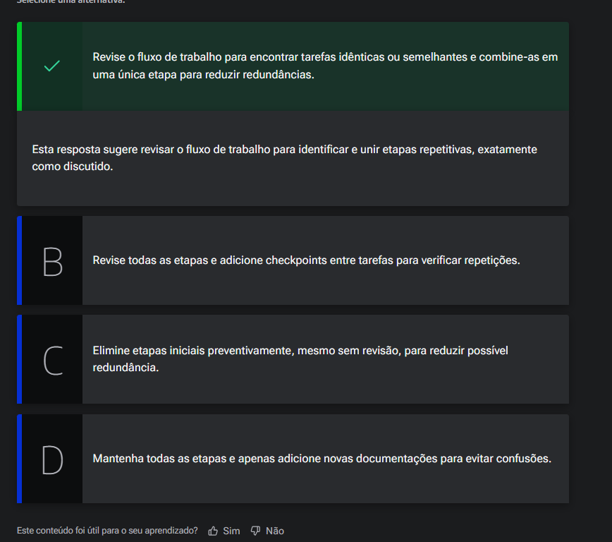
    </td>
</tr>
</table> 

[↑ Voltar ao topo](#topo)

---
## 9. Mão na massa
Para você expandir seus conhecimentos preparamos uma lista de exercícios para você treinar os conceitos de Power BI abordados nesse curso. Para algumas questões sugerimos que você baixe o projeto final e isso pode te ajudar na elaboração das respostas desses exercícios.

- 1 Cite uma maneira de trocar a fonte de dados dentro do Power BI.
- 2 Por que criamos o parâmetro __caminhoPasta__ nesse projeto? Pontue as facilidades e principais utilidades.
- 3 Altere o tipo da coluna "Id item pedido" da tabela "olist_itens_pedidos" de texto para número.
- 4 Saulo importou uma base de dados em .csv e percebeu que as colunas "preço" e "salário" foram identificadas pelo Power BI como texto. Como Saulo pode ajustar o formato dessas colunas? Cite todas as maneiras que você lembrar.
- 5 Explore a ferramenta do Power Query encontrando uma forma de calcular quantas linhas existem em nosso modelo.

__Opinião do instrutor__  

- __1. Cite uma maneira de trocar a fonte de dados dentro do Power BI.__

  Para trocar a fonte de dados no Power BI, você pode usar diferentes abordagens:

  - a) No Power Query Editor, vá para "Transform data" e clique em "Source" para selecionar uma nova origem. Em seguida, aplique as alterações.

  - b) Edite consultas no Power Query Editor, clicando com o botão direito na consulta desejada e escolhendo "Editar consulta". Modifique a origem na janela "Configurações da fonte".

  - c) No Power BI Service online, acesse o conjunto de dados, clique em "Mais opções" e escolha "Configurações" para modificar a origem da fonte de dados.

  - d) Use fórmulas M no Editor de Consultas para editar diretamente o código da consulta, como ajustar a URL em uma consulta de API.

Sempre faça backup antes de realizar alterações significativas e escolha a abordagem adequada às suas necessidades e tipo de dados.

- __2. Por que criamos o parâmetro caminhoPasta nesse projeto? Pontue as facilidades e principais utilidades.__

Parâmetros no Power Query permitem reutilizar consultas, automatizar atualizações, oferecer flexibilidade em filtros (por exemplo, datas), padronizar consultas para consistência, simplificar a manutenção e possibilitar interatividade com o usuário final. Em nosso projeto, utilizamos para automatizar o processo de obtenção de dados de diferentes bases para conseguirmos preparar os dados para as análises no Power BI. Esta funcionalidade facilita o compartilhamento do projeto com as partes interessadas.

- __3. Altere o tipo da coluna "Id item pedido" da tabela "olist_itens_pedidos" de texto para número.__   

<table style="text-align: center; width: 50%;"> 
<tr>
    <td style="text-align: left;">
    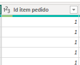
    </td>
</tr>
</table>  

- __4. Saulo importou uma base de dados em .csv e percebeu que as colunas preçoe salário foram identificadas pelo Power BI como texto. Como Saulo pode ajustar o formato dessas colunas? Cite todas as maneiras que você lembrar.__ 
- 
Saulo pode ajustar o formato das colunas preço e salário no Power BI de várias maneiras:

No Editor de Consultas: Selecionar a coluna, ir para "Transformar" e escolher o formato desejado.
<table style="text-align: center; width: 100%;"> 
<tr>
    <td style="text-align: left;">
    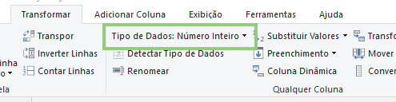
    </td>
</tr>
</table>  

No Editor de Consultas (Mudança de Tipo): Clicar com o botão direito na coluna e escolher "Alterar Tipo".

<table style="text-align: center; width: 100%;"> 
<tr>
    <td style="text-align: left;">
    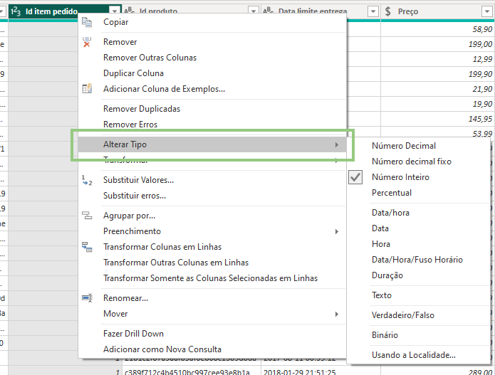
    </td>
</tr>
</table>  

Essas abordagens garantem que as colunas estejam corretamente formatadas para análises numéricas, vale ressaltar que essa não são as únicas maneiras de converter formato de dados aqui no Power BI, dentre elas podemos citar o uso da linguagem M e DAX para fazer essa conversão.

- __5. Explore a ferramenta do Power Query encontrando uma forma de calcular quantas linhas existem em nosso modelo.__  

Uma das formas de calcular a quantidade de linhas de nossa base de dados no Power Query é acessando o caminho Transformar → Contar Linhas. Ele irá gerar uma nova etapa apresentando na tela o resultado da consulta.

<table style="text-align: center; width: 50%;"> 
<tr>
    <td style="text-align: left;">
    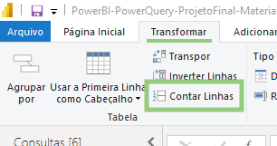
    </td>
</tr>
</table>  

Esperamos que com esses exercícios você tenha praticado ainda mais seus conhecimentos deste curso.

[↑ Voltar ao topo](#topo)

---
## 10. O que aprendemos?

Nessa aula, você aprendeu a:
- Explorarmos a renomeação de colunas para manter consistência e facilitar a manipulação de dados.
- Compreender a importância de escolher quais colunas carregar no projeto, removendo colunas desnecessárias.
- Explorar o Editor Avançado no Power Query para acessar e modificar a linguagem M diretamente.
- Compreender a estrutura básica da linguagem M, especialmente os blocos let e in.
- Entender a diferença entre duplicar e referenciar consultas, destacando as situações em que cada uma é mais apropriada.
- Identificar e eliminar etapas repetidas desnecessárias no Power Query para melhorar a performance da carga de dados.
- Unificar etapas similares, como colunas renomeadas e colunas renomeadas 1, no Editor Avançado.
- Corrigir o erro de referência cíclica na reorganização das etapas no Editor Avançado.
- Renomear etapas para evitar confusão e melhorar a legibilidade do código.
- Adicionarmos descrições e anotações às etapas no Power Query para facilitar a compreensão e o compartilhamento do projeto.  

---

<table align="center" style="border-collapse: collapse; margin-left: auto; margin-right: auto;"> 
  <caption><b>Skills do projeto</b></caption>
  <tr>
    <td style="padding: 5px;">
      
    </td>
    <td style="padding: 5px;">
      
    </td>
  </tr>
</table>

---
__Titulo:__ Finalizando os tratamento
__Autor:__ Thierry Lucas Chaves  
__Data de Criação:__ 14-06-2026  
__Data de Modificação:__ 19-06-2026  
__Versão:__ "1.0"