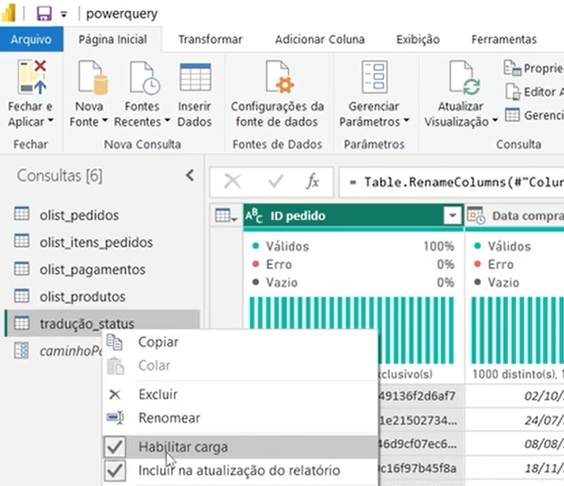
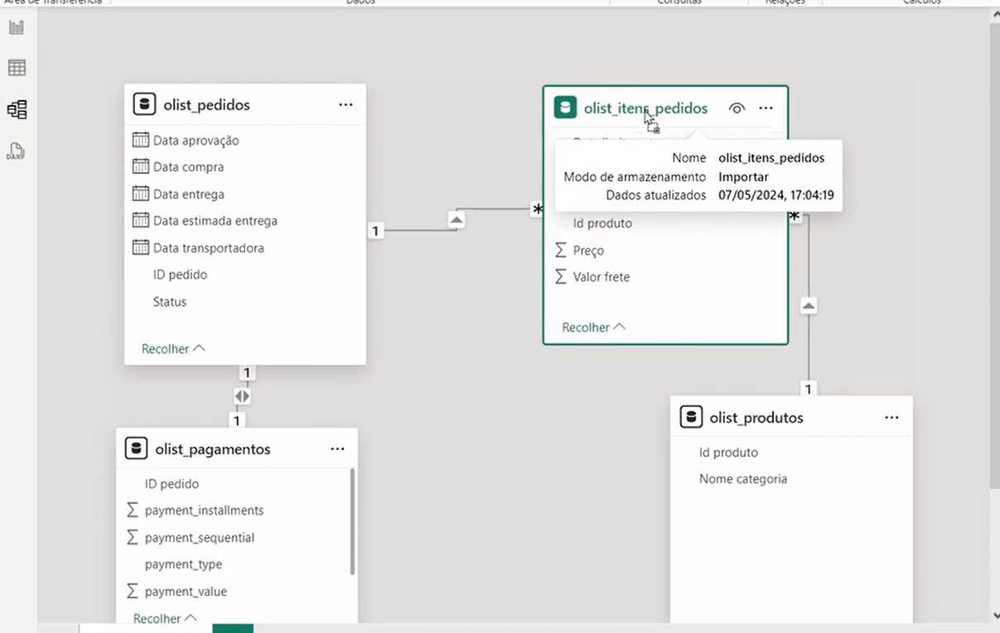
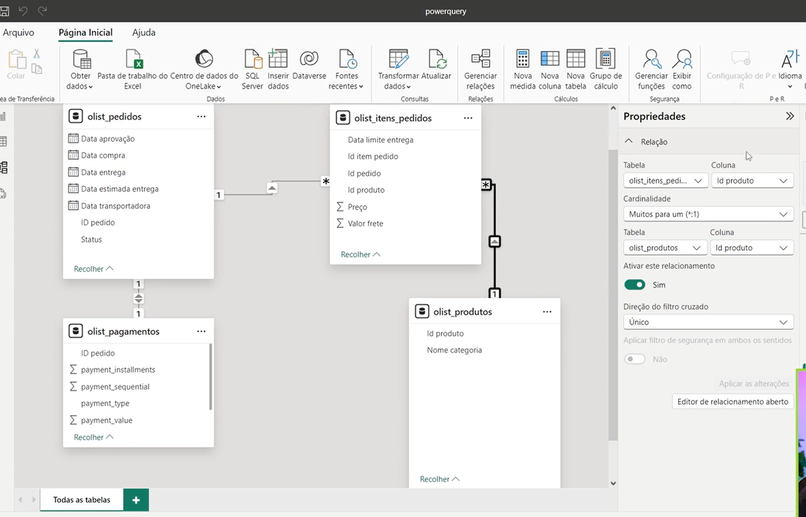
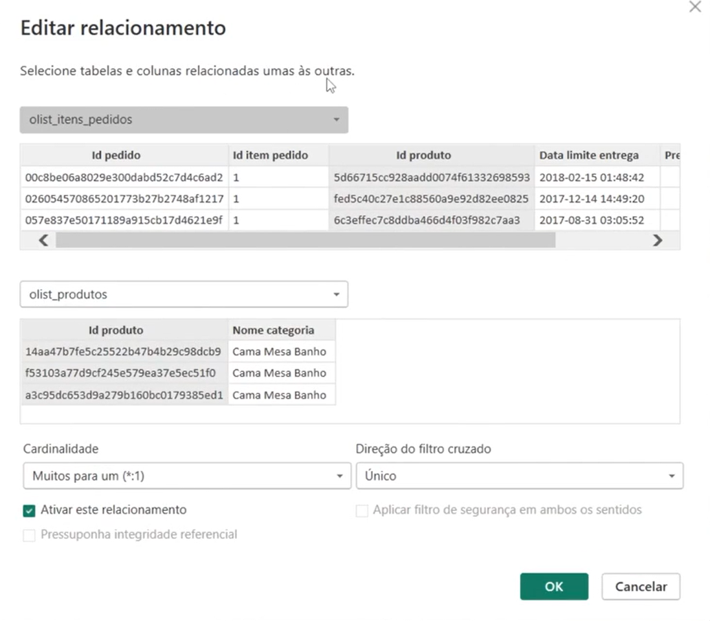
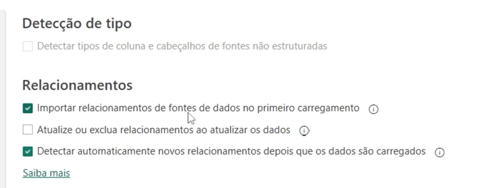
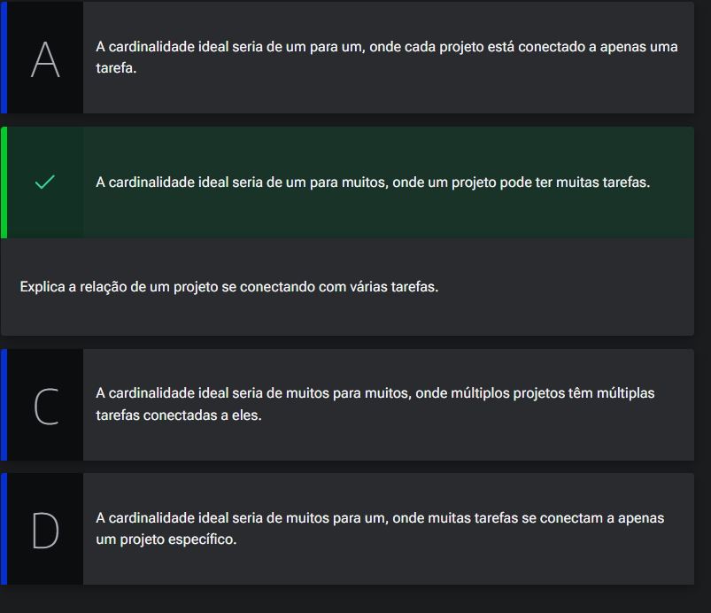
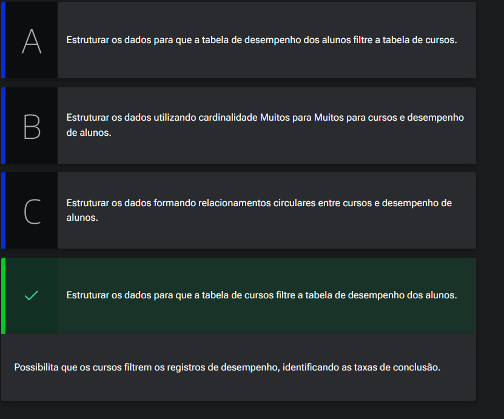
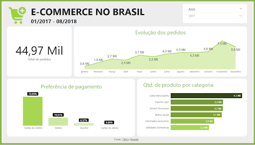

# Modelando os dados

## Sumário
- [Modelando os dados](#modelando-os-dados)
  - [Sumário](#sumário)
  - [1. Projeto da aula anterior](#1-projeto-da-aula-anterior)
  - [2. Carregando dados e acessando o modelo](#2-carregando-dados-e-acessando-o-modelo)
  - [3. Conhecendo as propriedades de relação](#3-conhecendo-as-propriedades-de-relação)
  - [4. Escolhendo a cardinalidade](#4-escolhendo-a-cardinalidade)
  - [5. Para saber mais: a importância da modelagem de dados](#5-para-saber-mais-a-importância-da-modelagem-de-dados)
  - [6. Garantindo conexões assertivas](#6-garantindo-conexões-assertivas)
  - [7. Modelando de forma adequada](#7-modelando-de-forma-adequada)
  - [8. Mão na massa](#8-mão-na-massa)
  - [9. Projeto final](#9-projeto-final)
  - [10. Referências](#10-referências)
  - [11. O que aprendemos?](#11-o-que-aprendemos)
  - [12. Conclusão](#12-conclusão)

## 1. Projeto da aula anterior

Caso prefira, você pode acessar o [projeto da aula 1](https://github.com/thierryLchaves/Santander-Imersao-Digital/blob/184f3613b2391ace6d1b4d46b148e44ccd1afc34/Analise_de_dados_e_IA_Nivelamento/Semana_07/Power_BI_Desktop_Realizando_ETL_no_Power_Query/src/Power%20Query%20-%20Aula%201.pbix) no ponto em que paramos na aula anterior.  

[↑ Voltar ao topo](#topo)

---
## 2. Carregando dados e acessando o modelo
Agora nessa ultima etapa desse nosso projeto, precisamos antes de realizar quaisquer cargas para dentro do projeto, ou de ainda começar a modelar os dados precisamos reavaliar, quais consultas fazem sentido, serem inseridas na etapa de carga dos dados.
Como exemplo fizemos o import de uma base de status, porém essa tabela serviu somente para realizar uma consulta e substituição de valores, então o que iremos realizar e desabilitar essa consulta para carga, para isso sobre a carga com opção de mouse lado direito, escolheremos  a opção de habilitar carga.  

<table style="text-align: center; width: 100%;"> 
<tr>
    <td style="text-align: left;">
    
    </td>
</tr>
</table>

O ultimo passo será realizar dentro da guia escolher a opção de fechar e aplicar.  
Com esse passo serão aplicados todas as alterações dentro desse projeto, porém antes de iniciarmos a parte de criação do dashboard,  a boa prática e visualizar/analisar como as tabelas estão sendo relacionadas entre sí. Uma das maneiras mais práticas é utilizando a exibição de modelo.  

<table style="text-align: center; width: 100%;"> 
<tr>
    <td style="text-align: left;">
    
    </td>
</tr>
</table>

[↑ Voltar ao topo](#topo)

---
## 3. Conhecendo as propriedades de relação

Dentro do modelo de modelagem de dados, podemos ver que não somente as tabelas foram importadas, como também podemos visualizar algumas informações sobre as conexões, clicando sobre a linha que conecta cada uma das tabelas, com isso será habilitado o menu lateral de propriedades, ou ainda podemos clicar com o mouse lado direito sobre a linha e escolher propriedades. 

<table style="text-align: center; width: 100%;"> 
<tr>
    <td style="text-align: left;">
    
    </td>
</tr>
<tr>
    <td style="text-align: left;">
    
    </td>
</tr>
</table>

> PS: um ponto que devemos te em mente quando  estamos visualizando as propriedades dos relacionamentos diz respeito a direção do filtro cruzados, pois quando por exemplo formos aplicar um processo de segmentação de dados, se tivermos a ciência de onde vem os dados será mais fácil aplicar o filtro ali.

E essa ideia descrita acima fica mais clarificada, quando  no modelo de visualização temos o ícone de uma seta apontando o relacionamento no nosso exemplo, temos o relacionamento entre pedido e produtos, a seta está de produtos para itens pedidos, o que significa que __produtos filtram pedidos__ , já quando temos um filtro com apontamento para 2 tabelas, é aconselhável que essa tabela não seja utilizada.  
Para alterar esse tipo de filtro, podemos tanto clicar duas vezes sobre o ícone, quanto em propriedades e modificar, quanto  no propriedade na barra lateral, modificando a cardinalidade da relação será modificado a direção do filtro. 

O Power B.I realiza o relacionamento automaticamente, porém isso não é interessante de ser realizada, para desabilitar esse processo seguiremos:  
`Aquivo -> Opções e Configurações  ->  Arquivo Atual -> Carregamentos`: dentro dessa opção teremos o menu re relacionamento e lá podemos desabilitar essa opção. 

<table style="text-align: center; width: 100%;"> 
<tr>
    <td style="text-align: left;">
    
    </td>
</tr>
</table>

Para realizar um relacionamento de forma manual basta clicar e pressionar a coluna chave e arrasta-la sobre a estrangeira.

[↑ Voltar ao topo](#topo)

---
## 4. Escolhendo a cardinalidade 

Em um sistema de gerenciamento de projetos, existe a tabela de projetos e outra de tarefas. Cada projeto pode ter várias tarefas. Qual a cardinalidade correta para representar essa relação?

<table style="text-align: center; width: 100%;"> 
<tr>
    <td style="text-align: left;">
    
    </td>
</tr>
</table>

[↑ Voltar ao topo](#topo)

---
## 5. Para saber mais: a importância da modelagem de dados
A modelagem de dados é uma etapa essencial em qualquer processo de análise de dados, e no Power BI, essa importância é ainda mais evidente. Com a capacidade de integrar diversas fontes de dados e transformá-los em informações úteis e acionáveis, o Power BI se destaca como uma das ferramentas mais poderosas para a criação de dashboards e relatórios interativos. No entanto, para aproveitar todo o potencial dessa ferramenta, é crucial dominar a modelagem de dados.

No contexto do Power BI, a modelagem de dados envolve a estruturação e organização dos dados de modo que eles possam ser facilmente acessados e analisados. Isso inclui a definição de relações entre diferentes tabelas, a limpeza de dados, a criação de colunas e medidas calculadas, e a otimização do desempenho das consultas.

Uma modelagem bem feita garante que os dados estejam em um formato que facilita o uso de fórmulas e funções DAX (Data Analysis Expressions), que são essenciais para a criação de cálculos avançados e agregações. Sem uma modelagem de dados adequada, o uso do DAX pode se tornar desafiador e os resultados das análises podem ser imprecisos ou difíceis de interpretar.

Além de facilitar o uso do DAX, uma boa modelagem de dados é fundamental para a criação de visuais eficazes no Power BI. Os dashboards e relatórios dependem de dados organizados e consistentes para oferecer uma visão clara e precisa das informações. Com uma modelagem bem estruturada, é possível criar gráficos e tabelas que não apenas mostram dados, mas contam uma história e fornecem insights valiosos. Isso é especialmente importante em cenários corporativos, onde decisões estratégicas são frequentemente baseadas nas análises fornecidas pelo Power BI.  

Caso você deseja aprofundar seus conhecimentos e habilidades em modelagem de dados no Power BI, no curso [Modelagem de Dados no Power BI](https://cursos.alura.com.br/course/power-bi-modelagem-dados), você aprenderá as melhores práticas para organizar e estruturar seus dados de maneira eficiente e eficaz. Com uma abordagem prática e didática, abordando desde conceitos básicos até técnicas avançadas, capacitando você a explorar ao máximo o potencial do Power BI.

Dominar a modelagem de dados é um passo fundamental para qualquer profissional que deseja utilizar o Power BI de maneira eficaz para tornar-se um especialista em Power BI.

[↑ Voltar ao topo](#topo)

---
## 6. Garantindo conexões assertivas
Agora iremos compreender qual a importância da modelagem para o relatório final ?
Uma importância crucial de saber o processo de onde para onde e qual a cardinalidade será refletida diretamente no processo de construção do dash, pois quando temos um relacionamento feito de forma incorreta consecutivamente nosso relatório está incorreto.   

[↑ Voltar ao topo](#topo)

---
## 7. Modelando de forma adequada
Na plataforma, os dados de desempenho dos alunos são importantes para melhorar os cursos. Como modelar os dados para identificar quais cursos têm a maior taxa de conclusão?
<table style="text-align: center; width: 100%;"> 
<tr>
    <td style="text-align: left;">
    
    </td>
</tr>
</table>

[↑ Voltar ao topo](#topo)

---
## 8. Mão na massa

Chegamos a reta final desse curso, e com tudo que aprendemos até aqui, além do projeto que fizemos juntos, você pode desenvolver um novo projeto. Incentivamos você a concluí-lo e usá-lo como parte do seu portfólio para demonstrar de forma prática tudo que você aprendeu sobre o tratamento de dados no Power Query. Nós preparamos um projeto completo, com dados da empresa Olist, que inclui tratamentos, uso de filtros e visualizações. Vamos conferir esse desafio?   

A Olist é uma plataforma de e-commerce que conecta pequenas empresas a marketplaces, permitindo que elas alcancem um público maior e expandam suas vendas. Com o objetivo de aprimorar seus processos e otimizar a experiência dos clientes, a Olist coletou uma ampla gama de dados ao longo do tempo.

E, como pessoa analista de dados, é seu papel aproveitar ao máximo esses dados, desvendando os valiosos insights por trás dessas informações. Para isso, você vai realizar uma série de tarefas para desenvolver um painel de controle utilizando a ferramenta Power BI, a fim de fornecer visões estratégicas para o negócio.

Para criar um painel de controle eficaz, usando o Microsoft Power BI, você deve executar as seguintes tarefas:

__Tarefa 1: Mostrar o total de pedidos da base de dados__

Uma das primeiras tarefas que você enfrentará como analista de dados nesse projeto é revelar o total de pedidos registrados na base de dados da Olist. Usando as suas habilidades no Power BI, você poderá criar uma visualização clara e concisa que mostrará o número de pedidos, fornecendo uma visão geral inicial abrangente da base de dados.

__Tarefa 2: Criar uma visualização para mostrar a evolução dos pedidos no tempo__  

Ao mergulhar fundo nos dados da Olist, você descobrirá que a história dos pedidos ao longo do tempo é extremamente valiosa. Essa análise temporal permitirá que a equipe da empresa tome decisões estratégicas mais embasadas e antecipe as demandas futuras. E por meio do uso de visuais no Power BI, será possível obter uma visualização dinâmica e interativa que ilustra a evolução dos pedidos, destacando possíveis sazonalidades, tendências e padrões ao longo do tempo.  

__Tarefa 3: Criar uma visualização para mostrar os percentuais de preferência por tipo de pagamento__  

Para compreender melhor o comportamento dos clientes da Olist, é essencial analisar os diferentes tipos de pagamento utilizados em suas transações. Utilizando o Power BI, você poderá criar uma visualização clara e informativa que demonstrará os percentuais de preferência por cada tipo de pagamento. Essa visualização revelará quais métodos de pagamento são mais populares entre os clientes da Olist, fornecendo insights valiosos para direcionar estratégias de marketing e aprimorar a experiência do cliente.  

__Tarefa 4: Criar uma visualização que mostra a quantidade de produtos por categoria, observando apenas um ranking dos valores mais altos__  

Outro aspecto importante para entender o negócio da Olist é analisar as categorias de produtos vendidos. Com o PowerBI, você poderá criar uma visualização impactante que destacará as categorias com a maior quantidade de vendas, apresentando um ranking dos valores mais altos. Essa visualização permitirá que a equipe da empresa identifique quais categorias de produtos são as mais populares entre os consumidores e direcione esforços para otimizar o mix de produtos e a estratégia de precificação.  

__Tarefa 5: Criar um filtro para segmentar os registros por ano__  

Para facilitar a análise dos dados da Olist, será necessário criar um filtro que permita segmentar os registros por ano. Utilizando o Power BI, você poderá desenvolver um filtro interativo que permitirá à equipe explorar os dados de forma mais precisa e detalhada, isolando informações específicas de cada ano. Esse filtro será uma ferramenta valiosa para identificar tendências sazonais, avaliar o crescimento ao longo do tempo e fazer comparações entre diferentes períodos. Além disso, é importante criar um filtro que desconsidere pedidos sem data de aprovação (filtro para valores em branco nas datas).  

Ao embarcar nessa jornada como analista de dados na Olist, você estará desbravando um mundo de insights ocultos. Suas habilidades em PowerBI serão fundamentais para revelar informações valiosas sobre os pedidos, preferências de pagamento, categorias de produtos e evolução ao longo do tempo. Se precisar de ajuda nesse desafio, disponibilizamos abaixo, na seção Opinião da pessoa instrutora, uma possível resolução para esse projeto.

__Opinião do instrutor__  

Antes de começar a resolução, é importante que você tenha em mãos o projeto do curso onde as conexões e tratamentos de dados no Power Query já foram executados e estão funcionais. Se você ainda não os possui, você pode baixar o projeto anterior e seguir as instruções da atividade para corrigir as conexões.

Visão geral da proposta de resolução do projeto:  
<table style="text-align: center; width: 100%;"> 
<tr>
    <td style="text-align: left;">
    
    </td>
</tr>
</table>

__Resolução do Desafio__  

Os arquivos com o projeto resolvido estão disponíveis para serem baixados no link abaixo. E caso você queira trabalhar em um resultado semelhante, os arquivos com a imagem de background, paleta de cores e ícone também estão disponíveis.

Link para o download do projeto, paleta e imagem de fundo: [base de dados](https://github.com/thierryLchaves/Santander-Imersao-Digital/blob/662bd0834e1591a0ac16c2b445730f9ff074807a/Analise_de_dados_e_IA_Nivelamento/Semana_07/Power_BI_Desktop_Realizando_ETL_no_Power_Query/db), [arquivo b.i](https://github.com/thierryLchaves/Santander-Imersao-Digital/blob/662bd0834e1591a0ac16c2b445730f9ff074807a/Analise_de_dados_e_IA_Nivelamento/Semana_07/Power_BI_Desktop_Realizando_ETL_no_Power_Query/src)

__Sugestões para Tarefa 1:__  

A visualização recomendada para mostrar o total de pedidos da base de dados no Power BI é o cartão (card).

O cartão é uma visualização simples, porém eficaz, que permite exibir um único valor de forma clara e destacada. Essa visualização é ideal para apresentar informações-chave, como o total de pedidos, de maneira direta e sem distrações visuais.

Ao utilizar um cartão, você poderá configurá-lo para exibir o valor total de pedidos de forma legível e com destaque. Além disso, o cartão possui opções de personalização, como a escolha da cor de fundo, tamanho da fonte e formato do número exibido.  

__Sugestões para Tarefa 2:__  

Para criar uma visualização para mostrar a evolução dos pedidos no tempo, a visualização recomendada no Power BI é o gráfico de linhas (line chart). Mas também podemos trabalhar com um gráfico de áreas, para causar mais impacto e aproveitar as cores com o dashboard.

Esses gráficos são uma escolha adequada para representar a evolução dos pedidos ao longo do tempo, pois permitem visualizar as tendências e variações dos dados de forma clara e intuitiva. Eles são compostos por pontos conectados por linhas, onde o eixo x representa o tempo (por exemplo, datas) e o eixo y mostra o número de pedidos.

É possível identificar rapidamente os padrões sazonais, tendências ascendentes ou descendentes, bem como flutuações significativas no número de pedidos ao longo do tempo. Além disso, essa visualização permite que as pessoas usuárias interajam com os dados, ampliando ou reduzindo o período de tempo para uma análise mais detalhada.

Você também pode adicionar elementos extras ao gráfico de linhas, como linhas de tendência, marcadores para pontos específicos de interesse ou rótulos para destacar eventos relevantes. Esses recursos ajudam a fornecer insights adicionais sobre a evolução dos pedidos, tornando a visualização mais informativa e impactante, o que pode influenciar em futuras decisões estratégicas da empresa.

__Sugestões para Tarefa 3:__  

Para criar uma visualização para mostrar os percentuais de preferência por tipo de pagamento, a visualização recomendada no Power BI é o gráfico de pizza (pie chart) ou o gráfico de barras horizontais (horizontal stacked bar chart).

O gráfico de pizza é uma escolha comum para mostrar a distribuição percentual de diferentes categorias, como os tipos de pagamento utilizados. Ele representa cada categoria como uma fatia do círculo, cujo tamanho é proporcional ao percentual que representa em relação ao total. Porém, o gráfico de pizza não é recomendado quando há muitas categorias de pagamento. Isso ocorre porque, com muitas categorias, as fatias do gráfico de pizza podem se tornar muito pequenas e difíceis de serem distinguidas visualmente, tornando a interpretação dos percentuais pouco precisa.

Outra opção é o gráfico de barras, onde cada barra representa um tipo de pagamento e o comprimento da barra indica a proporção do total que ele representa. Existem duas opções, verticais e horizontais, e para cada opção de empilhagem, conseguimos construir uma comparação visual direta entre as categorias. Ambas as visualizações são eficazes para mostrar os percentuais de preferência por tipo de pagamento, e a escolha entre elas dependerá do estilo visual desejado e da preferência pessoal.

Ao utilizar uma dessas visualizações, você poderá destacar claramente a preferência relativa de cada tipo de pagamento, permitindo que as pessoas usuárias compreendam facilmente a distribuição dos pagamentos e identifiquem quais métodos são mais populares. Além disso, você pode adicionar rótulos ou porcentagens para fornecer informações adicionais.

__Sugestões para Tarefa 4:__  
Para criar uma visualização que mostre a quantidade de produtos por categoria, observando apenas um ranking dos valores mais altos, a visualização recomendada no Power BI é o gráfico de barras com ordenação por valor decrescente.

O gráfico de barras é uma escolha eficiente para mostrar a quantidade de produtos em cada categoria, permitindo uma comparação visual direta entre as categorias. Cada categoria é representada por um tipo de barra (vertical ou horizontal), cuja altura ou largura é proporcional à quantidade de produtos nessa categoria.

Para atender ao requisito de observar apenas um ranking dos valores mais altos, você pode ordenar as barras de forma decrescente, colocando a categoria com a maior quantidade de produtos no topo. Isso permitirá que as pessoas usuárias identifiquem rapidamente as categorias com maior volume de produtos, enquanto as categorias com menor quantidade serão exibidas abaixo, de acordo com o ranking selecionado.

Para o projeto, escolhemos utilizar o gráfico de barras horizontal, e uma quantidade de 6 barras para mostrar o ranking.

Além disso, você pode adicionar rótulos nas barras para exibir a quantidade exata de produtos em cada categoria, auxiliando na interpretação dos dados.

Essa visualização proporcionará uma compreensão clara da distribuição dos produtos por categoria, permitindo que a equipe identifique facilmente as categorias com maior demanda ou que mereçam maior atenção. Isso auxiliará na tomada de decisões estratégicas, como ajustar estoques, otimizar a oferta de produtos ou direcionar campanhas de marketing específicas para as categorias mais populares.  

__Sugestões para Tarefa 5:__  

Para criar um filtro para segmentar os registros por ano no Power BI, podemos utilizar um filtro do tipo dropdown (lista suspensa), que permite a segmentação dos registros por ano.

Em vez de um slicer interativo (outra opção de filtro), um filtro dropdown oferece uma lista suspensa que permite às pessoas usuárias selecionar o ano desejado entre as opções disponíveis. Crie também um filtro para considerar somente os valores não “Em branco” como opções de filtragem. Não é necessário realizar tratamentos na base de dados, apenas criar o filtro para não mostrar a opção “Em branco”.

Ao utilizar um filtro dropdown, você oferecerá uma maneira conveniente de segmentar os registros por ano. Essa abordagem simplifica a interação para quem usa o dashboard, pois não é necessário selecionar valores em um slicer com múltiplas opções visíveis de uma vez.

Essa solução permitirá que as pessoas usuárias analisem os dados de forma mais granular, selecionando um ano específico de interesse. Isso facilita a identificação de tendências sazonais, padrões de crescimento ou comportamentos distintos em diferentes anos.

Com o filtro dropdown, as pessoas usuárias poderão personalizar a visualização e focar nos registros de um ano específico, permitindo uma análise mais precisa e a extração de insights valiosos com base em diferentes períodos de tempo. Essa é uma visualização que também se comunica muito bem com a proposta de evolução no tempo.   

O que vem depois?
Você pode compartilhar sua evolução e portfólio conosco através do LinkedIn. Será um prazer interagir com você por lá e acompanhar seu desenvolvimento!

Ao final do curso, sinta-se à vontade para deixar uma avaliação. Seu feedback é muito importante para que possamos trazer conteúdos cada vez melhores!

[↑ Voltar ao topo](#topo)

---
## 9. Projeto final

Se desejar, você pode conferir o [projeto completo do curso.](https://github.com/thierryLchaves/Santander-Imersao-Digital/blob/85f1d08033cf5d70607dfaf2979b7b277c921dcc/Analise_de_dados_e_IA_Nivelamento/Semana_07/Power_BI_Desktop_Realizando_ETL_no_Power_Query/src/Power%20Query%20-%20Projeto%20final.pbix)

[↑ Voltar ao topo](#topo)

---
## 10. Referências
[Power Query (gratuito, português, website)](https://learn.microsoft.com/pt-br/power-query/)  

Power Query é uma tecnologia de conexão de dados que permite descobrir, conectar, combinar e refinar dados de várias fontes para atender às necessidades de análise. Especialmente útil para análise de dados e inteligência empresarial.

[O que é Power Query? (gratuito, português, website)](https://learn.microsoft.com/pt-br/power-query/power-query-what-is-power-query)
Este recurso fornece uma visão geral conceitual do Power Query, explicando o que é, por que você o usaria e de onde ele se originou. Também ajuda a entender como ele se integra com outros produtos da Microsoft.

[Visão geral de fluxos de dados (Dataflows) do Power Platform e Dynamics 365 (gratuito, português, website)](https://learn.microsoft.com/pt-br/power-query/dataflows/overview-dataflows-across-power-platform-dynamics-365)
Este artigo ajuda você a entender o que são Fluxos de Dados (Dataflows) e como eles funcionam com o Power Platform e o Dynamics 365. Fornece exemplos de configuração de conexão de dados e modelagem de dados.

[Interface do usuário do Power Query (gratuito, português, website)](https://learn.microsoft.com/pt-br/power-query/power-query-ui)
Esta página ajuda os usuários a se familiarizarem com a Interface do usuário do Power Query. Ele fornece um walkthrough das várias ferramentas e recursos disponíveis, tornando-o uma referência útil para novatos e usuários experientes.

[Mesclando consultas no Power Query (gratuito, português, artigo)](https://www.alura.com.br/artigos/power-bi-mesclando-consultas-no-power-query)
Este artigo tutorial ensina como mesclar queries no Power Query, um recurso útil quando se trabalha com várias fontes de dados. Ele fornece instruções passo a passo, facilitando a prática da técnica.

[Curso: Power BI - Mergulhando na linguagem 'M' (pago, português, curso)](https://cursos.alura.com.br/course/power-bi-mergulhando-linguagem-m)
Este curso ensina como utilizar a linguagem M no Power BI. Por meio de aulas teóricas e práticas, os estudantes aprendem a criar consultas personalizadas e a trabalhar com várias fontes de dados.

[Parâmetros e exportação de modelos no Power BI (gratuito, português, artigo)](https://www.alura.com.br/artigos/power-bi-parametros-e-exportacao-de-modelos)
Este artigo descreve como usar parâmetros e exportar modelos no Power BI. Ele discute os benefícios de usar parâmetros ao conectar dados e oferece instruções detalhadas sobre como aplicar a técnica.

[Linguagens 'M' e 'DAX' no Power BI (gratuito, português, artigo)](https://www.alura.com.br/artigos/power-bi-linguagens-m-dax)
Este artigo aborda duas linguagens importantes usadas no Power BI: M e DAX. Ele compreende as semelhanças e diferenças entre as duas, ajuda a entender quando usar cada uma delas, e fornece exemplos de uso.

[↑ Voltar ao topo](#topo)

---
## 11. O que aprendemos?

<table style="text-align: center; width: 100%;"> 
<tr>
    <td style="text-align: left;">
    
    </td>
</tr>
</table>

[↑ Voltar ao topo](#topo)

---
## 12. Conclusão
PARABÉNS

---

<table align="center" style="border-collapse: collapse; margin-left: auto; margin-right: auto;"> 
  <caption><b>Skills do projeto</b></caption>
  <tr>
    <td style="padding: 5px;">
      
    </td>
    <td style="padding: 5px;">
      
    </td>
  </tr>
</table>

---
__Titulo:__ Modelando os dados
__Autor:__ Thierry Lucas Chaves  
__Data de Criação:__ 14-06-2026  
__Data de Modificação:__ 19-06-2026  
__Versão:__ "1.0"