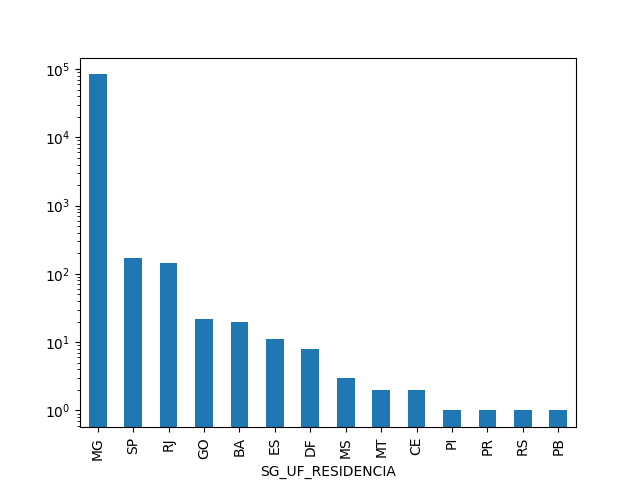
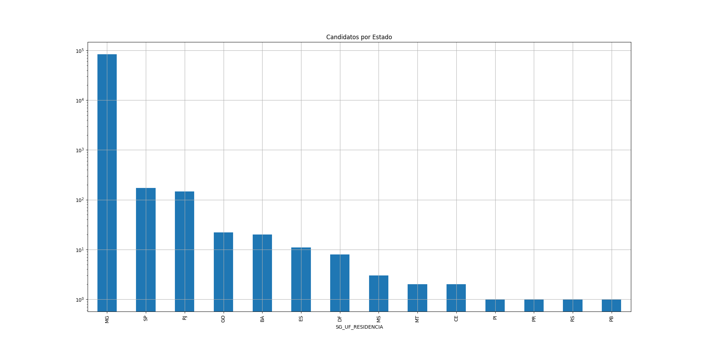
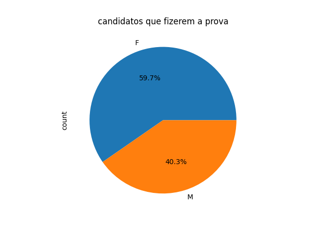
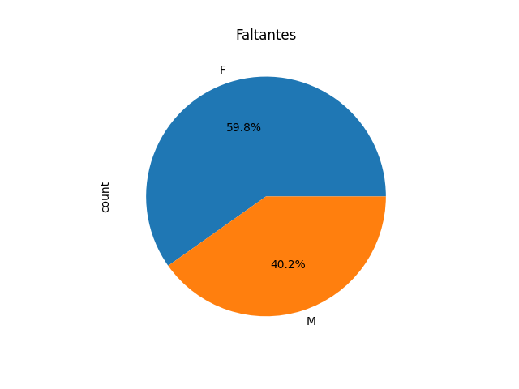
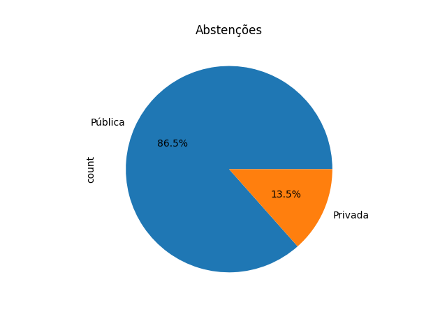

# Conteúdo Live 15/06/2026  
## Trabalhando com pandas III

<a id="topo"></a>

## Sumário
- [Conteúdo Live 15/06/2026](#conteúdo-live-15062026)
  - [Trabalhando com pandas III](#trabalhando-com-pandas-iii)
  - [Sumário](#sumário)
  - [1. Introdução.](#1-introdução)
  - [2. Notações](#2-notações)
  - [3. Analise de base com distribuição](#3-analise-de-base-com-distribuição)

## 1. Introdução.
Na aula em questão iremos iniciar o processo de analise de dados, com base no arquivo presente no repositório de dados dessa aula disponível [aqui](db/dado_mg.csv), Esse arquivo que estamos trabalhando trata-se sobre dados e notas do Enem de MG.
para tal analise daremos seguimento no nosso [notebook](src/aula6.ipynb)


## 2. Notações
Um dos motivos pelos quais utilizaremos a biblioteca pandas em conjunto com a programação, tem como um dos fatores o tamanho do arquivo.
Como estamos trabalhando com `CSV`, o processo de leitura pelo pandas exige que realizamos a inserção do parâmetro `sep = ';'`, pós esse processo também iremos realizar mais um tratamento no data frame, onde iremos adicionar algumas funções nativas seguindo o modelo do código abaixo:  
```python
dados.dropna(inplace=True)
dados.head()
```
Esse comando de `DROPNA`, é utilizado quando em casos que desejamos realizar a exclusão de células vazias ou com valores ausentes, o `inplace = true`, é utilizado quando não queremos realizar a recriação da variável , ou seja isso seria a mesma coisa de realizar 
```python
dados = dados.dropna()
```

Quando realizamos por exemplo o plot dos dados diretamente utilizando o `mathplotlib`, sem que realizamos algum tratamento em um base desse tamanho o gráfico ficaria um pouco estranho, então em analises de dados, nos podemos realizar o tratamento utilizando escalas logarítmicas, para tal processo devemos adicionar o argumento/parâmetro no dada frame para que ele seja apresentado da seguinte maneira descrita abaixo:
```python
dados['SG_UF_RESIDENCIA'].value_counts().plot(kind='bar',logy=True)
plt.show()
```
Mas o que isso quer dizer, estamos utilizando o argumento para informar ao python que o eixo `Y` do gráfico será apresentado em potências de 10, também pode ser denominada como décadas, deixando  o gráfico da seguinte maneira:   

<table style="text-align: center; width: 100%;"> 
<tr>
    <td style="text-align: center;">
    
    </td>
</tr>
</table>

Podemos melhorar um pouco a apresentação do gráfico, utilizando os seguintes argumentos em sequência dos demais:  
```python
dados['SG_UF_RESIDENCIA'].value_counts().plot(kind='bar',logy=True,grid=True,figsize=(20,10),title='Candidatos por Estado')
```
Com esses novos argumentos, teremos um novo gráfico deixando-o a seguinte maneira:  
<table style="text-align: center; width: 100%;"> 
<tr>
    <td style="text-align: center;">
    
    </td>
</tr>
</table>

## 3. Analise de base com distribuição 
No próximo passo iremos realizar uma analise de como estão distribuído nossa base nas presenças da prova separados por sexo dos participantes, e para tal processo iremos separar o dataframe em 2 datareframes diferentes, deixando nosso código assim :

```py
fizeram = dado[dado['NU_NOTA_REDACAO'] != '']
nao_fizeram = dado[dado['NU_NOTA_REDACAO'] == '']
fizeram.head()
nao_fizeram.head()
```  

Com o código acima realizamos o processo de segregação da informações em 2 novos grupos, e assim como recomendação de boa prática analisamos os dados presentes antes de realizar quaisquer plotagem de gráficos. 

Com o código em questão realizamos o processo de instância de novo objeto recebendo o nosso dataframe filtrado onde a nota da redação foi não está nula, o contrário para aqueles que fizerem, posteriormente a isso realizamo o mesmo processo de plotagem visto anteriormente, porém no código acima, realizamos a adição de algumas informações, sendo esse novos argumentos os litados abaixo:  
  -  kind - Aqui determinamos o tipo do gráfico que no caso foi pizza;
  -  title - Aqui é informado o nome do titulo do gráfico;
  -  autopct - Aqui nesse argumento estamos informando que o será um percentual com 1 casa decimal em cima dos valores.
  -  
com esse processo teremos o seguinte gráfico:
<table style="text-align: center; width: 100%;"> 
<tr>
    <td style="text-align: center;">
    
    </td>
</tr>
</table>

Com isso o que poderíamos concluir de maneira errada, que por exemplo existem mais mulheres que faltam do que homens, porém essa nao é analise correta, como nosso grupo amostral do sexo feminino é maior que a população total de homens, isso não significa que mulheres faltam mais que homens, e sim que como temos uma população de um grupo maior que outro é esperado que o número de abstenções sejam maiores. 
Assim como por exemplo se formos levar essa analise por segregação do tipos de escola _"publica e privada"_, temos outro tipo de dados onde temos um dado de pessoas presentes em escola publicas faltaram muito mais proporcionalmente a própria população de  estudantes de escola publica, então através desse dado temos outras conclusões. 

Vamos verificar isso nos gráficos disponibilizados abaixo:  
<table style="text-align: center; width: 100%;"> 
<tr>
    <td style="text-align: left;">
    
    </td>
    <td style="text-align: left;">
    
    </td>
</tr>
</table>

Na imagem temos conforme descrito anteriormente que independente do sexo, as mulheres de fato presentam maior número tanto em faltas como presenças então é natural que seu número de falta seja maior de fato.  
Porém se mudarmos a ótica de analise, e ao invés de realizamos essa analise de sexo por tipo de instituição _(Publica ou Privada)_  
<table style="text-align: center; width: 100%;"> 
<tr>
    <td style="text-align: left;">
    
    </td>
    <td style="text-align: left;">
    
    </td>
</tr>
</table>

Temos uma discrepância nos dados, que por mais que o número de participantes do Enem sejam em suma maioria de escola publica, o próprio número dentre esse universo amostral está em desproporcional com a população da analise. 

---
<table align="center" style="border-collapse: collapse; margin-left: auto; margin-right: auto; text-align: center;"> 
  <caption><b>Skills do projeto</b></caption>
  <tr>
    <td style="padding: 5px;">
      
    </td>
    <td style="padding: 5px;">
      
    </td>
    <td style="padding: 5px;">
      
    </td>
  </tr>
  <tr>
    <td style="padding: 5px;">
      
    </td>
    <td style="padding: 5px;">
      
    </td>
    <td style="padding: 5px;">
      
    </td>
  </tr>
</table>


---
__Titulo:__ Conteúdo Live 15/06/2026  
__Autor:__ Thierry Lucas Chaves    
__Data de Criação:__ 15-06-2026  
__Data de Modificação:__ 15-06-2026  
__Versão:__ "1.0"