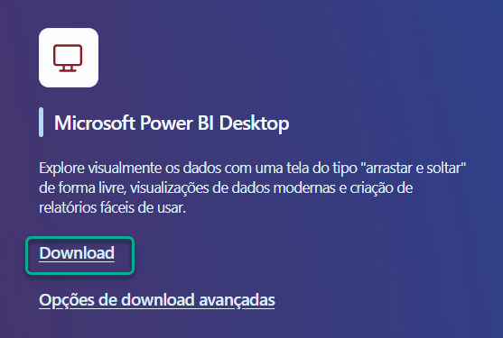
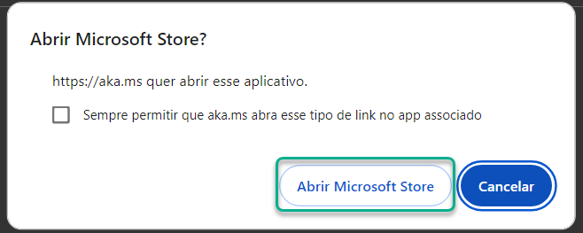
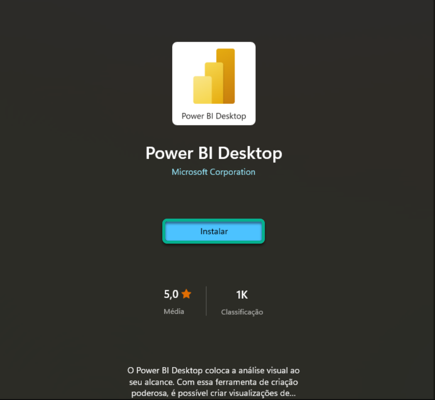
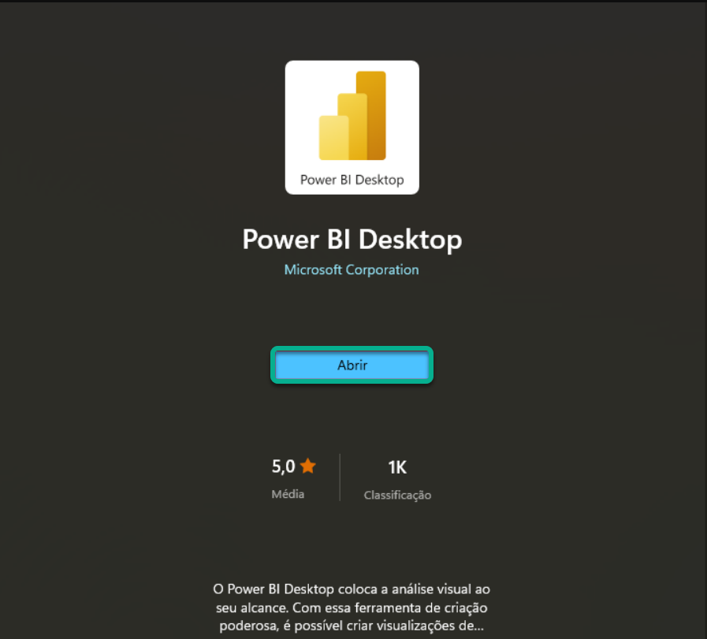

# Conhecendo os dados

## Sumário
- [Conhecendo os dados](#conhecendo-os-dados)
  - [Sumário](#sumário)
  - [1. Apresentação](#1-apresentação)
  - [2. Para saber mais: conta gratuita indisponível](#2-para-saber-mais-conta-gratuita-indisponível)
  - [3. Preparando o ambiente](#3-preparando-o-ambiente)
  - [4. Para saber mais: roadmap do curso](#4-para-saber-mais-roadmap-do-curso)
  - [5. Importando os dados](#5-importando-os-dados)
  - [6. Para saber mais: modelo semântico no Power BI](#6-para-saber-mais-modelo-semântico-no-power-bi)
  - [7. Explorando o DAX](#7-explorando-o-dax)
  - [8. Para saber mais: básico do DAX](#8-para-saber-mais-básico-do-dax)
  - [9. Calculando o desconto com DAX](#9-calculando-o-desconto-com-dax)
  - [10. Mão na massa: explorando as bases de dados](#10-mão-na-massa-explorando-as-bases-de-dados)
  - [11. O que aprendemos?](#11-o-que-aprendemos)

## 1. Apresentação  
Assim como em todos os outros cursos desse repositório, esse curso irá ter como premissa um projeto, porém desse curso em questão iremos realizar a análise de dados com base uma livraria, nossa analise será focada em 3 frentes diferentes sendo elas :
- Produtos
- Vendedores
- Vendas

Com isso iremos avaliar questões como, quais produto são __mais rentáveis__, quais são os __melhores vendedores__, e ainda realizar um __diagnóstico__ sobre as vendas realizadas.  
E todo esse processo iremos realizar utilizando a linguagem `DAX` do Power B.I

[↑ Voltar ao topo](#topo)

---
## 2. Para saber mais: conta gratuita indisponível  

Durante a realização da formação de Power BI, você perceberá que alguns cursos utilizam o Power BI Serviço, a plataforma online onde é possível publicar relatórios e dashboard, além de compartilhar com outras pessoas.

No entanto, sabemos que muitos alunos e alunas estão enfrentando dificuldades para criar uma conta gratuita do Power BI. Isso está acontecendo porque, no momento, a Microsoft não está disponibilizando uma opção de criação de conta gratuita com tanta facilidade como antes, e o acesso ao Power BI Serviço está disponível apenas por meio de licenças pagas.

Apesar disso, não se preocupe, pois isso não afetará em nada nos seus estudos. Você ainda poderá concluir todos os cursos da formação, mesmo sem acesso ao Power BI Serviço. A única diferença é que você não conseguirá publicar os relatórios online, mas poderá fazer todo o projeto no Power BI Desktop, que é gratuito e fornece todas as funcionalidades necessárias durante a formação.

A Microsoft realiza atualizações com alta frequência, então isso pode mudar em breve. Se surgir uma nova maneira de criar uma conta gratuita, vamos comunicar a você. Por enquanto, você pode realizar os cursos da formação de Power BI sem empecilhos.

Em caso de dúvidas, entre em contato conosco pelo Discord da Alura ou pelo canal de atendimento ao estudante.

[↑ Voltar ao topo](#topo)

---
## 3. Preparando o ambiente  

Neste curso, vamos aprender criar __cálculos com DAX__ por meio do Power BI. Para que possamos elaborar as atividades do curso, precisamos instalar o Power BI Desktop e baixar os arquivos que serão utilizados. 

__Material do curso__  
Durante o curso, iremos __aprender DAX__ utilizando uma base de dados contendo informações sobre as vendas de uma __livraria__, contendo o projeto inicial no Power BI e o arquivo Excel das vendas, o conteúdo desse material está dividido nesse repositório na [base de dados](), e o no [dashboard]()  

__Instalação do Power BI__  
- 1 Acesse a página de [download do Power BI.](https://www.microsoft.com/pt-br/power-platform/products/power-bi/downloads)
- 2 Na página de download, você encontrará diversas opções. Procure pela opção __Microsoft Power BI Desktop__ e clique em __Fazer download__:
<table style="text-align: center; width: 100%;"> 
<tr>
    <td style="text-align: left;">
    
    </td>
</tr>
</table>

- 3 Após essa ação, você será redirecionado para uma página em branco, onde será solicitada a abertura da loja da Microsoft. Clique em __Abrir Microsoft Store:__
<table style="text-align: center; width: 100%;"> 
<tr>
    <td style="text-align: left;">
    
    </td>
</tr>
</table>

- 4  Com a página inicial do Power BI Desktop na loja da Microsoft aberta, você pode clicar em __Instalar__:

<table style="text-align: center; width: 100%;"> 
<tr>
    <td style="text-align: left;">
    
    </td>
</tr>
</table>

- 5 Nessa etapa, é necessário aguardar a instalação ser finalizada. Após a instalação ser concluída, você pode clicar em Iniciar:
<table style="text-align: center; width: 100%;"> 
<tr>
    <td style="text-align: left;">
    
    </td>
</tr>
</table>

Pronto! Finalizamos a instalação do Power BI Desktop. Agora você já pode utilizá-lo e dar sequência às atividades do curso.

[↑ Voltar ao topo](#topo)

---
## 4. Para saber mais: roadmap do curso

Seja muito bem-vindo(a) ao nosso curso de Power BI: Construindo cálculos com DAX. Para que você possa ter uma visão geral do que será abordado, vamos conhecer os conteúdos técnicos que serão explorados durante o desenvolvimento do projeto.

Nosso curso está estruturado em seis aulas cuidadosamente planejadas para que você possa compreender os conceitos e funcionalidades do DAX de maneira prática e eficiente.

Com isso em mente, vamos conferir o que será abordado em cada aula?  

__Aula 1: Conhecendo os dados__  

Nesta aula de introdução, faremos as seguintes atividades:

- __Apresentação:__ Conheceremos o curso, o instrutor e os objetivos que iremos alcançar juntos.
- __Importação dos dados:__ Aprenderemos a importar dados para o Power BI, preparando nosso ambiente de trabalho.
- __Básico do DAX:__
    - __Escrever fórmulas:__ Introdução à sintaxe básica do DAX.
    - __Tipos de dados:__ Compreensão dos diferentes tipos de dados utilizados no DAX.
    - __Funções, operadores e variáveis:__ Aprenderemos a usar funções básicas, operadores matemáticos, e como declarar variáveis no DAX.  

__Aula 2: Colunas Calculadas e Medidas__   

Nesta aula, focaremos em conceitos essenciais para manipulação de dados:

- __Colunas Calculadas:__ Como criar e utilizar colunas calculadas no DAX.
- __Medidas:__ Diferença entre colunas calculadas e medidas, e como criar medidas eficientes.
- __Funções de Agregação:__
    - __Funções padrão:__ Como usar funções de agregação padrão, como SUM().
    - __Funções iteradoras:__ Utilização de funções que percorrem as linhas de uma tabela, como SUMX().

__Aula 3: Funções de Tabela__  
Na terceira aula, exploraremos funções que retornam tabelas:

- __FILTER:__ Filtragem de tabelas e resultados específicos.
- __RELATED:__ Como acessar dados específicos através de relacionamentos entre tabelas.
- __ALL:__ Utilização da função ALL() para ignorar filtros.

__Aula 4: Contextos no DAX__  
Esta aula será dedicada a entender como o contexto afeta os cálculos no DAX:

- __Contexto de Filtro:__ Entendimento de como os filtros aplicados afetam os resultados das fórmulas.
- __Contexto de Linha:__ Como o contexto de linha influencia os cálculos e como utilizá-lo corretamente.

__Aula 5: CALCULATE__  

A quinta aula será inteiramente dedicada a uma das funções mais poderosas do DAX:

- __CALCULATE:__ Aprenderemos a usar a função CALCULATE para modificar o contexto de filtro e criar cálculos mais elegantes e dinâmicos.  

__Aula 6: Inteligência Temporal__  

Na última aula, exploraremos funções específicas para análise temporal:

- __Tabela Calendário:__ Criação e utilização de uma tabela calendário para análises temporais.
- __Funções de Inteligência Temporal:__
    - __TOTALYTD:__ Cálculos acumulados no ano.
    - __SAMEPERIODLASTYEAR:__ Comparações com o mesmo período do ano anterior.

Estou confiante de que ao final deste curso, você estará preparado para aplicar DAX em seus projetos e análises de dados com confiança e eficiência. Vamos começar essa jornada juntos!  

[↑ Voltar ao topo](#topo)

---
## 5. Importando os dados

[↑ Voltar ao topo](#topo)

---
## 6. Para saber mais: modelo semântico no Power BI

[↑ Voltar ao topo](#topo)

---
## 7. Explorando o DAX

[↑ Voltar ao topo](#topo)

---
## 8. Para saber mais: básico do DAX

[↑ Voltar ao topo](#topo)

---
## 9. Calculando o desconto com DAX

[↑ Voltar ao topo](#topo)

---
## 10. Mão na massa: explorando as bases de dados

[↑ Voltar ao topo](#topo)

---
## 11. O que aprendemos?

[↑ Voltar ao topo](#topo)

---

<!-- <table style="text-align: center; width: 100%;"> 
<tr>
    <td style="text-align: left;">
    
    </td>
</tr>
</table> -->

---

<table align="center" style="border-collapse: collapse; margin-left: auto; margin-right: auto;"> 
  <caption><b>Skills do projeto</b></caption>
  <tr>
    <td style="padding: 5px;">
      
    </td>
    <td style="padding: 5px;">
      
    </td>
    <td style="padding: 5px;">
      
    </td>
  </tr>
</table>

---
__Titulo:__ Conhecendo os dados
__Autor:__ Thierry Lucas Chaves  
__Data de Criação:__ 19-06-2026  
__Data de Modificação:__ 19-06-2026  
__Versão:__ "1.0"