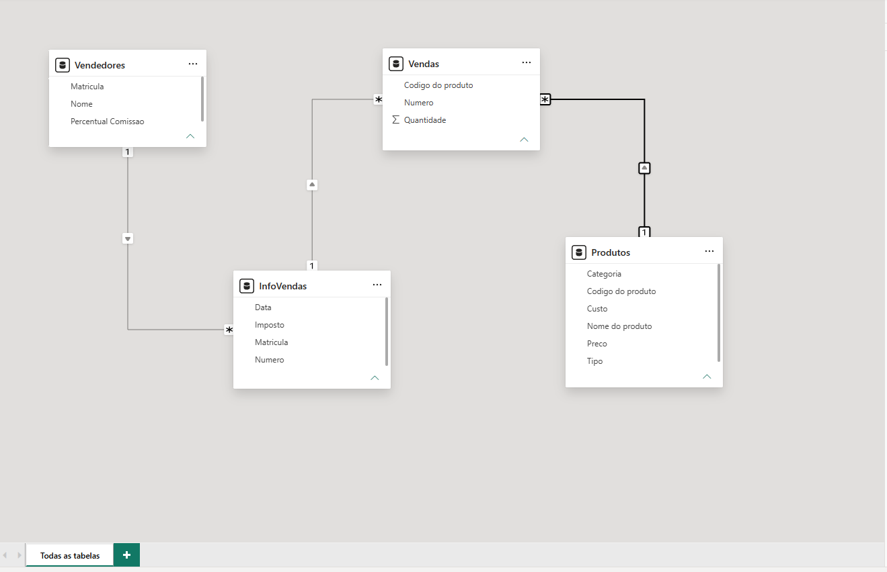
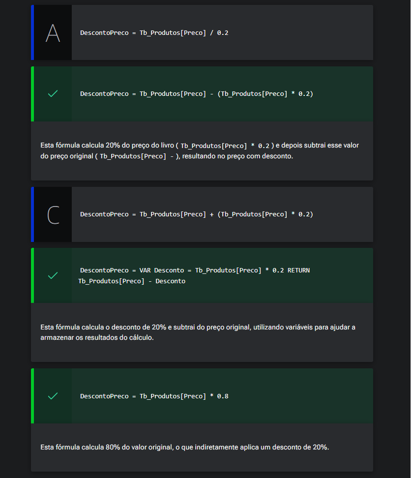

# Conhecendo os dados

<a id="topo"></a>

## Sumário
- [Conhecendo os dados](#conhecendo-os-dados)
  - [Sumário](#sumário)
  - [1. Apresentação](#1-apresentação)
  - [2. Para saber mais: conta gratuita indisponível](#2-para-saber-mais-conta-gratuita-indisponível)
  - [3. Preparando o ambiente](#3-preparando-o-ambiente)
  - [4. Para saber mais: roadmap do curso](#4-para-saber-mais-roadmap-do-curso)
  - [5. Importando os dados](#5-importando-os-dados)
  - [6. Para saber mais: modelo semântico no Power BI](#6-para-saber-mais-modelo-semântico-no-power-bi)
  - [7. Explorando o DAX](#7-explorando-o-dax)
  - [8. Para saber mais: básico do DAX](#8-para-saber-mais-básico-do-dax)
  - [9. Calculando o desconto com DAX](#9-calculando-o-desconto-com-dax)
  - [10. Mão na massa: explorando as bases de dados](#10-mão-na-massa-explorando-as-bases-de-dados)
  - [11. O que aprendemos?](#11-o-que-aprendemos)

## 1. Apresentação  
Assim como em todos os outros cursos desse repositório, esse curso irá ter como premissa um projeto, porém desse curso em questão iremos realizar a análise de dados com base uma livraria, nossa analise será focada em 3 frentes diferentes sendo elas :
- Produtos
- Vendedores
- Vendas

Com isso iremos avaliar questões como, quais produto são __mais rentáveis__, quais são os __melhores vendedores__, e ainda realizar um __diagnóstico__ sobre as vendas realizadas.  
E todo esse processo iremos realizar utilizando a linguagem `DAX` do Power B.I

[↑ Voltar ao topo](#topo)

---
## 2. Para saber mais: conta gratuita indisponível  

Durante a realização da formação de Power BI, você perceberá que alguns cursos utilizam o Power BI Serviço, a plataforma online onde é possível publicar relatórios e dashboard, além de compartilhar com outras pessoas.

No entanto, sabemos que muitos alunos e alunas estão enfrentando dificuldades para criar uma conta gratuita do Power BI. Isso está acontecendo porque, no momento, a Microsoft não está disponibilizando uma opção de criação de conta gratuita com tanta facilidade como antes, e o acesso ao Power BI Serviço está disponível apenas por meio de licenças pagas.

Apesar disso, não se preocupe, pois isso não afetará em nada nos seus estudos. Você ainda poderá concluir todos os cursos da formação, mesmo sem acesso ao Power BI Serviço. A única diferença é que você não conseguirá publicar os relatórios online, mas poderá fazer todo o projeto no Power BI Desktop, que é gratuito e fornece todas as funcionalidades necessárias durante a formação.

A Microsoft realiza atualizações com alta frequência, então isso pode mudar em breve. Se surgir uma nova maneira de criar uma conta gratuita, vamos comunicar a você. Por enquanto, você pode realizar os cursos da formação de Power BI sem empecilhos.

Em caso de dúvidas, entre em contato conosco pelo Discord da Alura ou pelo canal de atendimento ao estudante.

[↑ Voltar ao topo](#topo)

---
## 3. Preparando o ambiente  

Neste curso, vamos aprender criar __cálculos com DAX__ por meio do Power BI. Para que possamos elaborar as atividades do curso, precisamos instalar o Power BI Desktop e baixar os arquivos que serão utilizados. 

__Material do curso__  
Durante o curso, iremos __aprender DAX__ utilizando uma base de dados contendo informações sobre as vendas de uma __livraria__, contendo o projeto inicial no Power BI e o arquivo Excel das vendas, o conteúdo desse material está dividido nesse repositório na [base de dados](https://github.com/thierryLchaves/Santander-Imersao-Digital/blob/b88c8c4de27405cfa388184acd79d0867cb99a6a/Analise_de_dados_e_IA_Nivelamento/Semana_08/Power_BI_Construindo_calculos_com_Dax/db/dataset-vendas-livraria.xlsx), e o no [dashboard](https://github.com/thierryLchaves/Santander-Imersao-Digital/blob/b88c8c4de27405cfa388184acd79d0867cb99a6a/Analise_de_dados_e_IA_Nivelamento/Semana_08/Power_BI_Construindo_calculos_com_Dax/src/projeto-dax-livraria-inicial.pbix)  

__Instalação do Power BI__  
- 1 Acesse a página de [download do Power BI.](https://www.microsoft.com/pt-br/power-platform/products/power-bi/downloads)
- 2 Na página de download, você encontrará diversas opções. Procure pela opção __Microsoft Power BI Desktop__ e clique em __Fazer download__:
<table style="text-align: center; width: 100%;"> 
<tr>
    <td style="text-align: left;">
    
    </td>
</tr>
</table>

- 3 Após essa ação, você será redirecionado para uma página em branco, onde será solicitada a abertura da loja da Microsoft. Clique em __Abrir Microsoft Store:__
<table style="text-align: center; width: 100%;"> 
<tr>
    <td style="text-align: left;">
    
    </td>
</tr>
</table>

- 4  Com a página inicial do Power BI Desktop na loja da Microsoft aberta, você pode clicar em __Instalar__:

<table style="text-align: center; width: 100%;"> 
<tr>
    <td style="text-align: left;">
    
    </td>
</tr>
</table>

- 5 Nessa etapa, é necessário aguardar a instalação ser finalizada. Após a instalação ser concluída, você pode clicar em Iniciar:
<table style="text-align: center; width: 100%;"> 
<tr>
    <td style="text-align: left;">
    
    </td>
</tr>
</table>

Pronto! Finalizamos a instalação do Power BI Desktop. Agora você já pode utilizá-lo e dar sequência às atividades do curso.


[↑ Voltar ao topo](#topo)

---
## 4. Para saber mais: roadmap do curso

Seja muito bem-vindo(a) ao nosso curso de Power BI: Construindo cálculos com DAX. Para que você possa ter uma visão geral do que será abordado, vamos conhecer os conteúdos técnicos que serão explorados durante o desenvolvimento do projeto.

Nosso curso está estruturado em seis aulas cuidadosamente planejadas para que você possa compreender os conceitos e funcionalidades do DAX de maneira prática e eficiente.

Com isso em mente, vamos conferir o que será abordado em cada aula?  

__Aula 1: Conhecendo os dados__  

Nesta aula de introdução, faremos as seguintes atividades:

- __Apresentação:__ Conheceremos o curso, o instrutor e os objetivos que iremos alcançar juntos.
- __Importação dos dados:__ Aprenderemos a importar dados para o Power BI, preparando nosso ambiente de trabalho.
- __Básico do DAX:__
    - __Escrever fórmulas:__ Introdução à sintaxe básica do DAX.
    - __Tipos de dados:__ Compreensão dos diferentes tipos de dados utilizados no DAX.
    - __Funções, operadores e variáveis:__ Aprenderemos a usar funções básicas, operadores matemáticos, e como declarar variáveis no DAX.  

__Aula 2: Colunas Calculadas e Medidas__   

Nesta aula, focaremos em conceitos essenciais para manipulação de dados:

- __Colunas Calculadas:__ Como criar e utilizar colunas calculadas no DAX.
- __Medidas:__ Diferença entre colunas calculadas e medidas, e como criar medidas eficientes.
- __Funções de Agregação:__
    - __Funções padrão:__ Como usar funções de agregação padrão, como SUM().
    - __Funções iteradoras:__ Utilização de funções que percorrem as linhas de uma tabela, como SUMX().

__Aula 3: Funções de Tabela__  
Na terceira aula, exploraremos funções que retornam tabelas:

- __FILTER:__ Filtragem de tabelas e resultados específicos.
- __RELATED:__ Como acessar dados específicos através de relacionamentos entre tabelas.
- __ALL:__ Utilização da função ALL() para ignorar filtros.

__Aula 4: Contextos no DAX__  
Esta aula será dedicada a entender como o contexto afeta os cálculos no DAX:

- __Contexto de Filtro:__ Entendimento de como os filtros aplicados afetam os resultados das fórmulas.
- __Contexto de Linha:__ Como o contexto de linha influencia os cálculos e como utilizá-lo corretamente.

__Aula 5: CALCULATE__  

A quinta aula será inteiramente dedicada a uma das funções mais poderosas do DAX:

- __CALCULATE:__ Aprenderemos a usar a função CALCULATE para modificar o contexto de filtro e criar cálculos mais elegantes e dinâmicos.  

__Aula 6: Inteligência Temporal__  

Na última aula, exploraremos funções específicas para análise temporal:

- __Tabela Calendário:__ Criação e utilização de uma tabela calendário para análises temporais.
- __Funções de Inteligência Temporal:__
    - __TOTALYTD:__ Cálculos acumulados no ano.
    - __SAMEPERIODLASTYEAR:__ Comparações com o mesmo período do ano anterior.

Estou confiante de que ao final deste curso, você estará preparado para aplicar DAX em seus projetos e análises de dados com confiança e eficiência. Vamos começar essa jornada juntos!  

[↑ Voltar ao topo](#topo)

---
## 5. Importando os dados
O objetivo primário de nosso projeto será como podemos auxiliar a livraria a aumentar o seu faturamento.   
Utilizando a estratégia de divisão de escopo, nosso objetivo poderá ser compreendido em algumas etapas:  
- 1 Obter os dados da livraria;
- 2 Analisar os dados;
- 3 Aumentar a rentabilidade através da interpretação dos dados.  

Assim como em todos os processos vistos anteriormente o primeiro passo será realizar a carga dos dados para nosso [projeto](https://github.com/thierryLchaves/Santander-Imersao-Digital/blob/b88c8c4de27405cfa388184acd79d0867cb99a6a/Analise_de_dados_e_IA_Nivelamento/Semana_08/Power_BI_Construindo_calculos_com_Dax/src/projeto-dax-livraria-inicial.pbix), iremos acessar dentro da guia da página inicial a opção de obter dados, e selecionaremos a primeira opção de pasta de trabalho do Excel.  
> PS: O processo de importação não será detalhado, em minucias nesse repositório pois esse foi visualizado diversas vezes em outros cursos dentro desse repositório.
> PS2: Assim como visto na [aula de referência](https://github.com/thierryLchaves/Santander-Imersao-Digital/blob/1ed7d0365dd35a50d6166040a71843b4f82c09fe/Analise_de_dados_e_IA_Nivelamento/Semana_07/Power_BI_Desktop_Realizando_ETL_no_Power_Query/03_Avancando_nas_transformacoes/AvancandoNasTransformacoes.md), iremos utilizar o parâmetros e concatenação para melhor trabalho e reaproveitamento em diferentes máquinas   

Iremos realizar o processo padrão de importação sendo ele, apenas de import verificação do tipo de dado das colunas e renomeação das tabelas, seguindo o descrito abaixo 
- Table_1 -> Vendas
- Table_2 -> InforVendas
- Table_3 -> Produtos
- Table_4 -> Vendedores  

Pós renomeação e garantia das colunas alteradas com o tipo certo iremos fechar e aplicar para dar seguimento no processo. 

---
__Sobre as fontes de dados.__  
Em nossa base temos 4 tabelas, conforme vimos e tratamos anteriormente, a primeira tabela que devemos  visualizar a a mais importante é nossa tabela de vendas, essa tabela contem as informações básicas de cada venda, como código da venda, código do produto e a quantidade vendida, posteriormente a ela temos uma tabela de relação ou em termos de banco de dados uma tabela de <a href="#ent_f"> __Entidade fraca__ </a>, que pela a analise de suas colunas temos por o relacionamento direto entre a matricula do vendedor, data da venda, o número que está relacionado diretamente ao número de _"código da venda"_, e o percentual de imposto aplicado, também temos outras tabelas sendo a tabela de produtos, na qual teremos as informações sobre os produtos que são ofertados pela livraria, e por fim uma tabela sobre os vendedores, com essas informações podemos verificar o relacionamento entre nossas tabelas para garantir que os relacionamentos que foram construídos pelo Power B.I, foram feitos da maneira correta, e caso não podemos realizar o relacionamento através da guia de modelagem, deixando o relacionamento das tabelas referidas da seguinte maneira

<table style="text-align: center; width: 100%;"> 
<tr>
    <td style="text-align: left;">
    
    </td>
</tr>
</table>

<details id="ent_f">
    <summary> Entidade fraca</summary>
    <p>É uma entidade em um modelo relacional (ER) que não possui atributos suficientes para gerar uma chave primária própria e, portanto, depende da existência de outra entidade (entidade forte) para ser identificada.</p>
    <ul>
        <li><strong>Dependência de Existência:</strong> Se a entidade forte (pai) for excluída, a entidade fraca (filho) perde o sentido e também deve ser eliminada do banco de dados (ex: se o 'Funcionário' for deletado, seus 'Dependentes' também são).</li>
        <li><strong>Chave Primária Composta:</strong> Sua identificação é formada pela junção da chave primária da entidade forte com o seu próprio discriminador/chave parcial (ex: ID_Funcionario + Numero_Dependente).</li>
        <li><strong>Representação Gráfica:</strong> Nos diagramas Entidade-Relacionamento convencionais (notação de Chen), ela é representada visualmente por um retângulo duplo, e o seu relacionamento dependente por um losango duplo.</li>
    </ul>
</details>


[↑ Voltar ao topo](#topo)

---
## 6. Para saber mais: modelo semântico no Power BI  

Os modelos semânticos desempenham um papel crucial na análise de dados, facilitando a compreensão e a utilização eficiente das informações. Vamos explorar o conceito de modelos semânticos, os diferentes modos de operação no Power BI e as etapas para criar um modelo semântico robusto.

__O que são Modelos Semânticos?__  

Modelos semânticos são estruturas que organizam e definem os dados de forma a torná-los mais compreensíveis e utilizáveis para análise e geração de insights. No contexto do Power BI, um modelo semântico serve como a camada intermediária entre as fontes de dados brutas e os relatórios com visualizações. Ele encapsula a lógica de negócios, relações e cálculos necessários para transformar dados em informações significativas.

__Modos de Modelos Semânticos__ 

| __Modo__        | __Descrição__                                                                                                                                                                 | __Uso Ideal__                                                                          |
| :-------------- | :---------------------------------------------------------------------------------------------------------------------------------------------------------------------------- | :------------------------------------------------------------------------------------- |
| __Importação__  | Os dados são carregados diretamente para o Power BI Desktop e armazenados localmente. Oferece desempenho rápido para consultas e visualizações.                               | Conjuntos de dados estáticos ou que não mudam frequentemente.                          |
| __DirectQuery__ | Consultas são enviadas diretamente à fonte de dados original durante as interações. Ideal para conjuntos de dados grandes ou dinâmicos que exigem atualizações em tempo real. | Necessidade de atualizações em tempo real; conjuntos de dados dinâmicos                |
| __Composto__    | Combina benefícios de importação e DirectQuery. Permite importar algumas tabelas e consultar outras diretamente na fonte, oferecendo flexibilidade e otimização.              | Flexibilidade para otimizar desempenho e atualizações em tempo real quando necessário. |

Cada modo oferece uma abordagem única para lidar com seus dados, garantindo desempenho otimizado e atendendo às necessidades específicas de atualização e interatividade.


__Etapas do Modelo Semântico__  

Os modelos semânticos são criados seguindo uma sequência de etapas até o momento da sua publicação. Cada uma delas é essencial para o desenvolvimento do modelo.

No diagrama abaixo podemos conferir as 5 etapas necessárias para construção do modelo semântico no Power BI:
<table style="text-align: center; width: 100%;"> 
<tr>
    <td style="text-align: left;">
    
    </td>
</tr>
</table>

A seguir, vamos explorar cada uma dessas etapas para entender como escolher a melhor estratégia para seus projetos.   

__Conexão dos Dados__  

A primeira etapa na criação de um modelo semântico é conectar-se às fontes de dados. O Power BI suporta uma ampla variedade de fontes, incluindo bancos de dados SQL, arquivos Excel, serviços web e muito mais.

__Limpeza e Tratamento dos Dados__  

Uma vez conectados, os dados brutos geralmente precisam ser limpos e transformados. Isso pode incluir a remoção de duplicatas, tratamento de valores nulos, padronização de formatos e conversão de tipos de dados. O Power Query no Power BI facilita esse processo com uma interface intuitiva e ferramentas poderosas de transformação de dados.

__Definição dos Relacionamentos entre Tabelas__  

Com os dados limpos, o próximo passo é definir os relacionamentos entre as tabelas. Isso pode ser feito seguindo designs como Esquema Estrela. Relações bem definidas são essenciais para garantir que os cálculos e visualizações reflitam corretamente as interações entre os diferentes conjuntos de dados.

__Criação dos Cálculos com DAX__  

Após definir os relacionamentos, é hora de criar cálculos usando DAX (Data Analysis Expressions). DAX permite a criação de medidas, colunas calculadas e tabelas que podem realizar operações complexas e dinâmicas sobre os dados.

Essa etapa será o foco deste curso. Através dela, concluiremos a construção do nosso modelo semântico do Power BI.

__Publicação no Power BI Serviço__  

Com o modelo semântico completo, a última etapa consiste em publicar o relatório no Power BI Serviço. Isso permite que os relatórios e dashboards sejam compartilhados com outros usuários e acessados de qualquer lugar.

Dessa forma, criar um modelo semântico eficaz no Power BI envolve um processo estruturado de conexão, limpeza, modelagem e publicação de dados. Ao seguir essas etapas, você pode transformar dados brutos em insights valiosos, facilitando decisões informadas e estratégicas.


[↑ Voltar ao topo](#topo)

---
## 7. Explorando o DAX
A priori iremos acessar o modelo de visualização de tabela, e através desse modelo visualizaremos algumas opções existentes dentro do Power B.I para que possamos realizar algumas operações importantes nas nossas fontes de dados, mas antes de realizar qualquer aplicação de fórmula `DAX` vamos pincelar algumas funcionalidades de fácil acesso dentro do Power B.I, para confecção de uma fórmula DAX. 
Dentro do modelo de visualização de tabela teremos a guia Ferramentas de tabela, e nesse no agrupamento de menu cálculos temos algumas opções dentre elas:  
- Nova medida
- Medida Rápida
- Nova Coluna
- Nova tabela.

> Antes de quaisquer edições ou novas aplicações e importante ter como um rotina o processo de salvar o projeto.   
---
O primeiro passo de alteração a ser feita em nosso projeto será a criação de uma nova coluna, que iremos realizar através do botão de `Nova Coluna`, quando realizado tal processo, o Power B.I ira construir uma nova coluna no fim de nossa tabela, aqui iremos iremos nos ater a um comportamento padrão de fórmulas/códigos DAX, seu funcionamento é equivalente a uma fórmula Excel, na tal será apontado na extremidade esquerda o nome do campo ou coluna seguido de um símbolo de `=` onde após tal símbolo será escrito a funcionalidade DAX, para renomear a coluna podemos tanto faze-la através da barra de fórmulas quanto com duplo clique sobre a a coluna para renomeá-la. 
> PS: Diferentemente de outras linguagens de programação em fórmulas DAX, para o Power B.I o espaço entre nome de variáveis, ou colunas são interpretados normalmente.  
Pós a criação da coluna em questão iremos aplicar uma fórmula DAX, para aplicar 50% de desconto sobre o preço, e assim como fazemos no Excel, as fórmulas DAX permitem realizar a referências de colunas, e assim como operações aritméticas feitas em computado os caracteres para operações permanecem, por fim teremos um fórmula conforme exemplificada abaixo:  
```DAX
Desconto Preco = Produtos[Preco] * 0.5
```
Para além das aplicações de cálculos com fórmulas e operações aritméticas, o DAX nos possibilita também a utilização de funções, ou seja podemos realizar a mesma operação feita no passo anterior através de uma função DAX. 
```DAX
Desconto Preco Funcao = DIVIDE(Produtos[Preco],2,0)
```
Sobre a função assim ela nos permite a passagem de 3 parâmetros, sendo eles: 
- 1º O numerador: Aplicasse aqui qual será a coluna ou valor que desejamos dividir
- 2º O denominador: A base de calculo que será aplicada a divisão ou denominador da divisão
- 3º SAFERESULT: Aqui devemos informar um valor reserva, para casos de divisões incorretas, conforme descrito pelo hint da função 
  - _Função Safe Divide com capacidade para tratar casos de divisão por zero._

Outro ponto sobre funcionalidades DAX, ela nos permite a definição e utilização de variáveis, para isso antes de declarar uma variável devemos utilizar a palavra reservada `VAR`, ainda sobre variáveis, essas seguem o padrão de outras linguagens de programação ou seja nomes de variáveis não devem e não podem conter espaços entre os nomes. Assim podemos reescrever a primeira fórmula da seguinte forma:  
```DAX
Desconto Preco = 
VAR DescontoProduto = Produtos[Preco] * 0.5
RETURN DescontoProduto
```
Com essa formula obteremos o mesmo valor sobre a coluna, porém o que foi modificado em suma fora a sintaxe da fórmula, onde temos duas palavras reservadas, para aplicação dessa formula, 
- `VAR:` Define que a sequência de informações a frente serão utilizadas como variável  no exemplo acima o nome o que essa variável recebe que no casso uma operação
- `RETURN`  Define o que será retornado no caso o valor que está contido na variável.   


[↑ Voltar ao topo](#topo)

---
## 8. Para saber mais: básico do DAX

A linguagem DAX (Data Analysis Expressions) é fundamental para o trabalho com o Power BI, proporcionando uma maneira poderosa de criar cálculos e análises complexas. A seguir, vamos conhecer alguns conceitos básicos e boas práticas para começar:  

__Conceitos Básicos do DAX__

- 1 __Colunas Calculadas:__ São adicionadas ao modelo de dados e calculadas linha a linha. Úteis para criar novas informações baseadas em outras colunas.

- 2 __Medidas:__ São cálculos agregados que utilizam funções DAX para resumir dados, como somas, médias e contagens. São calculadas dinamicamente com base no contexto da filtragem.

- 3 __Contexto:__ No DAX, o contexto refere-se ao ambiente em que um cálculo é avaliado. Existem dois tipos principais:
    - __Contexto de Linha:__ Refere-se ao contexto de linha de uma tabela.
    - __Contexto de Filtro:__ Refere-se ao conjunto de filtros que são aplicados ao modelo de dados.

- 4 __Funções Comuns:__ Algumas funções DAX são frequentemente usadas, como:
    - `SUM()`, `AVERAGE()`, `COUNT()`, `CALCULATE()`, `FILTER()`, `RELATED()`, `ALL()`, entre outras.

Para explorar as principais funções do DAX, confira o artigo [Power BI: explorando Cheat Sheet do DAX](https://www.alura.com.br/artigos/dax-cheat-sheet), que contém as principais funções da linguagem DAX.

__Boas Práticas no DAX__  

- __Nomeação Clara:__ Use nomes claros e descritivos para colunas calculadas e medidas para facilitar a compreensão e manutenção do modelo.
- __Uso de Variáveis:__ Utilizar variáveis em DAX (VAR) pode melhorar a legibilidade e o desempenho das suas fórmulas. Variáveis permitem que você armazene resultados intermediários e os reutilize dentro da mesma expressão.
- __Formatação:__ Formate suas fórmulas DAX para melhorar a legibilidade. Quebre linhas longas, use recuos para indicar blocos lógicos e organize suas expressões de forma clara.
- __Evite Colunas Calculadas Desnecessárias:__ Prefira usar medidas sempre que possível, pois elas são mais eficientes e flexíveis. As colunas são calculadas quando os dados são carregados e armazenados no modelo, o que pode aumentar o tamanho do modelo e diminuir o desempenho.  

Para explorar ainda mais, recomendo conferir o artigo [Linguagem DAX: noções básicas e boas práticas](https://www.alura.com.br/artigos/linguagem-dax), que contém as principais funcionalidades e boas práticas da linguagem DAX.  

[↑ Voltar ao topo](#topo)

---
## 9. Calculando o desconto com DAX

Você está trabalhando em um projeto de análise de dados para uma livraria. Recentemente, a equipe de marketing decidiu oferecer descontos especiais em todos os livros para atrair mais clientes e aumentar as vendas. Como parte dessa iniciativa, você foi a pessoa encarregada de calcular o novo preço dos livros após aplicar um desconto de 20% sobre o preço original.

Considere o seguinte cenário: é necessário calcular o novo preço de cada livro após aplicar um desconto de 20% sobre o preço original. Qual das fórmulas DAX abaixo você utilizaria para realizar esse cálculo? Escolha as alternativas corretas.  

<table style="text-align: center; width: 100%;"> 
<tr>
    <td style="text-align: left;">
    
    </td>
</tr>
</table>

[↑ Voltar ao topo](#topo)

---
## 10. Mão na massa: explorando as bases de dados
No mundo da análise de dados, compreender a estrutura das bases de dados com as quais você trabalha é essencial para realizar análises precisas e valiosas. No Power BI, isso envolve entender as tabelas, os campos que elas contêm e como esses campos se relacionam entre si.

Para realizar o projeto do curso, você recebeu acesso a quatro tabelas principais: Vendas, InfoVendas, Produtos e Vendedores. Cada uma dessas tabelas armazena informações específicas que são cruciais para as análises que você realizará no futuro. Para maximizar a utilidade dessas tabelas, é necessário identificar o significado de cada campo, determinar os tipos de dados apropriados e estabelecer as relações corretas entre as tabelas.

[↑ Voltar ao topo](#topo)

---
## 11. O que aprendemos?

[↑ Voltar ao topo](#topo)

---

<!-- <table style="text-align: center; width: 100%;"> 
<tr>
    <td style="text-align: left;">
    
    </td>
</tr>
</table> -->

---

<table align="center" style="border-collapse: collapse; margin-left: auto; margin-right: auto;"> 
  <caption><b>Skills do projeto</b></caption>
  <tr>
    <td style="padding: 5px;">
      
    </td>
    <td style="padding: 5px;">
      
    </td>
    <td style="padding: 5px;">
      
    </td>
  </tr>
</table>


---
__Titulo:__ Conhecendo os dados
__Autor:__ Thierry Lucas Chaves  
__Data de Criação:__ 19-06-2026  
__Data de Modificação:__ 19-06-2026  
__Versão:__ "1.0"