# Colunas calculadas e medidas

<a id="topo"></a>

## Sumário
- [Colunas calculadas e medidas](#colunas-calculadas-e-medidas)
  - [Sumário](#sumário)
  - [1. Projeto da aula anterior](#1-projeto-da-aula-anterior)
  - [2. Calculando o Total de Vendas](#2-calculando-o-total-de-vendas)
  - [3. Para saber mais: ferramentas DAX](#3-para-saber-mais-ferramentas-dax)
  - [4. Calculando a Margem](#4-calculando-a-margem)
  - [5. Porcentagem da Margem](#5-porcentagem-da-margem)
  - [6. Para saber mais: colunas calculadas e medidas](#6-para-saber-mais-colunas-calculadas-e-medidas)
  - [7. Para saber mais: medidas rápidas, implícitas e explícitas](#7-para-saber-mais-medidas-rápidas-implícitas-e-explícitas)
  - [8. Aprimorando os cálculos](#8-aprimorando-os-cálculos)
  - [9. Para saber mais: funções iteradoras](#9-para-saber-mais-funções-iteradoras)
  - [10. Calculando a receita média](#10-calculando-a-receita-média)
  - [11. Mão na massa: criando medidas com funções iteradoras](#11-mão-na-massa-criando-medidas-com-funções-iteradoras)
  - [12. O que aprendemos?](#12-o-que-aprendemos)

## 1. Projeto da aula anterior
Caso prefira, você pode [acessar o arquivo](https://github.com/thierryLchaves/Santander-Imersao-Digital/blob/f22d04a155a7a2c82e5f6f401505397e1b941980/Analise_de_dados_e_IA_Nivelamento/Semana_08/Power_BI_Construindo_calculos_com_Dax/src/projeto-dax-livraria-inicial.pbix) com o projeto do curso no ponto em que paramos na aula anterior.

Ao carregar o projeto, você pode encontrar um problema na origem dos dados, que estão direcionadas para o diretório do instrutor.

<table style="text-align: center; width: 100%;"> 
<tr>
    <td style="text-align: left;">
    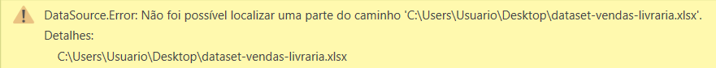
    </td>
</tr>
</table>


Nesse caso, vamos utilizar uma funcionalidade do Power BI chamada Parâmetro. Com ela, o processo de modificar o caminho dos arquivos será facilitado, pois iremos substituir o caminho do arquivo por esse parâmetro na fonte do arquivo, como na imagem abaixo:
<table style="text-align: center; width: 100%;"> 
<tr>
    <td style="text-align: left;">
    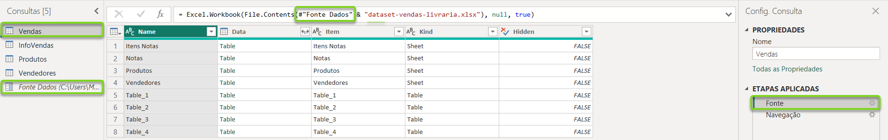
    </td>
</tr>
</table>

Acima, podemos verificar que estamos na tabela de Clientes, na etapa de Fonte, onde temos o trecho __#"Fonte Dados" & "dataset-vendas-livraria.xlsx"__ representando o caminho do arquivo. Perceba que o caminho da pasta onde está o arquivo de Clientes não está escrito ali, pois ele está armazenado no parâmetro __Fonte Dados__.

Como o parâmetro já vai estar criado, podemos simplesmente alterar seu valor, o que irá afetar todos os arquivos que o utilizam, ao invés de alterar a origem de cada arquivo por vez.

Para resolver isso, você pode seguir estes passos:  

- 1  No Editor do Power Query, selecione o parâmetro Fonte Dados na lateral esquerda. Você irá substituir o texto que se encontra no campo destacado na imagem abaixo: 
<table style="text-align: center; width: 100%;"> 
<tr>
    <td style="text-align: left;">
    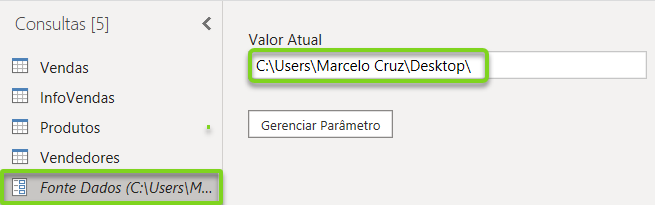
    </td>
</tr>
</table>

-2  Em seguida, acesse a pasta onde os arquivos do seu projeto se encontram, clique na barra superior e copie o diretório da sua pasta:  
<table style="text-align: center; width: 100%;"> 
<tr>
    <td style="text-align: left;">
    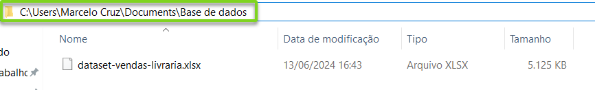
    </td>
</tr>
</table>

- 3 Após copiar o caminho da pasta, basta colá-lo no campo de texto do parâmetro no Power BI. Um detalhe importante é colocar mais uma contra barra no final do caminho `(\)` para que o caminho dos arquivos seja localizado corretamente.

- 4 Por fim, ao retornar para a tela inicial do Power BI, após selecionar Fechar e Aplicar, irá aparecer uma mensagem no topo, com fundo amarelo, informando que as alterações realizadas não foram aplicadas. Para solucionar essa questão, basta clicar em Aplicar alterações e esperar que os dados sejam atualizados.

Pronto, finalizamos todos os passos! Após procurar pelo caminho da pasta e atualizar o valor do parâmetro, conseguimos atualizar a fonte de dados para o prosseguimento do curso a partir daqui.

Qualquer dúvida, sinta-se à vontade para perguntar no fórum do curso.

Bons estudos!

[↑ Voltar ao topo](#topo)

---
## 2. Calculando o Total de Vendas
A premissa inicial do projeto gira em torno de uma maneira de auxiliar a livraria de maneiras de como __Aumentar as suas vendas__, a partir desse escopo eles gostariam de entender quais são os __produtos com maior rentabilidade__.  
Agora para que possamos entender quais são esses produtos com maior número de vendas precisamos obter alguns números antes, e um deles é o __Total de vendas__ , porém para obter esse valor total de vendas, não podemos simplesmente realizar a soma da quantidade de vendas, com base no código dos produtos, pois o que queremos saber é o valor total de vendas, e esse somente pode ser obtido com o __preço__ do produto que está presente na tabela de produtos.  
Para que possamos realizar esse calculo iremos utilizar uma função especifica, ela será aplicada diretamente na tabela de vendas, e nela iremos criar uma nova coluna. 
> PS: Essa criação pode ser realizada tanto através da opção dentro da guia de ferramentas de tabela, quanto através da opção de mouse lado direto em cima da tabela alvo Nova Coluna.  

Esse processo de criar colunas para obtenção de dados com fórmulas também é conhecido como <a href="#ColunmCalcuate">__Coluna calculada__</a>, dentro dessa coluna aplicaremos a função `RELATED` que tem como objetivo retornar um valor relacionado de outra tabela, que é justamente o que queremos o preço do produto da tabela de produtos, sua sintaxe para o contexto do nosso projeto ficaria da seguinte forma:  
```DAX
Preco Calculado = RELATED(Produtos[Preco])
```
Com essa informação dos preços dos produtos, agora iremos obter o total de vendas, e para isso basta aplicarmos a multiplicação da quantidade de vendas sobre essa coluna calculada deixando nossa nova coluna calculada da seguinte maneira:  

```DAX
Total Vendas = Vendas[Quantidade] * Vendas[Preco Calculado]
```
Com esse processo temos agora a informação do total de vendas sobre cada produto, porém somente essa informação não é o suficiente para atingir nossa premissa do projeto, sendo necessário também obtermos o custo sobre cada produto, essa informação é o que veremos adiante. 


<details id="ColunmCalcuate">
    <summary> Coluna calculada </summary>
    <p>É uma nova coluna adicionada a uma tabela existente no modelo do Power BI, cujos valores são computados linha por linha (contexto de linha) através de uma expressão DAX.</p>
    <ul>
        <li><strong>Contexto de Linha:</strong> A fórmula avalia e calcula o resultado individualmente para cada linha da tabela no momento da criação ou atualização dos dados, antes de qualquer interação do usuário no relatório.</li>
        <li><strong>Consumo de Memória (RAM):</strong> Diferente das medidas, os valores resultantes ocupam espaço físico no modelo de dados (armazenados em RAM e disco), o que pode impactar o tamanho do arquivo `.pbix`.</li>
        <li><strong>Casos de Uso Ideais:</strong> São perfeitas quando o resultado precisa ser utilizado para segmentar dados (Slicers/Filtros), eixos de gráficos, classificação de colunas ou para criar relacionamentos entre tabelas.</li>
    </ul>
</details>

[↑ Voltar ao topo](#topo)

---
## 3. Para saber mais: ferramentas DAX  

Durante a criação de fórmulas DAX, nos deparamos com diversos desafios, seja para formatar código, descobrir como uma função específica funciona, ou até mesmo como aplicar boas práticas. Pensando nisso, para auxiliar no desenvolvimento e otimização de fórmulas DAX, existem várias ferramentas valiosas. A seguir, apresentamos quatro ferramentas essenciais para qualquer desenvolvedor DAX: DAX Formatter, DAX Guide, DAX Patterns e Bravo.  

---

__DAX Formatter__  

O DAX Formatter é uma ferramenta online gratuita que ajuda a melhorar a legibilidade das fórmulas DAX através da formatação automática do código. Ele reorganiza as expressões DAX adicionando indentação, espaçamento e quebras de linha de forma adequada. Isso facilita a leitura e a manutenção do código, especialmente para fórmulas complexas. A ferramenta é bastante útil para garantir que as melhores práticas de formatação sejam seguidas.

Você pode acessar o DAX Formatter no site oficial: [DAX Formatter.](https://www.daxformatter.com/)

---

__DAX Guide__  

O DAX Guide oferece documentação detalhada sobre as funções DAX. Ele fornece descrições, exemplos de uso, sintaxe, parâmetros e melhores práticas para cada função DAX. Através dessa ferramenta, é possível entender melhor como cada função pode ser aplicada em diferentes cenários de análise de dados.

Acesse o DAX Guide em: [DAX Guide.](https://dax.guide/)

---

__DAX Patterns__  

O DAX Patterns é um repositório de padrões de design para resolver problemas comuns de modelagem de dados e cálculos utilizando DAX. Criado por especialistas renomados, o DAX Patterns oferece soluções testadas e otimizadas para diversos cenários, como cálculos de data, análise de dados acumulados, segmentação de dados e muito mais. Essa ferramenta é especialmente útil para acelerar o desenvolvimento, garantindo que você esteja utilizando abordagens eficientes e eficazes para resolver problemas complexos de análise de dados.

Explore os padrões disponíveis no site: [DAX Patterns.](https://www.daxpatterns.com/)

---

__Bravo__  

Bravo é uma ferramenta gratuita desenvolvida pela [SQLBI](https://www.sqlbi.com/) que oferece uma interface amigável para otimizar e gerenciar modelos de dados no Power BI. Com ele, você pode executar várias tarefas, como análise e otimização de medidas DAX, formatação de código DAX, e análise de desempenho do modelo. Além disso, o Bravo facilita a geração de resumos e relatórios de uso do modelo, ajudando a identificar possíveis melhorias e otimizações. Essa ferramenta é ideal para quem busca aumentar a eficiência e a performance de seus modelos de dados no Power BI.

Você pode baixar e aprender mais sobre Bravo em: [Bravo.](https://bravo.bi/)

---

Utilizar ferramentas como DAX Formatter, DAX Guide, DAX Patterns e Bravo tornam o desenvolvimento mais fácil, rápido e eficiente. Essas ferramentas ajudam a garantir que você esteja escrevendo código limpo, bem documentado e otimizado, permitindo que você se concentre nas análises e insights valiosos que o DAX pode proporcionar.

[↑ Voltar ao topo](#topo)

---
## 4. Calculando a Margem
Agora iremos trabalhar com o calculo da __margem das vendas__, para realizar esse calculo iremos obter o preço dos custos desses produtos, e esse calculo do custo será inserido dentro da nossa tabela de vendas, e para isso iremos utilizar a mesma fórmula vista anteriormente para obtenção do preço dos produtos modificando apenas a referência da coluna deseja, criando uma nova coluna calculada iremos inserir o seguinte código:  
```DAX
Custo Calculado = RELATED(Produtos[Custo])
```
Com essa informação em nossa tabela podemos calcular nossa margem, para isso iremos adicionar mais uma coluna calculada, com isso faremos o calculo da `quantidade de venda * (preco-custo)`, o que deixará nossa fórmula em nossa nova coluna da seguinte maneira:  

```DAX
Margem = Vendas[Quantidade] * (Vendas[Preco Calculado] - Vendas[Custo Calculado])
```
---
Em fim de posse das informações necessárias iremos apresentar esse dado de forma visual no Power B.I, para tal iremos acessar a parte de `CANVAS` do Power B.I, e adicionar um card em tabela para apresentar as informações, lembrando que queremos visualizar o preço de cada produto, a margem e o total, lembrando que em cenários de colunas calculadas, o Power B.I realiza de forma automática a soma de alguns campos com base nos relacionamentos, ou seja iremos inserir dentro dessa nossa tabela, a coluna de nome de produtos e nossa duas colunas calculadas de total de vendas e margem, como em nossa modelagem de dados já existe o relacionamento entre as tabelas, teremos de forma visual o nome dos produtos com a soma do total de vendas daquele produto, assim como sua margem deixando a exibição da seguinte maneira:  

<table style="text-align: center; width: 100%;"> 
<tr>
    <td style="text-align: left;">
    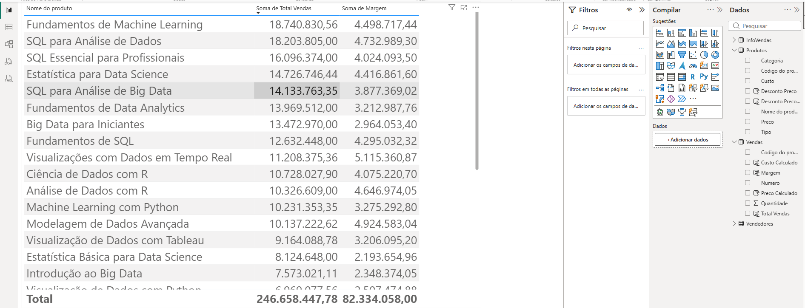
    </td>
</tr>
</table>

Com essa apresentação temos a informação de forma numérica sobre a margem e as vendas, porém essa maneira de apresentar os dados não é a melhor maneira de apresentar esse dado, seria mais intuitivo, sabermos a porcentagem, para que possamos realizar essa apresentação iremos regressar em nossa visualização de tabela, e adicionar mais uma coluna calculada, e iremos inserir mais uma fórmula de calculo conforme exemplo abaixo:  
```DAX
Margem % = DIVIDE(Vendas[Margem],Vendas[Total Vendas],0)
``` 
Como desejamos visualizar a porcentagem da margem das vendas, pós aplicação do calculo iremos formatar a exibição dessa colunas, isso pode ser feito através da guia de ferramentas de colunas -> Formatação -> `%`, quando aplicado a coluna será formatada em porcentagem. 
Porém se realizarmos simplesmente a adição dessa coluna dentro do nosso card, teremos um resultado _"peculiar"_ sobre a informação:  
<table style="text-align: center; width: 100%;"> 
<tr>
    <td style="text-align: left;">
    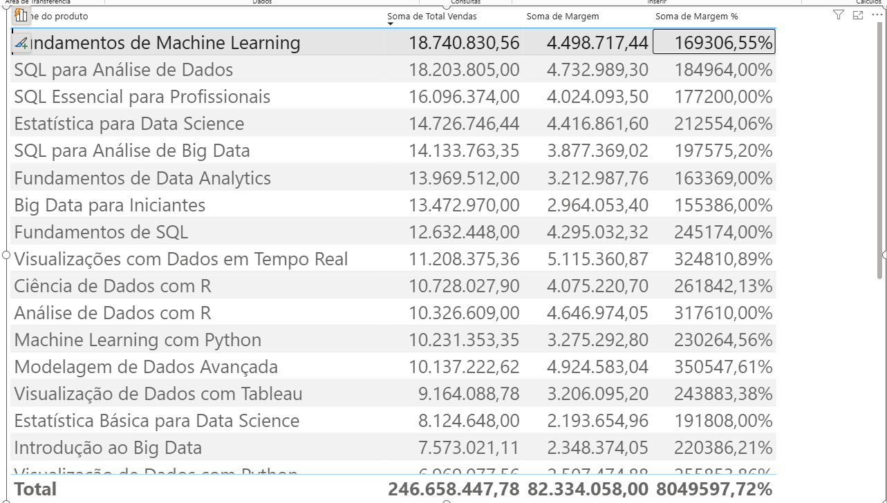
    </td>
</tr>
</table>

Essa apresentação é realizada pois o Power B.I realiza a soma das porcentagem pelo produto, e não realmente o que queremos para sanar essa apresentação devemos criar uma medida.
e isso veremos adiante.   

[↑ Voltar ao topo](#topo)

---
## 5. Porcentagem da Margem
Para aplicação dessa medida conforme descrito no tópico anterior iremos criar uma nova tabela para realizar o armazenamento das informações de vendas e margem, isso é realizado através da opção de nova tabela, dentro das ferramentas da tabela.   
Se realizarmos o processo de simplesmente copiar e colar a fórmula de margem realizada na coluna de medida de margem, o Power B.I irá apresentar um erro, similar ao exemplo abaixo:  
```text
Não é possível determinar um único valor para a coluna 'Margem' na tabela 'Vendas'. Isso pode acontecer quando uma fórmula de medida ou função se refere a uma coluna que contém muitos valores sem especificar uma agregação como min, max, count ou sum para obter um único resultado.
```
Essa informação é apresentada pois diferente do processo de colunas calculadas as medidas são realizadas com base em __Valores Agregados__ ou seja as medidas não realizam a inserção de valores linha a linha pela tabela, pois a medida é realizada _"Fora de uma tabela"_ ou seja ela é através de uma soma, uma média etc..
dado isso podemos utilizar uma dessa funções que no caso será a função de soma `SUM`, dentro da fórmula deixando a medida em questão com a seguinte notação:  
```DAX
Margem % = DIVIDE(SUM(Vendas[Margem]),SUM(Vendas[Total Vendas]),0)
```
>PS: Como realizamos a criação de uma nova tabela para o armazenamento da medida, o Power B.I nos permite criar colunas com mesmo nome de outras colunas desde que essa coluna não esteja na mesma tabela.

Agora sim iremos retornar ao nosso canvas, e inserir uma nova apresentação com visual de cartão e inserir essa medida para apresentação:   
<table style="text-align: center; width: 100%;"> 
<tr>
    <td style="text-align: left;">
    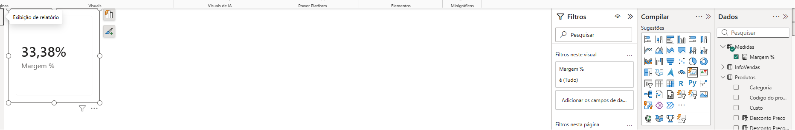
    </td>
</tr>
</table>

>PS: Por padrão a informação de column1 ficaria sendo apresentada na relação de dados, porém ela não consta na imagem pois foi ocultada.

Com isso teremos um novo visual com a informação correta:  
<table style="text-align: center; width: 100%;"> 
<tr>
    <td style="text-align: left;">
    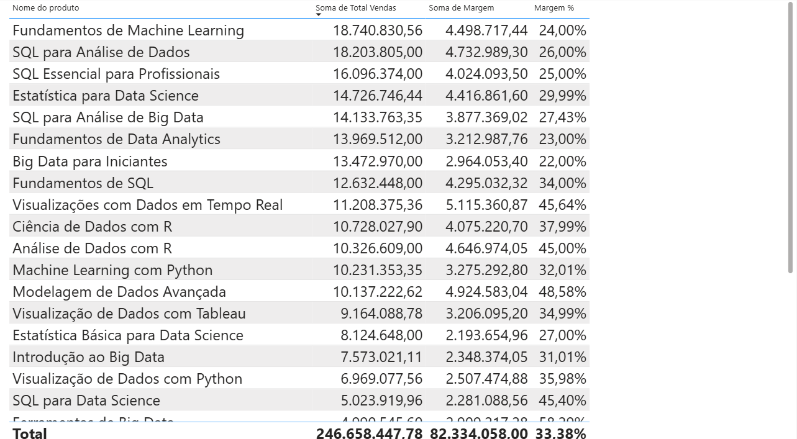
    </td>
</tr>
</table>

Com essa nova tabela e realizando a analise dos dados, percebemos um padrão sobre nossos produtos, quanto maior o valor das vendas menor a margem de lucro sobre esses produtos.

[↑ Voltar ao topo](#topo)

---
## 6. Para saber mais: colunas calculadas e medidas  

No Power BI, tanto as colunas calculadas quanto as medidas são elementos essenciais para o desenvolvimento das nossas análises. Embora ambos os recursos utilizem DAX (Data Analysis Expressions) para realizar cálculos, eles possuem diferentes características e usos.

Vamos explorar as principais diferenças entre colunas calculadas e medidas, suas vantagens e quando utilizar cada uma.

- __Colunas calculadas__  
- __Definição__  
As colunas calculadas são adicionadas diretamente às tabelas no modelo de dados. Elas são calculadas linha por linha, armazenando seus resultados junto com os dados originais.  
- __Características__  
  - _Armazenamento permanente:_ Os valores das colunas calculadas são armazenados no modelo de dados e recalculados apenas quando os dados são atualizados ou a definição da coluna é alterada.
  - _Cálculo linha a linha:_ As colunas calculadas operam no contexto de linha, o que significa que o cálculo é feito individualmente para cada linha da tabela. Os contextos de filtro e de linha serão abordados posteriormente no curso.
  - _Utilização em relacionamentos e filtragem:_ Colunas calculadas podem ser usadas para criar relacionamentos entre tabelas e também como campos para filtragem e segmentação em relatórios.

- __Exemplo__
Imagine uma tabela de vendas onde precisamos calcular a margem de lucro para cada venda. Podemos criar uma coluna calculada "Margem de Lucro" com a fórmula:
```DAX
Margem de Lucro = [Preço de Venda] - [Custo]
```
- __Vantagens__
  - _Facilidade de uso:_ São simples de criar e entender, especialmente para cálculos que precisam estar disponíveis em cada linha da tabela.
  - _Versatilidade:_ Podem ser usadas em relacionamentos, filtragens e como parte de outras colunas ou medidas.
---
- __Medidas__    
- __Definição__  
As medidas são cálculos dinâmicos que são avaliados no contexto da visualização em que são usadas. Elas não armazenam valores de forma persistente, mas recalculam seus resultados sempre que necessário, dependendo do contexto de filtragem e agregação.

- __Características__  
  - _Cálculo dinâmico:_ As medidas são recalculadas com base no contexto de filtragem aplicado às visualizações, tornando-as extremamente flexíveis para análises interativas.
  - _Agregações complexas:_  São ideais para cálculos que envolvem agregações, como somas, médias, contagens, etc.
  - _Menor impacto na memória:_ Como não armazenam valores permanentemente, as medidas consomem menos memória em comparação com colunas calculadas.
- __Exemplo__  
Suponha que precisamos calcular a receita total das vendas. Podemos criar uma medida "Receita Total" com a fórmula:
```DAX
Receita Total = SUM('Tabela de Vendas'[Preço de Venda])
```
- __Vantagens__  
  - _Eficiência:_  Calculam-se apenas quando necessário, economizando recursos de memória.
  - _Flexibilidade:_ Podem se adaptar a diferentes contextos de filtragem e agregação nas visualizações.
  - _Capacidade de agregação:_ Ideais para análises que requerem diferentes níveis de agregação.
---
__Resumo da comparação__  
Segundo a documentação da [Microsoft](https://learn.microsoft.com/en-us/training/modules/dax-power-bi-add-measures/), podemos comparar as colunas calculadas e medidas da seguinte forma:
  - Propósito: As colunas calculadas estendem uma tabela com uma nova coluna, enquanto as medidas definem como resumir os dados do modelo.
  - Avaliação: As colunas calculadas são avaliadas usando o contexto de linha no momento da atualização dos dados, enquanto as medidas são avaliadas usando o contexto de filtro no momento da consulta.
  - Armazenamento: As colunas calculadas armazenam um valor para cada linha na tabela, mas uma medida nunca armazena valores no modelo.
  - Uso visual: As colunas calculadas podem ser usadas para filtrar, agrupar ou resumir, enquanto as medidas são projetadas para resumir.
  
Compreender as diferenças entre colunas calculadas e medidas no Power BI é crucial para criar modelos de dados eficientes e relatórios dinâmicos. Utilizar cada uma delas adequadamente permite maximizar o potencial de análise e a performance do seu modelo de dados no Power BI.  

[↑ Voltar ao topo](#topo)

---
## 7. Para saber mais: medidas rápidas, implícitas e explícitas  

No Power BI, medidas são fórmulas utilizadas para realizar cálculos sobre os dados do seu modelo. Existem três tipos principais de medidas que você pode utilizar: medidas rápidas, medidas implícitas e medidas explícitas. Cada uma delas possui características e usos específicos que podem facilitar a análise e visualização dos seus dados.

__Medidas Rápidas__  
As medidas rápidas são cálculos predefinidos que podem ser facilmente adicionados aos seus relatórios sem a necessidade de escrever fórmulas DAX (Data Analysis Expressions) complexas. O Power BI oferece uma variedade de medidas rápidas, como somas acumuladas, médias móveis, percentuais de crescimento, entre outras. Para criar uma medida rápida, basta selecionar a opção "Nova Medida Rápida" no menu de Modelagem e escolher o tipo de cálculo desejado. Essas medidas são ideais para usuários que precisam de análises rápidas e eficientes sem um conhecimento profundo de DAX.

__Medidas Implícitas__  
As medidas implícitas são criadas automaticamente pelo Power BI quando você arrasta e solta um campo numérico em uma visualização. O Power BI determina o tipo de agregação (soma, média, contagem, etc.) a ser aplicado com base no contexto da visualização. Por exemplo, ao arrastar um campo de vendas para um gráfico de barras, o Power BI pode somar automaticamente os valores desse campo para exibir o total de vendas por categoria. Medidas implícitas são úteis para análises rápidas e simples, mas têm limitações em termos de personalização e flexibilidade.

__Medidas Explícitas__  
As medidas explícitas, também conhecidas como medidas definidas pelo usuário, são criadas manualmente utilizando fórmulas DAX. Essas medidas oferecem maior controle e flexibilidade, permitindo a criação de cálculos complexos e personalizados que atendem às necessidades específicas de análise. Para criar uma medida explícita, você deve clicar com o botão direito do mouse em uma tabela no painel de Campos, selecionar "Nova Medida" e digitar a fórmula DAX desejada. Medidas explícitas são essenciais para análises avançadas, relatórios dinâmicos e otimização de modelos de dados no Power BI.

__Comparação Entre os Tipos de Medidas__  
|                    |                                          |                   |                  |
| ------------------ | ---------------------------------------- | ----------------- | ---------------- |
| __Tipo de Medida__ | __Criação__                              | __Flexibilidade__ | __Complexidade__ |
| Medidas Rápidas    | Seleção de cálculos predefinidos         | Moderada          | Baixa            |
| Medidas Implícitas | Arrastar e soltar campos na visualização | Baixa             | Muito Baixa      |
| Medidas Explícitas | Fórmulas DAX manuais                     | Alta              | Alta             |

---
__Conclusão__  
Compreender a diferença entre medidas rápidas, implícitas e explícitas é fundamental para utilizar o Power BI de maneira eficaz. Enquanto medidas implícitas e rápidas podem acelerar análises simples e interativas, medidas explícitas são essenciais para personalizações avançadas e controle total sobre os cálculos realizados no seu modelo de dados. O equilíbrio entre esses tipos de medidas permite criar relatórios poderosos e insights profundos com o Power BI.  

Para saber mais sobre medidas implícitas e explícitas, acesse o artigo detalhado a seguir: [Power BI: medidas implícitas e explícitas](https://www.alura.com.br/artigos/power-bi-medidas-implicitas-explicitas).


[↑ Voltar ao topo](#topo)

---
## 8. Aprimorando os cálculos
Agora nesse tópico daremos andamento no nosso projeto, iremos transformar nossas colunas de medidas de `Total de Vendas` quando para `Margem`.  
Iremos acessar nossa tabela de medidas e criar mais uma medida que será nomeada de `Vendas Total`, a ideia pra essa aplicação seria similar ao que fizemos na coluna de vendas, porém como estamos trabalhando com medidas, se simplesmente colarmos a fórmula do total de vendas, ou ainda se aplicarmos uma função de agregação como `SUM()` nessa nova medida teremos alguns erros :

Se copiarmos a fórmula teremos o erro de agregação, conforme exemplo:  
```DAX
Total de Vendas = Vendas[Quantidade] * Vendas[Preco Calculado]
```
> Não é possível determinar um único valor para a coluna 'Quantidade' na tabela 'Vendas'. Isso pode acontecer quando uma fórmula de medida ou função se refere a uma coluna que contém muitos valores sem especificar uma agregação como min, max, count ou sum para obter um único resultado.

Por outro lado ser realizarmos a inserção de uma função de agregação como o `SUM()` dentro dessa fórmula, teremos outro erro:
```DAX
Total de Vendas = SUM(Vendas[Quantidade] * Vendas[Preco Calculado])
```
> A função SUM aceita somente uma referência de coluna como argumento.

Então para que possamos atingir nosso objetivo que em sua origem é de obter o valor da multiplicação de cada quantidade vendida de cada produto, teremos que utilizar um novo tipo de função que são as chamadas de __Função Iterador__, essa funções realizam o processo de _"Percorrer"_ cada linha da tabela, e essa função de iteradora que utilizaremos será a função `SUMX()`, o que deixará a notação de nossa fórmula da seguinte maneira:  
```DAX
Total de Vendas = 
SUMX(
    Vendas,
    Vendas[Quantidade] * Vendas[Preco Calculado]
)
```
Diferente da função `SUM`, a função de `SUMX`, exige a passagem de 2 parâmetros, sendo o primeiro a tabela de busca ou tabela referência e o segundo uma expressão que para o nosso caso é a fórmula de quantidade x preço calculado. Com essa aplicação podemos verificar essa nova medida adicionando outro card com essa medida criada. 
<table style="text-align: center; width: 100%;"> 
<tr>
    <td style="text-align: left;">
    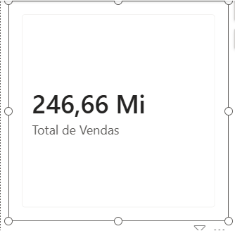
    </td>
</tr>
</table>

Com isso podemos substituir nossa coluna de total de vendas no visual para nossa medida, já o calculo da margem a ser criada ficara da seguinte maneira:  
```DAX
Margem = 
SUMX(
    Vendas,
    Vendas[Quantidade] * (Vendas[Preco Calculado] - Vendas[Custo Calculado])
)
```
Agora que criamos nossa medidas, não iremos mais precisar das colunas calculadas que foram criadas anteriormente, possibilitando a exclusão delas, mas é importante nos ater que como nossa primeira medida confeccionada foi a de `margem %` e essa estava baseada em nossas colunas de medidas que foram excluídas, podemos simplesmente atualizar essa medida, utilizando as outras medidas recém criada deixando nossa fórmula da seguinte maneira:  
```DAX
Margem % = DIVIDE([Margem],[Total de Vendas],0)
```
Assim como visualizamos no tópico anterior uma das principais vantagens das medidas em relação as colunas calculadas, é a quantidade de armazenamento necessário para a coluna calcula, o que torna nosso projeto mais enxuto e performático. 

--- 
Agora como temos a aplicação das medidas realizadas, podemos organizar nossa medidas em uma pasta para melhor organização, para realizar esse processo dentro da parte de visualização de modelos, quando clicamos sobre as medidas será apresentado um menu na barra lateral direita, com algumas informações dessas medidas e uma delas é a de pasta de exibição da medida, para criar essa pasta basta digitar um nome sobre o  campo de `PASTA DE EXIBIÇÃO`, e para adicionar outra medida a está pasta pode tanto ser digitado o nome da pasta na nova medida quanto arrasta-la para dentro da pasta. 

<table style="text-align: center; width: 100%;"> 
<tr>
    <td style="text-align: left;">
    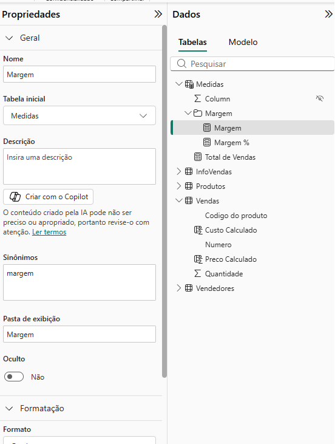
    </td>
</tr>
</table>

[↑ Voltar ao topo](#topo)

---
## 9. Para saber mais: funções iteradoras  

No Power BI, as funções iteradoras desempenham um papel fundamental ao permitir a realização de cálculos complexos e personalizados em linhas individuais de uma tabela, antes de agregá-las. Diferente das funções agregadoras padrão, que operam diretamente em colunas inteiras, as funções iteradoras avaliam expressões linha por linha, proporcionando uma grande flexibilidade na análise de dados.

----

__Principais Funções Iteradoras__  
- __SUMX__  
A função `SUMX()` itera sobre uma tabela, avalia uma expressão para cada linha e, em seguida, soma os resultados. É útil quando a soma de um cálculo complexo em cada linha é necessária.

__Exemplo:__  
```DAX
TotalVendas = SUMX(Vendas, Vendas[Quantidade] * Vendas[PreçoUnitário])
```
Neste exemplo, `SUMX()` multiplica a quantidade pelo preço unitário para cada linha na tabela Vendas e, em seguida, soma os resultados.

- __AVERAGEX__  
A função `AVERAGEX()` funciona de maneira similar à `SUMX()`, mas calcula a média dos resultados das expressões avaliadas para cada linha.

Exemplo:
```DAX
MediaDesconto = AVERAGEX(Vendas, Vendas[Desconto])
```
Este exemplo calcula a média dos descontos em cada linha da tabela Vendas.

- __MINX__  
A função `MINX()` itera sobre uma tabela, avalia uma expressão para cada linha e retorna o menor valor resultante.

Exemplo:
```DAX
MenorVenda = MINX(Vendas, Vendas[Quantidade] * Vendas[PreçoUnitário])
```
No trecho acima, `MINX()` calcula o valor total da venda _(quantidade multiplicada pelo preço unitário)_  para cada linha e retorna o menor valor.
- __MAXX__  
A função `MAXX()` é o oposto de `MINX()`, iterando sobre uma tabela, avaliando uma expressão para cada linha e retornando o maior valor resultante.

Exemplo:
```DAX
MaiorVenda = MAXX(Vendas, Vendas[Quantidade] * Vendas[PreçoUnitário])
```
Neste exemplo, `MAXX()` calcula o valor total da venda para cada linha e retorna o maior valor.

- __COUNTX__  
A função `COUNTX()` itera sobre uma tabela e conta o número de valores resultantes de uma expressão avaliada para cada linha, excluindo valores em branco.

Exemplo:
```DAX
ContagemVendas = COUNTX(Vendas, Vendas[Numero])
```
`COUNTX()` conta o número de transações na tabela Vendas.

---
__Quando utilizar Funções Iteradoras__  

As funções iteradoras são extremamente poderosas quando você precisa realizar cálculos que dependem de cada linha individualmente antes de agregá-los.

Elas são ideais para:
  - Realizar cálculos linha a linha que envolvem múltiplas colunas.
  - Aplicar lógica complexa ou condicional que não pode ser resolvida diretamente com funções agregadoras.
  - Criar resumos personalizados ou agregados de dados específicos.
  - Desempenho e eficiência

Embora as funções iteradoras sejam muito flexíveis, elas podem ser mais lentas do que as funções agregadoras padrão, especialmente em grandes conjuntos de dados. Isso ocorre porque cada linha é avaliada individualmente, o que pode aumentar significativamente o tempo de cálculo. Portanto, é importante usar funções iteradoras de maneira eficiente e considerar o impacto no desempenho do seu modelo de dados.

As funções iteradoras no Power BI são ferramentas essenciais para realizar análises detalhadas e complexas que exigem cálculos linha a linha. Compreender e utilizar funções como SUMX, AVERAGEX, MINX, MAXX, COUNTX e CONCATENATEX permite que você extraia insights profundos dos seus dados, aproveitando ao máximo as capacidades do Power BI. Contudo, é crucial equilibrar a necessidade de cálculos detalhados com a eficiência de desempenho para garantir que suas análises sejam tão precisas quanto rápidas.

[↑ Voltar ao topo](#topo)

---
## 10. Calculando a receita média  

Durante nosso trabalho como analista de dados, recebemos diversas demandas da livraria. Recentemente, solicitaram um relatório para entender melhor as vendas dos livros durante o último ano. A equipe está particularmente interessada em saber a receita média de vendas por livro.

Pensando nisso, qual das seguintes medidas você criaria no Power BI para calcular a receita média de vendas por livro? Escolha as alternativas corretas.

<table style="text-align: center; width: 100%;"> 
<tr>
    <td style="text-align: left;">
    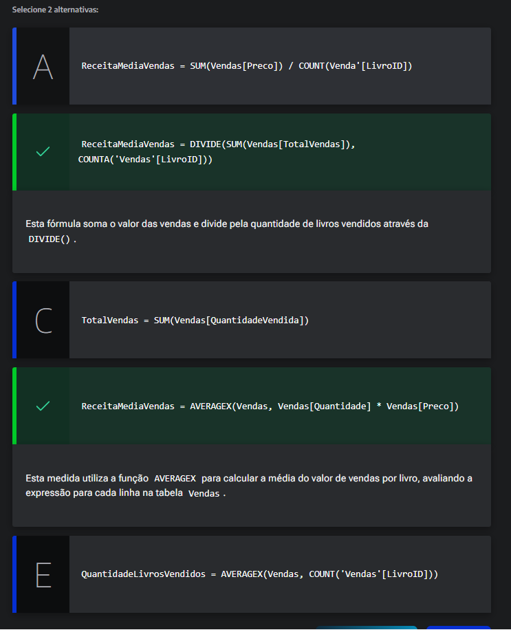
    </td>
</tr>
</table>


[↑ Voltar ao topo](#topo)

---
## 11. Mão na massa: criando medidas com funções iteradoras    

Nesta aula, você aprendeu a criar colunas calculadas para o total de vendas, margem e margem percentual. Além disso, aprendeu a substituir essas colunas por medidas utilizando a função iteradora `SUMX()` para obter resultados mais dinâmicos e eficientes.

Agora, a equipe de marketing precisa de um novo relatório que inclua a receita líquida por livro, considerando um desconto fixo de __10%__ sobre cada venda.  
Seu desafio é criar uma medida que calcule a receita líquida utilizando a função SUMX().

__Desafio:__  
Crie uma medida chamada ReceitaLiquida que calcule a receita líquida para cada livro considerando um desconto fixo de __10%__. Utilize a função `SUMX()` para realizar esse cálculo.
Utilize a tabela Vendas, que possui as seguintes colunas relevantes: Quantidade, PrecoUnitario e DescontoPercentual.
Em caso de dúvidas sobre a resolução da atividade, confira a seção “Opinião da pessoa instrutora”.

__Opinião do instrutor__  
Para resolver esta atividade, siga os seguintes passos:

- 1 Crie a medida ReceitaLiquida utilizando a função `SUMX()` na tabela Vendas.
- 2 A receita líquida deve considerar o desconto fixo de __10%__ aplicado ao valor total de cada venda (quantidade vendida multiplicada pelo preço unitário).
Para fins didático, segue um exemplo de como a medida pode ser criada:
```DAX
ReceitaLiquida = SUMX(
    Vendas,
    Vendas[Quantidade] * Vendas[Preco Calculado] * (1 - 0.10)
)
```

Essa medida calcula o valor total de cada venda após aplicar o desconto de 10% e, em seguida, soma esses valores para obter a receita líquida total.

Em caso de dúvidas, fique à vontade para usar o Fórum ou o Discord da Alura.

[↑ Voltar ao topo](#topo)

---
## 12. O que aprendemos?

Nessa aula, você foi capaz de:
- Criar colunas calculadas e medidas;
- Compreender as diferenças entre colunas calculadas e medidas;
- Utilizar funções padrão e iteradoras.

---

<table align="center" style="border-collapse: collapse; margin-left: auto; margin-right: auto;"> 
  <caption><b>Skills do projeto</b></caption>
  <tr>
    <td style="padding: 5px;">
      
    </td>
    <td style="padding: 5px;">
      
    </td>
    <td style="padding: 5px;">
      
    </td>
  </tr>
</table>


---
__Titulo:__ Colunas calculadas e medidas
__Autor:__ Thierry Lucas Chaves  
__Data de Criação:__ 19-06-2026  
__Data de Modificação:__ 20-06-2026  
__Versão:__ "1.0"