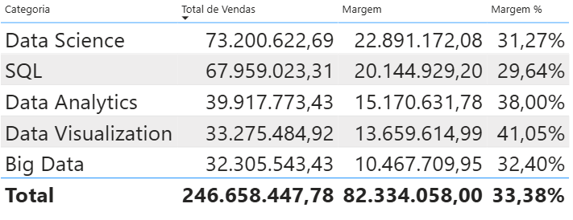
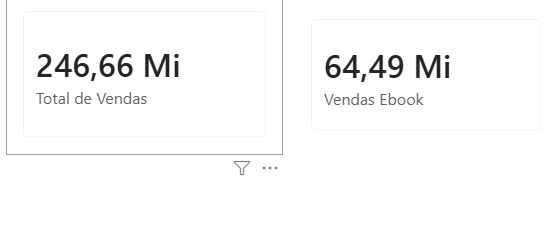
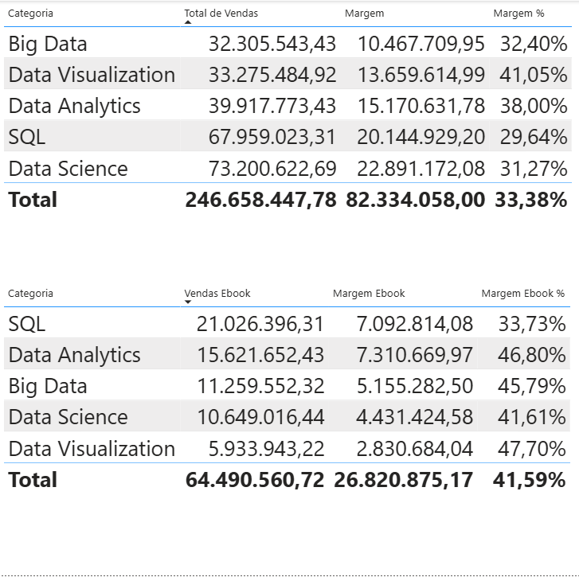

# Funções de tabela

<a id="topo"></a>

## Sumário
- [Funções de tabela](#funções-de-tabela)
  - [Sumário](#sumário)
  - [1. Projeto da aula anterior](#1-projeto-da-aula-anterior)
  - [2. Vendas por categoria](#2-vendas-por-categoria)
  - [3. Vendas por tipo de produto](#3-vendas-por-tipo-de-produto)
  - [4. Para saber mais: função FILTER](#4-para-saber-mais-função-filter)
  - [5. Destacando métricas](#5-destacando-métricas)
  - [6. Para saber mais: RELATED e RELATEDTABLE](#6-para-saber-mais-related-e-relatedtable)
  - [7. Filtrando regiões](#7-filtrando-regiões)
  - [8. Mão na massa: calculando vendas com filtros](#8-mão-na-massa-calculando-vendas-com-filtros)
  - [9. O que aprendemos?](#9-o-que-aprendemos)

## 1. Projeto da aula anterior 
Caso prefira, você pode acessar o projeto da [aula](https://github.com/thierryLchaves/Santander-Imersao-Digital/blob/f22d04a155a7a2c82e5f6f401505397e1b941980/Analise_de_dados_e_IA_Nivelamento/Semana_08/Power_BI_Construindo_calculos_com_Dax/src/projeto-dax-livraria-inicial.pbix) no ponto em que paramos na aula anterior.  

[↑ Voltar ao topo](#topo)

---
## 2. Vendas por categoria
Até o presente momento nosso projeto está estruturado de forma que temos uma visão individual de cada produto de uma maneira mais analítica sobre as vendas e sua margem de lucro, porém seria interessante obtermos uma visão agrupada sobre as categorias de cada produto, ou seja o que iremos realizar agora é uma maneira de obtermos uma visão mais agregada sobre os produtos. 
Para esse processo iremos criar uma nova página para essa visualização iremos criar um novo CARD de tabela, porém agora os campos que selecionaremos para apresentação dessa tabela será a categoria dos livros presentes na tabela de produtos, e as medidas que foram criadas anteriormente. com isso teremos um resultado conforme do exemplo abaixo:  
<table style="text-align: center; width: 100%;"> 
<tr>
    <td style="text-align: left;">
    
    </td>
</tr>
</table>

Ao analisar esse quadro temos uma nova visão sobre nossa vendas, se reparamos no card percebemos que por exemplo a categoria de __Data Science__ apesar de possuir o maior montante de vendas, é que possui a menor margem de lucro, e assim segue as categoria de __SQL e Big Data__, possuem uma margem inferior ao sua quantidade de vendas ficando abaixo dos 40% enm relação ao valor total das vendas. 
A frente iremos especificar ainda mais nossa visão obtendo a subdivisão das categoria pelos tipos de produtos, e isso é o que faremos no [tópico seguinte](#3-vendas-por-tipo-de-produto). 

[↑ Voltar ao topo](#topo)

---
## 3. Vendas por tipo de produto
Para que possamos realizar uma nova visualização focada pelo tipo de produto, nos iremos realizar uma nova fórmula utilizando `DAX`, para podermos utilizar nossas medidas com base no tipo do produto. 
Para isso iremos criar uma nova medida para realizar a soma do total de produtos com base em um filtro, nossa fórmula para isso será a seguinte:  
```DAX
Vendas Ebook = 
SUMX(
    FILTER( 
        Vendas,
        RELATED(Produtos[Tipo]) = "Ebook"
    ),
    Vendas[Quantidade] * Vendas[Preco Calculado]
) 
```
A forma acima, realizada uma soma de forma iterada, porém com base em um valor de filtro por isso utilizamos a função `FILTER`, essa função exige 2 parâmetros no caso a base na qual será aplicado o filtro, e o segundo qual é o filtro a ser aplicado, porém como nosso mote inicial é realizar um filtro com base no tipo do livro que está presente somente na tabela de produtos, realizamos então a utilização da função `RELATED` que é uma função que realiza o relacionamento de forma tabular entre duas tabelas, então com essa função conseguimos comparar nossa tabela de produtos no campo tipo igual a nossa condição que seria _Ebook_, aplicada diretamente a nossa tabela de vendas, com isso podemos utilizar essa expressão como a tabela do primeiro parâmetro exigido pela função `SUMX()`, e aplicar o restante da formula.  
Com essa nova medida, podemos visualizar diretamente em tela comparando a diferença entre a vendas total e as vendas pelo tipo de produto Ebook:  
<table style="text-align: center; width: 100%;"> 
<tr>
    <td style="text-align: left;">
    
    </td>
</tr>
</table>

Com isso iremos replicar a mesma lógica vistar anteriormente para as demais medidas, deixando as medidas da seguinte maneira:  
```DAX
Margem Ebook = 
SUMX(
    FILTER(
        Vendas,    
        RELATED(Produtos[Tipo]) = "Ebook"
        ),
    Vendas[Quantidade] * (Vendas[Preco Calculado] - Vendas[Custo Calculado])
)

Margem Ebook % = DIVIDE([Margem Ebook],[Vendas Ebook],0)
```
Quando aplicarmos essa fórmulas criadas acima, teremos uma visualização sobre o cenário de vendas quando o produto é do tipo _Ebook_, conforme imagem abaixo:  
<table style="text-align: center; width: 100%;"> 
<tr>
    <td style="text-align: left;">
    
    </td>
</tr>
</table>

Na segunda tabela visualizamos que a proporção de vendas ainda não acompanha a margem de lucro sobre o produto isso pode ser notado pela categoria de SQL, na qual temos o maior valor de vendas, porém com a menor margem. Porém ainda conseguimos melhorar a visão sobre as vendas, e seria interessante trazer de forma destacada sem que sejam responsivos ao clique das tabelas, deixando um cartão com valores fixo para o tipo de produto _Ebook_.  


[↑ Voltar ao topo](#topo)

---
## 4. Para saber mais: função FILTER
A função `FILTER` é uma das funções mais poderosas e versáteis no DAX (Data Analysis Expressions). Essa função permite criar tabelas filtradas com base em condições específicas, oferecendo uma maneira flexível de manipular e analisar dados.

---

__Funcionamento da Função FILTER__  
A função FILTER opera iterando sobre uma tabela e avaliando uma expressão booleana (uma condição) para cada linha dessa tabela. As linhas que atendem à condição especificada são incluídas na tabela resultante, enquanto as linhas que não atendem à condição são ignoradas. A sintaxe básica da função FILTER é a seguinte:
```DAX
FILTER(tabela, condição)
```
Onde tabela é a __tabela__ que você deseja filtrar e condição é a expressão booleana que determina quais linhas serão incluídas na tabela resultante.  

__Retorno de uma Tabela__  

Ao contrário de muitas funções DAX que retornam um valor escalar, a função FILTER retorna uma tabela. Essa tabela contém todas as linhas da tabela original que atendem à condição especificada. Essa funcionalidade é especialmente útil quando você deseja usar o resultado da FILTER como entrada para outras funções DAX que operam em tabelas, como `CALCULATE, SUMX, AVERAGEX`, entre outras.

---
__Função Iteradora__  

Uma característica essencial da função FILTER é que ela é uma função iteradora. Isso significa que a FILTER avalia a condição especificada para cada linha individualmente na tabela de entrada. Como uma função iteradora, FILTER pode lidar com condições complexas que dependem de valores específicos de cada linha, permitindo uma análise detalhada e personalizada dos dados.

__Contexto de Linha__  
O conceito de contexto de linha é crucial para entender como a função FILTER e outras funções DAX funcionam. O contexto de linha refere-se ao ambiente no qual uma fórmula DAX é avaliada, especificamente, quais linhas e colunas estão disponíveis para a fórmula no momento da avaliação.  

No caso da função FILTER, a condição é avaliada para cada linha no contexto de linha dessa linha específica. Isso permite que a função FILTER crie filtros dinâmicos de acordo com o contexto.

Vamos explorar o conceito de contexto de linha com mais profundidade na aula 4.

__Exemplo de uso da Função FILTER__  

Vamos considerar um exemplo prático para ilustrar o uso da função FILTER. Suponha que você tenha uma tabela de vendas chamada Vendas com as seguintes colunas: Produto, Quantidade, PrecoUnitario e DataVenda. Você deseja criar uma medida que calcule a quantidade número de vendas para produtos que tenham sido vendidos por mais de _R$ 100,00._ 
```DAX
VendasAcimaDe100 = COUNTROWS(FILTER(Vendas, Vendas[PrecoUnitario] > 100))
```
Neste exemplo, temos o seguinte:

- `FILTER(Vendas, Vendas[PrecoUnitario] > 100)` filtra a tabela Vendas para incluir apenas as linhas onde o preço unitário do produto é superior a R$ 100,00.
- `COUNTROWS` conta o número de linhas resultantes da filtragem, ou seja, o número de vendas que atendem ao critério estabelecido.
  
A função FILTER é uma ferramenta poderosa no DAX para criar tabelas filtradas com base em condições específicas. Como uma função iteradora, ela avalia cada linha individualmente e retorna uma tabela contendo apenas as linhas que atendem à condição especificada. Compreender o funcionamento da FILTER, incluindo o conceito de contexto de linha, permite realizar análises avançadas e personalizadas no Power BI.


[↑ Voltar ao topo](#topo)

---
## 5. Destacando métricas

[↑ Voltar ao topo](#topo)

---
## 6. Para saber mais: RELATED e RELATEDTABLE

[↑ Voltar ao topo](#topo)

---
## 7. Filtrando regiões

[↑ Voltar ao topo](#topo)

---
## 8. Mão na massa: calculando vendas com filtros

[↑ Voltar ao topo](#topo)

---
## 9. O que aprendemos?

[↑ Voltar ao topo](#topo)

---

<!-- <table style="text-align: center; width: 100%;"> 
<tr>
    <td style="text-align: left;">
    
    </td>
</tr>
</table> -->

---

<table align="center" style="border-collapse: collapse; margin-left: auto; margin-right: auto;"> 
  <caption><b>Skills do projeto</b></caption>
  <tr>
    <td style="padding: 5px;">
      
    </td>
    <td style="padding: 5px;">
      
    </td>
    <td style="padding: 5px;">
      
    </td>
  </tr>
</table>


---
__Titulo:__ Funções de tabela
__Autor:__ Thierry Lucas Chaves  
__Data de Criação:__ 19-06-2026  
__Data de Modificação:__ 19-06-2026  
__Versão:__ "1.0"