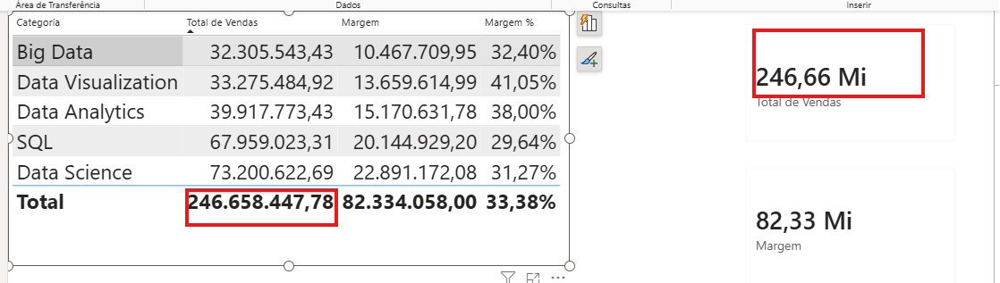
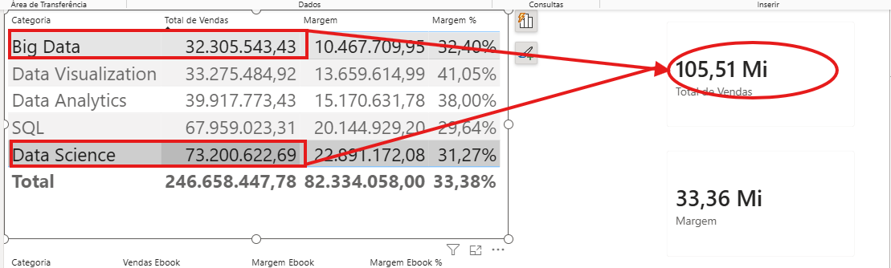

# Contextos no DAX

<a id="topo"></a>

## Sumário
- [Contextos no DAX](#contextos-no-dax)
  - [Sumário](#sumário)
  - [1. Projeto da aula anterior](#1-projeto-da-aula-anterior)
  - [2. Contexto de filtro](#2-contexto-de-filtro)
  - [3. Contexto de linha](#3-contexto-de-linha)
  - [4. Para saber mais: Contexto de filtro X Contexto de linha](#4-para-saber-mais-contexto-de-filtro-x-contexto-de-linha)
  - [5. Combinando contextos](#5-combinando-contextos)
  - [6. Avaliando contextos no DAX](#6-avaliando-contextos-no-dax)
  - [7. Mão na massa: explorando os contextos no DAX](#7-mão-na-massa-explorando-os-contextos-no-dax)
  - [8. O que aprendemos?](#8-o-que-aprendemos)

## 1. Projeto da aula anterior

Caso prefira, você pode acessar o projeto da [aula](https://github.com/thierryLchaves/Santander-Imersao-Digital/blob/f22d04a155a7a2c82e5f6f401505397e1b941980/Analise_de_dados_e_IA_Nivelamento/Semana_08/Power_BI_Construindo_calculos_com_Dax/src/projeto-dax-livraria-inicial.pbix) no ponto em que paramos na aula anterior.  

[↑ Voltar ao topo](#topo)

---
## 2. Contexto de filtro
Durante o processo de criação de medidas que realizamos ao decorrer do curso, visualizamos diferentes formas de criar medias estáticas ou dinâmicas conforme seleção de algum campo, porém todo esse processo foi um tanto quanto trabalhoso, o objetivo desse módulo será de aprender maneiras para que possamos aprimorar nossa medidas, ou seja cada vez que desejarmos alterar um cálculo podemos realizar ela de forma mais simples.    

---
Visto que nosso objetivo é aprender maneiras de como melhorar nosso filtro e sobretudo entender o funcionamento do DAX mediante a filtro, porém antes de modificar qualquer calculo é valido entendermos o contexto, no qual o DAX  está inserido, para exemplificar essa situação, em nosso DashBoard temos 3 valores totais em diferente apresentações, o valor total da categoria no card de tabela, o valor das somas das categoria, e o valor total do card, esse card de valor de vendas total, está em um contexto inicial sem aplicação de filtro, porém quando selecionamos alguma ou algumas categoria em nossa tabela, o valor do card irá se adaptar conforme o contexto de seleção. 

<table style="text-align: center; width: 100%;"> 
<tr>
    <td style="text-align: left;">
    
    </td>
</tr>
<tr>
    <td style="text-align: left;">
    
    </td>
</tr>
</table>

As imagens acima exemplifica bem o que estamos tratando, enquanto na primeira imagem o card de Vendas total está apresentando o valor de R$: 246.668.000,00 que representa exatamente o valor da soma total da coluna, a segunda imagem mostra que esse valor total está adaptado conforme a seleção das categoria, que no caso são as categoria de Big Data e Data Science, que totalização 105.506.206.12 que no caso o card como está limitado apresenta somente 106.51 milhões, mas com isso podemos verificar que as medidas estão conforme o contexto. Para esse tipo de comportamento damos o nome de __Contexto de Filtro__, em sintaxe os valores são alterados conforme o filtro que estamos selecionado, ou seja conforme os visuais que estamos aplicando.   


[↑ Voltar ao topo](#topo)

---
## 3. Contexto de linha
No tópico anterior visualizamos aplicações práticas e sobre o comportamento chamado de __Contexto de Filtro__, porém o DAX também trabalha com outro tipo de aplicação que é o chamado de __Contexto de linha__, para que possamos exemplificar essa aplicação vamos regressar ao que aprendemos na [aula 1](https://github.com/thierryLchaves/Santander-Imersao-Digital/blob/56a4b37f939f04f5fe326047191ce2abdafe32d9/Analise_de_dados_e_IA_Nivelamento/Semana_08/Power_BI_Construindo_calculos_com_Dax/01_Conhecendo_os_dados/ConhecendoOsDados.md), onde realizamos a confecção de colunas de medidas, quando realizamos a coluna de total de vendas utilizando a coluna calculada, o DAX, realiza esse calculo utilizando o que estamos estudando que é o contexto de linha, ilustrando o que acabamos de visualizar. 
> Contexto de Linha
```DAX
Total Vendas = Vendas[Quantidade] * Vendas[Preco Calculado]
```
> Contexto de filtro
```DAX
Total de Vendas = 
SUMX(
    Vendas,
    Vendas[Quantidade] * Vendas[Preco Calculado]
)
```
As fórmulas acima não se divergem somente na aplicação de uma função a mais, mas também na aplicação na [aula 2](https://github.com/thierryLchaves/Santander-Imersao-Digital/blob/56a4b37f939f04f5fe326047191ce2abdafe32d9/Analise_de_dados_e_IA_Nivelamento/Semana_08/Power_BI_Construindo_calculos_com_Dax/02_Colunas_calculadas_e_medidas/ColunasCalculadasEMedidas.md), vimos que uma medida necessita de funções iteradora, e um dos motivos é o tipo de contexto aplicado para medidas e colunas.  

Nesses exemplos de aplicação de coluna calculada essa aplicação fica mais patente pois para além da apresentação visual estamos trabalhando em uma tabela, o que torna nossa interpretação de contexto de linha mais evidente, porém esse tipo de contexto para fórmula/função não se limita a colunas calculadas, se retornamos a aplicação da nossa medida, temos a aplicação da função iteradora, que no caso é a função `SUMX()`, onde nela passamos a tabela depois o calculo, e justamente nesse primeiro argumento que apontamos qual a tabela deve ser iterada, para percorrer linha a linha para aplicar a função, também visualizamos essa aplicação de contexto de linha quando utilizamos por exemplo a função filter, que também exige como argumento primário a base de busca. Ou seja diferente do contexto de filtro no qual seu resultado depende do contexto da apresentação que está inserido, seja mediante a seleção de um card, ou ainda sobre a informação de um visual, o contexto de linha não é aplicado mediante algum visual ou seleção, ele _"serve"_ apenas para determinar quais linhas devem ser percorridas em uma tabela especifica. 


[↑ Voltar ao topo](#topo)

---
## 4. Para saber mais: Contexto de filtro X Contexto de linha

[↑ Voltar ao topo](#topo)

---
## 5. Combinando contextos

[↑ Voltar ao topo](#topo)

---
## 6. Avaliando contextos no DAX

[↑ Voltar ao topo](#topo)

---
## 7. Mão na massa: explorando os contextos no DAX

[↑ Voltar ao topo](#topo)

---
## 8. O que aprendemos?

[↑ Voltar ao topo](#topo)

---

<!-- <table style="text-align: center; width: 100%;"> 
<tr>
    <td style="text-align: left;">
    
    </td>
</tr>
</table> -->

---

<table align="center" style="border-collapse: collapse; margin-left: auto; margin-right: auto;"> 
  <caption><b>Skills do projeto</b></caption>
  <tr>
    <td style="padding: 5px;">
      
    </td>
    <td style="padding: 5px;">
      
    </td>
    <td style="padding: 5px;">
      
    </td>
  </tr>
</table>


---
__Titulo:__ Contextos no DAX
__Autor:__ Thierry Lucas Chaves  
__Data de Criação:__ 19-06-2026  
__Data de Modificação:__ 19-06-2026  
__Versão:__ "1.0"