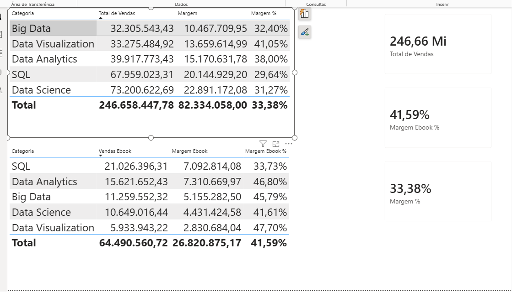
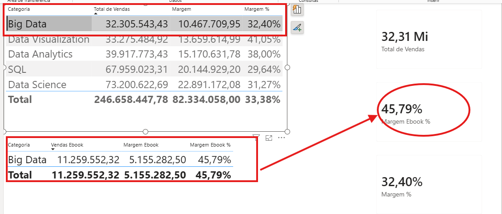
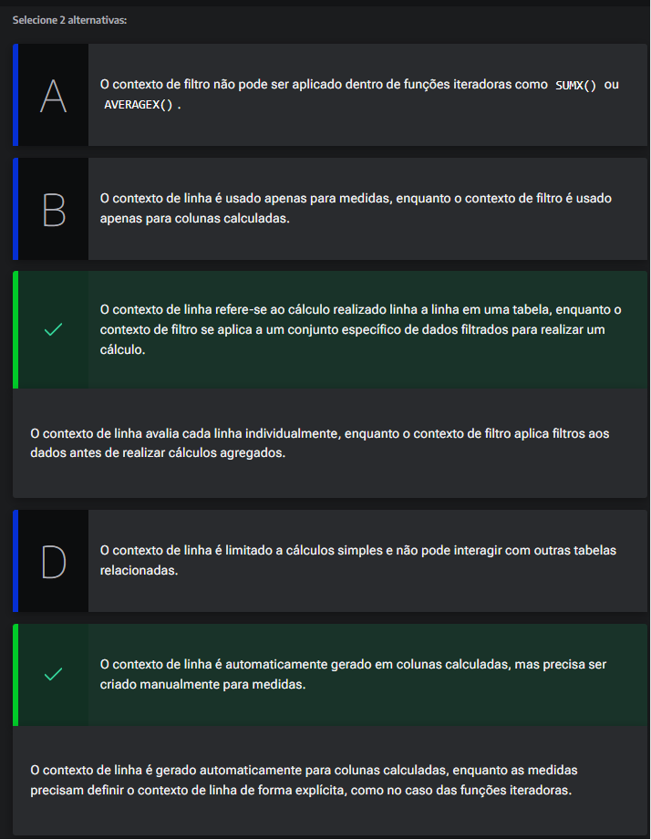
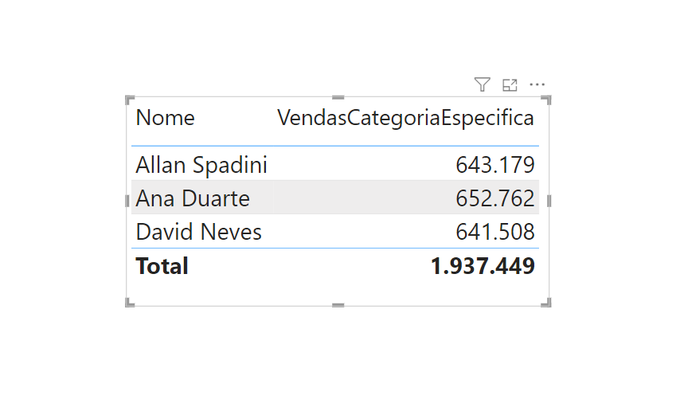
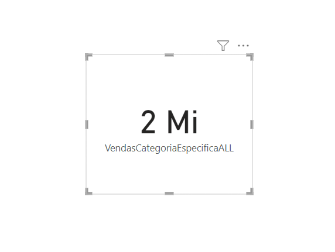

# Contextos no DAX

<a id="topo"></a>

## Sumário
- [Contextos no DAX](#contextos-no-dax)
  - [Sumário](#sumário)
  - [1. Projeto da aula anterior](#1-projeto-da-aula-anterior)
  - [2. Contexto de filtro](#2-contexto-de-filtro)
  - [3. Contexto de linha](#3-contexto-de-linha)
  - [4. Para saber mais: Contexto de filtro X Contexto de linha](#4-para-saber-mais-contexto-de-filtro-x-contexto-de-linha)
  - [5. Combinando contextos](#5-combinando-contextos)
  - [6. Avaliando contextos no DAX](#6-avaliando-contextos-no-dax)
  - [7. Mão na massa: explorando os contextos no DAX](#7-mão-na-massa-explorando-os-contextos-no-dax)
  - [8. O que aprendemos?](#8-o-que-aprendemos)

## 1. Projeto da aula anterior

Caso prefira, você pode acessar o projeto da [aula](https://github.com/thierryLchaves/Santander-Imersao-Digital/blob/f22d04a155a7a2c82e5f6f401505397e1b941980/Analise_de_dados_e_IA_Nivelamento/Semana_08/Power_BI_Construindo_calculos_com_Dax/src/projeto-dax-livraria-inicial.pbix) no ponto em que paramos na aula anterior.  

[↑ Voltar ao topo](#topo)

---
## 2. Contexto de filtro
Durante o processo de criação de medidas que realizamos ao decorrer do curso, visualizamos diferentes formas de criar medias estáticas ou dinâmicas conforme seleção de algum campo, porém todo esse processo foi um tanto quanto trabalhoso, o objetivo desse módulo será de aprender maneiras para que possamos aprimorar nossa medidas, ou seja cada vez que desejarmos alterar um cálculo podemos realizar ela de forma mais simples.    

---
Visto que nosso objetivo é aprender maneiras de como melhorar nosso filtro e sobretudo entender o funcionamento do DAX mediante a filtro, porém antes de modificar qualquer calculo é valido entendermos o contexto, no qual o DAX  está inserido, para exemplificar essa situação, em nosso DashBoard temos 3 valores totais em diferente apresentações, o valor total da categoria no card de tabela, o valor das somas das categoria, e o valor total do card, esse card de valor de vendas total, está em um contexto inicial sem aplicação de filtro, porém quando selecionamos alguma ou algumas categoria em nossa tabela, o valor do card irá se adaptar conforme o contexto de seleção. 

<table style="text-align: center; width: 100%;"> 
<tr>
    <td style="text-align: left;">
    
    </td>
</tr>
<tr>
    <td style="text-align: left;">
    
    </td>
</tr>
</table>

As imagens acima exemplifica bem o que estamos tratando, enquanto na primeira imagem o card de Vendas total está apresentando o valor de R$: 246.668.000,00 que representa exatamente o valor da soma total da coluna, a segunda imagem mostra que esse valor total está adaptado conforme a seleção das categoria, que no caso são as categoria de Big Data e Data Science, que totalização 105.506.206.12 que no caso o card como está limitado apresenta somente 106.51 milhões, mas com isso podemos verificar que as medidas estão conforme o contexto. Para esse tipo de comportamento damos o nome de __Contexto de Filtro__, em sintaxe os valores são alterados conforme o filtro que estamos selecionado, ou seja conforme os visuais que estamos aplicando.   


[↑ Voltar ao topo](#topo)

---
## 3. Contexto de linha
No tópico anterior visualizamos aplicações práticas e sobre o comportamento chamado de __Contexto de Filtro__, porém o DAX também trabalha com outro tipo de aplicação que é o chamado de __Contexto de linha__, para que possamos exemplificar essa aplicação vamos regressar ao que aprendemos na [aula 1](https://github.com/thierryLchaves/Santander-Imersao-Digital/blob/56a4b37f939f04f5fe326047191ce2abdafe32d9/Analise_de_dados_e_IA_Nivelamento/Semana_08/Power_BI_Construindo_calculos_com_Dax/01_Conhecendo_os_dados/ConhecendoOsDados.md), onde realizamos a confecção de colunas de medidas, quando realizamos a coluna de total de vendas utilizando a coluna calculada, o DAX, realiza esse calculo utilizando o que estamos estudando que é o contexto de linha, ilustrando o que acabamos de visualizar. 
> Contexto de Linha
```DAX
Total Vendas = Vendas[Quantidade] * Vendas[Preco Calculado]
```
> Contexto de filtro
```DAX
Total de Vendas = 
SUMX(
    Vendas,
    Vendas[Quantidade] * Vendas[Preco Calculado]
)
```
As fórmulas acima não se divergem somente na aplicação de uma função a mais, mas também na aplicação na [aula 2](https://github.com/thierryLchaves/Santander-Imersao-Digital/blob/56a4b37f939f04f5fe326047191ce2abdafe32d9/Analise_de_dados_e_IA_Nivelamento/Semana_08/Power_BI_Construindo_calculos_com_Dax/02_Colunas_calculadas_e_medidas/ColunasCalculadasEMedidas.md), vimos que uma medida necessita de funções iteradora, e um dos motivos é o tipo de contexto aplicado para medidas e colunas.  

Nesses exemplos de aplicação de coluna calculada essa aplicação fica mais patente pois para além da apresentação visual estamos trabalhando em uma tabela, o que torna nossa interpretação de contexto de linha mais evidente, porém esse tipo de contexto para fórmula/função não se limita a colunas calculadas, se retornamos a aplicação da nossa medida, temos a aplicação da função iteradora, que no caso é a função `SUMX()`, onde nela passamos a tabela depois o calculo, e justamente nesse primeiro argumento que apontamos qual a tabela deve ser iterada, para percorrer linha a linha para aplicar a função, também visualizamos essa aplicação de contexto de linha quando utilizamos por exemplo a função filter, que também exige como argumento primário a base de busca. Ou seja diferente do contexto de filtro no qual seu resultado depende do contexto da apresentação que está inserido, seja mediante a seleção de um card, ou ainda sobre a informação de um visual, o contexto de linha não é aplicado mediante algum visual ou seleção, ele _"serve"_ apenas para determinar quais linhas devem ser percorridas em uma tabela especifica. 


[↑ Voltar ao topo](#topo)

---
## 4. Para saber mais: Contexto de filtro X Contexto de linha  

No Power BI, compreender os conceitos de contexto de linha e contexto de filtro é essencial para criar medidas e colunas calculadas precisas e eficazes. Vamos explorar cada um desses conceitos e entender como eles influenciam os cálculos no DAX.  

---
__Como os valores se comportam__  

Antes de mais nada, é importante entender como os valores das medidas no Power BI se comportam. Imagine que calculamos o valor total de vendas através da medida __Vendas Total.__ Com essa medida criada, vamos fazer a seguinte pergunta: qual é o valor dessa medida?

Você poderia responder: é a soma total das vendas, onde multiplicamos o preço pela quantidade. Digamos que o valor seria de aproximadamente R$ 200 milhões. Essa resposta estaria correta, porém, há um detalhe importante nesse resultado.

Caso essa medida seja apresentada em um visual de cartão, o valor realmente será o respondido acima. Porém, se criarmos um visual de tabela e adicionarmos outro campo junto a essa medida, como as categorias dos produtos, esse valor irá mudar. Em vez de mostrar o montante total, será exibido o valor total de vendas para cada categoria.

A mensagem por trás desse entendimento é a seguinte: não podemos saber o valor apresentado por uma medida, antes de saber em qual contexto ela está sendo apresentada.

Com isso em mente, vamos entender os contextos existentes no DAX.

---

__Contexto de Filtro__  

O contexto de filtro, por outro lado, refere-se ao contexto em que uma fórmula DAX é avaliada com base em um conjunto de filtros aplicados aos dados. Isso acontece frequentemente ao criar medidas, onde os cálculos precisam considerar apenas os dados filtrados.

O contexto de filtro pode ser aplicado de várias maneiras, como filtros visuais, segmentos de dados, ou fórmulas DAX que explicitamente filtram os dados.

--- 

__Contexto de Linha__  

O contexto de linha refere-se ao contexto em que uma fórmula DAX é avaliada para uma linha específica da tabela. Em vez de filtrar uma tabela, o contexto de linha determina as linhas que serão percorridas durante um cálculo.

Esse contexto é criado de duas formas: automaticamente, quando você cria colunas calculadas; de forma manual, através das funções iteradoras.

Por exemplo, considere uma tabela de vendas com colunas para quantidade e preço unitário. Se você quiser calcular o total da venda para cada linha, você criaria uma coluna calculada como:  

```DAX
TotalVenda = Vendas[Quantidade] * Vendas[PrecoUnitario]
```

No caso de uma medida para realizar o mesmo cálculo, precisamos criar manualmente esse contexto de linha. Para isso, vamos utilizar a função iteradora `SUMX()`:  
```DAX
TotalVenda Medida = 
SUMX(
    Vendas,
    Vendas[Quantidade] * Vendas[PrecoUnitario]
)
```
O contexto de filtro é criado através do primeiro parâmetro da função `SUMX()`, em que definimos a tabela. A partir disso, a função sabe quais linhas deve percorrer para realizar o cálculo linha a linha.

---
__Diferenças e Interações__  

Enquanto o contexto de linha é mais simples e se refere a cálculos linha a linha, o contexto de filtro é mais complexo e permite que você defina um conjunto de dados específicos para cálculos.

O contexto de filtro serve para filtrar dados de uma tabela, enquanto o contexto de linha serve para percorrer uma tabela.

Os dois contextos podem interagir entre si. Por exemplo, a função `SUMX()` percorre uma tabela calculando uma expressão (contexto de linha), ao mesmo tempo que a tabela usada como referência pode ser filtrada por um visual (contexto de filtro).   

Para aprofundar seu entendimento sobre os conceitos de contexto de linha e contexto de filtro, recomendo a leitura do artigo [Power BI: contexto de linha e de filtro](https://www.alura.com.br/artigos/power-bi-contexto-linha-filtro), onde o Igor Nascimento e o David Neves abordam os principais conceitos por traz dos contextos do DAX. Essa é uma oportunidade imperdível para explorar e aprimorar ainda mais as suas habilidades analíticas!  

[↑ Voltar ao topo](#topo)

---
## 5. Combinando contextos
Agora que compreendemos os dois tipos de contexto e como se aplicam em fórmulas DAX, podemos extrapolar nosso conhecimento e verificar como seria possível realizar a aplicação conjunta de um contexto de linha com contexto de filtro dentro de uma funcionalidade DAX.  

Para iniciar vamos averiguar a função que criamos para o calculo de margem para Ebook, dentro dessa medida criada utilizamos a função `FILTER()`, para passar a nossa função SUMX(), qual seria o contexto de linha a ser aplicada, porém podemos modificar essa função, e ela pode ser modificada para que obedeça a relações de filtros, esse conceito recebe o nome de __contexto de filtro externo__, em nossa aplicação podemos visualizar isso de maneira mais evidente, quando adicionamos alguns dos cards de Ebook, quando não há nenhuma seleção na tabela  de categoria os resultados serão aplicados sobre toda a tabela de vendas, porém quando realizamos a seleção de uma categoria, esse calculo será modificado, em sintaxe a função `FILTER()`, ainda está realizando o filtro sobre a tabela de vendas dai o contexto de filtro externo, porém estamos filtrando esse universo de informações que no caso é nossa tabela de vendas, sobre o tipo de produtos Ebook:  

<table style="text-align: center; width: 100%;"> 
<tr>
    <td style="text-align: left;">
    
    </td>
</tr>
<tr>
    <td style="text-align: left;">
    
    </td>
</tr>
</table>

Nas imagens acima temos esse exemplo, onde a primeira imagem demonstra que temos a aplicação de um filtro incidindo sobre a tabela de vendas, para o produto do tipo ebook, ou seja ela esta aplicando o calculo utilizando o contexto de filtro sobre vendas, porém na segunda imagem temos que nossa margem foi modificada mediante a seleção ou influência externa _(dai o contexto de filtro externo mencionado anteriormente)_, onde temos que dentro do contexto já filtrado ainda temos a aplicação de mais um filtro que no casso é a categoria, se analisarmos a função dessa medida temos: 
```DAX
Margem Ebook = 
SUMX(
    FILTER(
        Vendas,    
        RELATED(Produtos[Tipo]) = "Ebook"
        ),
    Vendas[Quantidade] * (Vendas[Preco Calculado] - Vendas[Custo Calculado])
)
```
Temos a aplicação de uma função iteradora que no caso é a `SUMX()`, na qual como já dito anteriormente precisa do parâmetro de contexto de linha para _"saber onde será aplicado o filtro"_, e é justamente nesse primeiro argumento/parâmetro, que aplicamos nossa função de filtro que por sua vez está realizando outra iteração sobre a tabela de vendas,  e é justamente esse ponto que sofre influência do contexto de filtro externo, pois essa tabela  está presente em nossa aplicação e é justamente ela que está propiciando a aplicação do filtro sobre a categoria do livro, já no segundo argumento dessa função estamos aplicando o contexto de linha que no casso é a condição de filtro. Esse mesmo comportamento não é observado quando utilizamos a função de `ALL()` no filtro, porém a utilização dessa função exige certeza da utilização uma vez que um dos comportamentos dessa função é de ignorar quaisquer filtros externos que sejam aplicados sobre nosso visual, vamos supor que agora para além da nossa visualização de tabela desejamos utilizar um filtro por nome do vendedor, se utilizarmos a nossa medida de `ALL()`, esse filtro será ignorado também, entretanto temos maneiras de selecionar quais serão os filtros que podem ser aceitos para essa aplicação, e para isso podemos utilizar a função de `CALCULATE`. que veremos a [seguir](https://github.com/thierryLchaves/Santander-Imersao-Digital/blob/2c59670ecff61e0fe080534ed5415a9636b644c0/Analise_de_dados_e_IA_Nivelamento/Semana_08/Power_BI_Construindo_calculos_com_Dax/05_Conhecendo_o_CALCULATE/ConhecendoOCalculate.md)

[↑ Voltar ao topo](#topo)

---
## 6. Avaliando contextos no DAX
Você trabalha como analista de BI na empresa DataInsights, e seu chefe pediu para você criar medidas que utilizem contextos de filtro e linha para diversas análises. Para isso, você precisa entender bem a diferença entre os dois contextos.

Pensando nisso, qual das seguintes alternativas melhor descreve a diferença entre contexto de linha e contexto de filtro no DAX? Escolha as alternativas corretas.    

<table style="text-align: center; width: 100%;"> 
<tr>
    <td style="text-align: left;">
    
    </td>
</tr>
</table>


[↑ Voltar ao topo](#topo)

---
## 7. Mão na massa: explorando os contextos no DAX  

Você foi contratado como analista de dados na empresa TargetData. Como primeira demanda, você deve realizar uma análise detalhada das vendas de produtos. Para isso, você precisará aplicar seus conhecimentos sobre contexto de filtro e contexto de linha no DAX. O objetivo é criar medidas que utilizem esses conceitos para gerar insights valiosos.

--- 

__Desafio__  

- Utilize a função FILTER para criar uma medida que calcule a quantidade de vendas para produtos da categoria Big Data.
- Crie um visual de tabela e adicione o campo de nome do vendedor e a medida de quantidade de vendas.
- Crie uma nova medida com o mesmo cálculo da medida inicial, porém, utilizando a função ALL para ignorar filtros.
- Adicione essa nova medida com a função ALL em um visual de cartão.

Em caso de dúvidas sobre a resolução da atividade, confira a seção “Opinião da pessoa instrutora”. 

---  

__Opinião do instrutor__  

Para resolver o desafio, siga os passos abaixo:
- 1 Medida para calcular quantidade de vendas da categoria Big Data usando FILTER:
```DAX
VendasCategoriaEspecifica = 
SUMX(
    FILTER(
        Vendas, 
        RELATED( Produtos[Categoria] ) = "CategoriaDesejada"
    ),
           Vendas[Quantidade]
  )
```
- 2  Visual de tabela com o campo de nome do vendedor e a medida VendasCategoriaEspecifica:
<table style="text-align: center; width: 100%;"> 
<tr>
    <td style="text-align: left;">
    
    </td>
</tr>
</table>

- 3 Adição da função ALL na medida de `VendasCategoriaEspecifica`:
```DAX
VendasCategoriaEspecificaALL= 
SUMX(
    FILTER(
        ALL(Vendas), 
        RELATED( Produtos[Categoria] ) = "CategoriaDesejada"
    ),
           Vendas[Quantidade]
  )
```
- 4 Visual de cartão apresentando a medida `VendasCategoriaEspecificaALL`:
<table style="text-align: center; width: 100%;"> 
<tr>
    <td style="text-align: left;">
    
    </td>
</tr>
</table>

Em caso de dúvidas, fique à vontade para usar o Fórum ou o Discord da Alura.


[↑ Voltar ao topo](#topo)

---
## 8. O que aprendemos?
Nessa aula, você foi capaz de:
- Compreender os contextos de filtro e de linha;
- Diferenciar os contextos de filtro e de linha;
- Analisar o comportamento das medidas DAX;
- Reconhecer a presença dos contextos no cálculos.

<table align="center" style="border-collapse: collapse; margin-left: auto; margin-right: auto;"> 
  <caption><b>Skills do projeto</b></caption>
  <tr>
    <td style="padding: 5px;">
      
    </td>
    <td style="padding: 5px;">
      
    </td>
    <td style="padding: 5px;">
      
    </td>
  </tr>
</table>


---
__Titulo:__ Contextos no DAX
__Autor:__ Thierry Lucas Chaves  
__Data de Criação:__ 19-06-2026  
__Data de Modificação:__ 21-06-2026  
__Versão:__ "1.0"