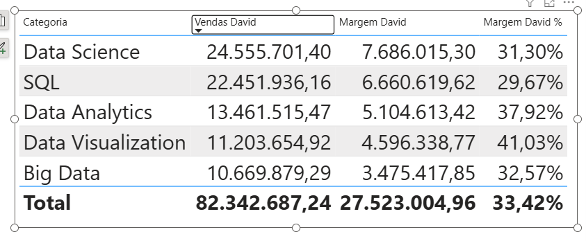
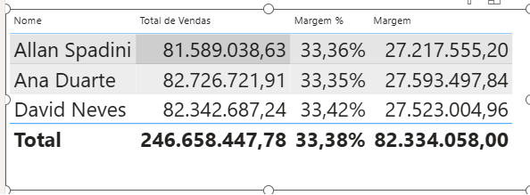
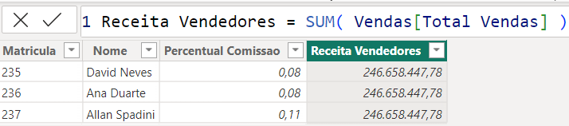
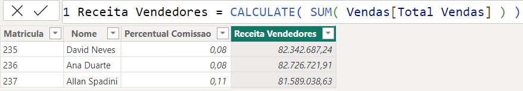
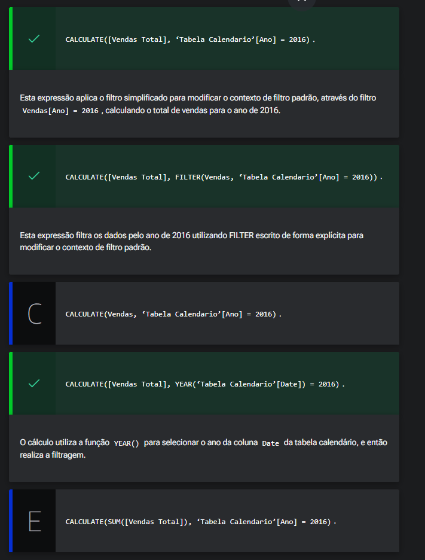

# Conhecendo o CALCULATE

<a id="topo"></a>

## Sumário
- [Conhecendo o CALCULATE](#conhecendo-o-calculate)
  - [Sumário](#sumário)
  - [1. Projeto da aula anterior](#1-projeto-da-aula-anterior)
  - [2. Vendas por vendedores](#2-vendas-por-vendedores)
  - [3. Para saber mais: criando a tabela calendário](#3-para-saber-mais-criando-a-tabela-calendário)
  - [4. Mudando o contexto de filtro](#4-mudando-o-contexto-de-filtro)
  - [5. Para saber mais: transição de contexto](#5-para-saber-mais-transição-de-contexto)
  - [6. Filtrando com CALCULATE](#6-filtrando-com-calculate)
  - [7. Para saber mais: funções de filtro](#7-para-saber-mais-funções-de-filtro)
  - [8. Mão na massa: criando uma matriz](#8-mão-na-massa-criando-uma-matriz)
  - [9. O que aprendemos?](#9-o-que-aprendemos)

## 1. Projeto da aula anterior

Caso prefira, você pode acessar o projeto da [aula](https://github.com/thierryLchaves/Santander-Imersao-Digital/blob/f22d04a155a7a2c82e5f6f401505397e1b941980/Analise_de_dados_e_IA_Nivelamento/Semana_08/Power_BI_Construindo_calculos_com_Dax/src/projeto-dax-livraria-inicial.pbix) no ponto em que paramos na aula anterior.  

[↑ Voltar ao topo](#topo)

---
## 2. Vendas por vendedores

Dando seguimento ao nosso projeto, a ideia será analisar as vendas realizadas com base em um vendedor especifico, para isso iremos realizar a confecção de mais uma página para visualizar essa informação criando mais um visual de tabela, com apresentações das categorias e as informações vendas, margem e margem em %, porém para o vendedor David Neves.  
Para isso iremos reaproveitas as medidas que criamos anteriormente para o tipo de produto, porém modificando o tipo pelo vendedor, ou seja iremos substituir onde na função `FILTER()`, passamos o `PRODUTOS[TIPO] ="Ebook"`, para `Vendedores[Nome] = "David Neves"`, com isso podemos criar nosso cartão de visualização com nossas medidas filtradas pelo vendedor:  
<table style="text-align: center; width: 100%;"> 
<tr>
    <td style="text-align: left;">
    
    </td>
</tr>
</table>

Novamente percebemos o mesmo padrão já mencionado, em nossa base de dados, que é o de quanto maior a quantidade de vendas menor é o percentual de margem de lucro sobre o produto.  
Até o presente momento não há nada de diferente do que já vimos ao decorrer do curso, e do que fora anotado neste repositório, porém como finalizamos nossa [aula anterior](https://github.com/thierryLchaves/Santander-Imersao-Digital/blob/d752f75f54bc2b3e16941bb3bff4ea24946355e0/Analise_de_dados_e_IA_Nivelamento/Semana_08/Power_BI_Construindo_calculos_com_Dax/04_Contextos_no_DAX/ContextosNoDax.md) a ideia agora será aprender uma maneira de realizar aplicação de filtros específicos para determinadas condições, para essa aplicação vamos primeiro criar uma nova apresentação tubular, e modificar a segregação dos dados que anteriormente estavam sendo aplicados por categoria porém agora serão pelo nome dos vendedores, o que deixaria nossa apresentação da seguinte maneira:  
<table style="text-align: center; width: 100%;"> 
<tr>
    <td style="text-align: left;">
    
    </td>
</tr>
</table>

Ainda assim essa maneira não é a ideia pois teríamos que adicionar um novo visual a cada vendedor, então para sanar isso veremos adiante a função se não a mais importante uma das mais importantes em DAX, que é função calculate.

[↑ Voltar ao topo](#topo)

---
## 3. Para saber mais: criando a tabela calendário

A tabela calendário é uma ferramenta essencial no Power BI para análises baseadas em datas. Ela permite a criação de visualizações temporais, como gráficos de tendências, comparações de períodos e cálculos sazonais. Com uma tabela calendário bem configurada, você pode facilmente agregar dados por dias, semanas, meses, trimestres e anos, além de executar funções DAX específicas para datas.

Além disso, ao criar a tabela calendário, garanta que a coluna DATE esteja corretamente formatada como "*14/03/2001 13:30:55 (General Date)". Nesse processo, lembre-se de estabelecer o relacionamento entre a tabela calendário e a tabela InfoVendas, utilizando a coluna de data como chave.

Para fins didáticos, considere o código a seguir para criar uma tabela calendário no Power BI:

```dax
Tabela Calendário = 
ADDCOLUMNS(
    CALENDARAUTO(),
    "Dia num", DAY([Date]),
    "Dia nome", FORMAT([Date], "dddd"),
    "Dia Semana", WEEKDAY([Date]),
    "Semana Num", WEEKNUM([Date]),
    "Mês Num", MONTH([Date]),
    "Mês Nome", FORMAT([Date], "mmm"),
    "Trimestre", QUARTER([Date]),
    "Ano", YEAR([Date])
)
```
Ao utilizar essa tabela, você pode enriquecer suas análises temporais, proporcionando insights mais detalhados e precisos sobre seus dados. A tabela calendário não apenas organiza seus dados, mas também permite uma análise mais profunda e significativa.  

Para explorar as funcionalidades da tabela calendário, confira o Alura+ Power BI: criando uma dimensão calendário com o Bravo, onde o Afonso Rios aborda a ferramenta Bravo, criando e customizando uma tabela calendário e diversas métricas de inteligência temporal.


[↑ Voltar ao topo](#topo)

---
## 4. Mudando o contexto de filtro  

Seguindo nossa provocação do [tópico anterior](#2-vendas-por-vendedores), iremos visualizar agora como podemos obter dentro de uma fórmula DAX conforme modificamos nossa contexto de filtro.   
Para isso iremos criar uma nova medida utilizando a função `CALCULATE`, essa função exige como argumentos uma expressão que para fins de exemplo utilizaremos o cálculo de total de vendas _(quantidade de produtos x preço)_, e depois os filtros, a função `CALCULATE` aceita vários filtros como argumentos, porém no nosso exemplo iremos utilizar apenas 1.  
```DAX
Vendas David Calculate = 
CALCULATE(
    [Total de Vendas], 
    Vendedores[Nome] = "David Neves"
)
```
Com isso podemos obter um resultado idêntico quando utilizamos a fórmula anterior:
```DAX
Vendas David = 
SUMX(
    FILTER( 
        Vendas,
        RELATED(Vendedores[Nome]) = "David Neves"
    ),
    Vendas[Quantidade] * Vendas[Preco Calculado]
)
```
No caso nossa nova função está realizado de forma automática, a condição de filtro condicional feita através do `RELATED`, poderíamos de substituir o filtro do segundo argumento da função para 
```DAX
  FILTER( 
      Vendas,
      RELATED(Vendedores[Nome]) = "David Neves"
    ),
``` 
Mas com a inteligência da função `CALCULATE`, apenas a escrita de `Vendedores[Nome] = "David Neves"`, realiza a mesma aplicação, ou seja o argumento que está sendo passado para o `CALCULATE` não é uma condicional e sim um retorno de __uma tabela obedecendo uma condição__. 


[↑ Voltar ao topo](#topo)

---
## 5. Para saber mais: transição de contexto

A transição de contexto no DAX (Data Analysis Expressions) é um conceito fundamental para a construção de fórmulas e cálculos no Power BI. Entender como o contexto funciona e como ele pode mudar é essencial para a criação de cálculos mais complexos.

Ela ocorre quando o contexto de linha se transforma em contexto de filtro. Isso é mais comum em funções como `CALCULATE, RELATED, e RELATEDTABLE`.

---

__Cenário prático__  
Imagine o seguinte cenário: precisamos criar uma coluna na tabela de __Vendedores__ que calcule o total de vendas de cada vendedor. Sabemos que existe uma coluna de __Total Vendas__ na tabela de __Vendas__, e é dela que precisamos.

Em seguida, vamos criar uma nova coluna na tabela de __Vendedores__ chamada __Receita Vendedores__. Para realizar o cálculo, vamos somar a coluna de __Total Vendas__ utilizando a função `SUM()`, como podemos conferir logo abaixo:

```DAX
Receita Vendedores = SUM( Vendas[Total Vendas] )
```
Antes de executar o código, vamos nos perguntar: qual será o resultado para cada vendedor, em cada linha da tabela?

Caso você tenha respondido que será o total de vendas respectivo de cada vendedor, a resposta correta é um pouco diferente. Vamos conferir o resultado:  

<table style="text-align: center; width: 100%;"> 
<tr>
    <td style="text-align: left;">
    
    </td>
</tr>
</table>

Como podemos perceber, o valor registrado nas linhas da tabela representa a soma total das vendas, repetida para cada vendedor. Ou seja, o valor não foi ajustado individualmente para cada vendedor.

Para entender isso, precisamos relembrar o seguinte: qual o contexto em que os dados das tabelas são apresentados? Apenas o contexto de linha. Isso significa que o cálculo da soma é feito sobre todas as linhas da tabela de Vendas, pois o contexto de filtro não existe nas tabelas.

No modo de exibição de tabelas, não existem visuais que podem adicionar contextos de filtro nos dados. Existem apenas as próprias linhas das tabelas, as quais são avaliadas durante a realização dos cálculos pelo contexto de linha.

Após a soma das vendas serem realizadas, o contexto de linha é avaliado, onde cada vendedor é reconhecido, e por isso cada linha recebe o valor total. O valor é o mesmo pois não existe uma filtragem para os valores das vendas com relação aos vendedores. Então, o DAX não entende que deve adaptar aquele valor para cada linha de forma diferente.

Nesse caso, podem surgir alguns questionamentos: como podemos adicionar um filtro nos cálculos das tabelas, se não temos visuais para filtrar esses dados e o contexto de filtro não existe? Como podemos adicionar um filtro nos cálculos das tabelas? Em outras palavras, como podemos fazer com que o resultado da soma das vendas seja filtrado pelos vendedores?

A resposta para isso vem com outra pergunta: como podemos adicionar um contexto de filtro a um cálculo utilizando apenas o DAX, sem usar visuais? Através da função `CALCULATE()`.

--- 
__CALCULATE__  

Como aprendemos durante o curso, a função `CALCULATE()` é a única função capaz de criar um contexto de filtro novo, sem precisar de visuais, usando apenas código DAX.

Agora que sabemos o que precisamos utilizar para adicionar a filtragem, vamos para a transição do contexto. Para isso, precisamos apenas envolver a soma das vendas em uma função `CALCULATE()`, como podemos verificar a seguir:

```DAX
Receita Vendedores = CALCULATE( 
      SUM(
         Vendas[Total Vendas] 
      )
)
```
Usando a função apenas com um parâmetro dessa forma, sem a adição de um parâmetro para o filtro, ela irá realizar a transição de contexto. O resultado é o seguinte:

<table style="text-align: center; width: 100%;"> 
<tr>
    <td style="text-align: left;">
    
    </td>
</tr>
</table>


Assim, a função `CALCULATE()` irá transformar as linhas do contexto de linha e utilizá-las como filtragem para os valores do cálculo.

Visualmente falando, podemos imaginar o seguinte: antes, a tabela de Vendedores era vista apenas como uma tabela que não possui contexto de filtro, em que os totais de vendas não eram adaptados para cada vendedor, pois possui apenas o contexto de linha.

Com a `CALCULATE()`, podemos imaginar que a tabela de Vendedores agora se comporta como um visual de tabela, em que o contexto de filtro é aplicado pelos campos da tabela e os valores da coluna de Receita Vendedores se adaptam para cada vendedor.

De forma ilustrativa, podemos pensar na transição de contexto como uma forma de transformar uma mera tabela com contexto de linha em um visual dinâmico com contexto de filtro.   

[↑ Voltar ao topo](#topo)

---
## 6. Filtrando com CALCULATE  

Você é um analista de dados em uma empresa de varejo que está analisando o desempenho de vendas por ano. Em seu relatório, você precisa calcular o total de vendas apenas para o ano de 2016, independentemente do filtro de datas que esteja sendo aplicado em outras partes do relatório.

Considerando esse contexto, qual expressão DAX você utilizaria para alcançar esse resultado, utilizando apenas a função CALCULATE para modificar o contexto de filtro padrão? Escolha as alternativas corretas. 


<table style="text-align: center; width: 100%;"> 
<tr>
    <td style="text-align: left;">
    
    </td>
</tr>
</table>


[↑ Voltar ao topo](#topo)

---
## 7. Para saber mais: funções de filtro  
 
As funções de filtro no DAX são essenciais para o controle e manipulação do contexto de filtro durante os cálculos. Elas permitem ajustar, aplicar ou remover filtros específicos, influenciando diretamente os resultados das medidas e colunas calculadas.

Compreender e utilizar essas funções de forma eficiente é crucial para realizar análises precisas e detalhadas no Power BI. Pensando nisso, vamos explorar três dessas funções: `REMOVEFILTERS, KEEPFILTERS e USERELATIONSHIP`.

---

__REMOVEFILTERS__  
A função `REMOVEFILTERS()` é usada para remover filtros de colunas ou tabelas específicas no contexto atual. Ela é útil quando você deseja calcular uma medida ignorando os filtros aplicados.

- Exemplo:  
```DAX
TotalVendasSemFiltro = 
CALCULATE (
    SUM( Vendas[Quantidade] ), 
    REMOVEFILTERS( Produtos[Categoria] ) 
)
```
Neste exemplo, a medida `TotalVendasSemFiltro` soma as quantidades de vendas ignorando qualquer filtro na coluna Categoria da tabela Produtos.

---
__KEEPFILTERS__  

A função `KEEPFILTERS()` preserva os filtros existentes enquanto adiciona novos filtros ao contexto. Isso pode ser útil para refinar os cálculos sem remover filtros que já estão aplicados.
- Exemplo:  
```DAX
VendasFiltradas = 
CALCULATE (
    SUM( Vendas[Quantidade] ), 
    KEEPFILTERS( Produtos'[Categoria] = "SQL" ) 
)
```
Neste caso, `VendasFiltradas` calcula a soma das vendas para a categoria "SQL", mantendo qualquer outro filtro já aplicado.

----

__USERELATIONSHIP__  

A função `USERELATIONSHIP()` ativa uma relação específica entre duas tabelas para o cálculo, mesmo que não seja a relação ativa padrão. Isso é útil quando você tem múltiplos relacionamentos entre tabelas e deseja usar um não ativo.

- Exemplo:
```DAX
TotalVendasPorDataEntrega = 
CALCULATE (
    SUM( Vendas[Quantidade] ), 
    USERELATIONSHIP( Vendas[DataEntrega], Calendário[Date] ) 
)
```
No trecho acima, `TotalVendasPorDataEntrega` calcula a soma das vendas usando a relação entre DataEntrega na tabela Vendas e Date na tabela Calendário.

Entender como e quando usar `REMOVEFILTERS(), KEEPFILTERS() e USERELATIONSHIP()` permite um controle mais refinado sobre o contexto de filtro, proporcionando cálculos mais precisos e flexíveis no Power BI. Essas funções são essenciais para análises avançadas e detalhadas, adaptando os cálculos às necessidades específicas dos dados e das perguntas de negócios.  

[↑ Voltar ao topo](#topo)

---
## 8. Mão na massa: criando uma matriz  

Você é um analista de dados em uma empresa de varejo que está trabalhando em um relatório para a equipe de marketing. A equipe solicitou um cálculo do total de vendas para produtos de categorias específicas, independentemente de qualquer filtro de categoria de produto aplicado em outras partes do relatório.

---
__Desafio__  

- Utilize a função `CALCULATE()` para criar uma medida DAX que calcule o total de vendas apenas para as categorias "Data Analytics" ou "Data Visualization".
Em caso de dúvidas sobre a resolução da atividade, confira a seção “Opinião da pessoa instrutora”.

__Opinião do instrutor__  
Para resolver o desafio, você pode usar a função `CALCULATE()` junto com FILTER() para criar um novo contexto de filtro que inclua apenas os produtos "Data Analytics" ou "Data Visualization". Para fins didáticos, segue uma possível solução:
```DAX
TotalVendasCategoriasEspecificas =
CALCULATE (
    [Vendas Total],
FILTER (
        Vendas,
        RELATED(Produtos[Categoria]) = "Data Analytics" || RELATED(Produtos[Categoria]) = "Data Visualization"
        )
)
```

Essa medida calcula o total de vendas, modificando o contexto de filtro para incluir apenas "Data Analytics" e "Data Visualization".

Em caso de dúvidas, fique à vontade para usar o Fórum ou o Discord da Alura.

[↑ Voltar ao topo](#topo)

---
## 9. O que aprendemos?

Nessa aula, você foi capaz de:
- Aplicar a função CALCULATE;
- Entender o funcionamento da função CALCULATE;
- Criar um contexto de filtro utilizando o DAX.

---

<table align="center" style="border-collapse: collapse; margin-left: auto; margin-right: auto;"> 
  <caption><b>Skills do projeto</b></caption>
  <tr>
    <td style="padding: 5px;">
      
    </td>
    <td style="padding: 5px;">
      
    </td>
    <td style="padding: 5px;">
      
    </td>
  </tr>
</table>


---
__Titulo:__ Conhecendo o CALCULATE
__Autor:__ Thierry Lucas Chaves  
__Data de Criação:__ 19-06-2026  
__Data de Modificação:__ 21-06-2026  
__Versão:__ "1.0"