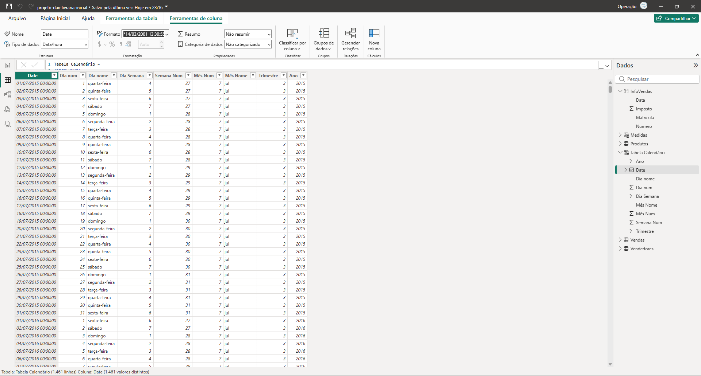
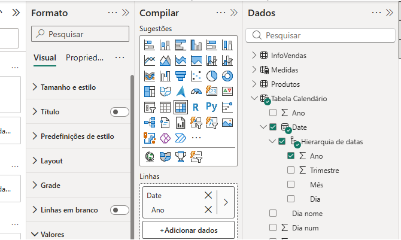
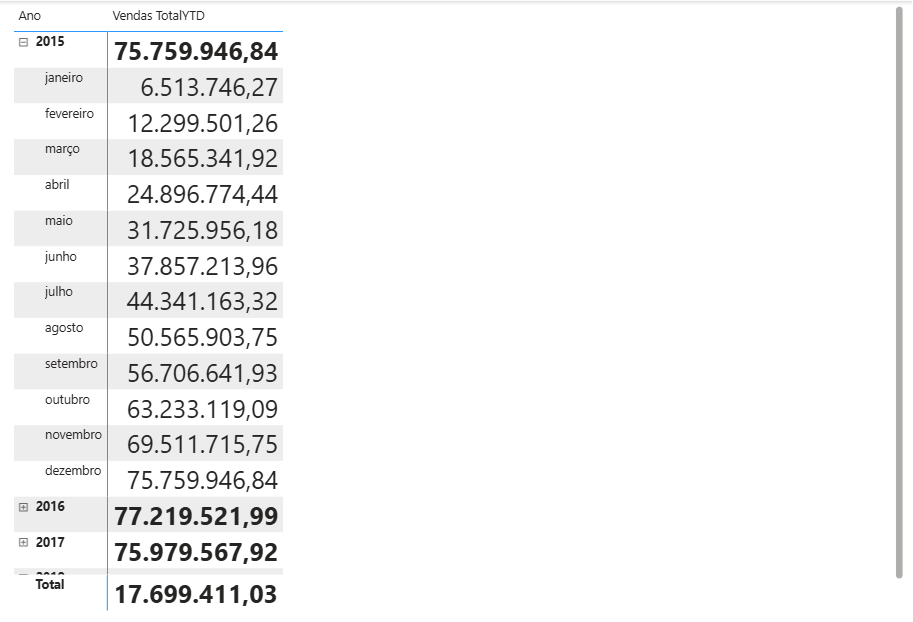
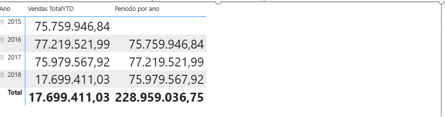
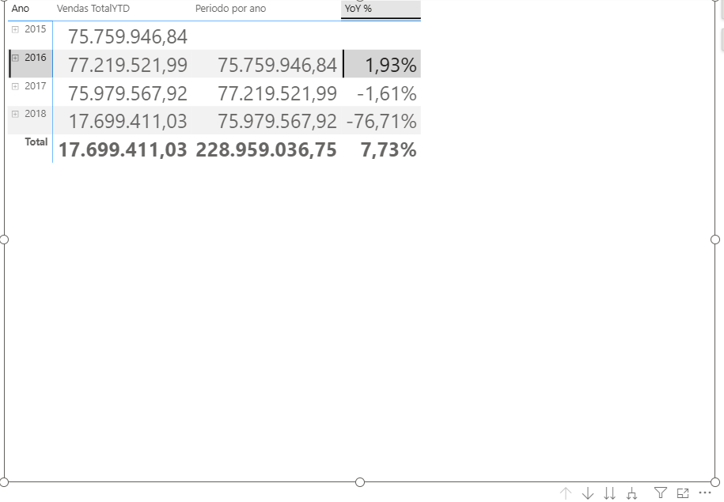
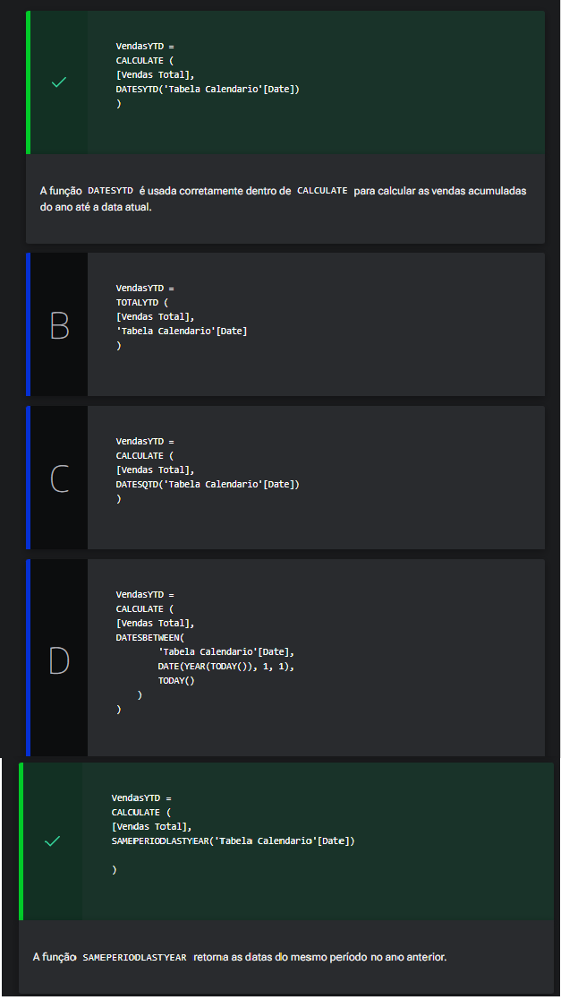
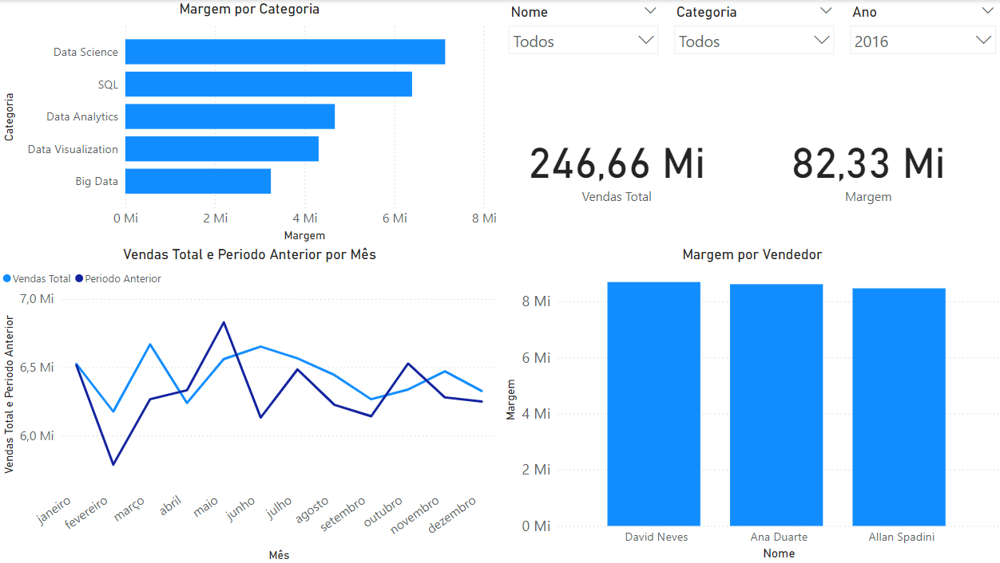

# Inteligência temporal

<a id="topo"></a>

## Sumário
- [Inteligência temporal](#inteligência-temporal)
  - [Sumário](#sumário)
  - [1. Projeto da aula anterior](#1-projeto-da-aula-anterior)
  - [2. Tabela calendário](#2-tabela-calendário)
  - [3. Para saber mais: funções de DATA](#3-para-saber-mais-funções-de-data)
  - [4. Calculando o período anterior](#4-calculando-o-período-anterior)
  - [5. Para saber mais: funções de inteligência temporal](#5-para-saber-mais-funções-de-inteligência-temporal)
  - [6. Calculando a diferença das vendas](#6-calculando-a-diferença-das-vendas)
  - [7. Vendas do período anterior](#7-vendas-do-período-anterior)
  - [8. Mão na massa: relatório final](#8-mão-na-massa-relatório-final)
  - [9. Projeto final](#9-projeto-final)
  - [10. Para ir mais fundo](#10-para-ir-mais-fundo)
  - [11. O que aprendemos?](#11-o-que-aprendemos)
  - [12. Conclusão](#12-conclusão)
  - [Parbéns](#parbéns)

## 1. Projeto da aula anterior

Caso prefira, você pode acessar o projeto da [aula](https://github.com/thierryLchaves/Santander-Imersao-Digital/blob/f22d04a155a7a2c82e5f6f401505397e1b941980/Analise_de_dados_e_IA_Nivelamento/Semana_08/Power_BI_Construindo_calculos_com_Dax/src/projeto-dax-livraria-inicial.pbix) no ponto em que paramos na aula anterior.  


[↑ Voltar ao topo](#topo)

---
## 2. Tabela calendário

Agora iremos modificar novamente o nosso projeto para que possamos aplicar uma analise de temporalidade em nossas vendas, para que possamos aplicar esse filtro de datas precisamos regressar a nossa base de dados e avaliar quais tabelas contem essa informação de datas, e essa tabela que contem tais informações e justamente a tabela de `infoVendas`, na qual possuímos a coluna que marca as datas das vendas de nossos produtos.   
Porém para que possamos realizar essa analise com base em datas, precisamos segregar as datas de forma que possamos obter as informações de data com separações de dia ano e mes por exemplo, e não todas em conjunto como está presente em nossa tabela, para que possamos realizar tal aplicação precisamos criar uma tabela dentro do Power B.I de calendário , dentro dessa tabela que iremos criar utilizaremos duas funções novas sendo elas `ADDCOLUMNS()` que realiza a adição de colunas com base nos argumentos passados como parâmetro e a outra função será a de `CALENDARAUTO()`, se tentarmos utilizar a função apenas com esse argumento o Power B.I irá para além de apresentar um erro, apenas irá criar uma coluna com datas idênticas as que já estão presentes na coluna de datas da tabela de `infoVendas`, então para realizar tal segregação precisamos _"destrinchar"_ de forma explicita na função como será a desatribuição dessas datas, para isso utilizaremos o código descrito abaixo, que será explicado o que cada argumento faz: 
```DAX
Tabela Calendário = 
ADDCOLUMNS(
    CALENDARAUTO(),
    "Dia num", DAY([Date]),
    "Dia nome", FORMAT([Date], "dddd"),
    "Dia Semana", WEEKDAY([Date]),
    "Semana Num", WEEKNUM([Date]),
    "Mês Num", MONTH([Date]),
    "Mês Nome", FORMAT([Date], "mmm"),
    "Trimestre", QUARTER([Date]),
    "Ano", YEAR([Date])
)
```
- `"Dia num", DAY([Date])`: Nesse parâmetro realizamos a extração do número do dia utilizando as funções `DAY` e apontamos qual será o atributo
- `"Dia nome", FORMAT([Date], "dddd")`: Nesse parâmetro realizamos a extração do dia porém obtendo seu nome, utilizando a função `FORMAT` extraindo a data `[date]`, e adicionado a mascara de dias que será aplicada `ddd`
- `"Dia Semana", WEEKDAY([Date])`: Nesse parâmetro realizamos a extração do dia da semana utilizando a função `WEEKDAY`, e apontamos qual será o atributo no caso `[date]`. 
- `"Semana Num", WEEKNUM([Date])`: Nesse parâmetro realizamos a extração do número da semana utilizando a função `WEEKNM`, e apontamos qual será o atributo no caso `[date]`
- `"Mês Num", MONTH([Date])`: Nesse parâmetro realizamos a extração do número do mês utilizando a função `MOUTH`, e apontamos qual será o atributo no caso `[date]`
- `"Mês Nome", FORMAT([Date], "mmm")`: Nesse parâmetro realizamos a extração do nome do mês utilizando a função de formatação `FORMAT` extraindo a data `[date]`, e adicionado a mascara de dias que será aplicada `mmm`
- `"Trimestre", QUARTER([Date])`: Nesse parâmetro realizamos a extração do trimestre utilizando a função `QUARTER`, e apontamos qual será o atributo no caso `[date]`
- `"Ano", YEAR([Date])`: Nesse parâmetro realizamos a extração do ano utilizando a função `YEAR`, e apontamos qual será o atributo no caso `[date]`

Esse argumento comum em todas as funções supracitadas, advém da nossa função `CALENDARAUTO()`, essa função por padrão irá criar uma coluna com nome de `Date`
[↑ Voltar ao topo](#topo)

---
## 3. Para saber mais: funções de DATA 

As funções de data no DAX são ferramentas poderosas que permitem manipular e analisar datas de maneiras sofisticadas. Essas funções são essenciais para realizar cálculos e análises temporais, como comparações ano a ano, cálculos de média móvel e muito mais.

Abaixo, vamos explorar algumas das principais funções de data no DAX e suas aplicações práticas.

- `TODAY()`: Retorna a data atual. É útil para criar colunas calculadas ou medidas que precisam ser comparadas com a data de hoje.

```DAX 
DataAtual = TODAY()
```
-`NOW()`: Retorna a data e a hora atuais. Usado quando é necessário incluir informações de tempo junto com a data.

```DAX 
DataHoraAtual = NOW()
```

- `YEAR(data)`: Extrai o ano de uma data.

```DAX 
AnoDaData = YEAR(Vendas[Data])
```
- `MONTH(data)`: Extrai o mês de uma data.
  
```DAX
MesDaData = MONTH(Vendas[Data])
```

- `DAY(data)`: Extrai o dia de uma data.
  
```DAX
DiaDaData = DAY(Vendas[Data])
```

- `DATE(ano, mês, dia)`: Cria uma data a partir de componentes individuais.
  
```DAX
DataPersonalizada = DATE(2023, 6, 13)
```

- `DATEDIFF(data_inicial, data_final, unidade)`: Calcula a diferença entre duas datas em unidades específicas (ano, trimestre, mês, dia, hora, minuto, segundo).
  
```DAX
DiferencaDias = DATEDIFF(Vendas[DataInicial], Vendas[DataFinal], DAY)
```

- `EOMONTH(data_inicial, meses)`: Retorna o último dia do mês após ou antes de um número especificado de meses.
  
```DAX
FimDoMes = EOMONTH(TODAY(), -1)  -- Último dia do mês anterior
```

- `EDATE(data_inicial, meses)`: Retorna a data no mesmo dia do mês, um número especificado de meses no passado ou futuro.
  
```DAX
DataFutura = EDATE(TODAY(), 6)  -- Seis meses no futuro a partir de hoje
```

- `CALENDAR(data_inicial, data_final)`: Cria uma tabela de datas entre as datas especificadas.
  
```DAX
Calendario = CALENDAR(DATE(2023, 1, 1), DATE(2023, 12, 31))
```
- `CALENDARAUTO()`: Cria uma tabela de datas automaticamente baseada nos dados presentes no modelo.
  
```DAX
CalendarioAuto = CALENDARAUTO()
```

As funções de data no DAX oferecem uma ampla gama de possibilidades para manipulação e análise de dados temporais. Com elas, você pode facilmente realizar comparações de períodos, calcular médias móveis, criar calendários dinâmicos e muito mais.  


[↑ Voltar ao topo](#topo)

---
## 4. Calculando o período anterior
Após a criação de nosso calendário podemos dar seguimento ao nosso projeto, entretanto é importante nos ater a um detalhe, em alguns casos será apresentado o campo de date com a informação de data completa, dia,mês ano, descrição mes dia e hora, porém esse tipo de formatação não é o mais indicado para trabalharmos com cálculos de dados, para tal precisamos formatar nossa coluna para utilizar o tipo de general date, conforme abaixo:  
<table style="text-align: center; width: 100%;"> 
<tr>
    <td style="text-align: left;">
    
    </td>
</tr>
</table>

---
Dado essa contextualização iremos criar mais uma página de visualização, para obtermos as informações temporais, nesse nova página utilizaremos o tipo de visualização de matriz, e selecionaremos primeiramente nosso campo date recém criado.   
Quando selecionado esse campo por padrão ele será em formato hierárquico, e irá demonstrar informações de mês dia e trimestre, porém o que desejamos e apenas a visualização anual das vendas, para tal podemos tanto remover essa informações no menu de filtro quanto em dados desmarcar essas opções: 
<table style="text-align: center; width: 100%;"> 
<tr>
    <td style="text-align: left;">
    
    </td>
</tr>
</table>

Com essa aplicação teremos informações dos meses, porém caso selecionarmos uma das medidas, tal qual o total de vendas, para esse card, a informação será incorreta pois para esse tipo de calculo temos que utilizar uma função especifica em DAX, que realiza cálculos utilizando __Inteligência Temporal__  e essa função é  listada abaixo:
```DAX
Vendas TotalYTD = 
    TOTALYTD(
        [Total de Vendas],
        'Tabela Calendário'[Date]
    )
```
Essa função recebe como argumentos, a expressão e base de data. 
> PS: importante certifica que haja o relacionamento entre a tabela de calendários com nossa tabela que contém as datas.


<table style="text-align: center; width: 100%;"> 
<tr>
    <td style="text-align: left;">
    
    </td>
</tr>
</table>

Agora como desejamos realizar uma comparação de vendas pelos anos anteriores, devemos adicionar mais uma medida que irá realizar a comparação do contexto de filtro atual, com base no filtro externo, para isso utilizaremos a função de `CALCULATE`, em conjunto com outra função o que deixará nossa função da seguinte forma: 
```DAX
Periodo por ano = 
    CALCULATE(
            [Total de Vendas], 
            SAMEPERIODLASTYEAR(
                'Tabela Calendário'[Date]
            )
    )
```
<table style="text-align: center; width: 100%;"> 
<tr>
    <td style="text-align: left;">
    
    </td>
</tr>
</table>

[↑ Voltar ao topo](#topo)

---
## 5. Para saber mais: funções de inteligência temporal  

As funções de inteligência temporal no DAX são projetadas para facilitar análises e comparações de dados ao longo do tempo. Elas permitem que você execute cálculos complexos que envolvem períodos específicos, como meses, trimestres, anos, e comparações com períodos anteriores.

Vamos explorar algumas das principais funções de inteligência temporal no DAX e suas aplicações. 

- `DATESMTD(tabela[Data]):` Retorna uma tabela que contém todas as datas do mês até a data especificada.

```DAX
DATESMTD(tabela[Data]): Retorna uma tabela que contém todas as datas do mês até a data especificada.
```
Essa função é útil para calcular o acumulado do mês até a data atual ou outra data específica.

- `DATESQTD(tabela[Data])`: Retorna uma tabela que contém todas as datas do trimestre até a data especificada.

```DAX
VendasQTD = 
CALCULATE (
[Vendas Total],
DATESQTD(‘Tabela Calendario’[Date])
)
```
Utilize essa função para calcular o acumulado do trimestre até a data atual ou outra data específica.

- `DATESYTD(tabela[Data], [year_end_date])`: Retorna uma tabela que contém todas as datas do ano até a data especificada. O parâmetro opcional year_end_date permite definir uma data de término de ano fiscal diferente de 31 de dezembro.

```DAX
VendasYTD = 
CALCULATE (
[Vendas Total],
DATESYTD(‘Tabela Calendario’[Date])
)
```
Essa função é ideal para calcular o acumulado do ano até a data atual ou outra data específica.

- `DATESBETWEEN(tabela[Data], data_inicial, data_final)`: Retorna uma tabela que contém as datas entre a data inicial e a data final especificadas.

```DAX
DATESBETWEEN(tabela[Data], data_inicial, data_final): Retorna uma tabela que contém as datas entre a data inicial e a data final especificadas.
```
Use essa função para calcular o total de um intervalo de datas específico, definido por você.

- `TOTALYTD(expressão, tabela[Data], [year_end_date])`: Calcula o acumulado do ano até a data especificada, similar à DATESYTD, mas diretamente dentro da função.
  
```DAX
TotalVendasYTD = 
TOTALYTD(
[Vendas Total],
‘Tabela Calendario’[Date]
  )
```
Essa função simplifica o cálculo de acumulados anuais sem a necessidade de combinar `CALCULATE e DATESYTD`.

- `SAMEPERIODLASTYEAR(tabela[Data])`: Retorna uma tabela que contém o mesmo período no ano anterior.
```DAX
VendasMesmoPeriodoAnoAnterior = 
CALCULATE(
[Vendas Total],
SAMEPERIODLASTYEAR(‘Tabela Calendario’[Date])
  )
```
Essa função é particularmente útil para comparações ano a ano (YoY).

As funções de inteligência temporal no DAX permitem calcular acumulados, comparar períodos específicos e analisar tendências ao longo do tempo. Elas são ferramentas essenciais para qualquer analista de dados que deseja realizar análises temporais detalhadas e precisas.  

[↑ Voltar ao topo](#topo)

---
## 6. Calculando a diferença das vendas

Agora o que iremos aprender é uma maneira de como visualizar em porcentagem a diferença ente as vendas dos anos, para tal podemos utilizar as seguintes funções:   
```DAX
YoY % = 
DIVIDE(
    [Total de Vendas] - [Periodo por ano],
    [Periodo por ano]
)
```
Com isso podemos obter as informações de comparação entre os anos sobre as vendas, deixando nossa matriz da seguinte maneira:  

<table style="text-align: center; width: 100%;"> 
<tr>
    <td style="text-align: left;">
    
    </td>
</tr>
</table>

[↑ Voltar ao topo](#topo)

---
## 7. Vendas do período anterior  

Você é um analista de dados em um e-commerce e precisa calcular as vendas acumuladas do ano até a data atual para incluir em um relatório. Além disso, você quer comparar essas vendas com as vendas acumuladas do mesmo período do ano anterior. Para isso, você precisa usar as funções de inteligência temporal do DAX.

Considerando essa demanda, qual expressão DAX você utilizaria para calcular as vendas acumuladas do ano até a data atual e as vendas acumuladas do mesmo período do ano anterior? Escolha a alternativa correta.  
<table style="text-align: center; width: 100%;"> 
<tr>
    <td style="text-align: left;">
    
    </td>
</tr>
</table>

[↑ Voltar ao topo](#topo)

---
## 8. Mão na massa: relatório final  

Durante o curso, criamos diversas visualizações para nos ajudar a realizar a análise dos dados. Nesse momento, precisamos reunir os principais visuais em uma única página, para montar nosso relatório final.

Para isso, vamos focar nossa apresentação nos principais pontos analisados, que foram: produtos, vendedores e vendas ao longo tempo.  

---
__Desafio__ 
- 1  Análise de Produtos:
  - Crie uma visualização que destaque as categorias de produtos mais rentáveis. Use a medida de Margem das vendas criada durante o curso.
  - Sugestão: Um gráfico de barras ou colunas que mostre as categorias ordenadas pela margem.

- 2 Análise de Vendedores:
  - Crie uma visualização que mostra quais vendedores tiveram maior rentabilidade. Utilize a medida de Margem dos vendedores que você criou durante o curso.
  - Sugestão: Um gráfico de barras ou colunas que mostre os vendedores ordenados pela margem.

- 3  Desempenho das Vendas ao Longo do Tempo:
  - Crie uma visualização que mostra o desempenho das vendas ao longo do tempo. Utilize as medidas de vendas (Venda Total) e as comparações com o mesmo período do ano anterior   (Periodo Anterior).
  - Sugestão: Um gráfico de linha ou área que mostre as vendas mês a mês, destacando a comparação com o ano anterior.

- 4 Visão Geral:
  - Crie um cartão ou indicador que mostre o total de vendas e margem de forma destacada.
  - Sugestão: Utilize as medidas Total Vendas e Margem com a função ALL().

- 5  Filtros e Interatividade:
  - Adicione filtros para permitir a análise por diferentes anos, categorias de produtos e vendedores.

__Instruções Adicionais:__  

Utilize as medidas `Vendas Total, Margem, Vendas Total ALL, Margem ALL e Periodo Anterior`, criadas durante o curso.
Aproveite as funcionalidades interativas do Power BI para tornar a análise dinâmica e exploratória.

Em caso de dúvidas sobre a resolução da atividade, confira a seção “Opinião da pessoa instrutora”.

---

__Opinião do instrutor__  

Abaixo você pode conferir os visuais criados para montar o relatório final [acesse aqui](https://github.com/thierryLchaves/Santander-Imersao-Digital/blob/df6f13c1fe5b0c608c8c42896a6e57363e8d5d9a/Analise_de_dados_e_IA_Nivelamento/Semana_08/Power_BI_Construindo_calculos_com_Dax/src/Relatorio%20Final_professor):

<table style="text-align: center; width: 100%;"> 
<tr>
    <td style="text-align: left;">
    
    </td>
</tr>
</table>

É importante destacar que este relatório pode ser aprimorado de diversas formas, e serve como ponto de partida para que você possa reunir as informações mais importantes analisadas durante o curso. Pensando nisso, você pode adicionar visualizações que destacam outros pontos que você considera importante, de forma livre.  

Além disso, caso queira melhorar ainda mais suas visualizações, confira o curso [Dashboard com Power BI: visualizando dados](https://cursos.alura.com.br/course/dashboard-power-bi-visualizando-dados), onde você aprenderá a desenvolver relatórios e dashboards funcionais, interativos e personalizados.  

Fique à vontade para compartilhar seu projeto no Linkedin ou em outras redes. Sempre ficamos felizes em ver os seus resultados.

Em caso de dúvidas, fique à vontade para usar o Fórum ou o Discord da Alura.  

[↑ Voltar ao topo](#topo)

---
## 9. Projeto final

Caso prefira, você pode acessar o arquivo da [aqui](https://github.com/thierryLchaves/Santander-Imersao-Digital/blob/df6f13c1fe5b0c608c8c42896a6e57363e8d5d9a/Analise_de_dados_e_IA_Nivelamento/Semana_08/Power_BI_Construindo_calculos_com_Dax/src/projeto-dax-livraria-final.pbix) com o projeto do curso no ponto em que paramos na aula anterior.

[↑ Voltar ao topo](#topo)

---
## 10. Para ir mais fundo
[The Definitive Guide to DAX (pago, inglês, livro)](https://www.google.com.br/books/edition/The_Definitive_Guide_to_DAX/ZvSfDwAAQBAJ?hl=pt-BR&gbpv=0)
> "The Definitive Guide to DAX" é uma referência essencial para qualquer desenvolvedor que trabalhe com Power BI, PowerPivot, ou SQL Server Analysis Services (SSAS). Nestas plataformas, DAX é a linguagem principal para criar modelos de negócios mais eficazes, capazes de analisar qualquer tipo de dados. DAX (gratuito, português, texto) Este é um guia sobre a Linguagem DAX (Data Analysis Expressions) da Microsoft. Trata-se de uma fórmula de linguagem de expressões de dados que serve para dar vida aos seus dados com diversas maneiras de manipulá-los. Com ele você vai aprender a resumir dados, descobrir perfis, encontrar as respostas para sua análise de negócios e criar suas próprias fórmulas.

[DAX Guide (gratuito, inglês, texto)](https://dax.guide/)
>O "DAX Guide" é um recurso gratuito, ideal para quem trabalha com DAX. Este guia online fornece documentação detalhada e exemplos de uso para todas as funções DAX, permitindo que os usuários compreendam melhor as capacidades da linguagem e apliquem as funções corretamente em seus projetos. 

[Business Intelligence (pago, português, livro)](https://www.casadocodigo.com.br/products/livro-business-intelligence)
> O livro "Business Intelligence" é um guia prático para quem deseja aprender sobre a área de inteligência de negócios e como implantar um projeto de BI em uma empresa. O autor, Ricardo Rabelo, detalha as etapas do processo de criação de um projeto de BI utilizando a ferramenta Pentaho.

[DAX Formatter (gratuito, inglês, texto)](https://www.daxformatter.com/)
>O "DAX Formatter" é uma ferramenta online gratuita que facilita a formatação e a padronização do código DAX. Desenvolvida para ajudar analistas e desenvolvedores a escreverem código DAX mais legível e organizado, a ferramenta formata expressões DAX automaticamente, melhorando a clareza do código.

[↑ Voltar ao topo](#topo)

---
## 11. O que aprendemos?

Nessa aula, você foi capaz de:
- Criar uma tabela calendário;
- Aplicar funções de inteligência temporal TOTALYTD() e SAMEPERIODLASTYEAR().
- Calcular as vendas ano a ano.

---
## 12. Conclusão
Parbéns
---

<table align="center" style="border-collapse: collapse; margin-left: auto; margin-right: auto;"> 
  <caption><b>Skills do projeto</b></caption>
  <tr>
    <td style="padding: 5px;">
      
    </td>
    <td style="padding: 5px;">
      
    </td>
    <td style="padding: 5px;">
      
    </td>
  </tr>
</table>


---
__Titulo:__ Inteligência temporal
__Autor:__ Thierry Lucas Chaves  
__Data de Criação:__ 19-06-2026  
__Data de Modificação:__ 21-06-2026  
__Versão:__ "1.0"