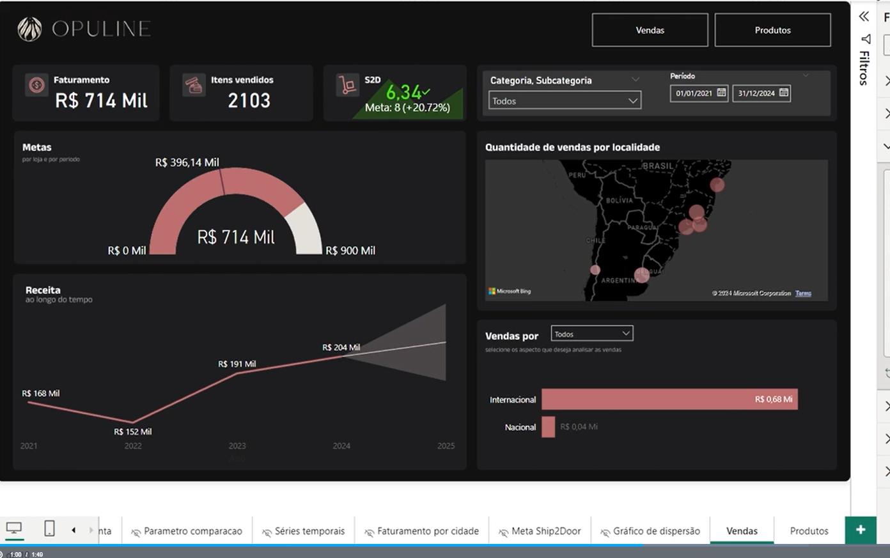

# Analisando categorias

## Sumário
- [Analisando categorias](#analisando-categorias)
  - [Sumário](#sumário)
  - [1. Apresentação](#1-apresentação)
  - [2. Para saber mais: conta gratuita indisponível](#2-para-saber-mais-conta-gratuita-indisponível)
  - [3. Preparando o ambiente](#3-preparando-o-ambiente)
  - [4. Explorando os dados](#4-explorando-os-dados)
  - [5. Identificando a melhor forma de visualização](#5-identificando-a-melhor-forma-de-visualização)
  - [6. Refletindo sobre o gráfico de pizza](#6-refletindo-sobre-o-gráfico-de-pizza)
  - [7. Para saber mais: usos do gráfico de pizza](#7-para-saber-mais-usos-do-gráfico-de-pizza)
  - [8. Análise com gráfico de pizza](#8-análise-com-gráfico-de-pizza)
  - [9. Faça como eu fiz: crie uma hierarquia](#9-faça-como-eu-fiz-crie-uma-hierarquia)
  - [10. O que aprendemos?](#10-o-que-aprendemos)

## 1. Apresentação

Assim como em todos os outros cursos desse repositório, esse curso irá ter como premissa um projeto, porém desse curso em questão iremos trabalhar em um projeto que estaremos sob a égide de um loja de cosméticos, porém as informações dessa loja __NÃO É ORIENTADA A DADOS__, porém o objetivo e realizar uma maneira que possamos incluir essa empresa para a <a href="#CULTdd"> Cultura Data-Driven </a>, então sobre nosso objetivo para além de atender a essa demanda, iremos entender quais são os melhores gráficos a serem aplicados para cada tipo de análise a serem feitas. 

Ao finalizar esse projeto, teremos como resultado um DashBoard similar ao da imagem abaixo:  
<table style="text-align: center; width: 100%;"> 
<tr>
    <td style="text-align: left;">
    
    </td>
</tr>
</table>

    
 Cultura Data-Driven

    
É um modelo de gestão em que as decisões estratégicas, operacionais e de negócios são baseadas na análise e interpretação de dados, em vez de intuição, palpites ou experiências puramente subjetivas.

    <ul>
        <li><strong>Democratização dos Dados:</strong> Garante que os dados não fiquem restritos apenas à equipe de TI ou cientistas de dados, permitindo que diferentes setores tenham autonomia para acessar e analisar informações relevantes.</li>
        <li><strong>Mentalidade Analítica:</strong> Estimula um ambiente focado em testes, experimentações e validação de hipóteses, onde os erros são identificados rapidamente por meio de métricas claras e transformados em aprendizado.</li>
        <li><strong>Foco em Resultados Reais:</strong> Substitui o viés de autoridade (a opinião de quem tem o cargo mais alto) por fatos concretos, otimizando processos, reduzindo custos e aumentando a previsibilidade do negócio.</li>
    </ul>

[↑ Voltar ao topo](#topo)

---
## 2. Para saber mais: conta gratuita indisponível  

Durante a realização da formação de Power BI, você perceberá que alguns cursos utilizam o Power BI Serviço, a plataforma online onde é possível publicar relatórios e dashboard, além de compartilhar com outras pessoas.

No entanto, sabemos que muitos alunos e alunas estão enfrentando dificuldades para criar uma conta gratuita do Power BI. Isso está acontecendo porque, no momento, a Microsoft não está disponibilizando uma opção de criação de conta gratuita com tanta facilidade como antes, e o acesso ao Power BI Serviço está disponível apenas por meio de licenças pagas.

Apesar disso, não se preocupe, pois isso não afetará em nada nos seus estudos. Você ainda poderá concluir todos os cursos da formação, mesmo sem acesso ao Power BI Serviço. A única diferença é que você não conseguirá publicar os relatórios online, mas poderá fazer todo o projeto no Power BI Desktop, que é gratuito e fornece todas as funcionalidades necessárias durante a formação.

A Microsoft realiza atualizações com alta frequência, então isso pode mudar em breve. Se surgir uma nova maneira de criar uma conta gratuita, vamos comunicar a você. Por enquanto, você pode realizar os cursos da formação de Power BI sem empecilhos.

Em caso de dúvidas, entre em contato conosco pelo Discord da Alura ou pelo canal de atendimento ao estudante.

[↑ Voltar ao topo](#topo)

---
## 3. Preparando o ambiente  

Neste curso, vamos aprender a utilizar um projeto com os dados carregados no Power BI.

__Antes de começar…__  
Vamos acessar o [arquivo PBIX]() que será utilizado durante o curso.

Além disso, vamos utilizar duas imagens que será usadas quando formos fazer a estilização do nosso relatório. Você também pode baixá-las [aqui]()

Por fim, caso você queira explorar e ir além no seu projeto, pode ficar à vontade para [acessar a base de dados do projeto]() e realizar suas próprias transformações e análises.

[↑ Voltar ao topo](#topo)

---
## 4. Explorando os dados

[↑ Voltar ao topo](#topo)

---
## 5. Identificando a melhor forma de visualização

[↑ Voltar ao topo](#topo)

---
## 6. Refletindo sobre o gráfico de pizza

[↑ Voltar ao topo](#topo)

---
## 7. Para saber mais: usos do gráfico de pizza

[↑ Voltar ao topo](#topo)

---
## 8. Análise com gráfico de pizza

[↑ Voltar ao topo](#topo)

---
## 9. Faça como eu fiz: crie uma hierarquia

[↑ Voltar ao topo](#topo)

---
## 10. O que aprendemos?

[↑ Voltar ao topo](#topo)

---

<!-- <table style="text-align: center; width: 100%;"> 
<tr>
    <td style="text-align: left;">
    
    </td>
</tr>
</table> -->

---

<table align="center" style="border-collapse: collapse; margin-left: auto; margin-right: auto;"> 
  <caption><b>Skills do projeto</b></caption>
  <tr>
    <td style="padding: 5px;">
      
    </td>
    <td style="padding: 5px;">
      
    </td>
    <td style="padding: 5px;">
      
    </td>
  </tr>
</table>

---
__Titulo:__ Analisando categorias
__Autor:__ Thierry Lucas Chaves  
__Data de Criação:__ 19-06-2026  
__Data de Modificação:__ 19-06-2026  
__Versão:__ "1.0"