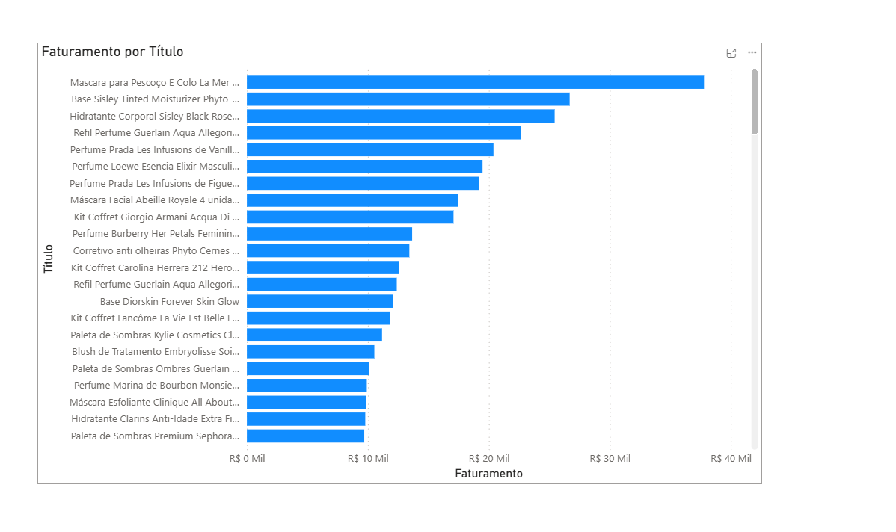
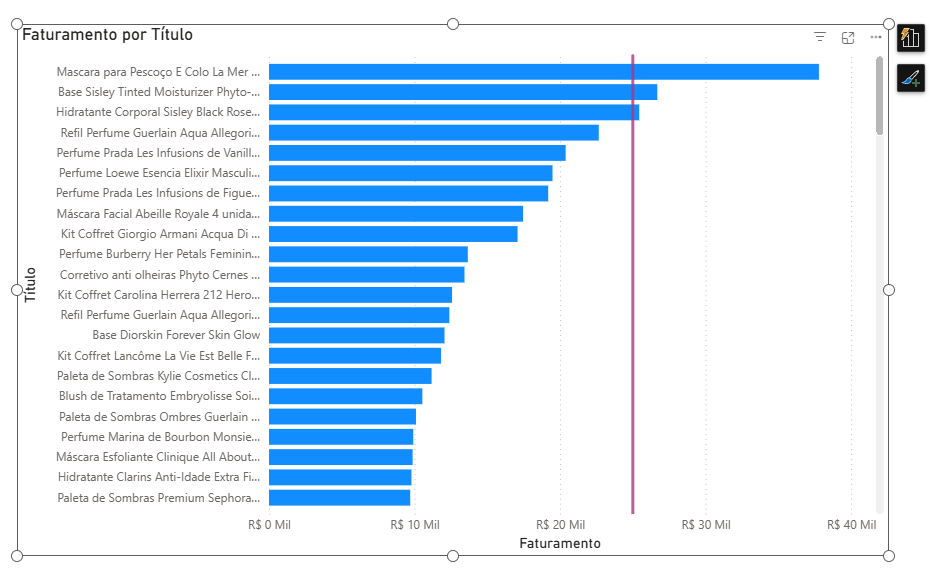
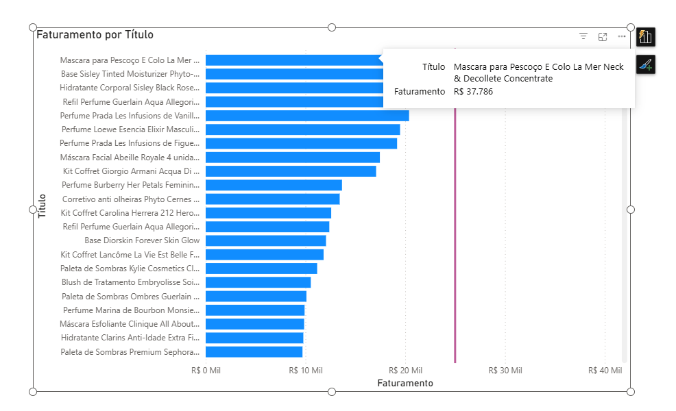
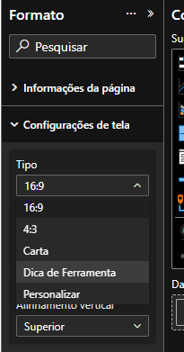
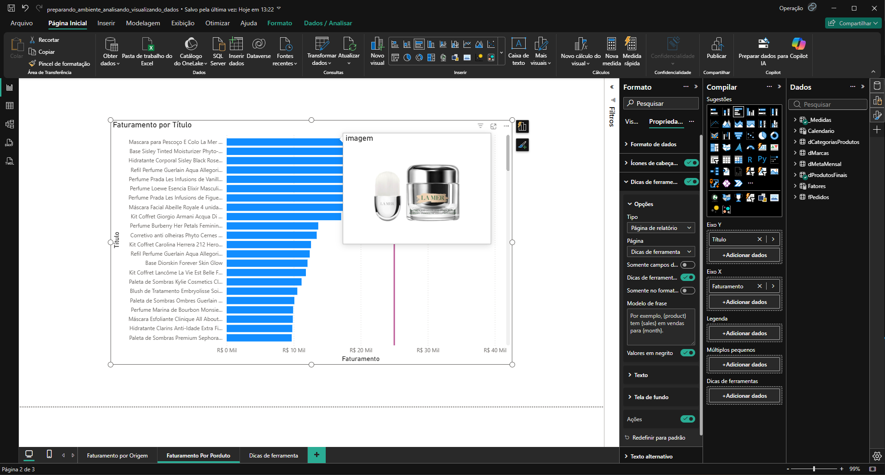
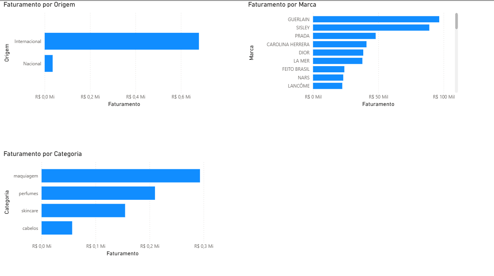

# Selecionando visuais para categorias

## Sumário
- [Selecionando visuais para categorias](#selecionando-visuais-para-categorias)
  - [Sumário](#sumário)
  - [1. Projeto da aula anterior](#1-projeto-da-aula-anterior)
  - [2. Adicionando guias de análises](#2-adicionando-guias-de-análises)
  - [3. Configure uma dica de ferramenta](#3-configure-uma-dica-de-ferramenta)
  - [4. Para saber mais: dicas de ferramenta (Tooltips) no Power BI](#4-para-saber-mais-dicas-de-ferramenta-tooltips-no-power-bi)
  - [5. Utilize um parâmetro de campo](#5-utilize-um-parâmetro-de-campo)
  - [6. Otimizando análises no Power BI com parâmetros de campo](#6-otimizando-análises-no-power-bi-com-parâmetros-de-campo)
  - [7. Faça como eu fiz: praticando com o parâmetro](#7-faça-como-eu-fiz-praticando-com-o-parâmetro)
  - [8. O que aprendemos?](#8-o-que-aprendemos)

## 1. Projeto da aula anterior

Caso prefira, você pode acessar o [projeto da aula 1](https://github.com/thierryLchaves/Santander-Imersao-Digital/blob/4099f5792dd83a1f4a69a5005f8f69238cf57fdf/Analise_de_dados_e_IA_Nivelamento/Semana_08/Power_BI_Visualizando_e_analisando_dados/src/preparando_ambiente_analisando_visualizando_dados.pbix) no ponto em que paramos na aula anterior.

[↑ Voltar ao topo](#topo)

---
## 2. Adicionando guias de análises

Nos últimos tópicos da aula, visualizamos maneiras de visualização diferentes, e constatamos que o melhor tipo a ser utilizado é de fato o gráfico de barras quando temos uma grande divisão dos grupos, principalmente quando estamos trabalhando com comparações de categorias, mas para além da facilidade nativa desse tipo de gráfico, podemos melhorar ainda mais essa visualização, e a extração de ideias com alguns recursos do Power B.I, para melhor entendimento desse processo iremos criar uma nova página com um novo gráfico de barras "_cluesterizado"_ , com as informações de fe faturamento por origem do produto, que deixara nosso gráfico com a seguinte aparência :  

<table style="text-align: center; width: 100%;"> 
<tr>
    <td style="text-align: left;">
    
    </td>
</tr>
</table>

Com esse modelo de visualização acima, temos informações sobre as categorias e seu faturamento de forma prática, e bem visual dessas divisões, agora podemos melhorar ainda mais ess visualização, podemos por exemplo realizar um destaque nas informações de quando por exemplo o faturamento atingir um determinado limite, e para realizarmos essa ação, podemos fazer o seguinte,  ao acessar a guia de formato temos nas opções de linha de referência, e através dessa opção podemos ter algumas opções, onde o mais válido a ser destacado, é o campo valor, onde através desse campo podemos tanto informar um valor quanto utilizarmos uma função, essa linha pode ser apresentada de diversas maneiras e quando determinamos os valores e estilos para essa apresentação, teremos o seguinte visual:  

<table style="text-align: center; width: 100%;"> 
<tr>
    <td style="text-align: left;">
    
    </td>
</tr>
</table>

[↑ Voltar ao topo](#topo)

---
## 3. Configure uma dica de ferramenta
Para além dessa estilização que acabamos de visualizar para nosso gráfico de barras, podemos estilizar ainda mais nosso gráfico utilizando uma ferramenta do Power B.I, essa opção que será de estilização de barra de ferramentas, essa dica de ferramentas pode ser visualizada, quando por exemplo passamos o mouse sobre alguma informação em nosso gráfico, e é apresentado algumas informações sobre aquele dado, como podemos ver abaixo:  

<table style="text-align: center; width: 100%;"> 
<tr>
    <td style="text-align: left;">
    
    </td>
</tr>
</table>

Mas podemos trabalhar com a estilização dessa dica de ferramentas, para começar a configuração iremos acessar a aba de formato, na parte de configurações de tela, nessa parte teremos o tipo e ali iremos modificar para Dica de ferramentas:  

<table style="text-align: center; width: 50%;"> 
<tr>
    <td style="text-align: left;">
    
    </td>
</tr>
</table>

Após essa seleção de configurações, iremos realizar a modificação do visual e escolher `Image_grid`, para essa configuração em especifico iremos adicionar adicionar a coluna de imagens presentes na nossa tabela de produtos para busca dessas imagens, para esse ultimo passo devemos selecionar o visual, clicar sobre o menu de formato, escolher a guia de propriedades, e dentro da aba `Dicas de ferramentas`, iremos escolher o tipo como sendo essa nova página que criamos, quando realizado esse processo será demonstrado um novo visual quando realizarmos o houver do mouse sobre a barra de produtos, conforme imagem abaixo:  

<table style="text-align: center; width: 100%;"> 
<tr>
    <td style="text-align: left;">
    
    </td>
</tr>
</table>

[↑ Voltar ao topo](#topo)

---
## 4. Para saber mais: dicas de ferramenta (Tooltips) no Power BI  

As dicas de ferramenta são pequenas janelas que aparecem quando o usuário passa o mouse sobre um elemento em um visual, fornecendo informações adicionais e contextuais. Elas ajudam a enriquecer a experiência do usuário, oferecendo detalhes sem sobrecarregar o visual principal.

Exemplo de Dica de Ferramenta:

Quando você passa o mouse sobre uma barra em um gráfico de barras, uma dica de ferramenta pode mostrar informações adicionais, como a porcentagem de crescimento, média ou detalhes específicos daquele ponto de dados.

__Dicas e Melhores Práticas__  
__Mantenha a Simplicidade:__  

As dicas de ferramenta devem ser informativas, mas não excessivamente detalhadas. Mantenha as informações concisas e relevantes.  

__Use Títulos e Descrições Claras:__  

Adicione títulos e descrições nas dicas de ferramenta para garantir que os usuários compreendam o contexto dos dados exibidos.  

__Teste a Experiência do Usuário:__  

Teste as dicas de ferramenta em diferentes visuais e dispositivos para garantir que elas funcionem corretamente e sejam úteis.
 
[↑ Voltar ao topo](#topo)

---
## 5. Utilize um parâmetro de campo
O próximo gráfico que iremos construir, será um novo gráfico de barras a priori, porém com o objetivo de entender como o faturamento irá se comportar por 3 categorias diferentes, sendo a _marca, origem e categoria_, de modo prático poderíamos construir uma visualização  conforme da imagem abaixo:  

<table style="text-align: center; width: 100%;"> 
<tr>
    <td style="text-align: left;">
    
    </td>
</tr>
</table>

Porém ainda assim temos a possibilidade, através de um recurso do Power B.I que nos auxilia a otimizar espaço e deixar  a imagem mais dinâmica, e esse recurso é através da adição de um __parâmetro__ 

[↑ Voltar ao topo](#topo)

---
## 6. Otimizando análises no Power BI com parâmetros de campo

[↑ Voltar ao topo](#topo)

---
## 7. Faça como eu fiz: praticando com o parâmetro

[↑ Voltar ao topo](#topo)

---
## 8. O que aprendemos?

[↑ Voltar ao topo](#topo)

---

<!-- <table style="text-align: center; width: 100%;"> 
<tr>
    <td style="text-align: left;">
    
    </td>
</tr>
</table> -->

---

<table align="center" style="border-collapse: collapse; margin-left: auto; margin-right: auto;"> 
  <caption><b>Skills do projeto</b></caption>
  <tr>
    <td style="padding: 5px;">
      
    </td>
    <td style="padding: 5px;">
      
    </td>
    <td style="padding: 5px;">
      
    </td>
  </tr>
</table>

---
__Titulo:__ Selecionando visuais para categorias
__Autor:__ Thierry Lucas Chaves  
__Data de Criação:__ 19-06-2026  
__Data de Modificação:__ 19-06-2026  
__Versão:__ "1.0"