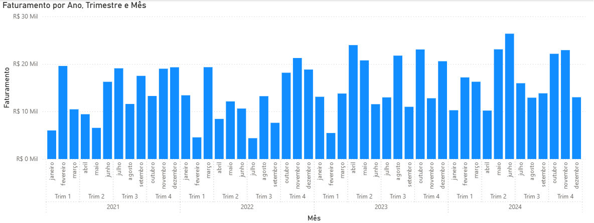
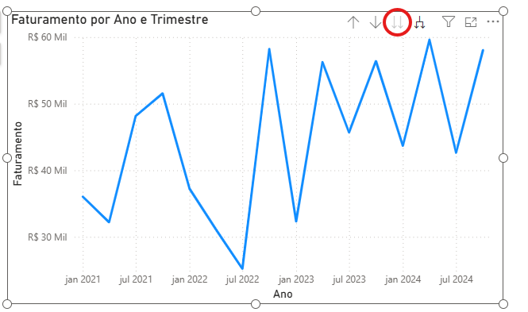
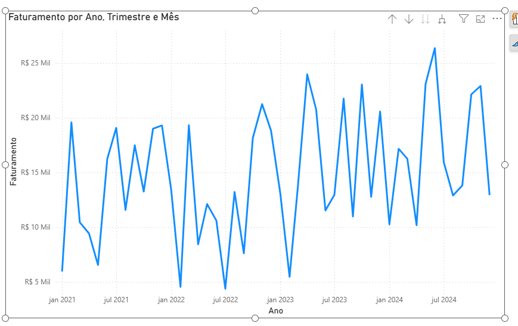
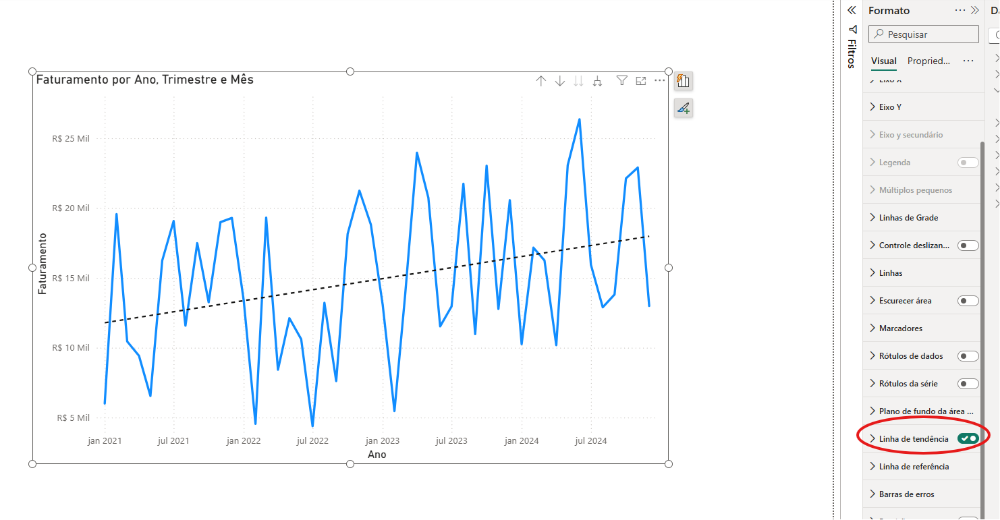
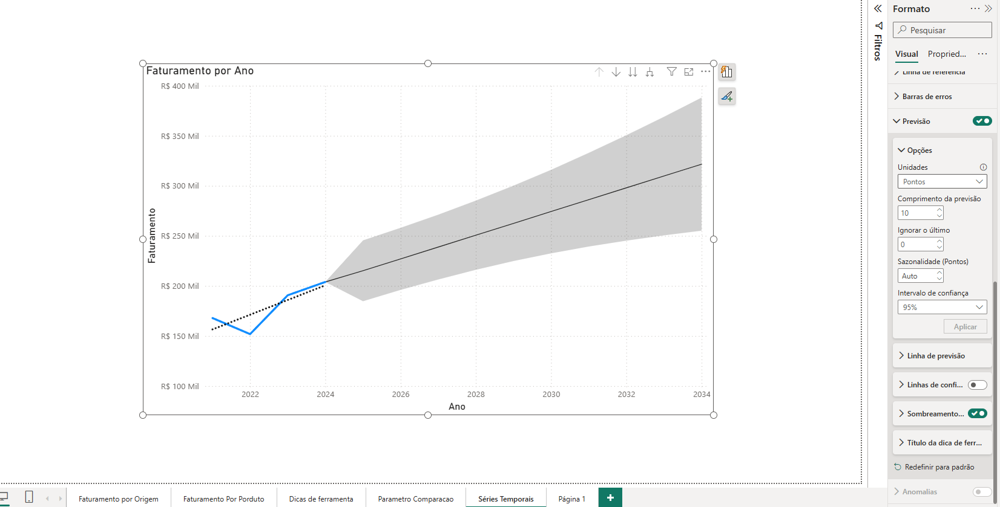
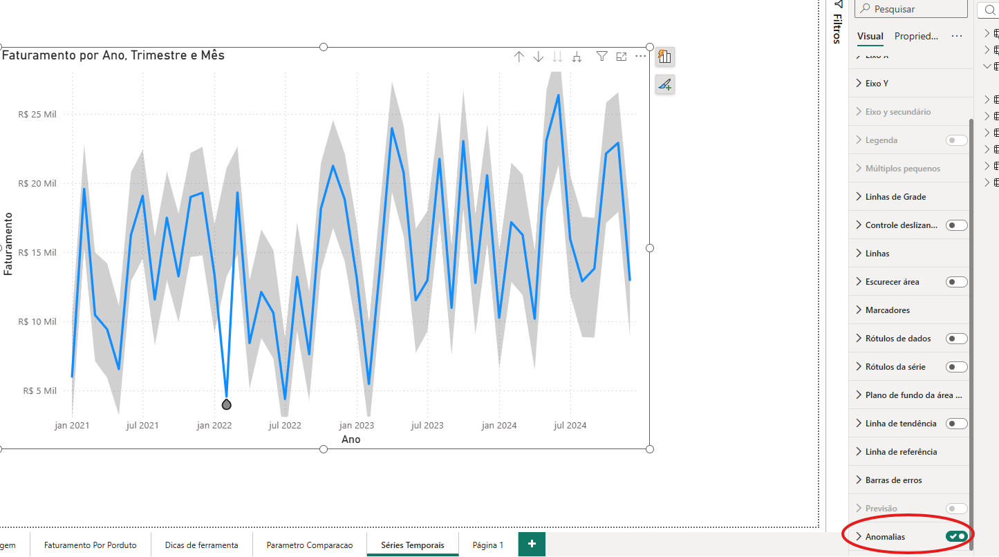
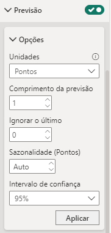
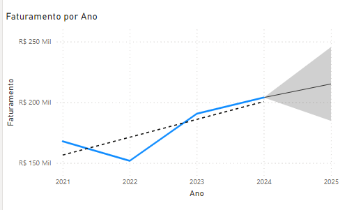
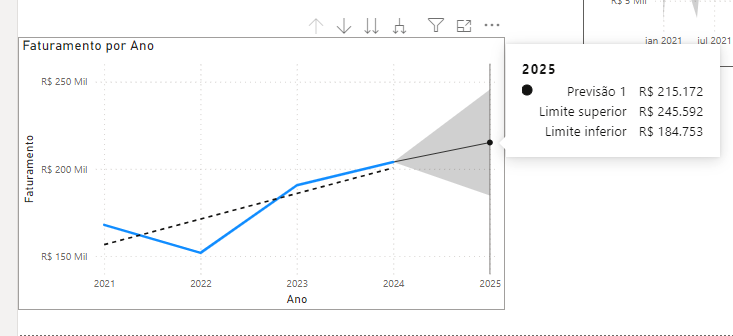
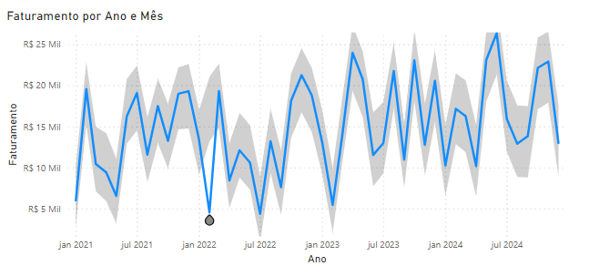

# Analisando dados ao longo do tempo

## Sumário
- [Analisando dados ao longo do tempo](#analisando-dados-ao-longo-do-tempo)
  - [Sumário](#sumário)
  - [1. Projeto da aula anterior](#1-projeto-da-aula-anterior)
  - [2. Criando gráfico de linha e área](#2-criando-gráfico-de-linha-e-área)
  - [3. Identifique tendências](#3-identifique-tendências)
  - [4. Para saber mais: aprimorando a análise com detecção de anomalias e previsões no Power BI](#4-para-saber-mais-aprimorando-a-análise-com-detecção-de-anomalias-e-previsões-no-power-bi)
  - [5. Detecte anomalias e faça previsões](#5-detecte-anomalias-e-faça-previsões)
  - [6. Decifrando o faturamento da Opuline](#6-decifrando-o-faturamento-da-opuline)
  - [7. Faça como eu fiz: trabalhando com tendências e previsões](#7-faça-como-eu-fiz-trabalhando-com-tendências-e-previsões)
  - [8. O que aprendemos?](#8-o-que-aprendemos)

## 1. Projeto da aula anterior
Caso prefira, você pode acessar o [projeto da aula 1](https://github.com/thierryLchaves/Santander-Imersao-Digital/blob/4099f5792dd83a1f4a69a5005f8f69238cf57fdf/Analise_de_dados_e_IA_Nivelamento/Semana_08/Power_BI_Visualizando_e_analisando_dados/src/preparando_ambiente_analisando_visualizando_dados.pbix) no ponto em que paramos na aula anterior.

[↑ Voltar ao topo](#topo)

---
## 2. Criando gráfico de linha e área
Desse tópico em diante iremos analisar os dados disponíveis, porém em analises temporais e iremos descobrir quais são os melhores ou qual o melhor visual a ser utilizado quando, estamos trabalhando com análises em relação ao tempo.   
Frequentemente são utilizados gráficos de barras para visualizações temporais e de certa fora esse tipo de gráfico até funciona, pois vemos as informações de forma comparativa de uma maneira relativamente fácil, conforme visualizamos abaixo: 
> PS: Quando utilizamos o visual de gráfico de colunas o preenchimento das informação são diferentes nos eixos, onde no Eixo X informamos a distribuição dos dados, e no eixo Y preenchemos com a informação que será distribuída/segmentada   

<table style="text-align: center; width: 100%;"> 
<tr>
    <td style="text-align: left;">
    
    </td>
</tr>
</table>

Porém temos um ponto a se notado, quando estamos utilizando gráficos de série temporal em relação a utilização de gráficos de colunas/barras, instintivamente nosso olho já realiza o processo de acompanhamento das variações conforme as barras sobem ou descem, dado que já iremos fazer esse processo de olhar o topo da barra visualizar o tempo de referenciado e subir e repetir esse processo, temos um outro tipo de gráfico que é considerado o mais adequado para esse tipo de analise, que se trata do __gráfico de linha__, conforme demonstramos na imagem abaixo:  

<table style="text-align: center; width: 100%;"> 
<tr>
    <td style="text-align: left;">
    
    </td>
</tr>
</table>

> PS: Podemos habilitar para os usuários a opção drill down para que possamo realizar a analise,facilitando sua navegação através do gráfico.
> PS2: O ícone em destaque da imagem realiza o processo de descer um nível de apresentação, porém realiza uma agregação dos dados (ou seja irá demonstrar todas as informações do tempo para uma única visualiza, ex: irá agrupar todos os dados do meses de janeiro e uma única exibição.)  

[↑ Voltar ao topo](#topo)

---
## 3. Identifique tendências
Dando continuidade o que vimos até aqui, podemos concluir que o gráfico de linhas é de fato o melhor modelo de gráfico a ser utilizado quando estamos trabalhando com séries temporais, para além da visualização melhorada para esse tipo de visual, podemos obter alguns recursos com a utilização desse gráficos de por exemplo inferir previsões de crescimento ou diminuição do faturamento.   
Quando analisamos esse gráfico com apresentação em anos, podemos notar que temos uma tendência de crescimento, porém se modificarmos nossa apresentação para o modelo mensal será que essa interpretação ficaria tão fácil de ser intuída ?

<table style="text-align: center; width: 100%;"> 
<tr>
    <td style="text-align: left;">
    
    </td>
</tr>
</table>

Como visualizamos na imagem acima, de fato realizar essa previsão de crescimento não fica tão fácil, porém o Power B.I possui uma ferramenta que auxilia nessas previsões, e essa informação trata-se da linha de tendencia, para sua utilização basta selecionar o gráfico selecionar a barra de formato e habilitar a opção de linha de tendencia:  

<table style="text-align: center; width: 100%;"> 
<tr>
    <td style="text-align: left;">
    
    </td>
</tr>
</table>

E assim como já vimos em outras visualizações anteriores, e possível realizar uma estilização dessa linha de tendência. 

[↑ Voltar ao topo](#topo)

---
## 4. Para saber mais: aprimorando a análise com detecção de anomalias e previsões no Power BI  

Na análise de dados, identificar anomalias e fazer previsões são etapas cruciais para entender o comportamento dos negócios e planejar ações futuras. Além de configurar as ferramentas de detecção de anomalias e previsão no Power BI, é essencial saber como interpretar esses resultados e utilizá-los para tomar decisões informadas.

---
__Interpretação de Resultados de Previsão__  

__Intervalo de Confiança__  
Ao utilizar a funcionalidade de previsão no Power BI, é importante compreender o conceito de intervalo de confiança:

- `Intervalo de Confiança:` Representa a faixa dentro da qual esperamos que os valores futuros se situem com um certo grau de confiança. No Power BI, isso é visualizado como uma área sombreada ao redor da linha de previsão.
  - `Interpretação:` Um intervalo de confiança estreito indica previsões mais precisas, enquanto um intervalo mais amplo sugere maior incerteza.

__Cenários de Previsão__ 

Ao analisar previsões, considere diferentes cenários para melhor planejamento:

- `Cenário Otimista:` Utilize o limite superior do intervalo de confiança para planejar em condições ideais.

- `Cenário Pessimista:` Utilize o limite inferior do intervalo de confiança para estar preparado para possíveis desafios.

- `Cenário Provável:` Baseie-se na linha central da previsão para um cenário mais equilibrado.

---
__Análise de Detecção de Anomalias__  

__Classificação de Anomalias__  

As anomalias podem ser classificadas em diferentes tipos, cada uma requerendo uma abordagem específica:  
- `Picos Positivos:` Valores significativamente mais altos que o esperado.
  - `Ação:` Investigar se houve um evento positivo, como uma promoção bem-sucedida ou um lançamento de produto.
- `Picos Negativos:` Valores significativamente mais baixos que o esperado.
  - `Ação:` Investigar causas potenciais como problemas de produção, marketing ineficaz ou eventos externos negativos.

__Aprofundando na Análise de Anomalias__  
Para entender melhor as anomalias detectadas, utilize as seguintes técnicas:
 
- `Drill Down:` Explore os dados em níveis mais detalhados (ex: de mensal para semanal ou diário) para identificar padrões mais granulares.

- `Segmentações:` Utilize filtros para segmentar os dados por diferentes categorias (ex: regiões, produtos, canais de vendas) e identificar se as anomalias estão concentradas em áreas específicas.  

[↑ Voltar ao topo](#topo)

---
## 5. Detecte anomalias e faça previsões
O Power B.I, nos possibilita realizar diferentes analises com diferentes tipos de visualizações, a ultima vista no tópico anterior foi realizar uma análise de séria temporal, e ainda adicionar uma linha de tendência do comportamento, porém essa ferramenta não limita-se a somente esse tipo de insight, podemos utilizar um recurso ainda mais poderoso e avançando, esse recurso que estamos falando trata-se da previsão, mas como podemos fazer esse processo?  
Para utilizar tal recurso dentro do nosso gráfico de linhas, temos na barra de formato a opção de previsão:  

<table style="text-align: center; width: 100%;"> 
<tr>
    <td style="text-align: left;">
    
    </td>
</tr>
</table>

Por padrão o processo de previsão vem preenchido como __10__, então a previsão irá ser representada conforme a visualização temporal selecionada, outro ponto que podemos selecionar, trata-se da opção de intervalo de confiança também presente na guia de formato, por padrão está vem selecionada como __95%__, e esse intervalo de confiança irá se adaptar conforme for aumentado essa opção _(a interpretação desse recurso foi explicada anteriormente no [tópico acima](#4-para-saber-mais-aprimorando-a-análise-com-detecção-de-anomalias-e-previsões-no-power-bi))_. 

Para além desse recurso disponível, também temos a opção de detecção de anomalias, que é realizada pelo Power B.I, essa opção também está presente na guia de formato desse tipo de visual é pode ser habilitada ou desabilitada, se realizamos o processo de visualização por meses, por exemplo teremos uma visualização mais _"fácil"_ sobre essas anomalias: 

<table style="text-align: center; width: 100%;"> 
<tr>
    <td style="text-align: left;">
    
    </td>
</tr>
</table>

Quando analisamos esse gráfico podemos visualizar que existe um sombreamos em torno das linhas, e é com esse sombreamento que podemos visualizar essas anomalias, no gráfico acima temos uma de fácil detecção que se refere a linha posicionada para Janeiro de 2022, nossa linha indica que o esperado para esse período seria um faturamento em torno dos 10 milhões, porém vemos que a linha teve uma queda abaixo ainda desse valor.  

Ou seja a detecção de anomalias dentro do Power B.I trabalha com um processo de detecção dos outliers ou seja valores muito discrepantes do que era esperado, e já a previsão atua no futuro baseando-se em modelos estáticos para identificar qual é o comportamento dos dados nos períodos futuros. 
[↑ Voltar ao topo](#topo)

---
## 6. Decifrando o faturamento da Opuline  
Após um ano de sucesso, a equipe de análise de dados da Opuline está empolgada para explorar as capacidades do Power BI e entender melhor o desempenho financeiro da empresa. Utilizando os recursos de previsão e detecção de anomalias, a equipe deseja não apenas projetar o faturamento para o próximo ano, mas também identificar possíveis meses com desempenho atípico que possam necessitar de investigação adicional. Com base nos dados históricos de faturamento e utilizando as ferramentas avançadas do Power BI, a equipe se depara com um desafio: como aplicar corretamente essas ferramentas para extrair insights valiosos?

Qual das seguintes ações a equipe de análise de dados da Opuline deve realizar para atingir seus objetivos de análise no Power BI?

<table style="text-align: center; width: 100%;"> 
<tr>
    <td style="text-align: left;">
    
    </td>
</tr>
</table>

[↑ Voltar ao topo](#topo)

---
## 7. Faça como eu fiz: trabalhando com tendências e previsões  

Agora vamos trabalhar com os poderosos recursos que os gráficos de linhas nos permitem: tendências, previsões e identificação de anomalias. Vamos então criar esse gráfico e explorar as possibilidades.

__Opinião do instrutor__  

Podemos analisar de forma detalhada os gráficos, mas também podemos usar recursos do power bi para evidenciar tais padrões.

No gráfico dos anos, vamos entender a previsão de faturamento para 2025, para isso vamos em formato e ativar a opção previsão. por padrão será previsto o faturamento dos próximos 10 anos, vamos ajustar esse comprimento para apenas 1.    
<table style="text-align: center; width: 50%;"> 
<tr>
    <td style="text-align: left;">
    
    </td>
</tr>
<tr>
    <td style="text-align: left;">
    
    </td>
</tr>
<tr>
<td style="text-align: left;">
    
    </td>
</tr>
</table>

Agora podemos olhar para o faturamento ano-mês, e dessa vez podemos entender se existiu algum faturamento atípico ativando a opção “detecção anomalia”.  

<table style="text-align: center; width: 100%;"> 
<tr>
    <td style="text-align: left;">
    
    </td>
</tr>
</table>

Aqui identificamos um mês que faturou bem menos do que estávamos prevendo de acordo com o histórico passado de faturamento.

A __detecção de anomalias__ baseia-se em algoritmos que identificam desvios significativos dos padrões normais, como outliers, tendências inesperadas ou mudanças abruptas.

Já as __previsões__ são realizadas através de técnicas de modelagem estatística, como análise de séries temporais, que projetam valores futuros com base nas tendências históricas.

Vale lembrar que a detecção de anomalia e a previsão são recursos que __não podem ser utilizados juntos no mesmo gráfico__, ou seja, quando utilizado um não você não pode utilizar o outro.

[↑ Voltar ao topo](#topo)

---
## 8. O que aprendemos?

Nessa aula, você aprendeu a:
- Explorar Gráficos Temporais;
- Utilizar Linhas de Tendência;
- Aplicar Previsões e Detecção de Anomalias;
- Analisar Hierarquias Temporais.

[↑ Voltar ao topo](#topo)

---

<table align="center" style="border-collapse: collapse; margin-left: auto; margin-right: auto;"> 
  <caption><b>Skills do projeto</b></caption>
  <tr>
    <td style="padding: 5px;">
      
    </td>
    <td style="padding: 5px;">
      
    </td>
    <td style="padding: 5px;">
      
    </td>
  </tr>
</table>

---
__Titulo:__ Analisando dados ao longo do tempo
__Autor:__ Thierry Lucas Chaves  
__Data de Criação:__ 19-06-2026  
__Data de Modificação:__ 24-06-2026  
__Versão:__ "1.0"