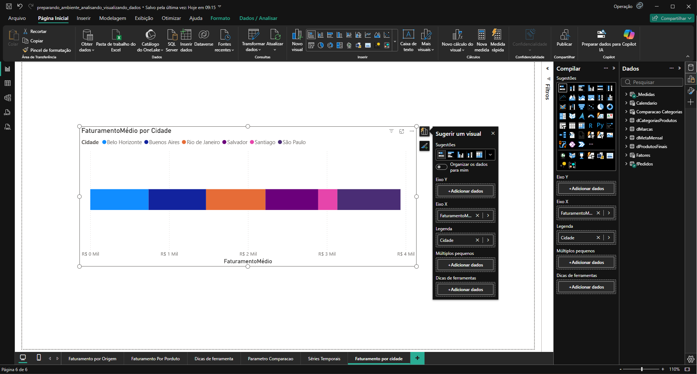
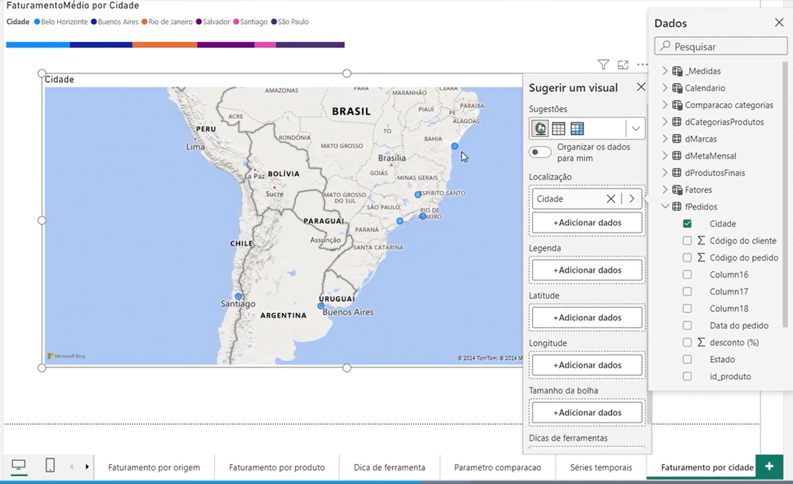
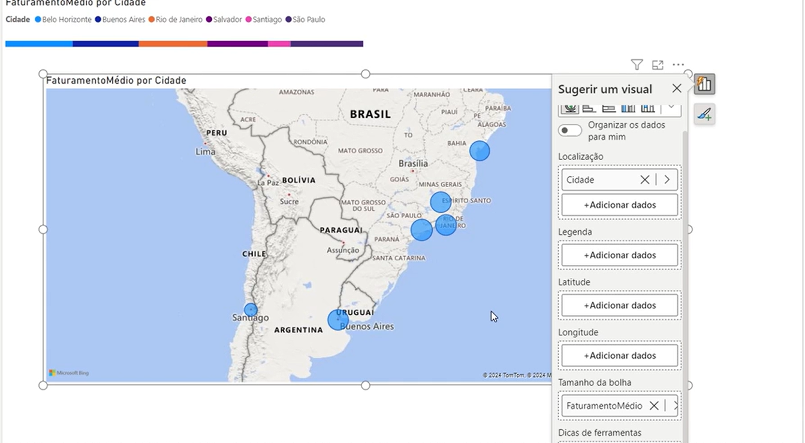
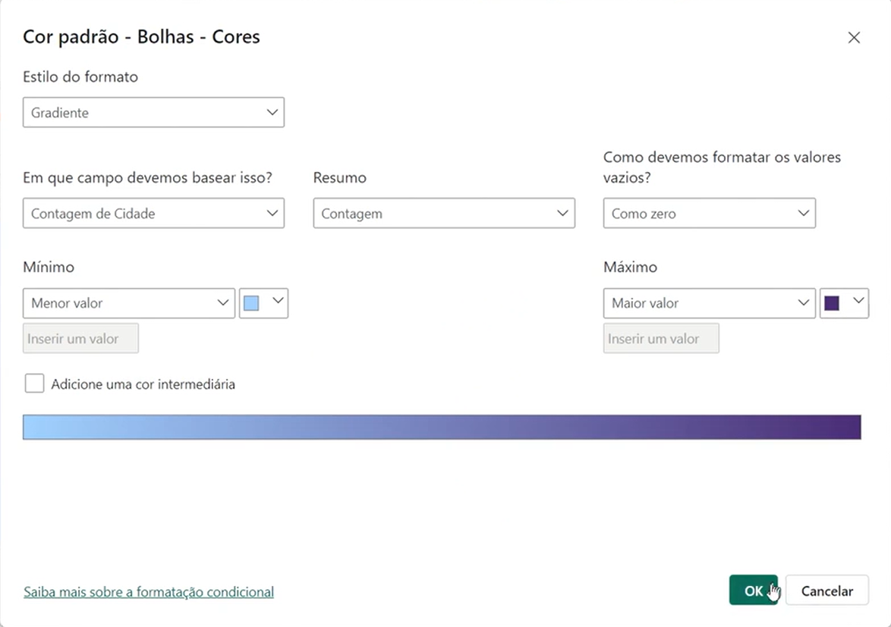
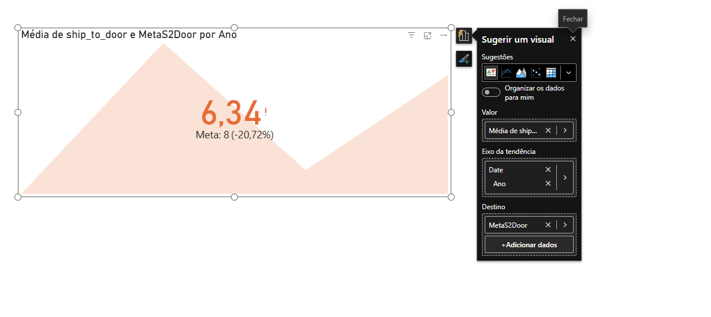
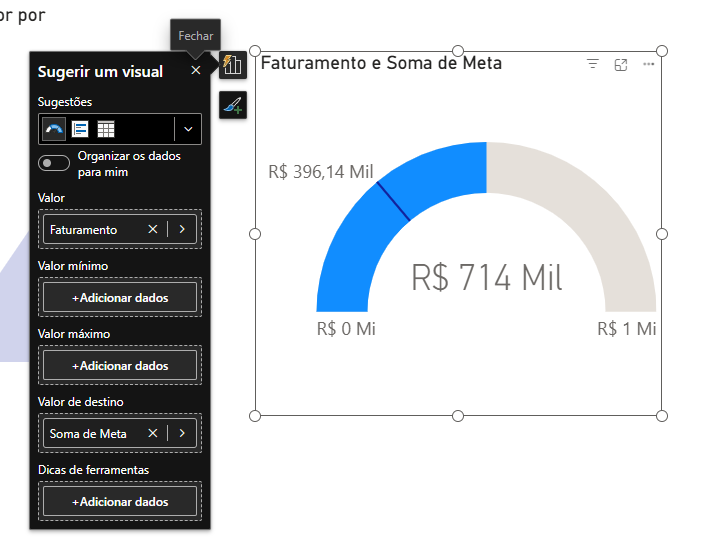
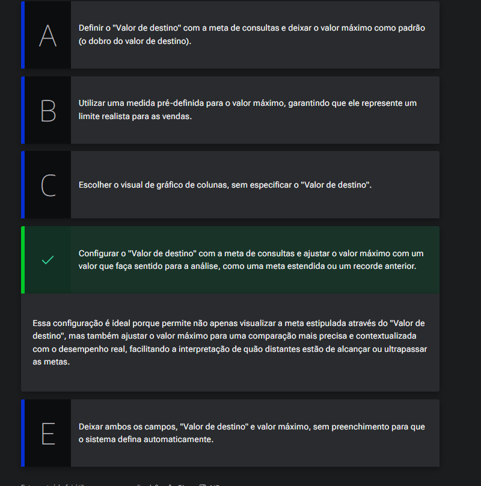
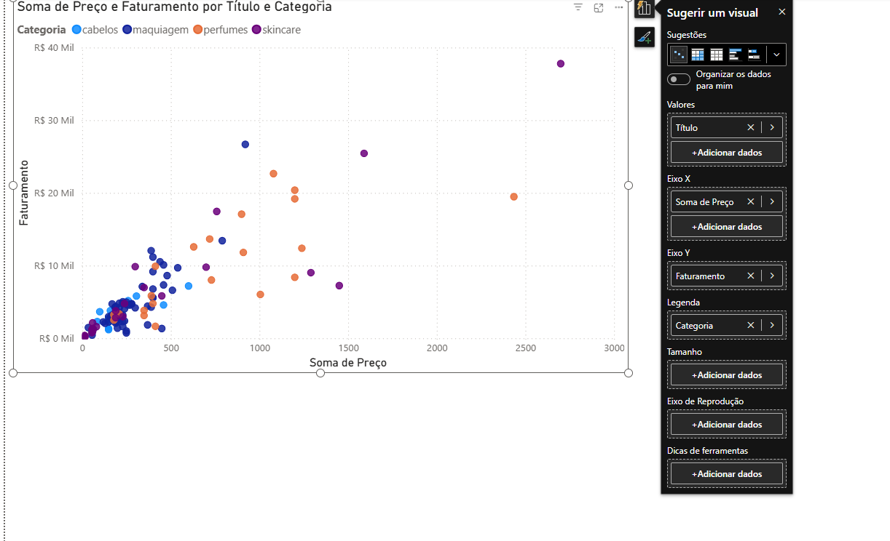
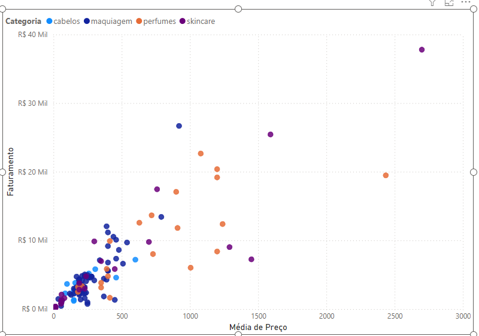

# Monitorando outros indicadores

## Sumário
- [Monitorando outros indicadores](#monitorando-outros-indicadores)
  - [Sumário](#sumário)
  - [1. Projeto da aula anterior](#1-projeto-da-aula-anterior)
  - [2. Visualize dados em mapas](#2-visualize-dados-em-mapas)
  - [3. Acompanhe os KPIs](#3-acompanhe-os-kpis)
  - [4. Para saber mais: aprimorando o monitoramento de KPIs no Power BI](#4-para-saber-mais-aprimorando-o-monitoramento-de-kpis-no-power-bi)
  - [5. Monitore as metas](#5-monitore-as-metas)
  - [6. Visualizando metas na Clínica Médica Voll](#6-visualizando-metas-na-clínica-médica-voll)
  - [7. Revele padrões com gráficos de dispersão](#7-revele-padrões-com-gráficos-de-dispersão)
  - [8. Faça como eu fiz: entendendo a correlação entre duas categorias](#8-faça-como-eu-fiz-entendendo-a-correlação-entre-duas-categorias)
  - [9. O que aprendemos?](#9-o-que-aprendemos)

## 1. Projeto da aula anterior
Caso prefira, você pode acessar o [projeto da aula 1](https://github.com/thierryLchaves/Santander-Imersao-Digital/blob/4099f5792dd83a1f4a69a5005f8f69238cf57fdf/Analise_de_dados_e_IA_Nivelamento/Semana_08/Power_BI_Visualizando_e_analisando_dados/src/preparando_ambiente_analisando_visualizando_dados.pbix) no ponto em que paramos na aula anterior

[↑ Voltar ao topo](#topo)

---
## 2. Visualize dados em mapas

Dando continuidade ao nosso projeto iremos realizar a confecção de um novo visual para conseguirmos visualizar o faturamento médio por cidade. Sendo assim iremos realizar o processo padrão que realizamos durante todo o projeto, para não _"atrapalhar"_ os visuais anteriormente construídos e criar uma nova página.  
Uma das maneiras possíveis de criação desse visual seria utilizando um gráfico de barras empilhados, onde podemos utilizar informações no `Eixo X`, com nossa medida de faturamento médio, e no campo de legendas as cidades, com esse preenchimento teríamos um gráfico similar ao da imagem anexo:  

<table style="text-align: center; width: 100%;"> 
<tr>
    <td style="text-align: left;">
    
    </td>
</tr>
</table>

Apesar de termos todas essas informações disponíveis em nosso gráfico, esse tipo de visualização incorre no mesmo problema visto anteriormente em outra aulas, de que a visualização dessa maneira carece de auxílios para visualização, e que quando tivermos um curto intervalo entre áreas ou tivermos diversas informações sejam próximas ou não sua visualização ficará prejudicada com esse visual, felizmente temos recursos no Power B.I, específicos para esse tipo de visualização, que são os Gráficos de Mapa.  
> PS: Devido as configurações das contas que estamos utilizando ao longo do projeto os recursos de mapa não estão disponíveis para utilização por isso as imagens e demonstrações serão prints da tala do curso.  

<table style="text-align: center; width: 100%;"> 
<tr>
    <td style="text-align: left;">
    
    </td>
</tr>
</table>

E recomendável em processos que utilizamos gráficos de mapas, que realizemos a tipificação desse campo corretamente, em nosso projeto nosso atributo de cidade não estão categorizados, para que possamos categorizar esse dados, ao selecionar o campo em questão será habilitado a guia de `Ferramentas de coluna`, nessa guia teremos disponível a opção de __`Categoria de dados`__, quando habilitado a visualização do ícone será modificado.  
> PS: Quando for necessário trabalhar com dados de localização, é possível criar colunas com as informações de Longitude e latitude para tais informações.

Dando sequência a nossa configuração do DashBoard, podemos adicionar a informação de faturamento médio através do parâmetro do visual,de tamanho da bolha, com isso teremos a seguinte apresentação do mapa.  

<table style="text-align: center; width: 100%;"> 
<tr>
    <td style="text-align: left;">
    
    </td>
</tr>
</table>

Para além desse processo podemos realizar a formatação dessas bolhas, para modificação de sua coloração podemos utilizar uma formatação de cores mediante a regras condicionais, conforme imagem abaixo:  

<table style="text-align: center; width: 100%;"> 
<tr>
    <td style="text-align: left;">
    
    </td>
</tr>
</table>

[↑ Voltar ao topo](#topo)

---
## 3. Acompanhe os KPIs
Agora como já realizamos diversas analises envolvendo o faturamento de nossa empresa, iremos trabalhar agora com as metas nessas analises, e a primeira a ser analisada será a de `ship-to-door`, no caso podemos interpretar como tempo de entrega. 
Para essas nossas novas analises iremos trabalhar com os visuais que são chamado de `KPI` _(Key performance indicator)_, esses indicadores ficam no agrupamento de medidor, cartão e KPI, em uma tradução livre podemos traduzir esse tipo de sigla para indicador chave de performance, e ele é utilizado quando temos algum indicador, meta ou valor de destino final utilizamos o visual de KPI para indicar tal visualização, e com isso podemos visualizar se esse indicador foi atendido ou não sobre nossa meta. 
Seu preenchimento funciona da seguinte maneira, no campo de valor iremos fornecer o valor da meta a ser batida, posteriormente a isso iremos no eixo dea tendência escolher um campo que codiza com a distribuição dessa meta ao longo do tempo, por fim o ultimo campo, indicamos qual é de fato o indicador de referência ou seja o valor a ser atingido   

<table style="text-align: center; width: 100%;"> 
<tr>
    <td style="text-align: left;">
    
    </td>
</tr>
</table>

Dado esse processo de configuração se realizamos a analise sobre nosso KPI, visualizamos que nosso KPI está com indicativo que estamos abaixo da meta estabelecida em torno de 20% a menos do estabelecido, porém  como estamos avaliando nosso indicador com marco temporal, estar nesse com indicador abaixo pode ser considerado bom para esse caso.  
Para o ajuste dessa informação dentro da guia de formato podemos modificar esse indicativo na guia de formato, no menu de eixo de tendência e modificar a direção. 

[↑ Voltar ao topo](#topo)

---
## 4. Para saber mais: aprimorando o monitoramento de KPIs no Power BI  

Os Indicadores Chave de Desempenho (KPIs) são fundamentais para acompanhar o progresso em relação a objetivos específicos. No Power BI, a visualização de KPIs permite uma rápida interpretação dos dados, ajudando a identificar se as metas estão sendo alcançadas. Vamos explorar algumas práticas avançadas e dicas para aprimorar o monitoramento de KPIs no Power BI.  

---
__Configuração e Personalização de KPIs__  
__Escolhendo a Métrica Correta__  
Para configurar um KPI, é crucial selecionar a métrica adequada que representa claramente o desempenho que você deseja monitorar. No exemplo da Opuline, utilizamos o "ship-to-door" como métrica principal.

---
__Adicionando Contexto com Eixos de Tendência__  

O eixo de tendência permite visualizar a evolução do KPI ao longo do tempo. Isso é útil para identificar padrões sazonais e tendências a longo prazo.

__Personalização de KPIs__  
__Formatação Condicional__  
A formatação condicional melhora a visualização dos KPIs, destacando rapidamente os valores que atendem ou não às metas estabelecidas.
- _Configuração de Cores:_  
  - Verde para metas atingidas.
  - Laranja ou vermelho para metas não atingidas.
---
__Definindo Limiares Personalizados__  
No Power BI, você pode ajustar os limiares de acordo com as necessidades específicas da sua métrica. No caso do "ship-to-door", onde valores menores são melhores, configure o KPI para refletir isso.  

__Exemplos Práticos de KPIs__  
__KPI de Eficiência de Entrega__  
- Métrica: Tempo de entrega (ship-to-door)
- Eixo de Tendência: Ano/Mês
- Meta: < 8 dias
- Configuração: Baixo é bom
- Formatação Condicional: Valores abaixo de 8 dias em verde, acima em vermelho.

__KPI de Satisfação do Cliente__  
- Métrica: Índice de Satisfação do Cliente (CSAT)
- Eixo de Tendência: Trimestre
- Meta: >= 85%
- Configuração: Alto é bom
- Formatação Condicional: Valores acima de 85% em verde, abaixo em vermelho.

__Uso de alertas__  
Configure alertas no Power BI para notificar quando um KPI ultrapassa um determinado limiar. Isso ajuda na resposta rápida a problemas.

__Anotações e Comentários__  
Adicione anotações e comentários diretamente no visual do KPI para fornecer contexto adicional e facilitar a interpretação dos resultados.

__Boas Práticas para KPIs__  
__Simplicidade e Clareza__  
Mantenha os visuais de KPIs simples e claros. Evite sobrecarregar com informações desnecessárias.

__Atualização Regular__  
Garanta que os dados usados para calcular os KPIs sejam atualizados regularmente para fornecer insights precisos e relevantes.

__Comparação com Metas__  
Sempre compare o desempenho atual com metas predefinidas. Isso proporciona uma referência clara do que está sendo medido.

Utilizar KPIs no Power BI vai além de simplesmente configurar um visual. É crucial entender como personalizar, interpretar e monitorar esses indicadores para obter insights acionáveis. Com as boas práticas que aprendemos, você pode transformar dados brutos em informações valiosas que apoiam a tomada de decisões estratégicas.  
[↑ Voltar ao topo](#topo)

---
## 5. Monitore as metas
Nesse tópico iremos criar visuais para que possamos comparar nossas metas, e como já foi debatido anteriormente o melhor visual a ser utilizado para comparações trata-se do gráfico de colunas.  

Como iremos comparar diretamente duas informações correlacionadas, vamos adicionar as duas informações em nosso eixo Y, e para esse caso em especifico atingimos nosso objetivo, porém o Power B.I possui visuais melhores para essa comparação de meta.

<table style="text-align: center; width: 100%;"> 
<tr>
    <td style="text-align: left;">
    
    </td>
</tr>
</table>

Nesse visual temos algumas questões que podem ser ressaltadas, o primeiro que iremos notar trata-se sobre os valores mínimos e máximo, por padrão o mínimo sempre será 0 e o máximo sempre será o dobro do valor, porém isso pode ser adaptado tanto com fórmula condição e algo do tipo.   

---
## 6. Visualizando metas na Clínica Médica Voll  

Na Clínica Médica Voll, a equipe de gestão deseja analisar o desempenho das consultas realizadas em comparação com as metas estabelecidas para o mês. Para isso, eles estão utilizando o Power BI e querem escolher o melhor tipo de visualização que lhes permita não apenas acompanhar as metas, mas também entender facilmente quão distantes estão de alcançá-las. Após uma revisão do curso "Power BI: visualizando e analisando dados", eles aprenderam sobre a eficácia do visual do indicador para esse propósito, especialmente por permitir a inclusão do "Valor de destino", que representa a meta estipulada, e a possibilidade de ajustar o valor máximo para uma análise mais precisa.

Considerando o objetivo da Clínica Médica Voll de analisar o desempenho das consultas em relação às metas estabelecidas, qual seria a melhor maneira de configurar o visual do indicador no Power BI para atender a essa necessidade?  

<table style="text-align: center; width: 100%;"> 
<tr>
    <td style="text-align: left;">
    
    </td>
</tr>
</table>

[↑ Voltar ao topo](#topo)

---
## 7. Revele padrões com gráficos de dispersão
Ultimo gráfico que abordaremos nesse aula será o gráfico de dispersão através desse gráfico podemos avaliar como duas variáveis diferentes podem estar correlacionadas. ou seja quando  modificamos uma qual influência nessa outra.   

<table style="text-align: center; width: 100%;"> 
<tr>
    <td style="text-align: left;">
    
    </td>
</tr>
</table>

Com esse gráfico nosso intuito e avaliar se a modificação o a correlação do preço dos produtos influem ou não em nosso faturamento, 
então primeiro informamos quais são os produtos em valores, posteriormente  no x distribuímos os preços desses produtos, e no y temos o faturamento, por fim adicionamos as legendas, nossa categoria, esse gráfico pode ser interpretado da seguinte maneira, quanto mais longe na horizontal maior é o preço, quanto mais alto na vertical maior o faturamento daquele produto.   

[↑ Voltar ao topo](#topo)

---
## 8. Faça como eu fiz: entendendo a correlação entre duas categorias

Vamos agora fazer um estudo sobre como duas variáveis se relacionam e como elas se afetam. Damos o nome de correlação entre as variáveis. Para isso, vamos utilizar o gráfico de dispersão, que pode nos auxiliar na visualização e agrupamento dos dados.    

__Opinião do instrutor__  
Vamos criar um gráfico de dispersão no Power BI que plote o faturamento no eixo Y e o preço médio no eixo X. Para enriquecer a análise, pintamos os pontos do gráfico de acordo com diferentes categorias.  

<table style="text-align: center; width: 100%;"> 
<tr>
    <td style="text-align: left;">
    
    </td>
</tr>
</table>

Com esse gráfico podemos perceber que, claro, quanto maior o preço médio dos produtos, maior o faturamento, mas podemos perceber que ao incluir a categoria que coloriu os pontos, percebemos que os perfumes estão mais altos do que os outros, revelando que faturamos mais e são mais caros em média.

Os gráficos de dispersão são utilizados para mostrar a relação entre duas variáveis quantitativas.

No nosso caso, cada ponto no gráfico representará um produto, com sua posição no eixo X indicando o preço médio e no eixo Y indicando o faturamento. Ao colorir os pontos de acordo com categorias específicas, adicionamos uma terceira dimensão à análise, facilitando a identificação de padrões e segmentos. Por exemplo, podemos observar se produtos com preços mais altos tendem a ter maior ou menor faturamento em diferentes categorias.

[↑ Voltar ao topo](#topo)

---
## 9. O que aprendemos?

Nessa aula, você aprendeu a:
- Analisar Distribuição Geográfica;
- Monitorar KPIs de Eficiência;
- Explorar Relações Entre Variáveis;
-  Utilizar Formatações e Visualizações Avançadas.
  

---

<table align="center" style="border-collapse: collapse; margin-left: auto; margin-right: auto;"> 
  <caption><b>Skills do projeto</b></caption>
  <tr>
    <td style="padding: 5px;">
      
    </td>
    <td style="padding: 5px;">
      
    </td>
    <td style="padding: 5px;">
      
    </td>
  </tr>
</table>

---
__Titulo:__ Monitorando outros indicadores
__Autor:__ Thierry Lucas Chaves  
__Data de Criação:__ 19-06-2026  
__Data de Modificação:__ 24-06-2026  
__Versão:__ "1.0"