# Estruturando o relatório

## Sumário
- [Estruturando o relatório](#estruturando-o-relatório)
  - [Sumário](#sumário)
  - [1. Projeto da aula anterior](#1-projeto-da-aula-anterior)
  - [2. Trabalhando com temas](#2-trabalhando-com-temas)
  - [3. Aplicando a identidade visual da Opuline](#3-aplicando-a-identidade-visual-da-opuline)
  - [4. Inserindo o layout final](#4-inserindo-o-layout-final)
  - [5. Para saber mais: seleção e indicadores](#5-para-saber-mais-seleção-e-indicadores)
  - [6. Finalizando página de vendas](#6-finalizando-página-de-vendas)
  - [7. Estilizando página de produtos](#7-estilizando-página-de-produtos)
  - [8. Navegação entre botões](#8-navegação-entre-botões)
  - [9. Para saber mais: menu sanduíche](#9-para-saber-mais-menu-sanduíche)
  - [10. Mão na massa: estruture uma apresentação](#10-mão-na-massa-estruture-uma-apresentação)
  - [11. Para saber mais: aprimorando o design e a navegação de relatórios](#11-para-saber-mais-aprimorando-o-design-e-a-navegação-de-relatórios)
  - [12. Faça como eu fiz: utilizando botões para navegação](#12-faça-como-eu-fiz-utilizando-botões-para-navegação)
  - [13. Projeto final](#13-projeto-final)
  - [14. Para ir mais fundo](#14-para-ir-mais-fundo)
  - [15. O que aprendemos?](#15-o-que-aprendemos)
  - [16. Conclusão](#16-conclusão)

## 1. Projeto da aula anterior 

Caso prefira, você pode acessar o [projeto da aula 1](https://github.com/thierryLchaves/Santander-Imersao-Digital/blob/4099f5792dd83a1f4a69a5005f8f69238cf57fdf/Analise_de_dados_e_IA_Nivelamento/Semana_08/Power_BI_Visualizando_e_analisando_dados/src/preparando_ambiente_analisando_visualizando_dados.pbix) no ponto em que paramos na aula anterior.  

[↑ Voltar ao topo](#topo)

---
## 2. Trabalhando com temas
Com todas as aplicações de dashboards, que foram realizadas, podemos dar seguimento ao nosso projeto, e durante esse módulo iremos trabalhar na parte mais gráfica do projeto, ou seja iremos melhor o visual da aplicação.  
Uma das ferramentas possíveis dentro do Power B.I trata-se exatamente da definição de temas, com esse recurso é possível aplicar formatos e visuais para diferentes gráficos obedecendo uma identidade visual .  
Então iremos adicionar mais uma nova aba, essa que será de fato para apresentação de nosso relatório final. 

Na nossa nova página recém criada podemos acessar a guia de exibição temos o menu expansível dos temas.  

<table style="text-align: center; width: 100%;"> 
<tr>
    <td style="text-align: left;">
    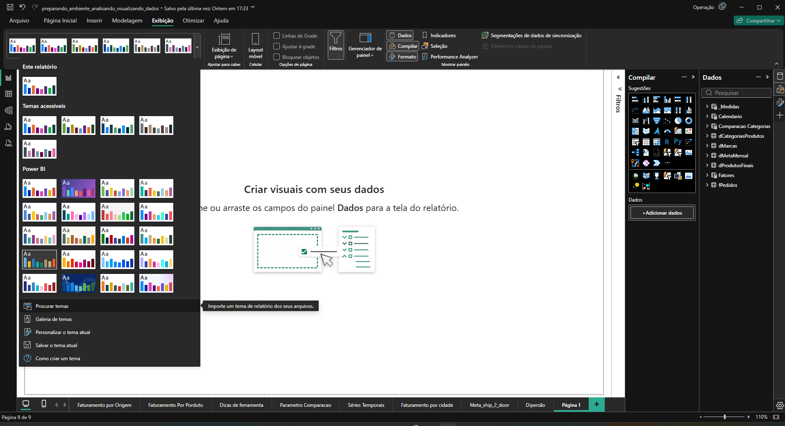
    </td>
</tr>
</table>

Nessa menu iremos escolher a opção de personalizar o tema, esse menu nos possibilita a aplicação de diferentes cores e temas que serão utilizados, podendo aplicar através de códigos hexadecimais, ou escolhendo cores, mais a frente será descrito nesse documento esses códigos para aplicarmos em nosso projeto. 

<table style="text-align: center; width: 100%;"> 
<tr>
    <td style="text-align: left;">
    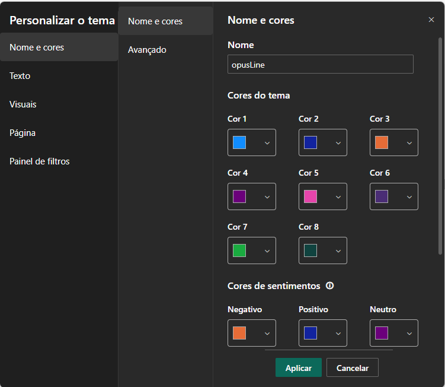
    </td>
</tr>
</table>

Raramente serão aplicados as 8 cores disponíveis, para utilização, porém nesse projeto serão personalizados as 8. 

[↑ Voltar ao topo](#topo)

---
## 3. Aplicando a identidade visual da Opuline

Após receber a identidade visual da Opuline, você está encarregado de aplicar esta identidade nos relatórios do Power BI para garantir que todos os visuais reflitam a marca de forma coesa. Você aprendeu que pode utilizar o pincel de formatação para copiar e colar formatações entre visuais semelhantes, mas também descobriu que é possível configurar um tema personalizado através de um arquivo JSON, o que permite aplicar a identidade visual de forma mais eficiente e uniforme em todos os relatórios.  

Considerando a necessidade de aplicar a identidade visual da Opuline de forma eficiente em todos os relatórios do Power BI, qual das seguintes opções seria a mais adequada para garantir a consistência visual e otimizar o tempo de formatação?

<table style="text-align: center; width: 100%;"> 
<tr>
    <td style="text-align: left;">
    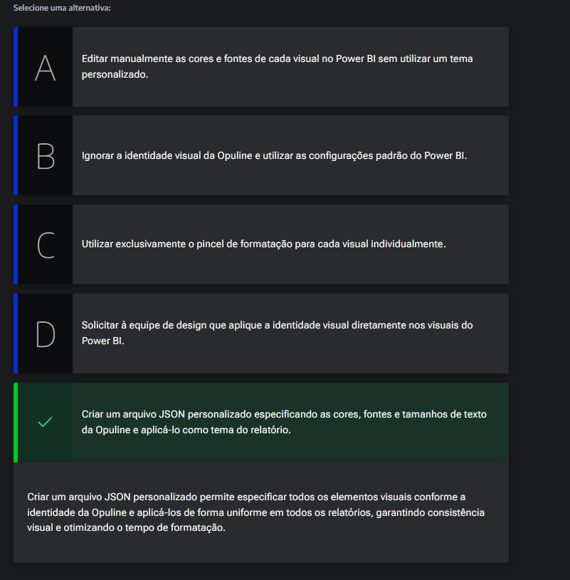
    </td>
</tr>
</table>

[↑ Voltar ao topo](#topo)

---
## 4. Inserindo o layout final

Agora que aprendemos a personalização dos temas, também temos disponibilizado em nosso projeto um Layout padrão,. 

A aplicação desse tema, pode ser realizada dentro na guia de formato, opção tela de fundo, com isso podemos estilizar e adequar nossos gráficos dentro do visual, conforme demonstrado em imagem abaixo:  

<table style="text-align: center; width: 100%;"> 
<tr>
    <td style="text-align: left;">
    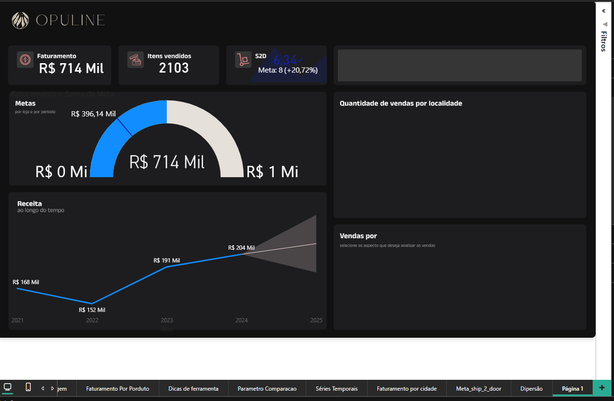
    </td>
</tr>
</table>

[↑ Voltar ao topo](#topo)

---
## 5. Para saber mais: seleção e indicadores

Vamos explorar 2 recursos importantes para elaborarmos uma apresentação. O primeiro deles é o de seleção.

Para acessar este recurso, vamos na guia "Exibição", na barra superior, e clicamos na opção "Seleção".

<table style="text-align: center; width: 100%;"> 
<tr>
    <td style="text-align: left;">
    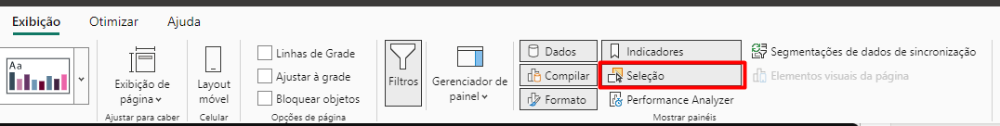
    </td>
</tr>
</table>

Ao fazê-lo, uma aba será aberta na lateral direita, ao lado da aba de visualizações.

<table style="text-align: center; width: 20%;"> 
<tr>
    <td style="text-align: left;">
    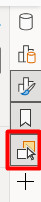
    </td>
</tr>
</table>

Note que nesta aba há uma ordem de camadas, o que significa que podemos sobrepor camadas, visuais e até mesmo caixas de texto, então podemos arrastar as camadas definindo a ordem desejada. Além do mais, com um duplo clique em cada camada podemos renomeá-la, já que as caixas de texto são nomeadas automaticamente dificultando a identificação sobre a qual visual se referem.  

<table style="text-align: center; width: 100%;"> 
<tr>
    <td style="text-align: left;">
    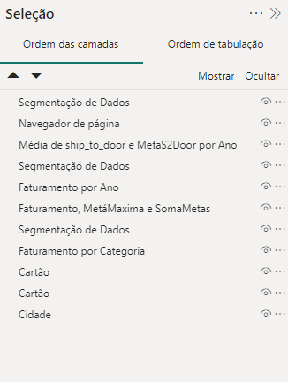
    </td>
</tr>
</table>

Para isso, selecione cada visual, identifique a camada/caixa de texto referente a ele e renomeie de forma que possamos identificar a associação.

Outra funcionalidade nesta aba de seleção, é a criação de grupos. Para isso, basta selecionar 2 visuais. Em seguida, clicamos com o botão direito do mouse e vamos em Agrupar > Agrupar.

<table style="text-align: center; width: 100%;"> 
<tr>
    <td style="text-align: left;">
    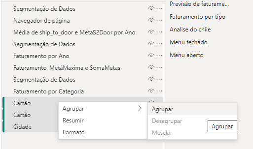
    </td>
</tr>
</table>

Ao fazê-lo, note que na aba de seleção já aparecerá um grupo, sobre o qual clicaremos 2 vezes para renomeá-lo como "Grupo de cartões".

<table style="text-align: center; width: 100%;"> 
<tr>
    <td style="text-align: left;">
    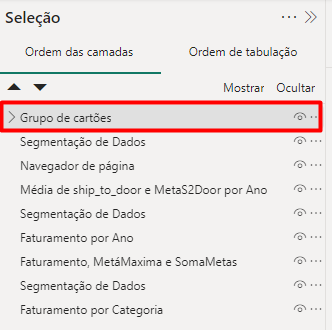
    </td>
</tr>
</table>

Temos, ainda, as funcionalidades de ocultar e visualizar, representadas pelo símbolo de olho que fica no canto do nome de cada item de camada. Para deixar o grupo oculto, por exemplo, bastaria clicar neste símbolo, mas o manteremos visível.

O recurso de ocultar e visualizar é excelente para organizar e manusear os nossos visuais dentro do relatório.

Na aba de seleção temos duas abas: "Ordem das camadas", que acabamos de explorar, e "Ordem de tabulação". Vamos explorar esta segunda!

Nela, conseguimos entender como os visuais estão ordenados. Inclusive, ao publicarmos este relatório, podemos usar a tecla "TAB" para seguir a ordenação disposta.

Vale ressaltar que a tabulação combina perfeitamente com o texto alternativo, pois há pessoas que navegam clicando na tecla TAB e conforme forem avançando nos visuais, os textos alternativos serão lidos pelo leitor de tela, viabilizando a compreensão por todas as pessoas.

Vamos, agora, conhecer um outro recurso que são os indicadores. Eles se localizam à direita de "Seleção", na barra superior. Ao clicá-lo, ele também abrirá uma aba lateral, assim como o recurso anterior.  

<table style="text-align: center; width: 100%;"> 
<tr>
    <td style="text-align: left;">
    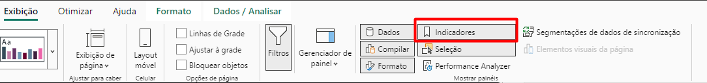
    </td>
</tr>
</table>

<table style="text-align: center; width: 20%;"> 
<tr>
    <td style="text-align: left;">
    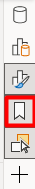
    </td>
</tr>
</table>

Os indicadores nos trazem uma espécie de foto do nosso relatório, é uma maneira de evidenciarmos o estado do relatório de forma personalizada. Se clicarmos no ano 2023, no gráfico de receita ao longo do tempo, por exemplo, o relatório inteiro será filtrado por este ano, assumindo os dados referentes a este período. Para salvar esta visualização, basta clicar em "Adicionar", na aba "Indicadores", e um arquivo chamado "Indicador 1" deve aparecer. Para renomeá-lo, basta dar um clique duplo. O chamaremos de 2023.

<table style="text-align: center; width: 100%;"> 
<tr>
    <td style="text-align: left;">
    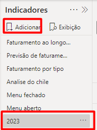
    </td>
</tr>
</table>

A partir disso, podemos clicar em "Exibição", ao lado de "Adicionar", para navegarmos entre os indicadores que criarmos. Ao clicar em "Sair" nosso relatório volta ao seu estado normal.

Esta é uma ótima funcionalidade para estruturarmos apresentações, já que podemos trazer um estado do dashboard.

[↑ Voltar ao topo](#topo)

---
## 6. Finalizando página de vendas
o processo irá seguir conforme visualizamos anteriormente, realizado a cópia e transposição dos arquivos para dentro da nossa página.
> ps: O modelo da tela abaixo, está conforme foi sendo feito no vídeo, com se trata de estilizações e não houve muitas coisas que já não foram vistas antes, não houve notações nesse módulo. Outro ponto é que ainda está em falta aplicação de tema de coloração. 

<table style="text-align: center; width: 100%;"> 
<tr>
    <td style="text-align: left;">
    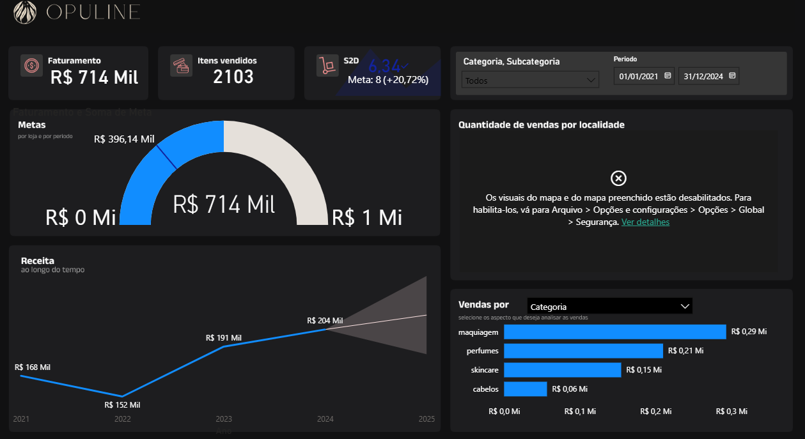
    </td>
</tr>
</table>

[↑ Voltar ao topo](#topo)

---
## 7. Estilizando página de produtos
As mesmas coisas que foram ditas, acima serão aplicadas aqui também. 

<table style="text-align: center; width: 100%;"> 
<tr>
    <td style="text-align: left;">
    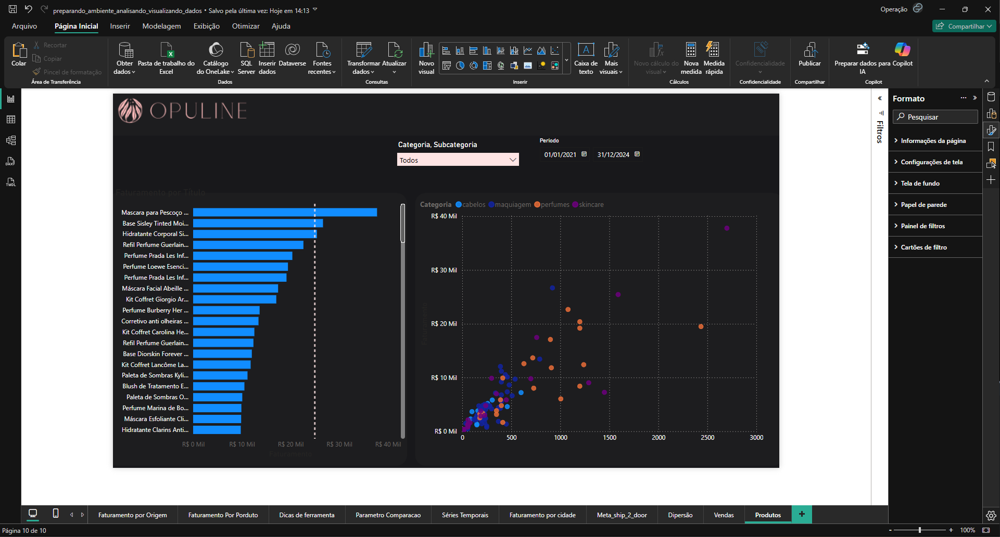
    </td>
</tr>
</table>

[↑ Voltar ao topo](#topo)

---
## 8. Navegação entre botões
Agora iremos aplicar um novo recurso e sobre ele iremos discorrer sobre sua utilização e aplicação.  Esse recurso se trata da navegação entre as páginas.  
Essa opção está presente dentro da guia de inserir sobre a opção de botões, submenu Navigator, por padrão esses botões constam com  a opção de listar todas as paginas mas isso pode ser desabilitado dentro da guia de menu páginas. 
com os botões devidamente confeccionados temos o seguinte dashboard

<table style="text-align: center; width: 100%;"> 
<tr>
    <td style="text-align: left;">
    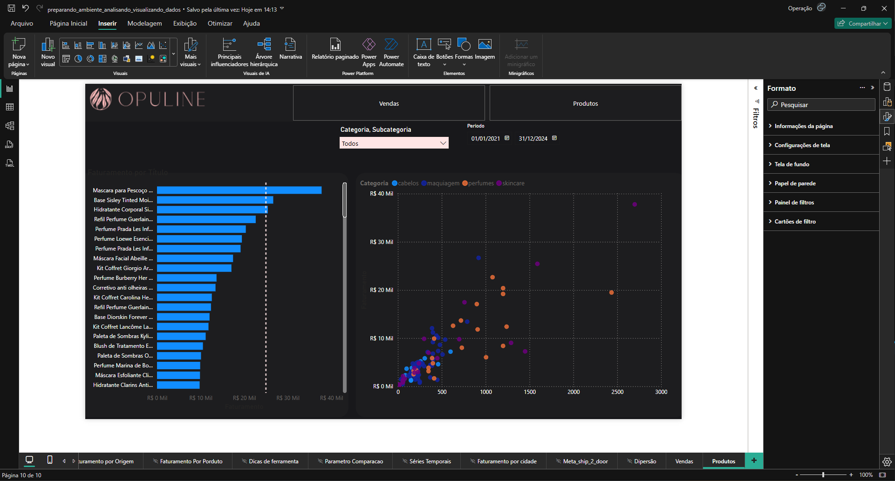
    </td>
</tr>
</table>

[↑ Voltar ao topo](#topo)

---
## 9. Para saber mais: menu sanduíche

Vamos conhecer um recurso que pode elevar seu relatório a um nível ainda mais profissional e dinâmico: o menu sanduíche(ou hambúrguer).

Para começar a construí-lo, acessamos a guia "Inserir" e vamos em "Formas", onde optaremos por um retângulo para estruturar o menu expandido.

<table style="text-align: center; width: 100%;"> 
<tr>
    <td style="text-align: left;">
    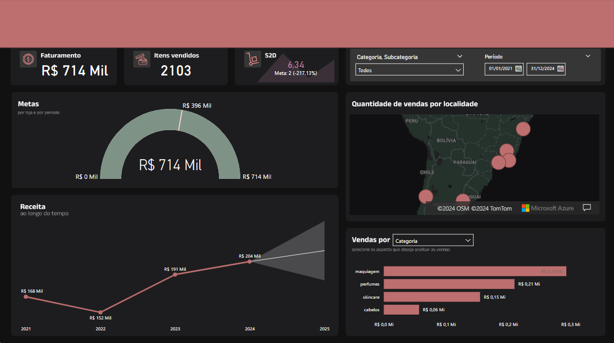
    </td>
</tr>
</table>

Vamos dimensioná-lo de maneira que fique da largura do nosso relatório, mas com uma altura baixa. Em seguida, o posicionamos no topo do relatório. Não se preocupe por ele estar cobrindo os visuais.

Agora, vamos começar a inserir os elementos dentro desta forma retangular.

Ainda precisamos incluir a opção de retornar ao relatório, ou seja, que o relatório seja mostrado sem este menu. Então clicaremos em "Botões", na barra superior, e clicamos na opção do botão "Voltar". O símbolo dele, que é uma seta para esquerda envolta por um círculo, deve aparecer na tela. Aumentamos esta figura e a posicionamos no canto direito do menu, ou seja, do nosso retângulo.

<table style="text-align: center; width: 100%;"> 
<tr>
    <td style="text-align: left;">
    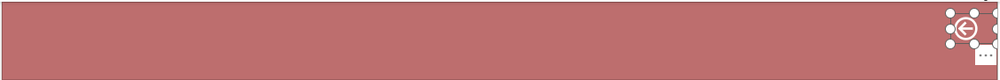
    </td>
</tr>
</table>

Até este momento, temos os filtros e o menu estruturado como se tivesse sido clicado, pois está aberto. Agora, vamos agrupar todos os itens que compõe o menu.

Lembre-se que na aba "Seleção", em "Ordem das camadas", temos todos os visuais anteriores e os elementos que inserimos para o menu. Então clicaremos em "Forma", teclamos "Shift", no teclado, e "Botão", assim conseguiremos selecionar todos os elementos do menu. Em seguida, basta clicar com o botão direito do mouse e agrupá-los. Quando o grupo surgir, o renomeamos como "Menu Sanduíche".

<table style="text-align: center; width: 100%;"> 
<tr>
    <td style="text-align: left;">
    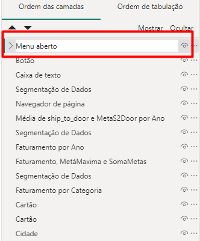
    </td>
</tr>
</table>

Se clicarmos no símbolo de olho à direita de "Menu Sanduíche", conseguiremos ocultá-lo, visualizando somente o relatório. Se habilitamos novamente, o menu reaparece. Para salvar esses 2 estados, com e sem menu, utilizaremos o recurso dos indicadores.

Vamos ocultar o menu e salvar o estado do relatório. Para isso, vamos em "Adicionar", na aba "Indicadores", e salvamos este primeiro indicador como "Sem menú".  

<table style="text-align: center; width: 40%;"> 
<tr>
    <td style="text-align: left;">
    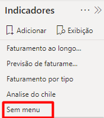
    </td>
</tr>
</table>

Agora, ativamos a visualização do menu e adicionamos um indicador do relatório com o menu, ao qual chamaremos de "com menu".

<table style="text-align: center; width: 40%;"> 
<tr>
    <td style="text-align: left;">
    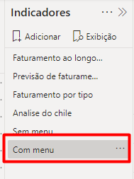
    </td>
</tr>
</table>

A partir deste momento, conseguimos interagir de forma correta. Mas nos falta criar um botão que faça a ação de mostrar o menu. Para isso, vamos em "Botões" e clicamos na opção "Em branco". O posicionaremos em cima do símbolo do menu, em que podemos posicionar em cima de um ícone importado ou mesmo um texto

<table style="text-align: center; width: 100%;"> 
<tr>
    <td style="text-align: left;">
    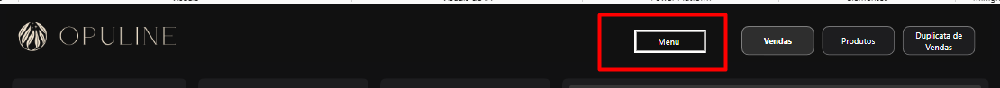
    </td>
</tr>
</table>

Com este botão selecionado, vamos em "Ação", a ativamos, e em "Tipo" optamos por "Indicador". Em seguida, selecionamos o indicador "com menu" no campo "Indicador".

Para testar essa funcionalidade no Power BI Desktop, teclamos "Ctrl" e aí, sim, clicamos no botão. Ao fazê-lo, nosso menu deve aparecer. Nos resta, então, inserir a ação no botão de voltar.

Ana: Selecionamos o botão de voltar e vemos que "Ação" já está ativada. Basta, portanto, definir o tipo como "Indicador" e selecionar o indicador "Sem menu". Para testar, teclamos "Ctrl" e clicamos no botão de voltar. Ao fazê-lo, nosso menu deve desaparecer.

Este recurso é interessante para otimizar espaço em nosso relatório, pois o menu fica escondido, mas aparece para o explorarmos.  

[↑ Voltar ao topo](#topo)

---
## 10. Mão na massa: estruture uma apresentação

Nosso relatório atinge os objetivos de análises que estabelecemos lá no início: acompanhar as vendas e a performance dos produtos.

Inclusive adicionamos elementos do design e de navegação de página para facilitar a interação e análises obtidas a partir daqui.

Essa solução é maravilhosa para aqueles que querem explorar os dados de forma autônoma, mas e aquelas análises que fizemos ao longo do curso?

Por exemplo, a previsão do faturamento para 2025, e o consumo de produtos brasileiros pelos clientes chilenos.

Como podemos fixar esses insights para que eles não se percam?

__Opinião do instrutor__  

Uma forma de resolver esse mão na massa é:

- 1. Crie um indicador

- 2. Altere o indicador

<table style="text-align: center; width: 100%;"> 
<tr>
    <td style="text-align: left;">
    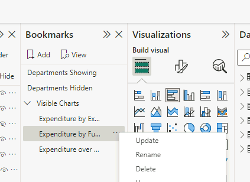
    </td>
</tr>
</table>

- 3. Navegue pelos diferentes indicadores
<table style="text-align: center; width: 100%;"> 
<tr>
    <td style="text-align: left;">
    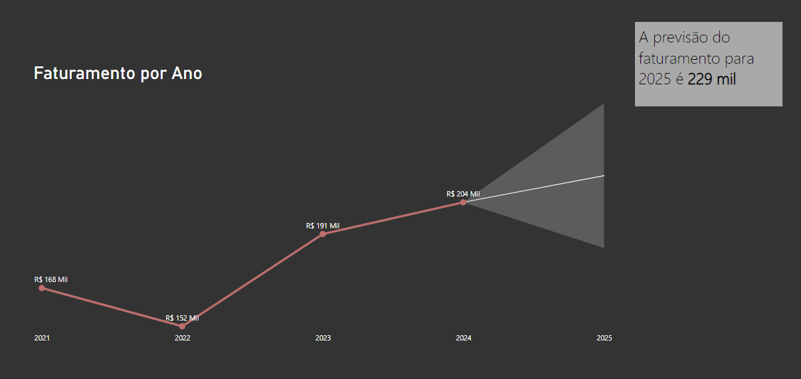
    </td>
</tr>
<tr>
    <td style="text-align: left;">
    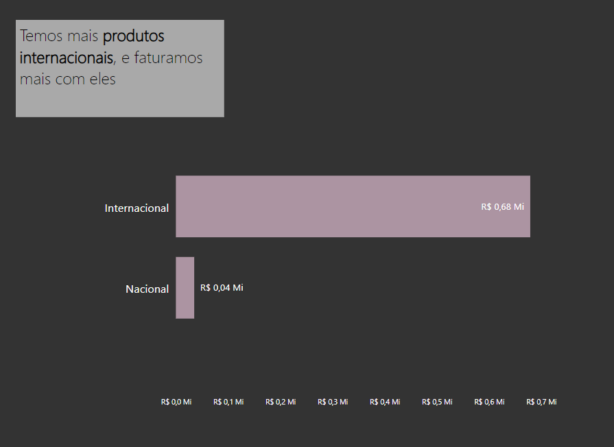
    </td>
</tr>
<tr>
    <td style="text-align: left;">
    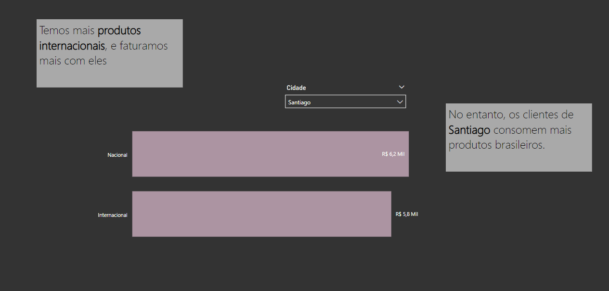
    </td>
</tr>
</table>

A análise de dados orientada permite que, por meio de decisões e processos orientados por dados, as empresas compreendam totalmente os dados que têm e, assim, tenham confiança nas decisões que tomam.

Aqui estruturamos uma apresentação utilizando a seleção e indicadores do power bi, dessa forma foi possível contar uma história com os dados apresentando nossas balises através dos melhores gráficos com seus respectivos comentários.

[↑ Voltar ao topo](#topo)

---
## 11. Para saber mais: aprimorando o design e a navegação de relatórios
 
O design de relatórios no Power BI é crucial para garantir que os usuários possam facilmente navegar pelas informações e encontrar os insights que precisam. Além de adicionar botões de navegação, existem outras práticas e recursos que podem melhorar a experiência do usuário e a eficácia do relatório.  

---

__Organização e Design de Páginas__  

__Consistência Visual__  

Manter uma consistência visual entre as diferentes páginas do relatório ajuda os usuários a se orientarem melhor e a entenderem as informações mais rapidamente.

- `Paleta de Cores Coerente:` Utilize uma paleta de cores consistente em todas as páginas do relatório.

- `Tipos de Fonte e Tamanhos:` Mantenha a uniformidade nos tipos de fonte e tamanhos de texto para títulos, legendas e rótulos.

- `Layout Uniforme:` Posicione elementos similares, como títulos e filtros, nos mesmos locais em todas as páginas.

---
__Melhoria na Navegação__  

__Uso de Marcadores__  

Os marcadores (bookmarks) no Power BI são uma ferramenta poderosa para criar relatórios dinâmicos e interativos.

- `Criação de Marcadores:` Configure marcadores para salvar estados específicos de uma página, como filtros aplicados ou visualizações específicas.

- `Botões de Ação com Marcadores:` Utilize botões para navegar entre diferentes estados salvos com marcadores, permitindo ao usuário alternar entre diferentes visões dos dados com um clique.

__Painéis de Navegação__  

Um painel de navegação pode ser adicionado a uma ou mais páginas do relatório para facilitar o acesso a diferentes seções.

- `Painel Lateral:` Crie um painel lateral com botões que levem a diferentes páginas ou seções do relatório.

- `Ícones e Imagens:` Utilize ícones ou imagens nos botões para tornar a navegação mais intuitiva e visualmente atraente.

---

__Interatividade Avançada__  

__Tooltips Personalizados__  

Adicione tooltips personalizados para fornecer informações adicionais sem sobrecarregar a visualização principal.

- `Configuração de Tooltips:` Crie páginas específicas de tooltip no Power BI e associe-as aos visuais principais.

- `Informação Adicional:` Inclua gráficos, tabelas ou texto explicativo nos tooltips para fornecer contexto adicional.

__Segmentação e Filtros__  
Permitir que os usuários apliquem filtros e segmentações diretamente nos visuais aumenta a interatividade do relatório.

- `Segmentação de Dados:` Adicione segmentações (slicers) que permitam aos usuários filtrar os dados por categorias como tempo, região ou produto.

- `Filtros de Página:` Utilize filtros de página para permitir uma visão focada nos dados relevantes para aquela página específica.

---

__Boas Práticas para Design de Relatórios__  

__Simplicidade e Clareza__  
Mantenha o design do relatório simples e claro para facilitar a interpretação dos dados.

- `Evite Excesso de Informações:` Não sobrecarregue as páginas com muitos gráficos ou tabelas. Foque nos principais insights.

- `Espaçamento Adequado:` Utilize espaçamento adequado entre os elementos para evitar poluição visual e tornar o relatório mais legível.

__Teste e Feedback__  
Antes de finalizar o relatório, realize testes com usuários finais para garantir que a navegação e o design atendam às necessidades deles.

- `Testes de Usabilidade:` Peça para os usuários navegarem pelo relatório e darem feedback sobre a facilidade de uso e clareza das informações.

- `Iteração:` Utilize o feedback para fazer ajustes e melhorias no relatório.

---

__Conclusão__  

Melhorar o design e a navegação dos relatórios no Power BI não apenas facilita a interpretação dos dados, mas também torna a experiência do usuário mais agradável e eficiente. Com práticas como o uso de marcadores, painéis de navegação e tooltips personalizados, você pode criar relatórios altamente interativos e intuitivos. Lembre-se sempre de testar e iterar com base no feedback dos usuários para alcançar o melhor resultado possível.

[↑ Voltar ao topo](#topo)

---
## 12. Faça como eu fiz: utilizando botões para navegação

Agora vamos realizar a construção da navegação entre as páginas do nosso relatório. Para isso vamos utilizar de um recurso muito importante, a criação e configuração de botões. Com eles vamos trazer praticidade e dinamicidade para o relatório final.  

__Opinião do instrutor__  

Precisamos apenas de dois botões, um para páginas de vendas e outro para página de produtos, vamos editar e formatar sua aparência.

<table style="text-align: center; width: 50%;"> 
<tr>
    <td style="text-align: left;">
    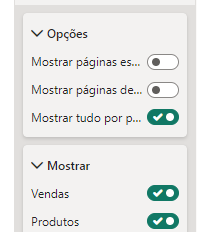
    </td>
</tr>
</table>

Ao criar botões de navegação permitimos que os usuários saltem diretamente para a página desejada com um único clique. Isso melhora a experiência de navegação e torna o relatório mais interativo e fácil de usar.

[↑ Voltar ao topo](#topo)

---
## 13. Projeto final

Se desejar, você pode conferir o [projeto completo do curso](https://github.com/thierryLchaves/Santander-Imersao-Digital/blob/da97eff09c9fb1f01ae7ee2f866cf2ab12fd8378/Analise_de_dados_e_IA_Nivelamento/Semana_08/Power_BI_Visualizando_e_analisando_dados/src/Projeto_final%20(1).pbix).

[↑ Voltar ao topo](#topo)

---
## 14. Para ir mais fundo
Caso você queira ir além dos conhecimentos que estudamos no curso vou deixar a referência que utilizamos:
[Storytelling com Dados: um Guia Sobre Visualização de Dados Para Profissionais de Negócios](https://www.google.com.br/books/edition/Storytelling_with_Data/IheRCgAAQBAJ?hl=pt-BR&gbpv=0) (Português, pago, livro) Autora: Cole Bussbaumer Knaflic  

É um guia essencial para transformar dados em histórias impactantes e compreensíveis. O livro oferece estratégias práticas e exemplos claros de como criar visualizações eficazes que comunicam insights de maneira persuasiva. Com um foco em técnicas de design, psicologia da percepção e princípios de comunicação, Knaflic ensina aos leitores como envolver seu público e transmitir suas mensagens de forma clara e memorável através de gráficos e narrativas baseadas em dados.

[↑ Voltar ao topo](#topo)

---
## 15. O que aprendemos?

Nessa aula, você aprendeu a:
- Utilizar os temas de cores no Power BI;
- Importar e utilizar um layout;
- Estilizar os gráficos e visuais;
- Recursos como indicadores e seleção.

[↑ Voltar ao topo](#topo)

---
## 16. Conclusão

Parabéns

---

<table align="center" style="border-collapse: collapse; margin-left: auto; margin-right: auto;"> 
  <caption><b>Skills do projeto</b></caption>
  <tr>
    <td style="padding: 5px;">
      
    </td>
    <td style="padding: 5px;">
      
    </td>
    <td style="padding: 5px;">
      
    </td>
  </tr>
</table>

---
__Titulo:__ Estruturando o relatório
__Autor:__ Thierry Lucas Chaves  
__Data de Criação:__ 19-06-2026  
__Data de Modificação:__ 25-06-2026  
__Versão:__ "1.0"