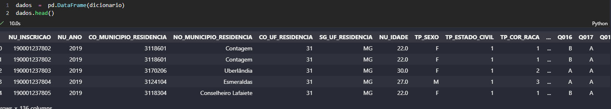
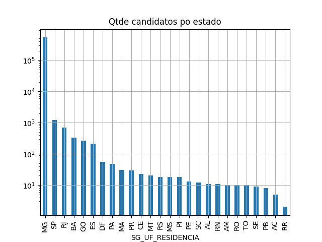
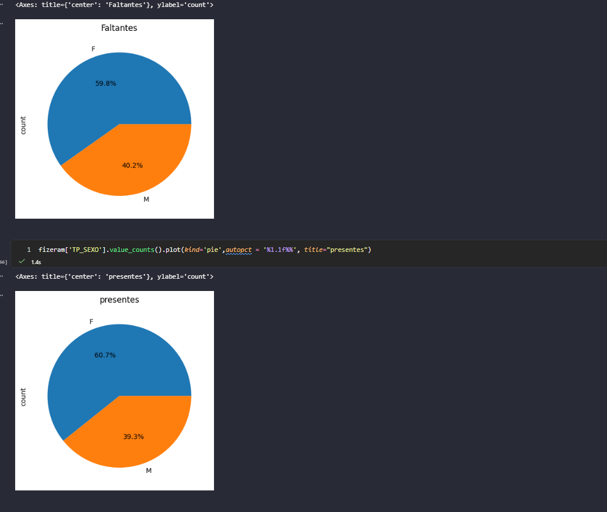
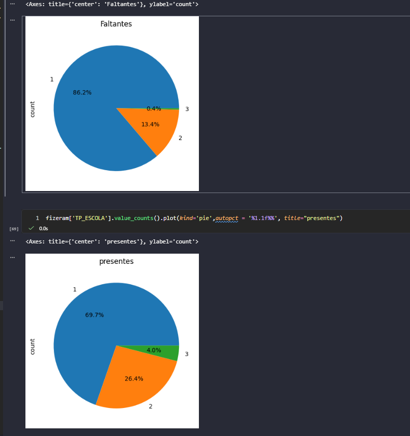
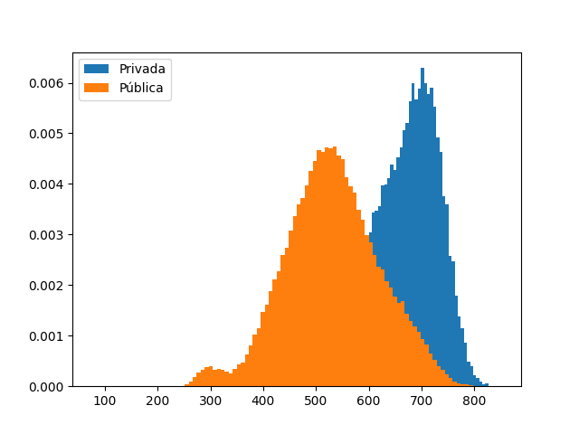

# Conteúdo Live 22/06/2026  
## Trabalhando com pandas IIII

<a id="topo"></a>

## Sumário
- [Conteúdo Live 22/06/2026](#conteúdo-live-22062026)
  - [Trabalhando com pandas IIII](#trabalhando-com-pandas-iiii)
  - [Sumário](#sumário)
  - [1. Introdução.](#1-introdução)
  - [2. recapitulação do de aula](#2-recapitulação-do-de-aula)
  - [3. Construção de novos gráficos](#3-construção-de-novos-gráficos)

## 1. Introdução.
Na aula em questão iremos iniciar o processo de analise de dados, com base no arquivo presente no repositório de dados dessa aula disponível [aqui](https://drive.usercontent.google.com/download?id=1KyfFdCYpTKuaHne5Gwj32HD5ODqyZGAj&export=download&authuser=0), Esse arquivo que estamos trabalhando trata-se sobre dados e notas do Enem de MG.
para tal analise daremos seguimento no nosso [notebook](src/aula7.ipynb)  

---
## 2. recapitulação do de aula  
Iremos iniciar nossa aula, do ponto de onde paramos que no caso é a análise que havíamos iniciado para a base de dados do Enem. 
Apenas para relembrarmos, visualizamos na aula anterior que uma das maneiras que podíamos realizar a leitura da nossa base de dados  seria com a argumento de `SEP = ;`
então para que não haja esse problema iremos realizar um outro modelo para visualizar esses separador dos dados.  
o processo inicia-se entendendo como dado está organizados, para isso podemos utilizar comandos como 
`columns` que irá nos retornar a quantidade de colunas no nosso data set, pós isso visualizamos qual tipo o python está interpretando aqueles dados, pós isso podemos separar essa sentenças com o comando `Split(';')`. Se seguirmos nessa base temos um código do seguinte:  

```py
coluna = dados.columns[0]
colunas  = coluna.split(';')

primeiro_dado =  dados[coluna][0].split(';')

dicionario = {key :[value] for key, value in zip(colunas,primeiro_dado)}
```
com esse processo obtemos a função que realiza a junção dos dados dados que estão no nosso primeiro dado, e a coluna  que é obtido quando na variável de colunas. 
e a função `zip`,  realiza exatamente essa função onde a gente consegue realizar o processo de par de informação, porém com isso obtemos somente 1 dados, porém nossa base é muito grande, e para que possamos transformar essa informação de maneira geral precisamos de um laço de repetição.  
então iremos realizar o seguinte código:  
```py
colunas = dados.columns[0]
colunas = colunas.split(';')
dado = dados[dados.columns[0]][0].split(';')
for i in range(len(dados)):
    for key,value in zip(dados.columns[0].split(";"),dados[dados.columns[0]][i].split(";")):
        dicionario[key].append(value)
```
Nesse código realizamos um laço de repetição para obter o tamanho da base de dados, depois realizamos o parâmetro das informações que estão na primeira lista que foi separada com `split(';')`, com os dados que estão sendo passados através do acesso da informação da linha do data ser dados, na coluna 0 ou primeira coluna na posição i separando as informações por `';`, quando essa condição for atendida iremos adicionar isso na estrutura de dicionário, após isso podemos realizar o processo de inicialização do dataframe com o pandas.

<table style="text-align: center; width: 100%;"> 
<tr>
    <td style="text-align: left;">
    
    </td>
</tr>
</table>

---
## 3. Construção de novos gráficos

Vamos reconstruir um dos  gráficos que realizamos anteriormente, para sabermos sobre a quantidade de pessoas que realizaram a prova pelo estado, para isso podemos executar o código: 
```py
dados['SG_UF_RESIDENCIA'].value_counts().sort_values(ascending=False).plot(kind='bar',logy=True,grid=True, title="Qtde candidatos po estado")
plt.savefig('barras')
```
<table style="text-align: center; width: 100%;"> 
<tr>
    <td style="text-align: left;">
    
    </td>
</tr>
</table>

Com isso teremos um gráfico em escala logarítmica, para essa distribuição lembrando que esse tipo de divisão é util quando estamos trabalhando  com uma quantidade massiva de dados.  Agora vamos  realizar novamente a analise segregando os dados pelos participantes e não participantes da prova, para isso utilizaremos um conhecimento tácito que um dos critérios de corte e redação = 0
para isso executaremos o seguinte código para obtermos o seguinte resultado:

```py
fizeram = dados[dados['NU_NOTA_REDACAO'] != '']
nao_fizeram = dados[dados['NU_NOTA_REDACAO'] == '']

nao_fizeram['TP_SEXO'].value_counts().plot(kind='pie',autopct = '%1.1f%%', title="Faltantes")
fizeram['TP_SEXO'].value_counts().plot(kind='pie',autopct = '%1.1f%%', title="presentes")
```


<table style="text-align: center; width: 100%;"> 
<tr>
    <td style="text-align: left;">
    
    </td>
</tr>
</table>

Com isso temos um analise, que o número de presentes e faltantes são maiores para mulheres justamente por que o número de mulheres que se inscreveram é maior, porém isso muda de cenário quando vamos analisar o tipo de escolas:  

<table style="text-align: center; width: 100%;"> 
<tr>
    <td style="text-align: left;">
    
    </td>
</tr>
</table>

Com esses gráficos temos, a analise dos dados e perceber que de fato a descredencia se da no tipo de escola que os participantes estão. 

---
Agora iremos iniciar uma análise para visualizarmos outra analise sobre as notas, e para isso iremos construir primeiro um dicionário que  tenham os pesos das notas 
```py
dict_pesos = {'NU_NOTA_CN':1, 'NU_NOTA_CH':3,'NU_NOTA_LC':2,'NU_NOTA_MT':1,'NU_NOTA_REDACAO':3}
publica = fizeram[fizeram['TP_ESCOLA'] == '2']
privada = fizeram[fizeram['TP_ESCOLA'] == '3']


notas_puiblica = publica[dict_pesos.keys()]
notas_puiblica = notas_puiblica[publica[dict_pesos.keys()] !=''].astype(float)
notas_puiblica.dropna(inplace=True)


notas_privada = privada[dict_pesos.keys()]
notas_privada = notas_privada[privada[dict_pesos.keys()] !=''].astype(float)
notas_privada.dropna(inplace=True)
notas_privada
notas_puiblica
pesos = list(dict_pesos.values())
soma_pesos = np.sum(pesos)

plt.hist(np.dot(notas_privada.to_numpy(), pesos) / soma_pesos, bins=100, label="Privada", density=True)
plt.hist(np.dot(notas_puiblica.to_numpy(), pesos) / soma_pesos, bins=100, label="Pública", density=True)

plt.legend()
plt.savefig('distribuicao')
plt.show()
```

Com esse código teremos uma distribuição da media das notas dividido pelo tipo de escola, que irá gerar nosso gráfico abaixo:  
<table style="text-align: center; width: 100%;"> 
<tr>
    <td style="text-align: left;">
    
    </td>
</tr>
</table>


Com isso visualizamos que a distribuição das informações é diferente por tipo da escola.  

---
<table align="center" style="border-collapse: collapse; margin-left: auto; margin-right: auto; text-align: center;"> 
  <caption><b>Skills do projeto</b></caption>
  <tr>
    <td style="padding: 5px;">
      
    </td>
    <td style="padding: 5px;">
      
    </td>
    <td style="padding: 5px;">
      
    </td>
  </tr>
  <tr>
    <td style="padding: 5px;">
      
    </td>
    <td style="padding: 5px;">
      
    </td>
    <td style="padding: 5px;">
      
    </td>
  </tr>
</table>


---
__Titulo:__ Conteúdo Live 22/06/2026  
__Autor:__ Thierry Lucas Chaves    
__Data de Criação:__ 22-06-2026  
__Data de Modificação:__ 22-06-2026  
__Versão:__ "1.0"